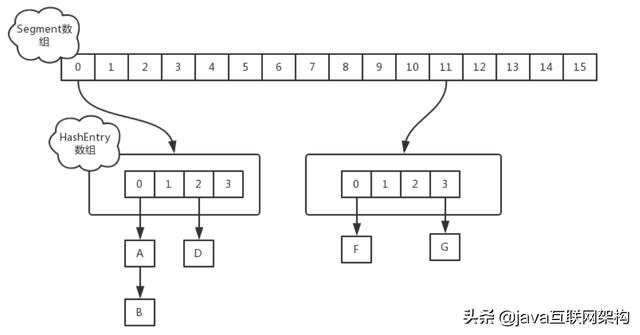

# **C++特性**

## c++基本数据类型

- C++基本数据类型有字符型（char）、整数类型（int）、浮点型（float）、双精度型（double）和无值类型（void），下表给出各种基本类型和内存中的位数和表示数值的范围（对于字符型存储的是ASCII码）：


- 布尔型（bool）、宽字符型（wchar_t）

- c++11新增了几种数据类型：long long、char16_t、char32_t等
 
## C++和C的区别

1. 设计思想上，C++面向对象，而C面向过程
    - 当解决一个问题的时候，**面向对象**会把事物抽象成对象的概念，就是说这个问题里面有哪些对象，然后给对象赋一些属性和方法，然后让每个对象去执行自己的方法，问题得到解决。
    - 当解决一个问题的时候，**面向过程**会把事情拆分成： 一个个函数和数据（用于方法的参数） 。然后按照一定的顺序，执行完这些方法（每个方法看作一个个过程），等方法执行完了，事情就搞定了。
    <https://blog.csdn.net/xmh594603296/article/details/79774167>
2. 在语法上
    - C++具有封装、继承、多态三种特性，支持泛型编程，拥有强大的STL模板库
    - C++相比C，增加多许多类型安全的功能，比如强制类型转换。(C++有四种自己的类型强转方式，分别是const_cast，static_cast，reinterpret_cast和dynamic_cast，C的强制类型转换使用()小括号里面加类型进行类型强转)
    - C++支持范式编程，比如模板类、函数模板等。
4. **函数重载**
    **C语言中产生函数符号的规则是根据名称产生**，这也就注定了c语言不存在函数重载的概念。而C++生成函数符号则考虑了函数名、参数个数、参数类型。
    C语言不存在函数重载，C++根据函数名参数个数参数类型判断重载，属于静多态，必须同一作用域下才叫重载
6. **动态内存管理**上，C++用new和delete， C用malloc和free

## 函数重载

1. 条件
        同一作用域
        函数名称相同
        函数参数 类型不同 个数不同 或 顺序不同
        （函数返回值不能作为函数重载的条件）

## 请你来说一说隐式类型转换

- 隐式类型转换是从小到大的转换。在数据类型上表现是**少字节数据类型，转换成多字节数据类型**，保证数据的完整性；
- 在类上表现，从**子类转换成父类**，保证类对象功能的正常。
- c++是一种强类型的语言，有着非常严格的类型检查，采用隐式类型转换会使程序员更方便快捷一点。
- 隐式类类型转换容易引起错误，除非你有明确理由使用隐式类类型转换，否则，将可以用一个实参进行调用的构造函数都声明为explicit。

## C++三大特性--封装、继承、多态

1. 封装

        将复杂的功能封装起来，对外开放一个接口，简单调用即可。将描述事物的数据和操作封装在一起，形成一个类；被封装的数据和操作只有通过提供的公共方法才能被外界访问（封装隐藏了对象的属性和实施细节），私有属性和方法是无法被访问的，表现了封装的隐藏性，增加数据的安全性

        优点：提高安全性，隔离影响。
2. 继承

        在父类基础上创建派生类，可以通过增加、修改、替换父类成员产生派生类，对父类进行扩充，这种继承性使程序具有可重用性。子类可以从父类中获得同类的本质特征，并且增加个体特征，而不必完全重新定义。

        优点：提高代码重用性。
3. 多态

        多态体现在两个方面，动态联编和静态联编，分别指 在程序运行时的多态 和 在程序编译时的多态。
        动态联编：在子类中 重写父类的虚函数，使用 父类指针指向子类对象时，可以实现不同的功能。
        静态联编：使用 普通的函数重载 或者 函数模板的使用，实现调用**同名函数实现不同功能**。

        优点：提高代码重用性，提高可扩展性

## 请你来回答一下include头文件的顺序以及双引号””和尖括号<>的区别？

- Include头文件的顺序：对于include的头文件来说，如果在文件a.h中声明一个在文件b.h中定义的变量，而不引用b.h。那么要在a.c文件中引用b.h文件，并且要先引用b.h，后引用a.h,否则汇报变量类型未声明错误。
- 双引号和尖括号的区别：编译器预处理阶段查找头文件的路径不一样。

1. 对于使用双引号包含的头文件，查找头文件路径的顺序为：
    - 当前头文件目录
    - 编译器设置的头文件路径（编译器可使用-I显式指定搜索路径）
    - 系统变量CPLUS_INCLUDE_PATH/C_INCLUDE_PATH指定的头文件路径
2. 对于使用尖括号包含的头文件，查找头文件的路径顺序为：
    - 编译器设置的头文件路径（编译器可使用-I显式指定搜索路径）
    - 系统变量CPLUS_INCLUDE_PATH/C_INCLUDE_PATH指定的头文件路径

## 一个头文件怎么使之只能被引用一次

1. #pragma once这是一个比较常用的C/C++杂注，只要在头文件的最开始加入这条杂注，就能够保证头文件只被编译一次。
2. #ifndef，#define，#endif是C/C++语言中的宏定义，通过宏定义避免文件多次编译

## 请你来说一下一个C++源文件从文本到可执行文件经历的过程？

1. 预处理阶段：对源代码文件中文件包含关系（头文件）、预编译语句（宏定义）进行分析和替换，生成预编译文件。
2. 编译阶段：将经过预处理后的预编译文件转换成特定汇编代码，生成汇编文件
3. 汇编阶段：将编译阶段生成的汇编文件转化成机器码，生成可重定位目标文件
4. 链接阶段：将多个目标文件及所需要的库链接成最终的可执行目标文件

## 模板函数和模板类的特例化

## 请你来说一下C++中类成员的访问权限

- C++通过 public、protected、private 三个关键字来控制成员变量和成员函数的访问权限，它们分别表示公有的、受保护的、私有的，被称为成员访问限定符。在类的内部（定义类的代码内部），无论成员被声明为 public、protected 还是 private，都是可以互相访问的，没有访问权限的限制。在类的外部（定义类的代码之外），只能通过对象访问成员，并且通过对象只能访问 public 属性的成员，不能访问 private、protected 属性的成员。通过设置友元与继承可以访问更多

## 标准库是什么？

    1)   C++ 标准库可以分为两部分：

    标准函数库： 这个库是由通用的、独立的、不属于任何类的函数组成的。函数库继承自 C 语言。

    面向对象类库： 这个库是类及其相关函数的集合。

    标准函数库： 输入/输出 I/O、字符串和字符处理、数学、时间、日期和本地化、动态分配、其他、宽字符函数

    面向对象类库：  标准的 C++ I/O 类、String 类、数值类、STL 容器类、STL 算法、STL 函数对象、STL 迭代器、STL 分配器、本地化库、异常处理类、杂项支持库

# **关键字用法**

## 关于const的问题


1. const关键字的作用：const意味着只读，起到保护，防止改动的作用。const关键字可以修饰变量、参数、返回值、甚至函数体，所以多使用const可以提高程序的健壮性；
2. const关键字的使用
    - 可以定义常量
        1. const常量可以提高效率，因为const常量是一个编译期间常量，会像宏一样在编译期间进行替换，但是不同的是，宏替换后编译器不再维护宏字符常量，但是const常量会放在符号表中
        2. const常量更安全，const常量具有数据类型，而宏常量没有数据类型，前者编译器会进行安全类型检查，而后者只进行字符替换，并有可能产生不可预估的错误
    - const与指针配合使用

        ```
        int b = 500;
        const int* a = &b; [1]底层指针 常量指针
        int const *a = &b; [2]
        int* const a = &b; [3]顶层    指针常量
        const int* const a = &b; [4]
        ```

        1. 如果const位于星号的左侧，则const就是用来修饰指针所指向的变量，即指针指向的变量为常量
        2. 如果const位于星号的右侧，const就是修饰指针本身，即指针本身是常量。
        - 因此，[1]和[2]的情况相同，都是指针所指向的内容为常量，这种情况不允许对内容进行更改操作，如不能*a = 3；[3]为指针本身是常量，即指针的地址不可变，不能a++；[4]为指针本身和指向的内容均为常量。
            顶层const和底层const
            底层const是代表对象本身是一个常量（不可改变）；常量指针
            顶层const是代表指针的值是一个常量,而指针指向(即对象的地址)的内容可以改变（指向的不可改变）；指针常量
    - 函数中使用const
        1. 函数参数中加const
        2. 函数返回值加const
            - const int fun1()(无意义，返回值本身就是赋值)
            - const int* fun2()(返回的指针不可修改)
            - int* const fun3()(将函数看成一个变量，这个变量不可改变)
    - 类相关const
        1. const修饰成员变量 --只可以在构造函数的初始化列表初始化
        2. const修饰成员函数 --不能改变成员函数的成员变量，且该函数不能调用非const成员
        3. const修饰对象/对象指针/对象引用 一旦将对象定义为常对象之后，该对象就只能访问被 const 修饰的成员了（包括 const 成员变量和 const 成员函数），因为非 const 成员可能会修改对象的数据


## volatile 

1. 修饰变量
   1. volatile指出 i 是随时可能发生变化的，每次使用它的时候必须从 i的地址中读取，因而编译器生成的汇编代码会重新从i的地址读取数据放在 b 中。而优化做法是，由于编译器发现两次从 i读数据的代码之间的代码没有对 i 进行过操作，它会自动把上次读的数据放在 b 中。而不是重新从 i 里面读。
2. 修饰指针
3. 多线程下的volatile
   1. 当两个线程都要用到某一个变量且该变量的值会被改变时，应该用 volatile 声明，该关键字的作用是**防止优化编译器把变量从内存装入 CPU 寄存器中**。如果变量被装入寄存器，那么两个线程有可能一个使用内存中的变量，一个使用寄存器中的变量，这会造成程序的错误执行。volatile 的意思是让编译器每次操作该变量时一定要从内存中真正取出

## const 和define的区别

1. 编译器处理方式不同
    - define是在预处理阶段展开
    - const常量是编译运行阶段使用
2. 类型和安全检查不同
    - define不检查类型，const会检查数据类型
3. 存储方式不同
    - define替换发生在编译阶段之前，直接进行替换，const发生在编译过程中，并且**宏替换完成后字符串常量会消失**。
    - 而**const常量会放在符号表中**，如果对他进行取地址或者extern声明，编译器就会为它分配空间
4. 宏定义会有边缘效应
    - 宏定义可能出现不可预估的优先级错误

## 说一下C++中static关键字的作用

1. 全局静态变量
 
    在全局变量加上关键字static，全局变量就定义成一个全局静态变量，存放于静态存储区，在整个程序运行期间一直存在；**未经初始化的全局静态变量会被自动初始化为0**；全局静态变量在声明他的文件之外是不可见的，准确地说是从定义之处开始，到文件结尾。
 
2. 局部静态变量
 
    在局部变量之前加上关键字static，局部变量就成为一个局部静态变量，**局部静态变量只初始化一次**。作用域仍为局部作用域，当定义它的函数或者语句块结束的时候，作用域结束。但是当局部静态变量离开作用域后，并没有销毁，而是仍然驻留在内存当中，只不过我们不能再对它进行访问，直到该函数再次被调用，并且值不变。
 
3. 静态函数  
 
    在函数返回类型前加static，函数就定义为静态函数。函数的定义和声明在默认情况下都是extern的，但**静态函数只是在声明他的文件当中可见，不能被其他文件所用。**函数的实现使用static修饰，那么这个函数只可在本cpp内使用，不会同其他cpp中的同名函数引起冲突；

    注意：不要在头文件中声明static的全局函数，不要在cpp内声明非static的全局函数，如果你要在多个cpp中复用该函数，就把它的声明提到头文件里去，否则cpp内部声明需加上static修饰。
 
4. **类的静态成员变量**

- 所有对象共享同一份数据
- 在编译阶段分配内存
- 类内声明，类外初始化

        在类中，静态数据成员可以实现多个对象之间的数据共享，并且使用静态数据成员还不会破坏隐藏的原则，即保证了安全性。因此，静态数据成员是类的所有对象中共享的成员，而不是某个对象的成员。

5. 类的静态成员函数

- 程序共享一个函数
- 静态成员函数只能访问静态成员变量

        静态成员函数和静态数据成员一样，它们都属于类的静态成员，他们都不是对象成员。因此对静态成员的引用不需要用对象名。在静态成员函数的实现中不能直接引用类中的非静态成员，可以引用类中的静态成员（这点非常重要）。如果静态成员函数中要引用非静态成员时，可通过对象来引用。从中可看出，调用静态成员函数使用如下格式：<类名>::<静态成员函数名>（<参数表>）

## define 和const的区别（编译阶段、安全性、内存占用等）

一：区别
（1）就起作用的阶段而言： #define是在编译的预处理阶段起作用，而const是在 编译、运行的时候起作用。
（2）就起作用的方式而言： #define只是简单的字符串替换，没有类型检查。而const有对应的数据类型，是要进行判断的，可以避免一些低级的错误。
（3）就存储方式而言：#define只是进行展开，有多少地方使用，就替换多少次，它定义的宏常量在内存中有若干个备份；const定义的只读变量在程序运行过程中只有一份备份。
（4）从代码调试的方便程度而言： const常量可以进行调试的，define是不能进行调试的，因为在预编译阶段就已经替换掉了。
二：const优点
（1）const常量有数据类型，而define常量没有数据类型。编译器可以对前者进行类型安全检查。而对后者只进行字符替换，没有类型安全检查，并且在字符替换可能会产生意料不到的错误。
（2）有些集成化的调试工具可以对const常量进行调试，但是不能对宏常量进行调试。
（3）const可节省空间，避免不必要的内存分配，提高效率

## final和override关键字

- final关键字说明某个类不能被继承，或者某个虚函数不能被重写（必须是虚函数），放在函数后面。
- override关键字在函数后面，显示说明这个函数是重写的。

## 请你说一说strcpy和strlen

1. strcpy是字符串拷贝函数，原型：

```
char *strcpy(char* dest, const char *src);
```

- 从src逐字节拷贝到dest，直到遇到'\0'结束，因为没有指定长度，可能会导致拷贝越界，造成缓冲区溢出漏洞,安全版本是strncpy函数。

2. strlen函数是计算字符串长度的函数，返回从开始到'\0'之间的字符个数。

## 字符串拷贝的函数

1. size_t copy (char* s, size_t len, size_t pos = 0) const;

- copy函数的作用是从string对象中取出若干字符存放到数组s中。其中，s是字符数组，n表示要取出字符的个数，pos表示要取出字符的开始位置。

1. strcpy:char* strcpy(char* strDestination, const char* strSource);将由source指针指示的C 字符串(包括结尾字符)复制到destination指针指示的区域中。

- 为了**避免溢出**，destination区域应该至少和source区域一样大。

2. strncpy:char *strncpy(char *dest, const char *src, int num)，复制source的前num字符到destination。

- 如果遇到null字符（'\0'），且还没有到num个字符时，就用（**num - n**）（n是遇到null字符前已经有的非null字符个数）个**null字符**附加到destination。

3. memcpy:void *memcpy(void *destin, void *source, unsigned num)；将source区域的前num个字符复制到destination中。

- 该函数**不检查null字符**（即将null字符当作普通字符处理），意味着将复制num个字符才结束。该函数不会额外地引入null字符，即如果num个字符中没有null字符，那么destination中相应字符序列中也没有null字符。同strcpy的区别：允许将source中null字符后面的字符也复制到destination中，而strcpy和strncpy则不可以

4. memmove:同memcpy完成同样的功能.

- 区别是，memmove允许destination和source的区域有重叠。而其他三个函数不允许。

## **在拷贝汉字或者日文字符的时候有什么需要注意的地方**

1. C++对多语言文本字符的支持，通过宽字符来解决。
  只要将输入输出设备绑定到一个本地的locale对象上即可。locale currentlocale("chs");表示中国
    各种对应关系如下：
    cin  wcin
    cout wcout
    char wchar_t
    string wstring
    ifstream wifstream
    一些非欧洲字符集（如日文汉字）包含许多单字节代码方案无法表示的字符，因此要求**使用多字节字符集 (MBCS) 编码。Unicode**
    中文属于Unicode字符，应当使用UTF-8进行编码

## C字符串处理函数的实现

### 实现strlen

```c
#include <cassert>

//字符串长度计算
int strlen(const char *str)
{
    assert(str);

    int len = 0;
    while(*str++)   len++;
    return  len;
}
```

### 实现strcmp
```c
#include <cassert>

//字符串比较
int strcmp(const char *str1,const char *str2)
{
    assert(str1 && str2);

    //在判断是否相等时不一定要转换为unsigned char
    while((*str1 == *str2) && *str1){
        str1++;
        str2++;
    }

    if(*str1 == *str2)//说明上面循环退出时*str等于0
        return 0;

    //128种扩展ascii码使用最高位来标识，
    //所以在判断返回大于0还是小于0是，要转换为unsigned char，否则结果相反

    return *(unsigned char*)str1 > *(unsigned char*)str2 ? 1 : -1;
}
```

### 实现strcat

```c
#include <cassert>

//字符串拼接
char* strcat(char *strDest,const char *strSrc)
{
    assert(strDest && strSrc);

    char *p = strDest;
    while(*p) p++;

    while(*p++ = *strSrc++);
    return strDest;
}
```

### 实现strcpy

```c
#include <cassert>

//字符串拷贝
char* strcpy(char *strDest,const char *strSrc)
{
    assert(strDest && strSrc);

    char *p = strDest;
    while(*p++ = *strSrc++);
    return strDest;
}
```

### 实现memcpy

实现的实际上是memmove，实际的memcpy是不考虑重叠的
重点在于处理重叠的情况：

```c
void* memcpy(void *dst,const void *src,size_t size)
{
    if(dst == NULL || src == NULL){
        return NULL;
    }

    char *pdst = (char*)dst;
    char *psrc = (char*)src;

    //有重叠，从高地址开始复制
    if(pdst > psrc && pdst < psrc + size){
        pdst = pdst + size - 1;
        psrc = psrc + size - 1;
        while(size--){
            *pdst-- == *psrc--;
        }
    }
    //没有重叠，从低地址开始复制
    else{
        while(size--){
            *pdst++ = *psrc++;
        }
    }

    return dst;
}
```

## C++中rand() 函数的用法

1、rand()不需要参数，它会返回一个从0到最大随机数的任意整数，最大随机数的大小通常是固定的一个大整数。

2、如果你要产生0~99这100个整数中的一个随机整数，可以表达为：int num = rand() % 100; 

     这样，num的值就是一个0~99中的一个随机数了。

3、如果要产生1~100，则是这样：int num = rand() % 100 + 1;  

4、总结来说，可以表示为：int num = rand() % n +a;

     其中的a是起始值，n-1+a是终止值，n是整数的范围。

5、一般性：rand() % (b-a+1)+ a ;    就表示  a~b 之间的一个随机整数。

## 请你来说一说extern“C”

- **extern可以置于变量或者函数前**，以标示变量或者函数的定义在别的文件中，提示编译器**遇到此变量和函数时在其他模块中寻找其定义。**此外extern也可用来进行链接指定。
1. 当它与"C"一起连用时，如: extern "C" void fun(int a, int b);则告诉编译器在编译fun这个函数名时*翻译**相应的函数名而不是C++的，C++的规则在翻译这个函数名时会把fun这个名字变得面目全非，可能是fun@aBc_int_int#%$也可能是别的，这要看编译器的"脾气"了(不同的编译器采用的方法不一样)，为什么这么做呢，因为C++支持函数的重载啊，
2. 当extern不与"C"在一起修饰变量或函数时，如在头文件中: extern int g_Int; 它的作用就是声明函数或全局变量的作用范围的关键字，其声明的函数和变量可以在本模块或其他模块中使用，记住它是一个声明不是定义!也就是说B模块(编译单元)要是引用模块(编译单元)A中定义的全局变量或函数时，它只要包含A模块的头文件即可,在编译阶段，模块B虽然找不到该函数或变量，但它不会报错，它会在连接时从模块A生成的目标代码中找到此函数。
   <https://www.cnblogs.com/yc_sunniwell/archive/2010/07/14/1777431.html>

## C++ 内联函数inline、宏定义define

宏和函数的区别：

1. 宏做的是简单的字符串替换(注意是字符串的替换,不是其他类型参数的替换),而函数的参数的传递,参数是有数据类型的,可以是各种各样的类型.
2. 宏的参数替换是不经计算而直接处理的,而函数调用是将实参的值传递给形参,既然说是值,自然是计算得来的.
3. *宏在编译之前进行,即先用宏体替换宏名,然后再编译*的,而*函数显然是编译之后,在执行时,才调用*的.因此,宏占用的是编译的时间,而函数占用的是执行时的时间.
4. 宏的参数是不占内存空间的,因为只是做字符串的替换,而函数调用时的参数传递则是具体变量之间的信息传递,形参作为函数的局部变量,显然是占用内存的.
5. 函数的调用是需要付出一定的时空开销的,因为系统在调用函数时,要保留现场,然后转入被调用函数去执行,调用完,再返回主调函数,此时再恢复现场,这些操作,显然在宏中是没有的.
宏定义：#define
1、宏是在代码处不加任何验证的简单替代，而内联函数是将代码直接插入调用处，而减少了普通函数调用时的资源消耗。
2、宏不是函数，只是在编译前（编译预处理阶段）将程序中有关字符串替换成宏体。

在c++中尽量不要使用宏定义，可能会产生一些不必要的错误
define mul(a,b) a*b
mul(3+4,5+6)
即 3+45+6=29
与(3+4)(5+6)=77 的 预想不一致

- **内联函数**：

程序在编译器编译的时候，编译器将程序中出现的内联函数的调用表达式用内联函数的函数体进行替换，而对于其他的函数，都是在运行时候才被替代。这其实就是个空间代价换时间的i节省。所以内联函数一般都是1-5行的小函数

1. 内联函数是c++为提高程序运行效率做的改进
2. 常规函数与内联函数的区别不在于编写方式，而在于被调用时的运行机制
3. 内联函数和普通函数相比可以加快程序运行的速度，因为不需要中断调用，在**编译的时候内联函数可以直接被镶嵌到目标代码中**。
4. 内联函数不能递归
常规函数被调用时进入到被调用的函数中执行
内联函数在执行时使用函数代码替换函数调用
内联函数适用于：
1. 一个函数不断被重复调用。
2. 函数只有简单的几行，且函数不包含for、while、switch语句。
一般来说，我们写小程序没有必要定义成inline，但是如果要完成一个工程项目，当一个简单函数被调用多次时，则应该考虑用inline。

- **inline与define的区别**
（1）内联函数在编译时展开，宏在预处理时展开；
（2）内联函数直接嵌入到目标代码中，宏是简单的做文本替换；
（3）内联函数有类型检测、语法判断等功能，而宏没有；
（4）inline函数是函数，宏不是；
（5）宏定义时要注意书写（参数要括起来）否则容易出现歧义，内联函数不会产生歧义；
C++ 语言的函数内联机制既具备宏代码的效率，又增加了安全性，而且可以自由操作类的数据成员。

## 虚函数可以是内联函数吗

虚函数可以是内联函数，内联是可以修饰虚函数的，但是当虚函数表现多态性的时候不能内联。
理由如下：内联是在发生在编译期间，编译器会自主选择内联，而虚函数的多态性在运行期，编译器无法知道运行期调用哪个代码，因此虚函数表现为多态性时（运行期）不可以内联。 inline virtual唯一可以内联的时候是：编译器知道所调用的对象是哪个类（如 Base::who()），这只有在编译器具有实际对象而不是对象的指针或引用时才会发生。

## C++中四种强制类型static_cast、 dynamic_cast、const_cast、reinterpret_cast转换

1. reinterpret_cast

    改变指针或引用的类型、将指针或引用转换为一个足够长度的整形、将整型转换为指针或引用类型。
    在使用reinterpret_cast强制转换过程仅仅只是比特位的拷贝，因此在使用过程中需要特别谨慎！
2. static_cast

    用于各种**隐式转换**，可以实现C++中**内置基本数据类型**之间的相互转换。
    （1）用于类层次结构中基类和派生类之间指针或引用的转换
      进行上行转换（把派生类的指针或引用转换成基类表示）是安全的
      进行下行转换（把基类的指针或引用转换为派生类表示），由于没有动态类型检查，所以是不安全的
    （2）用于基本数据类型之间的转换，如把int转换成char。这种转换的安全也要开发人员来保证
    （3）把空指针转换成目标类型的空指针
    （4）把任何类型的表达式转换为void类型
    注意：static_cast不能转换掉expression的const、volitale或者__unaligned属性。
3. dynamic_cast

    用于**动态类型转换**。只能用于**含有虚函数的类**，用于**类层次间的向上和向下转化**。只能转指针或引用。向下转化时，如果是非法的对于指针返回NULL，对于引用抛异常。要深入了解内部转换的原理。
    向上转换：指的是子类向基类的转换
    向下转换：指的是基类向子类的转换
    它通过判断在执行到该语句的时候，变量的运行时类型和要转换的类型是否相同来判断是否能够进行向下转换。
    （1）其他三种都是编译时完成的，dynamic_cast是运行时处理的，运行时要进行类型检查。
    （2）不能用于内置的基本数据类型的强制转换。
    （3）dynamic_cast转换如果成功的话返回的是指向类的指针或引用，转换失败的话则会返回NULL。
    （4）使用dynamic_cast进行转换的，基类中一定要有虚函数，否则编译不通过。

            B中需要检测有虚函数的原因：类中存在虚函数，就说明它有想要让基类指针或引用指向派生类对象的情况，此时转换才有意义。    
            这是由于运行时类型检查需要运行时类型信息，而这个信息存储在类的虚函数表（关于虚函数表的概念，详细可见<Inside c++ object model>）中，
            只有定义了虚函数的类才有虚函数表。
    （5）在类的转换时，在类层次间进行上行转换时，dynamic_cast和static_cast的效果是一样的。在进行下行转换时，dynamic_cast具有类型检查的功能，比static_cast更安全。

        向上转换，即为子类指针指向父类指针（一般不会出问题）；向下转换，即将父类指针转化子类指针。
        向下转换的成功与否还与将要转换的类型有关，即要转换的指针指向的对象的实际类型与转换以后的对象类型一定要相同，否则转换失败。
            在C++中，编译期的类型转换有可能会在运行时出现错误，特别是涉及到类对象的指针或引用操作时，更容易产生错误。Dynamic_cast操作符则可以在运行期对可能产生问题的类型转换进行测试。
4. const_cast

    const_cast用于强制去掉这种不能被修改的常数特性，但需要特别注意的是const_cast不是用于去除变量的常量性，而是去除指向常数对象的指针或引用的常量性，其去除常量性的对象必须为指针或引用。
    ① 可以将 const 指针转为非 const 指针。
    ② 可以将const引用转换为非const引用。
    <http://www.cppblog.com/chaosuper85/archive/2009/08/07/92563.html>
5. 注：为什么不使用 C 的强制转换？
    C的强制转换表面上看起来功能强大什么都能转，但是**转化不够明确，不能进行错误检查，容易出错**。  

# **类**

## C++中构造函数与析构函数

1. 构造函数

    - 是用来初始化类对象的成员的，所以当创建类对象就会调用构造函数。
    - 函数名和类名必须一样，没有返回值。
    - 当没有显式的定义构造函数时，系统会自己生成默认的构造函数。
    - 构造函数可以重载。
  基类构造函数、对象成员构造函数、派生类本身的构造函数  
2. 析构函数
    - 是类的一个成员函数，名字由波浪号加类名构成，是执行与构造函数相反的操作：**释放对象使用的资源，并销毁非static成员**。
    - 函数名是在类名前加上~，无参数且无返回值。
    - 析构函数不能重载。每有一次构造函数的调用就会有一次析构函数的调用。

3. 请你来说一下C++中析构函数的作用

- 析构函数与构造函数对应，当对象结束其生命周期，如对象所在的函数已调用完毕时，系统会自动执行析构函数，**释放动态开辟的内存空间，防止内存泄漏**。
- 析构函数名也应与类名相同，只是在函数名前面加一个位取反符~，例如~stud( )，以区别于构造函数。它不能带任何参数，也没有返回值（包括void类型）。只能有一个析构函数，不能重载。
- 如果用户没有编写析构函数，编译系统会自动生成一个缺省的析构函数（即使自定义了析构函数，编译器也总是会为我们合成一个析构函数，并且如果自定义了析构函数，编译器在执行时会先调用自定义的析构函数再调用合成的析构函数），它也不进行任何操作。所以许多简单的类中没有用显式的析构函数。
- 如果一个类中有指针，且在使用的过程中动态的申请了内存，那么最好显示构造析构函数，在销毁类之前，释放掉申请的内存空间，避免内存泄漏。
- 父类构造-子类构造-子类析构-父类析构
- 1）派生类本身的析构函数；2）对象成员析构函数；3）基类析构函数。

## 析构函数可以抛异常吗

C++标准指明析构函数不能、也不应该抛出异常。

C++异常处理模型是为C++语言量身设计的，更进一步的说，它实际上也是为C++语言中面向对象而服务的。C++异常处理模型最大的特点和优势就是对C++中的面向对象提供了最强大的无缝支持。那么如果对象在运行期间出现了异常，C++异常处理模型有责任清除那些由于出现异常所导致的已经失效了的对象(也即对象超出了它原来的作用域)，并释放对象原来所分配的资源， 这就是调用这些对象的析构函数来完成释放资源的任务，所以从这个意义上说，**析构函数已经变成了异常处理的一部分**。

析构函数不能抛出异常的理由：
1. 如果析构函数抛出异常，则异常点之后的程序不会执行，如果析构函数在异常点之后执行了某些必要的动作比如释放某些资源，则这些动作不会执行，会造成诸如资源泄漏的问题。
2. 通常异常发生时，c++的机制会调用已经构造对象的析构函数来释放资源，此时若析构函数本身也抛出异常，则前一个异常尚未处理，又有新的异常，会造成程序崩溃的问题。

那么当无法保证在析构函数中不发生异常时， 该怎么办?
1. 把异常完全封装在析构函数内部，决不让异常抛出函数之外。

```c++
~ClassName()
{
  try{
      do_something();
  }
  catch(){  //这里可以什么都不做，只是保证catch块的程序抛出的异常不会被扔出析构函数之外。
   }
}
```

## public，protected和private访问权限和继承

- private: 只能由该类中的函数、其友元函数访问,不能被任何其他访问，该类的对象也不能访问.
- protected: 可以被该类中的函数、子类的函数、以及其友元函数访问,但不能被该类的对象访问
- public: 可以被该类中的函数、子类的函数、其友元函数访问,也可以由该类的对象访问

  注：友元函数包括两种：设为友元的全局函数，设为友元类中的成员函数
  父类与其直接子类的访问关系如上，无论是哪种继承方式（private继承、protected继承、public继承）。
  都是private不可见

  对于三种继承关系的不同：
  public继承：public继承后，从父类继承来的函数属性不变（private、public、protected属性不变，）。
  private继承：private继承后，从父类继承来的函数属性都变为private
  protected继承：protected继承后，从父类继承过来的函数，public、protected属性变为protected，private还是private。

## class和struct的区别

- 在C++中，可以用struct和class定义类，都可以继承。区别在于：struct的默认继承权限和默认访问权限是public，而class的默认继承权限和默认访问权限是private。
- class还可以定义模板类形参，比如template <class T, int i>。

## 介绍C++所有的构造函数

赋值函数（重载），拷贝构造函数，移动构造函数，构造函数，移动赋值函数，析构函数

## 什么情况下会调用拷贝构造函数（三种情况）

1. 当**用类的一个对象去初始化**类的另一个对象时。
2. 当函数的形参是类的对象，调用函数进行形参和实参的结合时。
3. 当**函数的返回值是对象**，函数执行完成返回调用者时

## C++ 中拷贝构造函数的形参能否进行值传递？-

- 不能。如果是值传递的话，调用拷贝构造函数时，首先将**实参传给形参，这样又会调用拷贝构造函数**，如此，会造成无限递归调用拷贝构造函数。

**拷贝赋值**如果为值传递，仅仅是多了一次拷贝，并不会无限递归
**拷贝构造**如果为值传递，才会引起无限递归

## 友元

- 非成员函数的友元声明

```c++
friend Sales_data add(const Sales_data&,const Sales_data&);
```

- 类的友元声明

```c++
friend class Window_mgr;
```

## C++如何阻止一个类被实例化？一般在什么时候将构造函数声明为private？

1. 将类定义为抽象基类
2. 将构造函数声明为private；
3. 不允许类外部创建类对象，只能在类内部创建对象

# **多态**

## 定义

- 多态分为静态多态和动态多态。**静态多态是通过重载和模板技术实现，在编译的时候确定**，静态绑定。
- **动态多态通过虚函数和继承关系来实现**，执行动态绑定，在**运行的时候确定。**
- c++的动态多态用一句话概括就是:在基类的函数前加上virtual关键字，在派生类中重写该函数，运行时将会根据对象的实际类型来调用相应的函数，如果对象类型是派生类，就调用派生类的函数，如果对象类型是基类，就调用基类的函数。
- **虚表是在编译期就建立了，虚函数表可以看做一个虚函数指针数组。而对象的隐藏成员--虚指针是在运行期--也就是构造函数被调用时进行初始化的，这是实现多态的关键。**

## 请你回答一下静态多态和虚函数的区别

- 静态多态的函数地址早绑定 - 编译阶段确定函数地址
- 动态多态的函数地址晚绑定 - 运行阶段确定函数地址(虚函数因为用了虚函数表机制，调用的时候会增加一次内存开销)

## 多态满足条件

- 有继承关系
- 子类重写父类中的虚函数

## **虚函数总结**

- 定义：虚函数是在基类中使用关键字virtual声明的函数。

1. 包含虚函数的类都有虚表
2. 虚表可以继承，如果子类没有重写虚函数，那么子类虚表中仍然会有该函数的地址，只不过这个地址指向的是基类的虚函数实现，如果重写了相应的虚函数，那么虚表中的地址就会改变，指向自身的虚函数实现
3. C++中虚函数表位于只读数据段（.rodata），也就是C++内存模型中的常量区；而虚函数则位于代码段（.text），也就是C++内存模型中的代码区。
**虚函数的代价**
1. 带有虚函数的类，每一个类会产生一个虚函数表，用来存储指向虚成员函数的指针；
2. 带有虚函数的类的每一个对象，都会有有一个指向虚表的指针，会增加对象的空间大小；
3. **不能再是内联的函数**，因为内联函数在编译阶段进行替代，而虚函数表示等待，在运行阶段才能确定到低是采用哪种函数，虚函数不能是内联函数。

## **纯虚函数的作用是什么**

- 定义：纯虚函数是一种特殊的虚函数，在许多情况下，在**基类中不能对虚函数给出有意义的实现，而把它声明为纯虚函数，它的实现留给该基类的派生类去做**。纯虚函数在声明虚函数时被“初始化”为0的函数。在成员函数的形参后面写上=0，包含纯虚函数的类叫做抽象类（也叫接口类），抽象类不能实例化出对象。纯虚函数在派生类中重新定义以后，派生类才能实例化出对象

- 纯虚函数声明：  virtual 函数类型 函数名 （参数表列） = 0;
    （1）纯虚函数没有函数体；
    （2）最后面的“=0”并不表示函数返回值为0，它只起形式上的作用，告诉编译系统“这是纯虚函数”；
    （3）这是一个声明语句，最后有分号。
    纯虚函数只有函数的名字而不具备函数的功能，不能被调用。
    纯虚函数的作用是在基类中为其派生类保留一个函数的名字，以便派生类根据需要对他进行定义。如果在基类中没有保留函数名字，则无法实现多态性。
    如果在一个类中声明了纯虚函数，在其派生类中没有对其函数进行定义，则该虚函数在派生类中仍然为纯虚函数。

## 抽象类是什么

- 不用定义对象而只作为一种基本类型用作继承的类叫做抽象类（也叫接口类），凡是包含纯虚函数的类都是抽象类，**抽象类的作用是作为一个类族的共同基类，为一个类族提供公共接口**，抽象类不能实例化出对象。
  纯虚函数在派生类中重新定义以后，派生类才能实例化出对象。

## 请你说一说重载和覆盖

- 重载：函数名相同，作用域相同，参数列表不同
- Overloading: the function name is the same, the scope is the same, and the parameter list is different
- 重写：子类继承父类，重写父类的虚函数。返回值类型、函数名、参数列表完全一致。

## 为什么基类析构函数必须是虚函数？为什么C++默认的析构函数不是虚函数

- 假设基类中采用非虚析构函数，当删除基类指针指向派生类的对象时，就不会触发动态绑定，也不会调用派生类的析构函数。那么，派生类的内存空间得不到释放就会发生内存泄漏。
- 为什么不会触发**动态绑定**？
  所谓的动态绑定的条件是：基类的指针或引用有可能指向不同的派生类的对象。对于非虚函数，执行时实际调用该函数的对象类型为该指针或引用的**静态类型**（基类类型）；对于虚函数，执行时实际调用该函数的对象类型为该指针或引用的**实际类型**。
- <https://blog.csdn.net/qq_42247231/article/details/105109709>
- Setting the destructor of the parent class that may be inherited to a virtual function can ensure that when we new a subclass, and then use the base class pointer to point to the subclass object, the space of the subclass can be released when the base class pointer is released. Prevent memory leaks.
- C++默认的析构函数不是虚函数是因为虚函数需要额外的虚函数表和虚表指针，占用额外的内存。而对于不会被继承的类来说，其析构函数如果是虚函数，就会浪费内存。因此C++默认的析构函数不是虚函数，而是只有当需要当作父类时，设置为虚函数。

## 虚函数与构造函数（构造函数为什么一般不定义为虚函数）

1. 虚函数的作用在于通过基类的指针或引用来调用派生类的那个成员函数。而构造函数是在创建对象时自己主动调用的，不可能通过基类的指针或者引用去调用。

2. 虚函数的调用需要虚函数表指针，而该指针存放在对象的内存空间中；若构造函数声明为虚函数，那么由于对象还未创建，还没有内存空间，更没有虚函数表地址用来调用虚函数即构造函数了

## 纯虚析构函数

- 虚析构函数是为了让通过基类指针或引用可以正确释放派生类对象。有时候如果**想让基类成为一个抽象类**，也就是不能被实例化，可以为类引入一个纯虚函数。但如果手上没有任何pure virtual函数时，该怎么办？由于抽象类总是会被作为基类用于派生的，而基类就该有一个虚的析构函数，并且由纯虚函数可以导致抽象类。所以常常把基类的析构函数声明为纯虚析构函数。又由于所有对象析构时，最后都会调用其基类的析构函数，所以基类的析构函数必须有定义。纯虚析构函数也不例外。

# **C++内存管理**

## 请你说一说C++的内存管理是怎样的？

    在C++中，虚拟内存分为代码段、数据段、BSS段、堆区、文件映射区以及栈区六部分。

从Code Segment到Stack的内存地址均位于用户空间中，其地址空间由低到高。其中：

1. Code Segment(代码段或Text Segment)中存放着程序的机器码和只读数据，可执行指令就是从这里取得的。如果可能，系统会安排相同程序的多个运行实体共享这些实例代码。这个段在内存中一般被标记为只读，任何对该区的写操作都会导致段错误（Segmentation Fault）。
2. Data Segment中存放已初始化的全局或静态变量。
3. BSS中存放未初始化的全局或静态变量。
4. Heap(堆)，堆的大小并不固定，可动态扩张或缩减。其分配由malloc()、new()等这类实时内存分配函数来实现(brk函数也是从这里分配内存)。
5. Stack(栈)，用来存储函数调用时的临时信息，如函数调用所传递的参数、函数的返回地址、函数的局部变量等。 在程序运行时由编译器在需要的时候分配，在不需要的时候自动清除。栈内存的申请和释放遵循LIFO(先进后出)。


        堆：堆是操作系统中的术语，是操作系统所维护的一块特殊内存，用于程序的内存动态分配，C语言使用malloc从堆上分配内存，使用free释放已分配的对应内存。

        栈：在执行函数时，函数内局部变量的存储单元都可以在栈上创建，函数执行结束时这些存储单元自动被释放。栈内存分配运算内置于处理器的指令集中，效率很高，但是分配的内存容量有限。

        自由存储区：自由存储区是C++基于new操作符的一个抽象概念，凡是通过new操作符进行内存申请，该内存即为自由存储区。

        全局/静态存储区：这块内存是在程序编译的时候就已经分配好的，在程序整个运行期间都存在。例如全局变量，静态变量。

        常量存储区：这是一块比较特殊的存储区，他们里面存放的是常量(const)，不允许修改。
- <https://blog.csdn.net/qq_34796146/article/details/104139121?ops_request_misc=%257B%2522request%255Fid%2522%253A%2522161492979416780271585553%2522%252C%2522scm%2522%253A%252220140713.130102334.pc%255Fall.%2522%257D&request_id=161492979416780271585553&biz_id=0&utm_medium=distribute.pc_search_result.none-task-blog-2~all~first_rank_v2~rank_v29-2-104139121.first_rank_v2_pc_rank_v29&utm_term=%E8%AF%B7%E4%BD%A0%E8%AF%B4%E4%B8%80%E8%AF%B4C%2B%2B%E7%9A%84%E5%86%85%E5%AD%98%E7%AE%A1%E7%90%86%E6%98%AF%E6%80%8E%E6%A0%B7%E7%9A%84>

## 堆栈的区别

- 栈是编译器自动申请与分配，程序员无法进行控制的顺序线性结构，在程序结束时，由系统进行回收，堆是一种需要程序员手动申请的链表结构，申请的内存空间需要程序员手动释放，程序员不释放时系统可能回收。

1. 申请方式
  stack:
  由系统自动分配。   例如，声明在函数中一个局部变量   int   b;   系统自动在栈中为b开辟空间
  heap:
  需要程序员自己申请，并指明大小
  在C++中用new运算符
  如p2   =   new   char[10];
  但是注意p1、p2本身是在栈中的。  

2. 申请后系统的响应
  栈：只要栈的剩余空间大于所申请空间，系统将为程序提供内存，否则将报异常提示栈溢出。
  堆：首先应该知道**操作系统有一个记录空闲内存地址的链表**，当系统收到程序的申请时，
  会遍历该链表，寻找**第一个空间大于所申请空间的堆结点**，然后将该结点从空闲结点链表
  中删除，并将该结点的空间分配给程序，另外，对于大多数系统，会在这块内存空间中的
  首地址处记录本次分配的大小，这样，代码中的delete语句才能正确的释放本内存空间。
  另外，由于找到的堆结点的大小不一定正好等于申请的大小，系统会自动的将多余的那部
  分重新放入空闲链表中。

3. 申请大小的限制
  栈：在Windows下,栈是向低地址扩展的数据结构，是一块连续的内存的区域。这句话的意
  思是栈顶的地址和栈的最大容量是系统预先规定好的，在WINDOWS下，栈的大小是2M（也有
  的说是1M，总之是一个编译时就确定的常数），如果申请的空间超过栈的剩余空间时，将
  提示overflow。因此，能从栈获得的空间较小。
  堆：堆是向高地址扩展的数据结构，是不连续的内存区域。这是由于系统是用链表来存储
  的空闲内存地址的，自然是不连续的，而链表的遍历方向是由低地址向高地址。堆的大小
  受限于计算机系统中有效的虚拟内存。由此可见，堆获得的空间比较灵活，也比较大。

4. 申请效率的比较：
  栈由系统自动分配，速度较快。但程序员是无法控制的。
  堆是由new分配的内存，一般速度比较慢，而且容易产生内存碎片,不过用起来最方便.
  另外，在WINDOWS下，最好的方式是用VirtualAlloc分配内存，他不是在堆，也不是在栈是
  直接在进程的地址空间中保留一块内存，虽然用起来最不方便。但是速度快，也最灵活。

5. 堆和栈中的存储内容
  栈：  在函数调用时，第一个进栈的是主函数中后的下一条指令（函数调用语句的下一条可
  执行语句）的地址，然后是函数的各个参数，在大多数的C编译器中，**参数是由右往左入栈的**，然后是函数中的局部变量。注意静态变量是不入栈的。
  当本次函数调用结束后，局部变量先出栈，然后是参数，最后栈顶指针指向最开始存的地址，也就是主函数中的下一条指令，程序由该点继续运行。
  堆：  一般是在堆的头部用一个字节存放堆的大小。堆中的具体内容由程序员安排。

6. 增长方向：堆的增长方向是向着地址增大的方向进行的，而栈采用的是后进先出的策略，所以元素的增长方向是朝着地址减少的方向进行的。

7. 使用栈就象我们去饭馆里吃饭，只管点菜（发出申请）、付钱、和吃（使用），吃饱了就
  走，不必理会切菜、洗菜等准备工作和洗碗、刷锅等扫尾工作，他的好处是快捷，但是自
  由度小。
  使用堆就象是自己动手做喜欢吃的菜肴，比较麻烦，但是比较符合自己的口味，而且自由
  度大。   (经典！)

## malloc底层原理

- 首先会在记录空闲地址的链表进行寻找，如果找到大于申请空间的则用

1. 当开辟的空间小于 128K 时，调用 brk（）函数，malloc 的底层实现是系统调用函数 brk（），其主要移动指针 _enddata(此 时的 _enddata 指的是 Linux 地址空间中堆段的末尾地址，不是数据段的末尾地址)
2. 当开辟的空间大于 128K 时，mmap（）系统调用函数来在虚拟地址空间中（堆和栈中间，称为“文件映射区域”的地方）找一块空间来开辟。
3. 当一个进程发生缺页中断的时候，进程会陷入核心态，执行以下操作：

    1）检查要访问的虚拟地址是否合法

    2）查找/分配一个物理页

    3）填充物理页内容（读取磁盘，或者直接置0，或者什么都不做）

    4）建立映射关系（虚拟地址到物理地址的映射关系）

    5）重复执行发生缺页中断的那条指令
4. https://www.cnblogs.com/zpcoding/p/10808969.html#_labelTop

## New/delete和malloc/free的区别


1. new/delete是C++的操作符，而malloc/free是C语言的库函数
2. new是用来创造对象的，他的执行流程是先申请内存，然后使用类的构造函数来初始化对象，在调用delete时也一样是先调用析构函数，然后再释放内存空间，而malloc是直接开辟出一块空间，并不会为对象初始化
3. 后者使用必须指明申请内存空间的大小
4. new 给对象数组开空间使用new[],对应释放使用delete[];malloc开辟的空间可以给单个对象使用，也可以给对象数组使用，释放交给free;（给对象和对象数组开辟空间的不同）
5. new返回的是我们所创建对象类型的指针;malloc申请空间后返回的是一个void*类型的指针，我们要在使用时将其强转为我们要使用的类型
6. new失败抛异常;malloc失败返回空.
7. new不可以扩容;malloc开辟的空间如果不够用可以使用realloc来扩大空间
8. new分配内存的位置在自由存储区，malloc则在堆上分配
   自由存储区的位置取决于operator new的实现。自由存储区不仅可以为堆，还可以是静态存储区，这都看operator new在哪里为对象分配内存。
    <https://blog.csdn.net/qq_40840459/article/details/81268252>
  **有了malloc/free为什么还要new/delete？**
  对于非内部数据类型的对象而言，光用maloc/free无法满足动态对象的要求。对象在创建的同时要自动执行构造函数，对象在消亡之前要自动执行析构函数。由于malloc/free是库函数而不是运算符，**不在编译器控制权限之内**，不能够把执行构造函数和析构函数的任务强加于malloc/free。
  因此C++语言需要一个能完成动态内存分配和初始化工作的运算符new，以及一个能完成清理与释放内存工作的运算符delete。

## ？？？TCMalloc原理
TCMalloc全称Thread-Caching Malloc，即线程缓存的malloc，实现了高效的多线程内存管理，用于替代系统的内存分配相关的函数（malloc、free，new，new[]等）。

1. TCMalloc将整个虚拟内存空间划分为n个同等大小的Page。将n个连续的page连接在一起组成一个Span。
    1. ThreadCache内存不够用会向CentralCache申请，CentralCache内存不够用时会向PageHeap申请，PageHeap不够用就会向OS操作系统申请。
2. TCMalloc中的概念#
    1. Page#（一般8kb）
    操作系统对内存管理的单位，TCMalloc也是以页为单位管理内存，但是TCMalloc中Page大小是操作系统中页的倍数关系。2，4，8
    2. Span#
    Span 是PageHeap中管理内存页的单位，它是由一组连续的Page组成，比如2个Page组成的span，多个这样的span就用链表来管理。当然，还可以有4个Page组成的span等等。
    3. **ThreadCache**
    ThreadCache是每个线程各自独立拥有的cache，一个cache包含多个空闲内存链表（size classes），每一个链表（size-class）都有自己的object，每个object都是大小相同的。
    4. **CentralCache**
    CentralCache是当ThreadCache内存不足时，提供内存供其使用。它保持的是空闲块链表，链表数量和ThreadCache数量相同。ThreadCache中内存过多时，可以放回CentralCache中。
    5. **PageHeap**
    PageHeap保存的也是若干链表，不过链表保存的是Span（多个相同的page组成一个Span）。CentralCache内存不足时，可以从PageHeap获取Span，然后把Span切割成object。
3. **小对象内存分配 ThreadCache** （256kb以下）
   1. TCMalloc 定义了很多个**size class**，每个size class都维护了一个可分配的的空闲列表，空闲列表中的每一项称为一个object（如下图），同一个size-class的空闲列表中每个object大小相同。在申请小内存时(小于256K)，TCMalloc会根据申请内存大小映射到某个size-class中。
   2. 
   3. 上面每一个object都是 N bytes。用于Thread Cache小内存分配。
    这个就组成了每一个ThreadCache的free list，thread可以从各自的free list获取对象，不需要加锁，所以速度很快。
   4. 如果ThreadCache的free list为空呢？那就从CentralCache中的CentralFreeList中获取若干个object到ThreadCache对应的size class列表中，然后在取出其中一个object返回。
    如果CentralFreeList中的object不够用了呢？那CentralFreeList就会向PageHeap申请一连串由Span组成页面，并将申请的页面切割成一系列的object之后，再将部分object转移给ThreadCache。
    如果PageHeap也不够用了呢？那就向OS操作系统申请内存。
    从上面论述可以看出，这也是一个**多级缓存思想**的应用。
4. 大对象内存分配 PageHeap
   1. 当申请的内存大于256K时，不再通过ThreadCache分配，而是**通过PageHeap直接分配大内存**。

## delete与delete[]

new、delete是操作符，用来分配空间和清理对象的。new[]、delete[]是来为对象数组分配空间和清理对象的。

1. 对于基本数据类型，这两者使用起来并无区别
2. 对自定义数据类型，一般指类，假设通过new申请了一个对象数组，注意是对象数组，返回一个指针，对于此对象数组的内存释放，需要做两件事情：一是释放最初申请的那部分空间，二是调用析构函数完成清理工作。对于内存空间的清理，由于申请时记录了其大小，因此无论使用delete还是delete[]都能将这片空间完整释放，而问题就出在析构函数的调用上，当使用delete时，仅仅调用了对象数组中第一个对象的析构函数，而使用delete [ ]的话，将会逐个调用析构函数

## 深拷贝与浅拷贝

- 浅拷贝（shallowCopy）只是增加了一个指针指向已存在的内存地址，
 
- 深拷贝（deepCopy）是增加了一个指针并且申请了一个新的内存，使这个增加的指针指向这个新的内存，使用深拷贝的情况下，释放内存的时候不会因为出现浅拷贝时释放同一个内存的错误。
- Shallow Copy (shallowCopy) just adds a pointer to an existing memory address,
-
    Deep copy (deepCopy) adds a pointer and applies for a new memory, so that the increased pointer points to this new memory. When using deep copy, the memory will not be released when a shallow copy occurs.

1. 在未定义显示拷贝构造函数的情况下，系统会调用默认的拷贝函数–即浅拷贝，它能够完成成员的一对一拷贝（逐位复制），当类中数据成员没有指针时，利用浅拷贝完全没问题的；但当数据成员中有指针时，如果采用简单的浅拷贝，那么两个类中的两个指针将会指向同一块地址，当对象快结束时，会调用两次析构器，从而导致指针悬挂现象，所以此时必须使用深拷贝
2. 简单来说，带指针用深拷贝，不带指针用浅拷贝
```c++
class Person {
public:
//无参(默认)构造函数
    Person() {
        cout << "无参构造函数!" << endl; }
//有参构造函数
    Person(int age ,int height) {
        cout << "有参构造函数!" << endl; m_age = age;
        m_height = new int(height);
    }
//拷贝构造函数
/*    Person(const Person& p) {
        cout << "拷贝构造函数!" << endl; //如果不利用深拷贝在堆区创建新内存，会导致浅拷贝带来的重复释放堆区问题 m_age = p.m_age;
        m_height = new int(*p.m_height);
    }*/
//析构函数
    ~Person() {
        cout << "析构函数!" << endl;
        if (m_height != NULL)
        {
            delete m_height;
        }
    }
public:
    int m_age;
    int* m_height;
};
void test01()
{
    Person p1(18, 180);
    Person p2(p1);
    cout << "p1的年龄: " << p1.m_age << " 身高: " << *p1.m_height << endl;
    cout << "p2的年龄: " << p2.m_age << " 身高: " << *p2.m_height << endl; 
}
```

## 请你来回答一下什么是memory leak，也就是内存泄漏，如何预防

1. 内存泄漏(memory leak)是指由于疏忽或错误造成了程序未能释放掉不再使用的内存的情况。内存泄漏并非指内存在物理上的消失，而是应用程序分配某段内存后，由于设计错误，失去了对该段内存的控制，因而造成了内存的浪费。
2. Memory leak refers to the situation where the program fails to release memory that is no longer used due to negligence or error. Memory leak does not mean the physical disappearance of the memory, but after the application allocates a certain segment of memory, due to a design error, it loses control of this segment of memory, which cau
ses a waste of memory.

    - 堆内存泄漏 （Heap leak）。对内存指的是程序运行中根据需要分配通过malloc,realloc new等从堆中分配的一块内存，再是完成后必须通过调用对应的 free或者delete 删掉。如果程序的设计的错误导致这部分内存没有被释放，那么此后这块内存将不会被使用，就会产生Heap Leak.
    - 系统资源泄露（Resource Leak）。主要指程序使用系统分配的资源比如 Bitmap,handle ,SOCKET等没有使用相应的函数释放掉，导致系统资源的浪费，严重可导致系统效能降低，系统运行不稳定。
    - 没有将基类的析构函数定义为虚函数。当基类指针指向子类对象时，如果基类的析构函数不是virtual，那么子类的析构函数将不会被调用，子类的资源没有正确是释放，因此造成内存泄露。
1. **检查内存泄漏**的方法 
   1. Linux平台上 有valgrind可以非常方便的帮助我们定位内存泄漏*valgrind --tool=tool_name program_name*
   2. **对象计数**。在对象构造时计数++，析构时–，每隔一段时间打印对象的数量
   3. 重载new和delete？记录分配点（甚至是调用堆栈），定期打印。
   4. 使用DiagLeak检测

## 请你来说一下什么时候会发生段错误

- 段错误就是指访问的内存超出了系统所给这个程序的内存空间。
- 段错误通常发生在**访问非法内存地址**的时候，具体来说分为以下几种情况：1.使用野指针；2.试图修改字符串常量的内容。

野指针：访问一个已销毁或者访问受限的内存区域的指针，野指针不能判断是否为NULL来避免

## ？？？内存对齐和为什么要进行内存对齐？

- 什么是内存对齐
  理论上计算机对于任何变量的访问都可以从任意位置开始，然而实际上系统会对这些变量的存放地址有限制，通常将变量首地址设为某个数N的倍数，这就是内存对齐。

什么是结构体内存对齐
结构体不像数组，结构体中可以存放不同类型的数据，它的大小也不是简单的各个数据成员大小之和，限于读取内存的要求，而是每个成员在内存中的存储都要按照一定偏移量来存储，根据类型的不同，每个成员都要按照一定的对齐数进行对齐存储，最后整个结构体的大小也要按照一定的对齐数进行对齐。

结构体对齐规则：

1. 数据成员对齐规则：第一个成员在与结构体变量偏移量为0的地址，以后每个数据成员的对齐按照 #pragma pack指定的数值和这个数据成员自身长度中，比较小的那个进行。
2. 结构的整体对齐规则：在数据成员完成各自对齐之后，结构本身也要进行对齐，对齐将按照#pragma pack指定的数值和结构(或联合)最大数据成员长度中，比较小的那个进行。

- 平台移植型好
  不是所有的硬件平台都能访问任意地址上的数据；某些硬件平台只能只在某些地址访问某些特定类型的数据，否则抛出硬件异常，及遇到未对齐的边界直接就不进行读取数据了。

- 性能好
  未对齐的内存，处理器需要作两次内存访问；而对齐的内存访问仅需要一次访问。

## **内存溢出、内存泄露、内存越界和栈溢出**

    内存溢出（out of memory）

        是指程序在申请内存时，没有足够的内存空间供其使用。

    内存泄漏（memory leak）

        是指程序在申请内存后，无法释放已申请的内存空间，占用有用内存。
        注：内存泄漏最终会导致内存溢出
        简单理解，内存溢出就是要求分配的内存超出了系统所给的。内存泄漏是指向系统申请分配内存进行使用（new），但是用完后不归还（delete），导致占用有效内存。

    内存越界

        是指向系统申请一块内存后，使用时却超出申请范围。比如一些操作内存的函数：sprintf、strcpy、strcat、vsprintf、memcpy、memset、memmove。当造成内存泄漏的代码运行时，所带来的错误是无法避免的，通常会造成

        1.破坏了堆中内存内存分配信息数据

        2.破坏了程序其他对象的内存空间

        3.破坏了空闲内存块

        附：如果在之前你的程序运行一切正常，但因为你新增了几个类的成员变量或者修改了一部分代码（前提是保证你的这些修改是完全正确的）而导致程序发生错误，则因考虑是否是内存被破坏的原因了，重点排查内存是否越界。

    缓冲区溢出（栈溢出）

        程序为了临时存取数据的需要，一般会分配一些内存空间称为缓冲区。如果向缓冲区中写入缓冲区无法容纳的数据，则会造成缓冲区以外的存储单元被改写，称为缓冲区溢出。而栈溢出是缓冲区溢出的一种，原理也是相同的。分为上溢出和下溢出。其中，上溢出是指栈满而又向其增加新的数据，导致数据溢出；下溢出是指空栈而又进行删除操作等，导致空间溢出。

## 内存分布问题

- 全局变量和静态变量以及全局常量存放在全局区；局部变量与局部常量存放在栈区（局部在栈）；字面值常量（字符串）存放在常量区
- 常量在C++里的定义就是一个top-level const加上对象类型，常量定义必须初始化。

## 内存中hash_map的高性能实现，无锁hash？数据量特别大？

1. JDK1.7，CurrentHashMap采用锁分离的技术来解决多线程的安全问题
   1. 
   2. Segment数组的意义就是将一个大的table分割成多个小的table来进行加锁，也就是上面的提到的锁分离技术，而每一个Segment元素存储的是HashEntry数组+链表，这个和HashMap的数据存储结构一样。
   3. ConcurrentHashMap 与HashMap和Hashtable 最大的不同在于：put和 get 两次Hash到达指定的HashEntry，第一次hash到达Segment,第二次到达Segment里面的Entry,然后在遍历entry链表.
2. JDK1.8, 直接用Node数组+链表+红黑树的数据结构来实现，并发控制使用Synchronized和CAS来操作，整个看起来就像是优化过且线程安全的HashMap.
3. 见Mysql中无锁hash
4. **每个连接的请求都放到固定的线程，尽量避免不同线程处理同一连接的请求**类似于把hash_map分块，每个线程处理hash_map的1/n

## 提高内存中缓存命中率一般用什么方式，什么数据结构


1. 缓存内部是以组的形式组织的。图中的每一块代表一组，每组由一到多行组成（当然图中的是每组有多行）。
2. 地址A中的中间S 位标记了该地址在缓存中属于哪一组，先通过s 确定这个地址在缓存中的哪一组。 
    通过上面一步确定了属于的组后，地址A中的左边 t 位标记了该地址在该组的哪一行。
    最后由右边的 b 指出地址A中的元素在该行的偏移位。也就是确定在这行的哪一个位置。
3. 
    1. 组选择
    2. 行匹配
    3. 字抽取
4. 三级缓存？


## 空类的大小是多少？为什么？

1. C++空类的大小不为0，不同编译器设置不一样，vs设置为1；
2. C++标准指出，不允许一个对象（当然包括类对象）的大小为0，不同的对象不能具有相同的地址；
3. 带有虚函数的C++类大小不为1，因为每一个对象会有一个vptr指向虚函数表，具体大小根据指针大小确定；
4. C++中要求对于类的每个实例都必须有独一无二的地址,那么编译器自动为空类分配一个字节大小，这样便保证了每个实例均有独一无二的内存地址。

## 请你回答一下C++中拷贝赋值函数的形参能否进行值传递？

- 能。(拷贝赋值与拷贝构造函数不同)

## 请你说说C++如何处理返回值？

- 生成一个临时变量，把它的引用作为函数参数传入函数内。

## C++ 里是怎么定义常量的？常量存放在内存的哪个位置？

常量在 C++里的定义就是一个const 加上对象类型，常量定义必须初始化。

对于局部对象，常量存放在栈区。

对于全局对象，编译期一般不分配内存，常量存放在全局/静态存储区。

对于字面值常量，比如字符串，存放在常量存储区。

# **指针与引用**

## c++中的smart pointer四个智能指针： shared_ptr,unique_ptr,weak_ptr,auto_ptr

	C++里面的四个智能指针: auto_ptr, shared_ptr（16byte）, weak_ptr, unique_ptr 其中后三个是c++11支持，并且第一个已经被11弃用。
 
- 为什么要使用智能指针：
    智能指针的作用是管理一个指针，因为存在以下这种情况：申请的空间在函数结束时忘记释放，造成内存泄漏。使用智能指针可以很大程度上的避免这个问题，因为**智能指针就是一个类**，当超出了类的作用域时，类会自动调用析构函数，析构函数会自动释放资源。所以智能指针的作用原理就是**在函数结束时自动释放内存空间**，不需要手动释放内存空间。

        The role of a smart pointer is to manage a pointer, because there is the following situation: the requested space is forgotten to be released at the end of the function, causing a memory leak. Using smart pointers can avoid this problem to a large extent, because a smart pointer is a class. When it exceeds the scope of the class, the class will automatically call the destructor, and the destructor will automatically release resources. So the working principle of smart pointers is to automatically release the memory space at the end of the function, without manually releasing the memory space. 

1. auto_ptr用于管理通过new表达式获取的对象，并在auto_ptr本身被销毁时删除该对象。
  采用所有权模式。

```c++
auto_ptr< string> p1 (new string ("I reigned lonely as a cloud.”));
auto_ptr<string> p2;
p2 = p1; //auto_ptr 不会报错.
```

此时不会报错，p2 剥夺了 p1 的所有权，但是当程序运行时访问 p1 将会报错。所以 auto_ptr 的缺点是：存在潜在的内存崩溃问题！（一个内存空间，释放了两次）

2. unique_ptr实现**独占式拥有或严格拥有**概念，保证同一时间内只有一个智能指针可以指向该对象。它对于避免资源泄露(例如“以new创建对象后因为发生异常而忘记调用delete”)特别有用。
  采用所有权模式

```c++
unique_ptr<string> p3 (new string ("auto")); //#4
unique_ptr<string> p4； //#5
p4 = p3;//此时会报错！！
```

编译器认为 p4=p3 非法，避免了 p3 不再指向有效数据的问题。因此，unique_ptr 比 auto_ptr 更安全。

3. shared_ptr实现共享式拥有概念。多个智能指针可以指向相同对象，该**对象和其相关资源会在“最后一个引用被销毁”时候释放**。从名字share就可以看出了资源可以被多个指针共享，它使用计数机制来表明资源被几个指针共享。可以通过成员函数use_count()来查看资源的所有者个数。除了可以通过new来构造，还可以通过传入auto_ptr, unique_ptr,weak_ptr来构造。当我们调用release()时，当前指针会释放资源所有权，计数减一。当计数等于0时，资源会被释放。
  shared_ptr 是为了解决 auto_ptr 在对象所有权上的局限性(auto_ptr 是独占的), 在使用引用计数的机制上提供了可以共享所有权的智能指针。

4. weak_ptr 是一种**不控制对象生命周期**的智能指针, 它指向一个 shared_ptr 管理的对象. 负责该对象内存管理的是那个强引用的shared_ptr. weak_ptr只是提供了对管理对象的一个访问手段。weak_ptr 设计的目的是为配合shared_ptr而引入的一种智能指针来协助shared_ptr工作, 它只可以从一个 shared_ptr 或另一个 weak_ptr 对象构造, 它的构造和析构不会引起引用记数的增加或减少。weak_ptr是用来解决shared_ptr相互引用时的死锁问题,如果说两个shared_ptr相互引用,那么这两个指针的引用计数永远不可能下降为0,资源永远不会释放。

5. 当两个对象相互使用一个 shared_ptr 成员变量指向对方，会造成循环引用，使引用计数失效，从而导致内存泄漏。

6. 为了解决循环引用导致的内存泄漏，引入了 weak_ptr 弱指针，weak_ptr 的构造函数不会修改引用计数的值，从而不会对对象的内存进行管理，其类似一个普通指针，但不指向引用计数的共享内存，但是其可以检测到所管理的对象是否已经被释放，从而避免非法访问

            auto_ptr may cause memory corruption 
            unique_ptr guarantees that only one smart pointer can point to the object at the same time. It is useful for avoiding resource leaks 
            shared_ptr implements the concept of shared ownership. Multiple smart pointers can point to the same object 
            weak_ptr is used to solve the deadlock problem when shared_ptr references each other 

<https://blog.csdn.net/y601500359/article/details/105297348>

## 关于引用

1. 引用必须初始化

```
Int a = 10;
Int &b = a;正确
Int& b = 10； 错误
Const Int& b = 10;正确，常量引用
```

2. 引用的本质

    引用的本质是指针常量

    ```
    Int* const res = &a;
    ```

    指针指向不可更改，但指向的内容可以更改

3. 左值引用与右值引用

    <https://guodong.plus/2020/0307-190855/>

## 请说一下C/C++ 中指针和引用的区别

- 概念
  - 指针利用地址，它的值直接指向存储在另外一个地方的值，因此，将地址形象化的称为“指针”。意思是通过它能找到以它为地址的内存单元。
  - 引用就是某一变量的一个别名，对引用的操作与对变量直接操作完全一样。

1. 指针有自己的一块空间，而引用只是一个别名；
2. 使用sizeof看一个指针的大小是4，而引用则是被引用对象的大小；
3. 指针可以被初始化为NULL，而引用必须被初始化且必须是一个已有对象的引用；
4. 作为参数传递时，指针需要被解引用才可以对对象进行操作，而直接对引用的修改都会改变引用所指向的对象；
5. 指针在使用中可以指向其它对象，但是引用只能是一个对象的引用，不能被改变；
6. 指针可以有多级指针（**p），而引用只有一级；
7. 如果返回动态内存分配的对象或者内存，必须使用指针，引用可能引起内存泄露。
8. 引用的主要功能就是作为函数的参数和返回值
9. 指针和引用使用自增运算符的意义不一样。

- 为啥有了指针还要引用
    指针可以毫无约束的操作内存中的任何东西，功能十分强大，但是也很危险，所以可以在恰当的时机使用引用，当你需要指向某个东西，而且一定专一，绝不会让其指向其它东西

        1. The pointer has its own space, and the reference is just an alias;
        2. Use sizeof to see that the size of a pointer is 4, and the reference is the size of the referenced object;
        3. The pointer can be initialized to NULL, and the reference must be initialized and must be a reference to an existing object;
        4. When passing as a parameter, the pointer needs to be dereferenced to operate on the object, and direct modification of the reference will change the object pointed to by the reference;
        5. The pointer can point to other objects in use, but the reference can only be a reference to an object and cannot be changed;
        6. The pointer can have multiple levels of pointers (**p), and the reference is as high as one level;
        7. If you return objects or memory allocated by dynamic memory, pointers must be used, and references may cause memory leaks. 

## 什么时候用引用传递，什么时候用指针传递？

1. 参数传递方式：传值 和 传址
   1. 传值方式,只是将实参的值的拷贝传递给函数(方法),在方法内对形参进行操作,其对象是实参的拷贝,对实参不能造成影响.在方法结束返回后,形参被释放丢弃,实参的内容并不会改变;
   2. 传址方式,将实参的地址传递给函数(方法),在方法内对形参进行操作即等于对实参进行相同的操作,在方法结束返回后,形参同样被释放,实参的内容将会是对形参进行操作的结果.
2. 传址方式，又可以细分为：引用传递(pass-by-reference) , 指针传递(pass-by-pointer)
    引用其实就是对象的别名，传对象的引用,用于把一个对象的地址作为参数传过去，而不是对象本身。
    传递引用，避免了一次实参到形参的拷贝，提高了效率。
3. 关于何时使用引用参数？
   1. 使用引用参数的主要原因有：
        程序员能够修改调用函数中的数据对象
        通过传递引用而不是整个数据对象，可以提高运行速度
   2. 对于使用**传递的值而不做修改**的函数：
        如果数据对象很小，如内置数据对象，则按值传递
        如果数据对象是数组，则使用指针，并将指针声明为指向const的指针
        如果数据对象是较大的结构则使用const指针或const引用，以提高效率，节省复制结构所需的时间和空间
        如果数据对象是类对象则使用const引用。类设计的语义常常要求使用引用，这是C++新增这项特性的主要原因，因此传递类对象的标准方式是按照引用传递。
   3. 对于**修改调用函数中数据**的函数：
        如果数据对象是内置数据类型则使用指针。
        如果数据对象是数组则只能使用指针
        如果数据对象是结构则使用引用或指针
        如果数据对象是类对象则使用引用
4. 在c/c++编程中，到底什么时候该用指针来传递参数呢？
    1. 需要改变实参的时候, 只能用指针.
    2. 传递大型结构并且"只读"其元素的时候,因为大型结构通过值传递, 需要拷贝其每个元素, 这样效率太低.
    3. 需要遍历数组或频繁引用其元素时, 这样效率比使用下标高.
    4. 动态分配空间时, 必须使用指针.
    5. 传递数组时, 必须使用指针.
    6. 函数返回指针时, 比如fopen
5. 什么时候用指针，什么时候用引用
   1. 首先，要认识到在任何情况下都不能用指向空值的引用。一个引用必须总是指向某些对象。
   2. 如果你使用一个变量并让它指向一个对象，但是该变量在某些时候也可能不指向任何对象，这时你应该把变量声明为指针
   3. 如果变量肯定指向一个对象，例如你的设计不允许变量为空，这时你就可以把变量声明为引用。
   4. 不存在指向空值的引用这个事实意味着使用引用的代码效率比使用指针的要高。因为在使用引用之前不需要测试它的合法性。

## 指针和数组的区别

1. 指针保存数据的地址  数组保存数据
2. 指针间接访问数据，首先获得指针的内容，然后将其作为地址，从该地址中提取数据；  数组直接访问数据
3. 指针通常用于动态的数据结构   数组通常用于固定数目且数据类型相同的元素
4. 指针通过malloc分配内存，free释放内存  数组则是隐式的分配和删除
5. 指针通常指向匿名数据，操作匿名数据  数组自身即为数据名

## 请你回答一下野指针是什么？

- 野指针就是指向一个已释放的内存或者无访问权限的内存区域的指针。

## this指针

- 当形参和成员变量同名时，可用this指针来区分
- 在类的非静态成员函数中返回对象本身，可使用return *this
- C++中空指针也是可以调用成员函数的，但是也要注意有没有用到this指针。如果用到this指针，需要加以判断保证代码的健壮性

## 请说一下函数指针

1. 定义
    函数指针是指向函数首地址的指针变量。
    函数指针本身首先是一个指针变量，该指针变量指向一个具体的函数。这正如用指针变量可指向整型变量、字符型、数组一样，这里是指向函数。
    C在编译时，每一个函数都有一个入口地址，函数指针指向的就是这个入口地址。有了函数指针，可以通过指针来调用函数。就向指针数组一样。
2. 用途：
    函数指针可以调用函数和做函数的参数，比如回调函数。
3. 示例：

    ```
    char * fun(char * p)  {…}       // 函数fun

    char * (*pf)(char * p);             // 函数指针pf

    pf = fun;                        // 函数指针pf指向函数fun

    pf(p);                        // 通过函数指针pf调用函数fun
    ```

# **C++11**

## **请问C++11有哪些新特性？**

1. **类型推导**

- C++11引入了auto和decltype关键字，使用他们可以在编译期就推导出变量或者表达式的类型；
- auto：让编译器在编译期间就推导出变量的类型
- decltype：用于推导表达式类型

2. 右值引用

- 纯右值：运算表达式产生的临时变量、不和对象关联的原始字面量、非引用返回的临时变量、lambda表达式等都是纯右值。
- 将亡值：可以理解为即将要销毁的值。
<https://mp.weixin.qq.com/s?__biz=MzkyODE5NjU2Mw==&mid=2247484786&idx=1&sn=fc10ee31da336ec53b23b8be93e847ef&source=41#wechat_redirect>

3. **列表初始化**

- C++11中可以直接在变量名后面加上初始化列表来进行对象的初始化

4. lambda表达式

5. **智能指针**

- c++11引入了三种智能指针： std::shared_ptr   std::weak_ptr   std::unique_ptr

6. **基于范围的for循环**

- 03  for (auto iter = vec.begin(); iter != vec.end(); iter++)
- 11  for (int i : vec)

7. **nullptr**

- nullptr是c++11用来表示空指针新引入的常量值，在c++中如果表示空指针语义时建议使用nullptr而不要使用NULL，因为NULL本质上是个int型的0，其实不是个指针。

8. **final & override**

- c++11关于继承新增了两个关键字，final用于修饰一个类，表示禁止该类进一步派生和虚函数的进一步重载，override用于修饰派生类中的成员函数，标明该函数重写了基类函数，如果一个函数声明了override但父类却没有这个虚函数，编译报错，使用override关键字可以避免开发者在重写基类函数时无意产生的错误。

9. constexpr

- constexpr是c++11新引入的关键字，用于编译时的常量和常量函数，这里直接介绍constexpr和const的区别：
- 两者都代表可读，const只表示read only的语义，只保证了运行时不可以被修改，但它修饰的仍然有可能是个动态变量，而constexpr修饰的才是真正的常量，它会在编译期间就会被计算出来，整个运行过程中都不可以被改变，constexpr可以用于修饰函数，这个函数的返回值会尽可能在编译期间被计算出来当作一个常量，但是如果编译期间此函数不能被计算出来，那它就会当作一个普通函数被处理。

10. sizeof

- c++11中sizeof可以用在类的数据成员上

11. 内存对齐

- 什么是内存对齐
  理论上计算机对于任何变量的访问都可以从任意位置开始，然而实际上系统会对这些变量的存放地址有限制，通常将变量首地址设为某个数N的倍数，这就是内存对齐。
- 为什么要内存对齐
  硬件平台限制，内存以字节为单位，不同硬件平台不一定支持任何内存地址的存取，一般可能以双字节、4字节等为单位存取内存，为了保证处理器正确存取数据，需要进行内存对齐。
  提高CPU内存访问速度，一般处理器的内存存取粒度都是N的整数倍，假如访问N大小的数据，没有进行内存对齐，有可能就需要两次访问才可以读取出数据，而进行内存对齐可以一次性把数据全部读取出来，提高效率。.
- c++11关于内存对齐新增了一些函数：void align_cpp11_after(){ static std::aligned_storage<sizeof(A), alignof(A)>::type data; A *attr = new (&data) A;}
  还有：alignof()、std::alignment_of()、alignas()

12. 基础数值类型

- c++11新增了几种数据类型：long long、char16_t、char32_t等

13. 随机数功能

- c++11关于随机数功能则较之前丰富了很多，典型的可以选择概率分布类型

14. 正则表达式

- c++11引入了regex库更好的支持正则表达式

15. 新增数据结构
std::forward_list：单向链表，只可以前进，在特定场景下使用，相比于std::list节省了内存，提高了性能

std::forward_list<int> fl = {1, 2, 3, 4, 5};for (const auto &elem : fl) { cout << elem;}

std::unordered_set：基于hash表实现的set，内部不会排序，使用方法和set类似

std::unordered_map：基于hash表实现的map，内部不会排序，使用方法和set类似

std::array：数组，在越界访问时抛出异常，建议使用std::array替代普通的数组

std::tuple：元组类型，类似pair，但比pair扩展性好

16. 新增算法
all_of：检测表达式是否对范围[first, last)中所有元素都返回true，如果都满足，则返回true

std::vector<int> v(10, 2);if (std::all_of(v.cbegin(), v.cend(), [](int i) { return i % 2 == 0; })) {std::cout << "All numbers are even\n";}

any_of：检测表达式是否对范围[first, last)中至少一个元素返回true，如果满足，则返回true，否则返回false，用法和上面一样

none_of：检测表达式是否对范围[first, last)中所有元素都不返回true，如果都不满足，则返回true，否则返回false，用法和上面一样

find_if_not：找到第一个不符合要求的元素迭代器，和find_if相反

copy_if：复制满足条件的元素

itoa：对容器内的元素按序递增

std::vector<int> l(10);std::iota(l.begin(), l.end(), 19); // 19为初始值for (auto n : l) std::cout << n << " ";// 19 20 21 22 23 24 25 26 27 28

minmax_element：返回容器内最大元素和最小元素位置

17. 并发相关

- c++11关于并发引入了好多好东西，有：std::thread相关 std::mutex相关 std::lock相关 std::atomic相关 std::call_once相关 volatile相关 std::condition_variable相关 std::future相关 async相关
<https://mp.weixin.qq.com/s?__biz=MzkyODE5NjU2Mw==&mid=2247484782&idx=1&sn=e2f36d7896fe168e17957efea5ecdf21&source=41#wechat_redirect>

7.

## **请你详细介绍一下C++11中的可变参数模板、右值引用和lambda这几个新特性。**

1. 可变参数模板

    在C++11之前，类模板和函数模板只能含有固定数量的模板参数。C++11增强了模板功能，允许模板定义中包含0到任意个模板参数，这就是可变参数模板。

    ```c++
    //template<class... T>
    template<typename...T>
    void f(T...args);
    ```

        func();//args不含任何参数

        func(1);//args包含一个int类型的实参

        func(1,2.0)//args包含一个int一个double类型的实参

        其中T叫做模板参数包，args叫做函数参数包
    省略号作用如下：

    1）声明一个包含0到任意个模板参数的参数包

    2）在模板定义的右边，可以将参数包展成一个个独立的参数

2. 右值引用

    C++中，左值通常指可以取地址，有名字的值就是左值，而不能取地址，没有名字的就是右值。而在C++11中，右值是由两个概念构成，将亡值和纯右值。纯右值是用于识别临时变量和一些不跟对象关联的值，比如1+3产生的临时变量值，2,true等，而将亡值通常是指具有转移语义的对象，比如返回右值引用T&&的函数返回值等。
    C++11中，右值引用就是对一个右值进行引用的类型。由于右值通常不具有名字，所以我们一般只能通过右值表达式获得其引用，比如：

    T && a=ReturnRvale();

    假设ReturnRvalue()函数返回一个右值，那么上述语句声明了一个名为a的右值引用，其值等于ReturnRvalue函数返回的临时变量的值。

    **基于右值引用可以实现转移语义和完美转发新特性,避免无意义的复制，提高性能。**
3. lambda

    利用Lamda表达式可以编写内嵌的匿名函数，用以替换独立函数或者函数对象，并且使得代码更可读。是一种匿名函数，即没有函数名的函数；Lamda函数的语法定义如下：

    - [capture](params)mutable->return-type{statement}
    - [capture]：捕获列表，捕获上下文变量以供lambda使用。同时[]是lambda寅初复，编译器根据该符号来判断接下来代码是否是lambda函数。
    - (Params)：参数列表，与普通函数的参数列表一致，如果不需要传递参数，则可以连通括号一起省略。
    - mutable是修饰符，默认情况下lambda函数总是一个const函数，Mutable可以取消其常量性。在使用该修饰符时，参数列表不可省略。
    - ->return-type:返回类型是返回值类型
    - {statement}:函数体，内容与普通函数一样，除了可以使用参数之外，还可以使用所捕获的变量。

                C++11中的lambda函数，其中的“捕捉列表”是由0个或多个“捕捉项”组成，并以逗号“，”分隔。捕捉列表有如下几种形式：
                （1）[]默认不捕获任何变量；
                （2）[var]表示值传递方式捕捉变量var；
                （3）[=]表示值传递方式捕捉所有副作用域的变量（包括this）；
                （4）[&var]表示引用传递捕捉所有变量var；
                （5）[&] 表示引用传递捕捉所有父作用域的比哪里（包括this）；
                （6）[=， &x]表示以值捕获所有变量，当x例外，通过引用捕获；
                （7）[&， x]表示以引用捕获所有变量，但x例外，通过值捕获；
                （8）[this] 表示引用捕获当前对象（其实是复制指针）；
                （9）[*this]表示通过值方式捕获当前对象；

# **杂项**

## C++的空类有哪些成员函数：
. 缺省构造函数。
. 缺省拷贝构造函数。
. 缺省析构函数。
. 缺省赋值运算符。
. 缺省取址运算符。
. 缺省取址运算符 const

## 请你说说C语言参数压栈顺序？

- 从右到左

## 请你来说一说C++函数栈空间的最大值

- 默认是1M，不过可以调整

## 请你说说你了解的RTTI

- RTTI的英文全称是Run-Time Type Identification，即运行时类型识别。它可以在程序运行时检查父类型的引用是否可以指向子类型的对象，即确保类型向下转换安全。
- 在C++层面主要体现在dynamic_cast和typeid,VS中虚函数表的-1位置存放了指向type_info的指针。对于存在虚函数的类型，typeid和dynamic_cast都会去查询type_info

## 请你说说C语言是怎么进行函数调用的？

- 每一个函数调用都会分配函数栈，在栈内进行函数执行过程。调用前，先把返回地址压栈，然后把当前函数的esp指针压栈。

## 请你来说一说++i和i++的实现

1. ++i 实现：

    ```
    int&  int::operator++（）
    {
    *this +=1；
    return *this；
    }
    ```

2. i++ 实现：

    ```
    const int  int::operator（int）
    {
    int oldValue = *this；
    ++（*this）；
    return oldValue；
    }
    ```

## main函数执行前有哪些流程，操作系统运行一个程序的流程

任何一个C/C++程序，它的背后都有一套庞大的代码来进行支撑，以使得该程序能够正常运行。这套代码至少包括入口函数，及其依赖的函数所构成的函数集合。当然，它还应该包括各种标准函数（如字符串，数学运算等）的实现。一般的程序运行过程如下：
1. 操作系统创建进程后，把控制权交给程序的入口函数（gcc –e (_startEntryPoint)）,   这个函数往往是运行时库的某个入口函数。  glibc 的入口函数是_start,
          msvc(vc6.0)是mainCRTStartup
2. 入口函数对**运行库和程序运行环境进行初始化**，包括**堆，I/O，线程，全局变量构造**（constructor）等。
3. 调用MAIN函数，正式开始执行程序主体。
4. 执行MAIN完毕，返回入口函数，进行清理工作，包括全局变量析构，堆销毁，关闭I/O等，然后进行系统调用介绍进程

https://blog.csdn.net/yueqian_scut/article/details/24384941

运行时库主要功能模块
1.启动与退出，包括入口函数及其依赖函数
2.标准函数，C语言标准规定的标准函数
3.I/O，I/O功能的封装和实现，如提供PRINT
4.堆，堆的封装和实现
5.调试支持等

程序详细运行过程

1. 程序执行前装载器会把用户的参数和环境变量压入栈，接着操作系统把控制权交给mainCRTStartup入口函数。
2. 初始化和OS版本相关的全局变量
3. 初始化堆，每个进程都有属于自己的堆。它是一次性从系统中申请一块比较大的虚拟空间（实际需要时（如malloc）才会映射到物理页），以后在进程中由库的堆管理算法来维护这个堆。
4. I/O初始化，继承父进程打开文件表。
5. 获取命令行参数和环境变量
6. 初始化C库的一些数据
7. 全局变量构造，如各个全局类对象的构造函数调用和标记 __attribute__((constructor))属性的各个函数。它们都应该在进入main前进行调用。
8. 注册析构函数
9. 执行函数主体
10. 调用析构函数
11. 释放堆
12. 释放其他资源
13. 调用exit系统API退出进程

## **c++怎么实现一个函数先于main函数运行**

    1)   如果在main函数之前声明一个类的全局的对象。那么其执行顺序，根据全局对象的生存期和作用域，肯定先于main函数。

```c++
    class simpleClass

    {

    public:

        simpleClass( )

        {

        cout << "simpleClass constructor.." << endl;         }

    };

    simpleClass g_objectSimple; //step1全局对象

    int main(int argc, _TCHAR* argv[]) //step3

    {

        return 0;

    }
```

    2)   定义在main( )函数之前的全局对象、静态对象的构造函数在main( )函数之前执行。

    3)   Main函数执行之前，主要就是初始化系统相关资源；

    ①    设置栈指针

    ②    初始化static静态和global全局变量，即data段的内容

    ③    将未初始化部分的全局变量赋初值：数值型short，int，long等为0，bool为FALSE，指针为NULL，等等，即.bss段的内容

    ④    全局对象初始化，在main之前调用构造函数

    ⑤    将main函数的参数，argc，argv等传递给main函数，然后才真正运行main函数

    4)   Main函数执行之后

    ①    全局对象的析构函数会在main函数之后执行；

    ②    可以用_onexit 注册一个函数，它会在main 之后执行;

## 以下四行代码的区别是什么？ const char *arr = "123"; char* brr = "123"; const char crr[] = "123"; char drr[] = "123"

1. const char * arr = "123";

    //字符串123保存在常量区，const本来是修饰arr指向的值不能通过arr去修改，但是字符串“123”在常量区，本来就不能改变，所以加不加const效果都一样

2. char * brr = "123";

    //字符串123保存在常量区，这个arr指针指向的是同一个位置，同样不能通过brr去修改"123"的值

3. const char crr[] = "123";

    //这里123本来是在栈上的，但是编译器可能会做某些优化，将其放到常量区

4. char drr[] = "123";

    //字符串123保存在栈区，可以通过drr去修改

## **随机数的生成**

    1)   #include<time.h>  srand((unsigned)time(NULL));   cout<<(rand()%(b-a))+a;

    2)   由于rand()的内部实现是用线性同余法做的，所以生成的并不是真正的随机数，而是在一定范围内可看为随机的伪随机数。

    3)   种子写为srand(time(0))代表着获取系统时间，电脑右下角的时间，每一秒后系统时间的改变，数字序列的改变得到的数字不同，这才得带不同的数字，形成了真随机数，即使是真随机数，也是有规律可循。

## **main函数有没有返回值**

- 程序运行过程入口点main函数，main（）函数返回值类型必须是int，这样返回值才能传递给程序激活者（如操作系统）表示程序正常退出。main（int args, char **argv） 参数的传递。参数的处理，一般会调用getopt（）函数处理，但实践中，这仅仅是一部分，不会经常用到的技能点。

## 在不使用额外空间的情况下，交换两个数？

    1)   算术

    x = x + y;
    y = x - y;

    x = x - y;

    2)   异或

    x = x^y;// 只能对int,char..
    y = x^y;
    x = x^y;
    x ^= y ^= x;

# C++ 多线程相关

## C++多线程编程要用到什么样的组件或者类/用什么方法实现多线程

1. 在多线程程序中，集合和容器类与线程交互的主要途径：线程间通信ITC、多线程服务器
2. 多线程搜索引擎组件：集合mt_set和容器对象lqueue组件、线程对象ct_thread。
3. 作为多线程服务器的容器类：多线程集服务器[set_server类]：用于将类分解成多个线程的简单技术。

- set_server类用于提供多线程服务，多线程服务由mt_set组件来实现。即set_server类的用户请求一个服务，set_server类然后创建一个线程来执行这个服务，该线程将请求传递给mt_set类，mt_set类完成这个请求，并返回结果。

4. 多线程类简单架构基石：6个基本组件

- **宿主类、线程类、互斥和事件类、友元成员函数、域类、强制转换基本元素**
<https://www.jianshu.com/p/8f2fb46ece6c>

## 了解OMP吗

https://zhuanlan.zhihu.com/p/51173703

# Linux相关

## 请你来说一下 fork 函数

```c++
fork：创建一个和当前进程映像一样的进程可以通过 fork( )系统调用；

相关头文件：

# include <sys/types.h>
# include <unistd.h>
函数原型： pid_t  fork(void);

成功调用 fork( )会创建一个新的进程，它几乎与调用 fork( )的进程一模一样，这两个进程都会继续运行。

返回值：

在子进程中，成功的 fork( )调用会返回 0。
在父进程中 fork( )返回子进程的 pid。
如果出现错误，fork( )返回一个负值。
    最常见的 fork( )用法是创建一个新的进程，然后使用 exec( )载入二进制映像，替换当前进程的映像。这种情况下，派生（fork）了新的进程，而这个子进程会执行一个新的二进制可执行文件的映像。这种“派生加执行”的方式是很常见的。

    在早期的 Unix 系统中，创建进程比较原始。当调用 fork 时，内核会把所有的内部数据结构复制一份，复制进程的页表项，然后把父进程的地址空间中的内容逐页的复制到子进程的地址空间中。但从内核角度来说，逐页的复制方式是十分耗时的。现代的 Unix 系统采取了更多的优化，例如 Linux，采用了写时复制的方法，而不是对父进程空间进程整体复制。
```