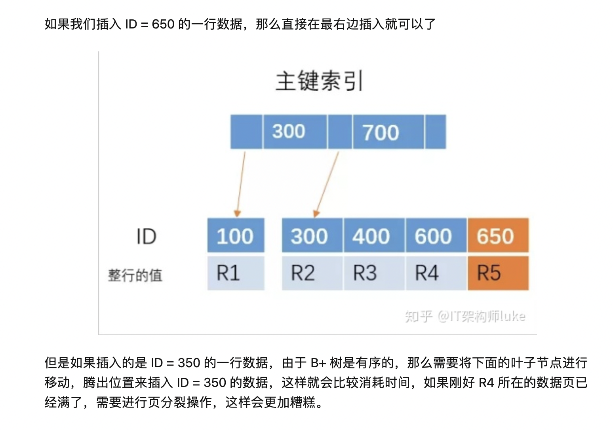
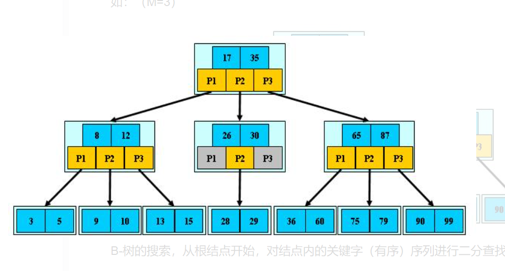
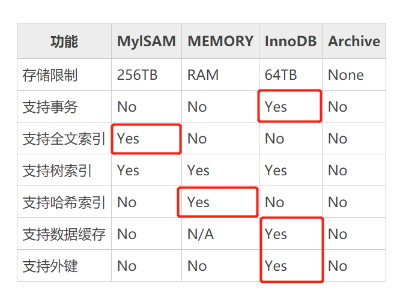
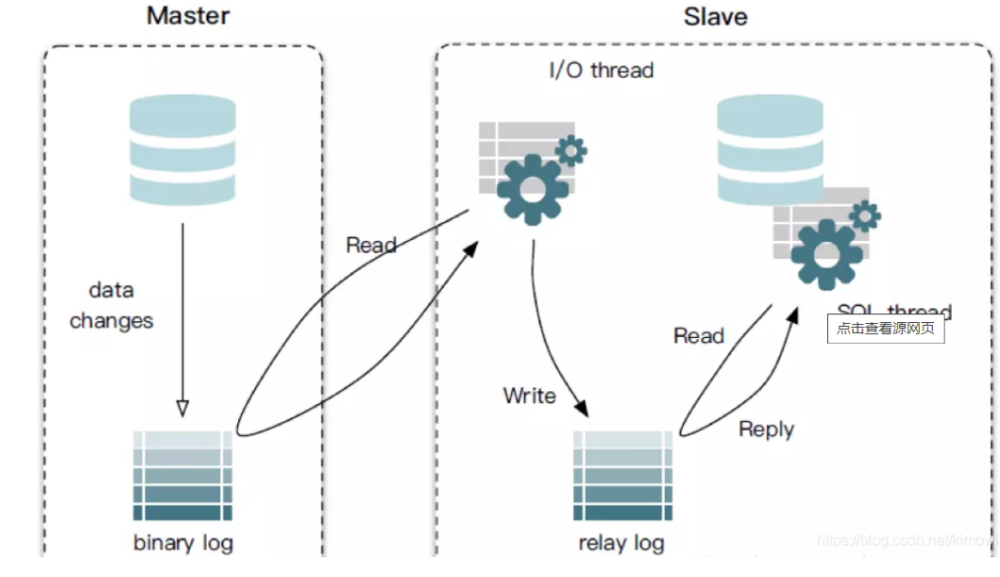
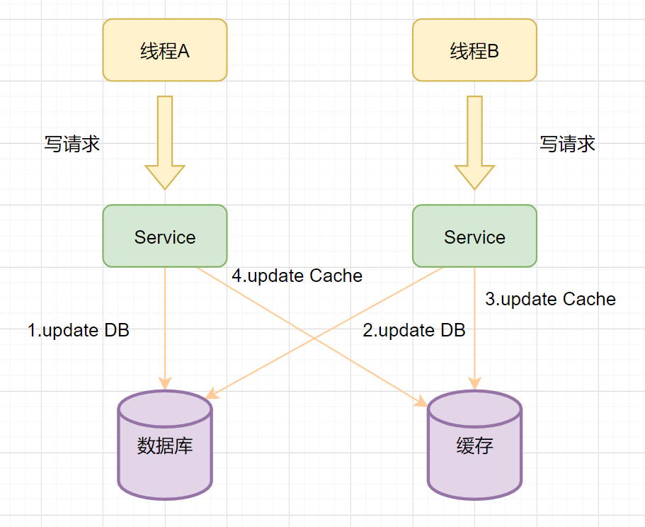
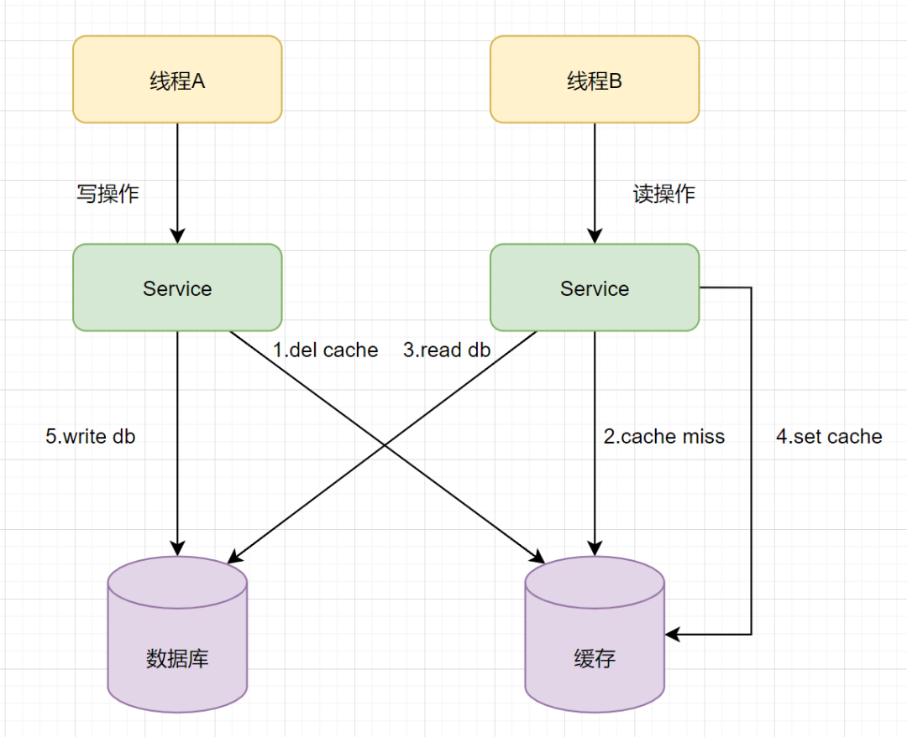
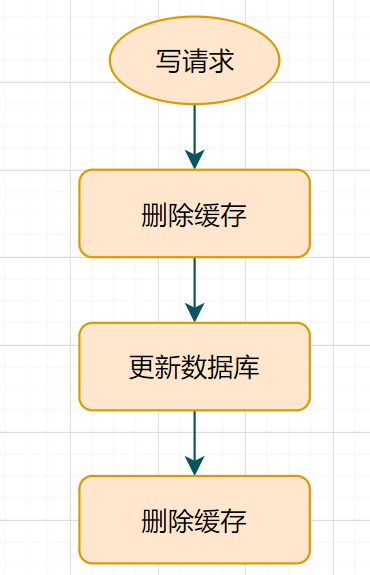
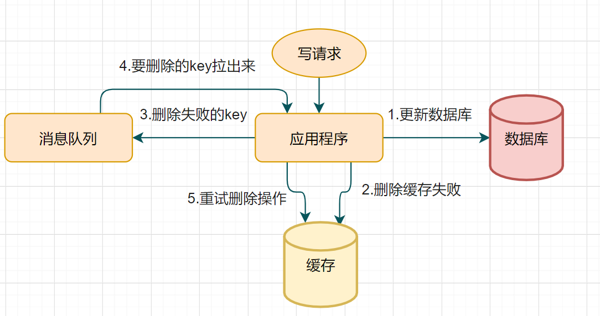
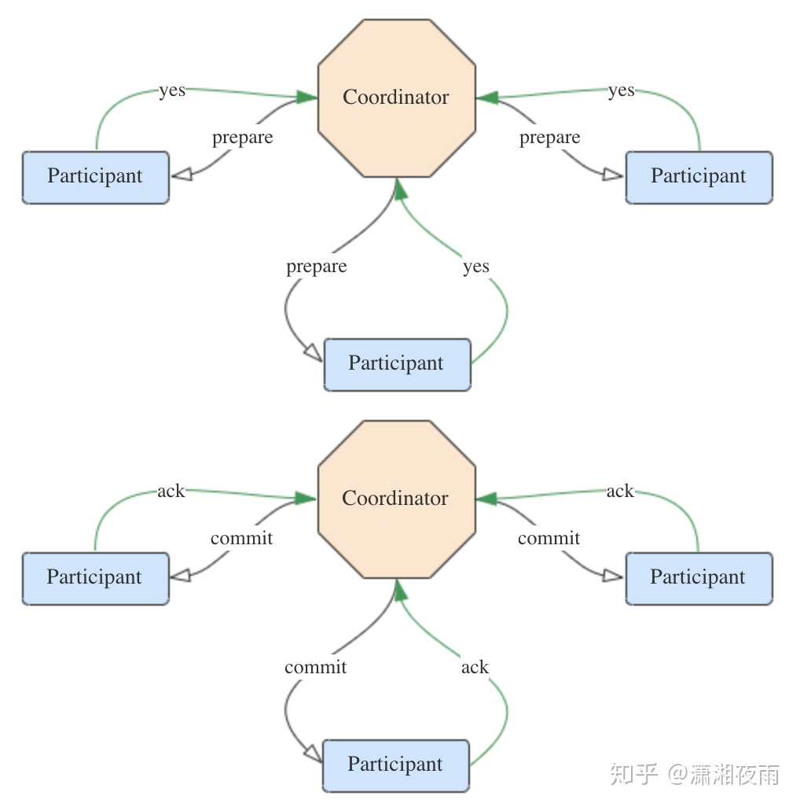
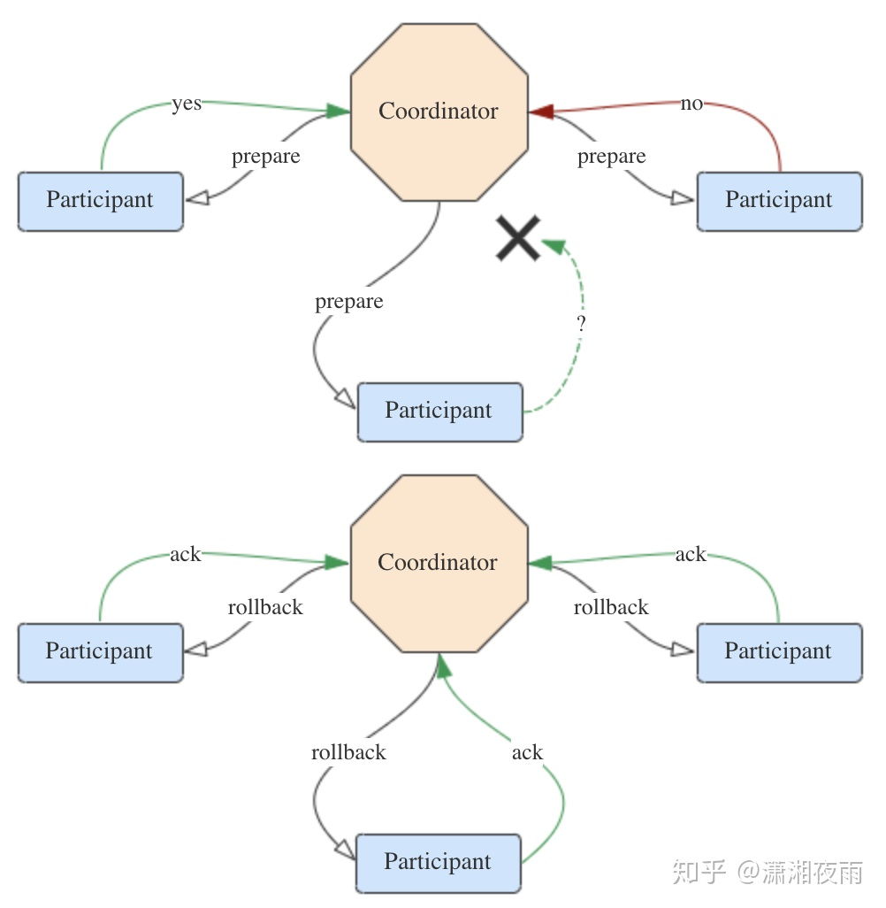

# 数据库Myql

https://zhuanlan.zhihu.com/p/40396971

## 关系型数据库与非关系型数据库

### 关系型数据库

1. 关系型数据库：指采用了关系模型来组织数据的数据库。
2. 关系模型指的就是二维表格模型，而一个关系型数据库就是由二维表及其之间的联系所组成的一个数据组织。
3. 关系型数据库的优点：
   1. 容易理解：二维表结构是非常贴近逻辑世界的一个概念，关系模型相对网状、层次等其他模型来说更容易理解
   2. 使用方便：通用的SQL语言使得操作关系型数据库非常方便
   3. 易于维护：丰富的完整性(实体完整性、参照完整性和用户定义的完整性)大大减低了数据冗余和数据不一致的概率
4. 关系型数据库存在的问题
   1. 网站的用户并发性非常高，往往达到每秒上万次读写请求，对于传统关系型数据库来说，硬盘I/O是一个很大的瓶颈
   2. 网站每天产生的数据量是巨大的，对于关系型数据库来说，在一张包含海量数据的表中查询，效率是非常低的
   3. 在基于web的结构当中，数据库是最难进行横向扩展的，当一个应用系统的用户量和访问量与日俱增的时候，数据库却没有办法像web server和app server那样简单的通过添加更多的硬件和服务节点来扩展性能和负载能力。当需要对数据库系统进行升级和扩展时，往往需要停机维护和数据迁移。
   4. 性能欠佳：在关系型数据库中，导致性能欠佳的最主要原因是多表的关联查询，以及复杂的数据分析类型的复杂SQL报表查询。为了保证数据库的ACID特性，必须尽量按照其要求的范式进行设计，关系型数据库中的表都是存储一个格式化的数据结构。

### 非关系型数据库

1. 非关系型数据库：指非关系型的，分布式的，且一般不保证遵循ACID原则的数据存储系统
2. 非关系型数据库以键值对存储，且结构不固定，每一个元组可以有不一样的字段，每个元组可以根据需要增加一些自己的键值对，不局限于固定的结构，可以减少一些时间和空间的开销
3. 优点
   1. 用户可以根据需要去添加自己需要的字段，为了获取用户的不同信息，不像关系型数据库中，要对多表进行关联查询。仅需要根据id取出相应的value就可以完成查询。
   2. 适用于SNS(Social Networking Services)中，例如facebook，微博。系统的升级，功能的增加，往往意味着数据结构巨大变动，这一点关系型数据库难以应付，需要新的结构化数据存储。由于不可能用一种数据结构化存储应付所有的新的需求，因此，非关系型数据库严格上不是一种数据库，应该是一种数据结构化存储方法的集合。
4. 不足：只适合存储一些较为简单的数据，对于需要进行较复杂查询的数据，关系型数据库显的更为合适。不适合持久存储海量数据
5. 非关系型数据库的分类
   1. 面向高性能并发读写的key-value数据库：
   2. 面向海量数据访问的面向文档数据库：
   3. 面向搜索数据内容的搜索引擎：
   4. 面向可扩展性的分布式数据库：
6. C(Consistency)一致性
   一致性是指更新操作成功并返回客户端完成后，所有节点在同一时间的数据完全一致。与ACID的C完全不同
   A(Availability)可用性
   可用性是指服务一直可用，而且是正常响应时间。
   P(Partition tolerance)分区容错性
   分区容错性是指分布式系统在遇到某节点或网络分区故障的时候，仍然能够对外提供满足一致性和可用性的服务。

著作权归作者所有。商业转载请联系作者获得授权，非商业转载请注明出处。

### 关系型与非关系型数据库的比较

1. 成本：Nosql数据库简单易部署，基本都是开源软件，不需要像使用Oracle那样花费大量成本购买使用，相比关系型数据库价格便宜。
2. 查询速度：Nosql数据库将数据存储于缓存之中，而且不需要经过SQL层的解析，关系型数据库将数据存储在硬盘中，自然查询速度远不及Nosql数据库。
3. 存储数据的格式：Nosql的存储格式是key,value形式、文档形式、图片形式等等，所以可以存储基础类型以及对象或者是集合等各种格式，而数据库则只支持基础类型。
4. 扩展性：关系型数据库有类似join这样的多表查询机制的限制导致扩展很艰难。Nosql基于键值对，数据之间没有耦合性，所以非常容易水平扩展。
5. 持久存储：Nosql不使用于持久存储，海量数据的持久存储，还是需要关系型数据库
6. 数据一致性：非关系型数据库一般强调的是数据最终一致性，不像关系型数据库一样强调数据的强一致性，从非关系型数据库中读到的有可能还是处于一个中间态的数据，
Nosql不提供对事务的处理。

# 索引

## 索引(index)
- 索引 是一种排好序的快速查找数据结构
- 
1. 索引的目的：
   1. 帮助检索数据；
   2. 提高联接效率；
   3. 节省ORDER BY、GROUP BY的时间；
   4. 保证数据唯一性（仅限于唯一索引）。

2. mysql有四种不同的索引：

1，普通索引：最基本的索引，没有任何限制，是我们大多数情况下使用到的索引。

2，唯一索引：与普通索引类型，不同的是唯一索引的列值必须唯一，但允许为空值。

3，全文索引：全文索引（FULLTEXT）仅可以适用于MyISAM引擎的数据表；作用于CHAR、VARCHAR、TEXT数据类型的列。

4，组合索引：将几个列作为一条索引进行检索，使用最左匹配原则。

## 主键索引和非主键索引有什么区别？

如果查询语句是 select * from table where ID = 100,即主键查询的方式，则只需要搜索 ID 这棵 B+树。

如果查询语句是 select * from table where k = 1，即非主键的查询方式，则先搜索k索引树，得到ID=100,再到ID索引树搜索一次，这个过程也被称为回表。

## 为什么建议使用主键自增的索引


- 如果我们的主键是自增的，每次插入的 ID 都会比前面的大，那么我们每次只需要在后面插入就行， 不需要移动位置、分裂等操作，这样可以提高性能。也就是为什么建议使用主键自增的索引

## 聚簇索引和非聚簇索引(有点像vector和List)

每个表只能有一个聚集索引，因为目录只能按照一种方法进行排序。

1. 聚簇索引(聚集索引)：我们把这种正文内容本身就是按照一定规则排列的目录称为“聚集索引”。例如按照拼音查词，目录里的词顺序对应后面内容的顺序。
2. 非聚簇索引(非聚集索引)：我们把这种目录纯粹是目录，正文纯粹是正文的排序方式称为“非聚集索引”。例如按照偏旁查词，目录里的词顺序不对应后面内容的顺序(目录内容和后面内容没有关联性)。
3. **区别**：
   1. **聚集索引一个表只能有一个**，而非聚集索引一个表可以存在多个
   2. **聚集索引存储记录是物理上(存储空间)连续存在**，而非聚集索引是逻辑上的连续，物理存储并不连续。聚集索引中索引的键值逻辑顺序决定了表数据行的物理存储顺序，而非聚集中，非聚集索引只是对键值对的索引，跟键值对的物理存储顺序无关。
   3. 索引是通过二叉树的数据结构来描述的，我们 可以这么理解聚簇索引，**聚集索引的叶节点就是数据节点(即目录顺序对应内容顺序)**。而非聚簇索引的**叶节点仍然是索引节点，只不过有一个指针指向对应的数据块**，所以聚集索引不需要额外的空间来存索引和内容的映射，而非聚集则需要。
4. 优缺点(一般指主键)：
   1. 插入效率： 聚集索引比较慢，因为是顺序存储，所以需要找到位置，有点像ArrayList
   2. 查询速率： 聚集索引会更快，类似vector和list的查询速率。
5. **一些注意点：**
   1. 聚集索引(Unique属性)一个表只有一个，一般是唯一索引，但也可以是其他的索引，只要没有设置唯一索引是聚集索引即可。
   2. 聚集索引不一定效率就要高于非聚集索引，主要看应用的场景。
   3. 数据库中通过什么描述聚集索引与非聚集索引的？ 一般现在的数据库存储索引都是通过二叉树，聚集索引保留了目录和内容的对应，所以叶子结点直接存数据，而非聚集节点，叶子结点存的是指向内容的指针。

## 索引原则(创建索引的注意事项)

1. **最左前缀匹配原则**。这是非常重要、非常重要、非常重要（重要的事情说三遍）的原则，MySQL会一直向右匹配直到遇到范围查询（>,<,BETWEEN,LIKE）就停止匹配。
2. 尽量**选择区分度高的列作为索引**，区分度的公式是 COUNT(DISTINCT col) / COUNT(*)。表示字段不重复的比率，比率越大我们扫描的记录数就越少。
3. **索引列不能参与计算**，尽量保持列“干净”。比如，FROM_UNIXTIME(create_time) = '2016-06-06' 就不能使用索引，原因很简单，B+树中存储的都是数据表中的字段值，但是进行检索时，需要把所有元素都应用函数才能比较，显然这样的代价太大。所以语句要写成 ： create_time = UNIX_TIMESTAMP('2016-06-06')。
4. **尽可能的扩展索引**，不要新建立索引。比如表中已经有了a的索引，现在要加（a,b）的索引，那么只需要修改原来的索引即可。
5. 单个多列组合索引和多个单列索引的检索查询效果不同，因为在执行SQL时，MySQL只能使用一个索引，会从多个单列索引中选择一个限制最为严格的索引。
6. 为经常排序、分组、查询的字段建立索引

## 索引是越多越好吗

1. **数据量小**的表不需要建立索引，建立会增加额外的索引开销
2. 不经常引用的列不要建立索引，因为不常用，即使建立了索引也没有多大意义。对经常用于查询的字段应该创建索引。
3. 经常频繁更新的列不要建立索引，因为肯定会**影响插入或更新的效率**
4. 数据重复且分布平均的字段，因此他建立索引就没有太大的效果（例如性别字段，是否上架等等，不适合建立索引）
5. 数据变更需要维护索引，意味着索引越多维护成本越高。当对表中的数据进行增加、删除、修改时，**索引也需要动态的维护，降低了数据的维护速度。**
6. **更多的索引也需要更多的存储空间**，一个表中很够创建多个索引，这些索引度会被存放到一个索引文件中(专门存放索引的地方)。

## 从innodb的索引结构分析，为什么索引的key长度不能太长?

key太长会导致一个页当中能够存放的key的数目变少，间接导致索引树的页数目变多，索引层次增加，从而影响整体查询变更的效率。


## 六大约束

　　1.NOT NULL ：非空，用于保证该字段的值不能为空。例如学生表的学生姓名及学号等等。

　　2.DEFAULT：默认值，用于保证该字段有默认值。例如学生表的学生性别

　　3.PRIMARY KEY：主键，用于保证该字段的值具有唯一性并且非空。例如学生表的学生学号等。

　　4.UNIQUE：唯一，用于保证该字段的值具有唯一性，可以为空。例如注册用户的手机号，身份证号等。

　　5.CHECK：检查约束（MySql不支持），检查字段的值是否为指定的值。

　　6.FOREIGN KEY：外键，用于限制两个表的关系，用于保证该字段的值必须来自于主表的关联列的值，在从表添加外键约束，用于引用主表中某些的值。例如学生表的专业编号

## 主键，外键和索引


1. 定义：
   1. 主键： 唯一标识一条记录，不允许重复，不允许为空
   2. 外键： 该表的外键其实是另一个表的主键，当前表的外键可以重复，可以为空
   3. 索引：索引不可以重复，但可以有一个索引为null
2. 作用：
   1. 主键：用来保证数据完整性
   2. 外键：用来和其他表建立联系
   3. 索引：提高查询排序速度
3. 个数：
   1. 主键：一个表只能有一个主键
   2. 外键：一个表可以有多个外键
   3. 索引：一个表可以有多个(唯一)索引

### 外键

1、用于限制两个表的关系，从表的字段值引用了主表的某字段值
2、外键列和主表的被引用列要求类型一致，意义一样，名称无要求
3、主表的被引用列要求是一个key（一般就是主键）
4、插入数据，先插入主表，再在从表设置外键

## 什么是内连接(inner join)，左外连接(left join)，右外连接(right join)

https://blog.csdn.net/plg17/article/details/78758593

1. 内连接(inner join)：只把两张表中相关联的记录都显示出来。
2. 左外连接(left join): 左表为主表，左表中的所有记录都会显示，然后右表中哪些没有匹配也要显示但是用null来填充。
3. 右外连接(right join)：右表为主表，右表中的所有记录都会显示，然后左表中哪些没有匹配也要现实但是用null来填充。

## 可以使用多个列来创建索引

任何标准表最多可以创建16个索引列。

## mysql的索引失效的情况？(用explain指令+select语句就可分析这一句sql的情况，主要是索引使用情况)

1. 查询语句中，where后面如果是用了like的，**like以%为前缀时，索引无效**，**以%为后缀时，索引有效**。select * from emp where ename like "%e" ->索引无效化
2. **or语句前后没有同时使用索引**。当or左右查询字段只有一个是索引，该索引失效，只有**当or左右查询字段均为索引时，才会生效**。 有AB两个索引，select * from emp where A="axx" or name = "Asda" ->索引无效，因为or后面的name不是索引。
3. 组合索引的时候，不是**使用第一列索引，索引失效**。有ABC三个索引，select * from emp where B="Sss" and C = "sdas". ->索引无效化，因为A是第一列索引，然后没有用上。
4. **数据类型出现隐式转化**。如varchar不加单引号的话可能会自动转换为int型，使索引无效，产生全表扫描。例如一个索引job是varchar类型的。 select * from emp where job=100.(job转成int型) -> 索引无效。
5. 在索引字段上使用not，<>，!=。**不等于操作符是永远不会用到索引的**，因此对它的处理只会产生全表扫描。 优化方法： key<>0 改为 key>0 or key<0。
6. **对索引字段进行计算操作、字段上使用函数**。例如索引为emp(ename，empno，sal), select * from emp where left(ename,2)="SMITH" -> 索引无效化，因为对索引进行函数操作。
7. **当全表扫描速度比索引速度快时**，mysql会使用全表扫描，此时索引失效。
8. 如果查询时用到了，**index is null这样的判断，索引失效，转为全局扫描**。
9. **不满足最左前缀原则**，类似a=1 and b = 1 and c > 3 and d = 1,d这个索引就失效了。**中间不能有范围查询！！！**

## hash索引和B+树索引的区别？

1. B+树索引具有**范围查找和前缀查找**的能力，对于有N节点的B树，检索一条记录的复杂度为O(LogN)。相当于二分查找，同时B+树索引可以支持模糊查询(支持最左匹配原则)
2. 哈希索引只能做等于查找，但是无论多大的Hash表，查找复杂度都是O(1)。
3. 如果值的差异性大，并且**以等值查找（=、 <、>、in）为主**，Hash索引是更高效的选择，它有O(1)的查找复杂度。但是Hash 索引不支持多列联合索引(因为不是我们所想的多个索引的hash联合而是多个索引联合后求哈希)
4. 如果值的差异性相对较差，并且**以范围查找**为主，B树是更好的选择，它支持范围查找。
5. 为什么最终选择B+数索引：大多数场景下，都会有组合查询，范围查询、排序、分组、模糊查询等查询特征

## 索引无法存储null值

1. 单列索引无法存储null值，复合(组合)索引无法存储全为null的值
2. 索引是有序的。NULL值进入索引时，无法确定其应该放在哪里。（将索引列值进行建树，其中必然涉及到诸多的比较操作，null 值是不确定值无法。
3. 如果需要把空值存入索引，方法有二：其一，把NULL值转为一个特定的值，在WHERE中检索时，用该特定值查找。其二，建立一个复合索引。

## NULL与空值区别

1、空值不占空间，NULL值占空间。当字段不为NULL时，也可以插入空值。

2、当使用 IS NOT NULL 或者 IS NULL 时，只能查出字段中没有不为NULL的或者为 NULL 的，不能查出空值。

3、判断NULL 用IS NULL 或者 is not null,SQL 语句函数中可以使用IFNULL()函数来进行处理，判断空字符用 =''或者<>''来进行处理。

4、在进行**count()统计某列的记录数的时候，如果采用的NULL值，会被系统自动忽略掉，但是空值是会进行统计到其中的。**

5、MySql中如果某一列中含有NULL，那么包含该列的索引就无效了。这一句不是很准确。

6：实际到底是使用NULL值还是空值('')，根据实际业务来进行区分。个人建议在实际开发中如果没有特殊的业务场景，可以直接使用空值。

## 数据库为什么是 B+ 树而不是hash表、红黑树等等

1. 大多数场景下，数据库都会有组合查询，范围查询、排序、分组、模糊查询等查询特征

2. 为什么不用红黑树？一般InnoDB一个页16k，一条记录1k大小，如果是二叉树，剩下的记录不方便存储，因此用多路树；另外如果红黑树，同样多的内容的话，深度会变大很多，磁盘的IO次数也会增加很多。

## B+树、B树、红黑树的区别

1. B树：二叉搜索树，所有非叶子结点至多拥有两个儿子，非叶子结点的左指针指向小于其关键字的子树，右指针指向大于其关键字的子树。那么B树的搜索性能逼近二分查找；但它比连续内存空间的二分查找的优点是，改变B树结构（插入与删除结点）不需要移动大段的内存数据，甚至通常是常数开销；有个平衡问题就是会退化成链表。
2. B-树：也可以叫做多路搜索树，即不是二叉的。B-树的性能总是等价于二分查找（与M值无关），也就没有B树平衡的问题，即可以看成是二三树，是一个比较平衡的搜索树。每个关键词只出现一次，然后非叶子节点也是可以被命中的，即也是数据。

3. B+树： B+的搜索与B-树也基本相同，区别是B+树只有达到叶子结点才命中(**数据都出现在叶子结点，然后叶子结点之间会有指针相连形成个链表结构**)
   1. 所有关键字都出现在叶子结点的链表中（稠密索引），且链表中的关键字恰好是有序的；
   2. 非叶子节点不可能是数据
   3. 非叶子结点相当于是叶子结点的索引（稀疏索引），叶子结点相当于是存储（关键字）数据的数据层；
4. 红黑树(平衡二叉树，从二三树改进过来，二三树的三叉用红黑颜色表示)：红黑树（Red-Black Tree）是二叉搜索树（Binary Search Tree）的一种改进。我们知道二叉搜索树在最坏的情况下可能会变成一个链表（当所有节点按从小到大的顺序依次插入后）。而红黑树在每一次插入或删除节点之后都会花O（log N）的时间来对树的结构作修改，以保持树的平衡，以下是性质：
   1. 根节点是黑色的。
   2. 空节点是黑色的
   3. 红色节点的父、左子、右子节点都是黑色
   4. 在任何一棵子树中，每一条从根节点向下走到空节点的路径上包含的黑色节点数量都相同
5. 优缺点和适用场景
   1. 适用场景：如果涉及到磁盘操作的话，B+树会好一些，如果是直接内存操作的话，红黑树的效率会更高。

## 11三层的B+树可以存多少信息，页表自己定义，节点大小自己估算

<https://blog.csdn.net/csdnlijingran/article/details/102309593>
一般来说InnoDB中的一页大小是16KB

1. 如果是两层的B+树：
那么这棵B+树的存放**总记录数为：根节点指针数*单个叶子节点记录行数**
因为非叶子节点的结构是：“页指针+键值”，我们假设**主键ID为bigint类型**，长度为8字节（byte），而**指针大小在InnoDB源码中设置为6字节**（byte），这样一共14字节，一个页可以存放的指针个数为16384/14=1170个，指针指向一个存放记录的页，一个页里可以放16条数据，那么一颗高度为2的B+树就可以存放 1170 * 16=18720 条数据。同理，高度为3的B+树，就可以存放 1170 * 1170 * 16 = 21902400 条记录。
1. 如果是三层的B+树：节点大小和页大小都按照14字节和16K来定的话，这边麻烦的就是层次问题
从二层来推，首先二层的情况是1170个对吧，而第二层的每一个页也都可以存1170个，行记录数是累乘的，就是1170 * 1170 * 16。

## 什么情况会用到哈希索引？会存到硬盘吗？

关系性数据库这种数据量大的索引能达到亿级别，所以为了减少内存的占用，索引也会被存储在磁盘上

- 文件系统和数据库的索引都是存在硬盘上的，所以如果数据量比较大的情况下，不一定能一次性读到内存中，所以采取多路树的话，不需要一次性加载这么多的数据，而哈希索引就是类似数据吧，数据是平层的，所以需要一次性读到内存当中，可能会出现不够读的情况。所以用B+树也是有从这方面的考虑。

- **数据库中用B+树的原因**：
  - 数据库中select数据的时候可能会查询多条数据，那么B+ 树由于所有数据都在叶子结点，不用跨层，同时由于有链表结构，只需要找到首尾，通过链表就能把所有数据取出来了。这样子范围查询更方便，也是为什么不选择B-树，因为B-树的话非叶子节点也会是数据。

## 为何使用B+树，而非B-树或者红黑树

1. B-树的每个节点都有data域（指针），这会增加IO次数；而B+树除了叶子节点其它节点并不存储数据，节点小，磁盘IO次数就少。这是优点之一。为什么是B+树而不是B树呢，因为它内节点不存储data，这样一个节点就可以存储更多的key。
2. B+树所有的Data域在叶子节点，一般来说都会进行一个优化，就是将所有的叶子节点用指针串起来。这样遍历叶子节点就能获得全部数据，能进行区间访问
3. 红黑树往往出现由于树的深度过大而造成磁盘IO读写过于频繁，进而导致效率低下的情况。

1. B+树空间利用率更高，可减少I/O次数
2. 增删文件（节点）时，效率更高
   1. 因为B+树的叶子节点包含所有关键字，并以有序的链表结构存储，这样可很好提高增删效率，基于范围查询更好。
3. B+树的查询效率更加稳定
   1. 因为B+树的每次查询过程中，都需要遍历从根节点到叶子节点的某条路径。所有关键字的查询路径长度相同，导致每一次查询的效率相当。

# 锁

## 锁有哪几种分类方式

1. 按操作划分，可分为DML锁、DDL锁

2. **按锁的粒度划分，可分为表级锁、行级锁、页级锁（mysql）**

3. **按锁级别划分，可分为共享锁、排他锁**

4. 按加锁方式划分，可分为自动锁、显示锁

5. **按使用方式划分，可分为乐观锁、悲观锁**

## MySQL中有哪几种锁(表锁，行锁，页锁)

1. 表级锁(全表锁)：开销小，上锁快，不会出现死锁，锁的粒度比较大，并发性较差。
2. 行级锁：针对行上锁，开销大，可能死锁，粒度比较小，并发度比较好。
3. 页面锁：粒度介于行和表，所以开销也介于两者之间。比较中庸和平衡的锁。

### MyISAM锁机制

1. MyISAM引擎只提供表锁。
2. 在执行查询语句（ SELECT ）前，会自动给涉及的表加读锁，此时允许其他用户对同一表的读操作。但会阻塞对同一个表的写操作。
3. 在执行更新操作（ UPDATE、DELETE、INSERT 等）前，会自动给涉及的表加写锁，此时会阻塞其他用户对同一个表的读操作和写操作。

### InnoDB锁机制
InnoDB 支持表锁、行锁，实际上**InnoDB 是通过给索引项加锁，来实现行锁的。**

只有查询数据时，**检索条件走索引才可以使用行级锁，否则 InnoDB 将使用表锁。**

在实际开发中，要特别注意 InnoDB 这一特性，不然，可能造成大量的锁冲突，从而影响并发！！！

InnoDB使用索引的条件
（1）在不通过索引条件查询的时候，InnoDB 确实使用的是表锁，而不是行锁。
（2）**行锁是针对索引加锁**，不是针对记录加的锁。即使访问的是不同行，但如果它们**索引相同，还是会出现锁冲突**。
（3）当表中含有多个索引的时候，不同的事务可以使用不同的索引锁定不同的行。
（4）即使在条件中使用了索引，但是否使用索引来检索数据是由 MySQL 通过判断不同执行计划的代价决定的。如果 MySQL 认为全表扫描效率更高，比如很小的表，也不会使用索引，此时 InnoDB 将使用表锁，而不是行锁。因此，在分析锁冲突的时候，不要忘记检查 SQL 的执行计划，以确定是否真正使用了索引。

在默认的可重复读隔离级别下：

**执行查询语句（ SELECT ）前，由于 MVCC（多版本控制）的方式，什么锁都不会加。**
**在执行更新操作（ UPDATE、DELETE、INSERT 等）前，会自动给涉及的行加写锁，此时会阻塞其他用户的写操作，但是通过 MVCC（多版本控制）的方式允许读操作**

## 乐观锁与悲观锁

### 悲观锁   写多用

1. 这种借助数据库锁机制在修改数据之前先锁定，再修改的方式被称之为悲观并发控制（又名“悲观锁”，Pessimistic Concurrency Control，缩写“PCC”）。
2. 流程

         在对任意记录进行修改前，先尝试为该记录加上排他锁（exclusive locking）。
         如果加锁失败，说明该记录正在被修改，那么当前查询可能要等待或者抛出异常。 具体响应方式由开发者根据实际需要决定。
         如果成功加锁，那么就可以对记录做修改，事务完成后就会解锁了。
         其间如果有其他对该记录做修改或加排他锁的操作，都会等待我们解锁或直接抛出异常

### 乐观锁   读多用

1. 乐观锁（ Optimistic Locking ） 相对悲观锁而言，乐观锁假设认为数据一般情况下不会造成冲突，所以在数据进行提交更新的时候，才会正式对数据的冲突与否进行检测，如果发现冲突了，则让返回用户错误的信息，让用户决定如何去做。
2. 相对于悲观锁，在对数据库进行处理的时候，乐观锁并不会使用数据库提供的锁机制。一般的**实现乐观锁的方式就是记录数据版本**。实现数据版本有两种方式，第一种是使用**版本号**，第二种是使用**时间戳**。
3. 为数据库表添加一个 “version”字段来实现读取出数据时，将此版本号一同读出，之后更新时，对此版本号加1。在更新过程中，会对版本号进行比较，如果是一致的，没有发生改变，则会成功执行本次操作；如果版本号不一致，则会更新失败。
4. 乐观锁机制在高并发场景下，可能会导致大量更新失败的操作。

### 乐观锁和悲观锁的区别

- a. 加锁时机不同：
- 
         1.悲观锁，从数据开始修改时就将数据锁住，直到更改完成才释放锁
         2.乐观锁，直到数据修改完准备提交时才上锁，完成后释放
- b.并发性区别
         1.因为悲观锁是在事务执行中加锁，当并发量高时，就有可能会对其他事务进程造成影响，造成其他事务进程执行时间过长，导致事务超时
         2.乐观锁是在对数据进行检查时才加锁，锁的时间会少很多，而只有锁住数据的时候会影响其它事务。
         3.两种锁各有优缺点，不可认为一种好于另一种，像**乐观锁适用于写比较少的情况下，即冲突真的很少发生的时候，这样可以省去了锁的开销，加大了系统的整个吞吐量。**但如果经常产生冲突，上层应用会不断的进行retry，这样反倒是降低了性能，所以这种情况下用悲观锁就比较合适

## 数据库中的时间戳是什么(数据库的锁机制->行间锁，表级锁，时间戳)

时间戳的话，是一种**非锁机制来实现并发**。

- 原理：
时间戳就是在数据库表中单独**加一列时间戳**，比如“TimeStamp”， 每次读出来的时候，把该字段也读出来，**当写回去的时候，把该字段加1(操作后+1)**，提交之前 ，跟**数据库的该字段比较**一次，如果**与数据库的值一致的话(中间没有其他事务操作这些数据)**，就允许保存，否则不允许保存，这种机制不通过锁机制，但也可以提高数据库的并发处理能力。

## 1了解 MVCC (multi version concurrent control)(多版本控制)吗

https://blog.csdn.net/SnailMann/article/details/94724197

- 在并发访问的时候，数据存在版本的概念，MVCC可以有效地提升数据库并发能力
- 简单讲，如果没有MVCC，当想要读取的数据被其他事务用排它锁锁住时，只能互斥等待；而这时MVCC可以通过提供历史版本从而实现读取被锁的数据(的历史版本)，避免了互斥等待。
- 在 MySQL中，**多版本并发控制是InnoDB 存储引擎实现隔离级别的一种具体方式**，用于实现提交读和可重复读这两种隔离级别。而未提交读隔离级别总是读取最新的数据行，无需使用 MVCC；可串行化隔离级别需要对所有读取的行都加锁，单纯使用 MVCC 无法实现。

  MVCC一般有两种实现方式，本文所讲的InnoDB采用的是后者:
   实时保留数据的一个或多个历史版本
   **在需要时通过undo日志构造出历史版本** Read View 就是事务进行快照读操作的时候生产的读视图 (Read View)

## 数据库索引与锁的关系

- 索引分为主键索引和非主键索引两种，如果一条sql语句操作了主键索引，MySQL就会锁定这条主键索引；如果一条语句操作了非主键索引，MySQL会先锁定该非主键索引，再锁定相关的主键索引。

## mysql怎么实现分布式锁

1. 最简单的方式可能就是直接创建一张锁表(**通过唯一性约束**)，然后通过操作该表中的数据来实现了。当我们想要获得锁的时候，就可以在该表中增加一条记录，想要释放锁的时候就删除这条记录。```INSERT INTO database_lock(resource, description) VALUES (1, 'lock');```**resource字段做唯一性约束**，这样如果有多个请求同时提交到数据库的话，数据库可以保证只有一个操作可以成功
2. 基于数据库乐观锁，如MySQL（增加字段版本标识version控制实现）
数据增加一个版本标识，在基于数据库表的版本解决方案中，一般是通过为数据库表添加一个 “version”字段来实现读取出数据时，将此版本号一同读出，之后更新时，对此版本号加1。在更新过程中，会对版本号进行比较，如果是一致的，没有发生改变，则会成功执行本次操作；如果版本号不一致，则会更新失败。

**优缺点**:乐观锁的优点比较明显，由于在检测数据冲突时并不依赖数据库本身的锁机制，不会影响请求的性能，当产生并发且并发量较小的时候只有少部分请求会失败。缺点是需要对表的设计增加额外的字段，增加了数据库的冗余，另外，当应用并发量高的时候，version值在频繁变化，则会导致大量请求失败，影响系统的可用性。

## 无锁hash的实现

**CAS(Compare And Swap)**是一种底层硬件提供的功能，它可以将判断并更改一个值的操作原子化。

### 无锁链表的实现


 在实现无锁HashMap之前，让我们先来看一下比较简单的无锁链表的实现方法。

以插入操作为例：

首先我们需要找到待插入位置前面的节点A和后面的节点B。
然后新建一个节点C，并使其next指针指向节点B。（见图1）
最后使节点A的next指针指向节点C。（见图2）

但在操作中途，有可能其他线程在A与B直接也插入了一些节点（假设为D），如果我们不做任何判断，可能造成其他线程插入节点的丢失。（见图3）我们可以利用CAS操作，在为节点A的next指针赋值时，判断其是否仍然指向B，如果节点A的next指针发生了变化则重试整个插入操作。

无锁链表的查找操作与普通链表没有区别。而其删除操作，则需要找到待删除节点前方的节点A和后方的节点B，利用CAS操作验证并更新节点A的next指针，使其指向节点B。

### 无锁HashMap的难点与突破

- HashMap主要有插入、删除、查找以及ReHash四种基本操作。一个典型的HashMap实现，会用到一个数组，数组的每项元素为一个节点的链表。对于此链表，我们可以利用上文提到的操作方法，执行插入、删除以及查找操作，但对于ReHash操作则比较困难。


如图4，在ReHash过程中，一个典型的操作是遍历旧表中的每个节点，计算其在新表中的位置，然后将其移动至新表中。期间我们需要操纵3次指针（将C节点从蓝表ReHash到绿表）：

将A的next指针指向D
将B的next指针指向C
将C的next指针指向E
而这三次指针操作必须同时完成，才能保证移动操作的原子性。但我们不难看出，CAS操作每次只能保证一个变量的值被原子性地验证并更新，无法满足同时验证并更新三个指针的需求。

于是我们不妨换一个思路，既然移动节点的操作如此困难，我们可以使所有节点始终保持有序状态，从而避免了移动操作。在典型的HashMap实现中，数组的长度始终保持为2^{i}，而从Hash值映射为数组下标的过程，只是简单地对数组长度执行取模运算（即仅保留Hash二进制的后i位）。当ReHash时，数组长度加倍变为2^{i+1}，旧数组第j项链表中的每个节点，要么移动到新数组中第j项，要么移动到新数组中第j+2^{i}项，而它们的唯一区别在于Hash值第i+1位的不同（第i+1位为0，则仍为第j项，否则为第j+2^{i}项）。


如图5，我们将所有节点按照Hash值的翻转位序（如1101->1011，就是顺序逆序）由小到大排列。当数组大小为8时，2、18在一个组内；3、11、27在另一个组内。每组的开始，插入一个哨兵节点，以方便后续操作。为了使哨兵节点正确排在组的最前方，我们将正常节点Hash的最高位（翻转后变为最低位）置为1，而哨兵节点不设置这一位。

当数组扩容至16时（见图6），第二组分裂为一个只含3的组和一个含有11、27的组，但节点之间的相对顺序并未改变。这样在ReHash时，我们就不需要移动节点了。

（通过上面的表述可知：核心思想就是，**通过一些列的方法，使rehash时总体链表顺序不改变**）

由于扩容时数组的复制会占用大量的时间，这里我们采用了将整个数组分块，**懒惰建立**的方法。这样，**当访问到某下标时，仅需判断此下标所在块是否已建立完毕（如果没有则建立）。**

# 事务

## 数据库的三范式

1. 第一范式：列不可以再分
   1. 目的：确保每一列元素的原子性。即让每一列都不可在细分。
   2. 举例：例如中国北京，中国上海，这个时候列可以由一列拆分成两列 中国 北京 中国 上海。此时才是不能在细分。
2. 第二范式：行可以唯一区分->主键约束
   1. 目的：目的是每张表只描述一件事情。这样子可以通过这件事的主键来精确定位到这张表。
   2. 举例：例如产品订单可以分为产品信息和订单信息
3. 第三范式：表的非主属性不能依赖其他表的非主属性->外键(另一张表)约束。
   1. 目的： 不存在对非主键列的传递依赖

## 数据库事务(ACID属性)

事务(TRANSACTION)是作为单个逻辑工作单元执行的一系列操作，**这些操作作为一个整体一起向系统提交，要么都执行、要么都不执行**。
ACID属性：

1. 原子性(Atomicity  adəˈmisədē): 事务是一个完整的操作，里面的每一步操作都是不可分割的，要么都成败，要么都失败。
2. 一致性(Consistency): 当事务完成后，数据处于一致状态的。不会发生不可预期变化。
3. 隔离性(Isolation  ˌīsəˈlāSH(ə)n): 对数据进行修改的所有**并发事务是彼此隔离的**， 这表明**事务必须是独立的**，它不应以任何方式依赖于或影响其他事务。
4. 永久性(Durability): 事务对数据库的修改是永久保持的，而不是暂时修改。

## 数据库并发事务带来哪些问题(脏读和幻读)

1. 脏读： 当一个事务正在访问数据并且**对数据进行了修改**，而这种**修改还没有提交到数据库中**，这时**另外一个事务也访问了这个数据，然后使用了这个数据(元数据没经过修改的)**。因为这个数据是还没有提交的数据，那么另外一个事务读到的这个数据是“脏数据”，依据“脏数据”所做的操作可能是不正确的。
2. 丢失修改：: 指在一个事务读取一个数据时，另外一个事务也访问了该数据，那么在第一个事务中修改了这个数据后，第二个事务也修改了这个数据。**这样第一个事务内的修改结果就被第二个事务的修改结果给覆盖了**
3. 不可重复读： 指在一个事务内多次读同一数据。在这个事务还没有结束时，另一个事务也访问该数据。那么，在第一个事务中的两次读数据之间，由于第二个事务的修改导致第一个事务两次读取的数据可能不太一样。这就发生了在一个事务内两次读到的数据是不一样的情况，因此称为不可重复读。**在重复读过程中，插进了修改事务，正常重复读不可能值不同。**
4. 幻读：依然是一个事务在不同的查询读操作，但中间插进来一个事务进行了insert操作，第一个事务再次读的时候会**发现多了一些原本没有的数据**，就像幻觉。

## 事务四大隔离级别(针对并发事务问题的)

1. 读取未提交（read uncommitted）：最低的隔离级别，允许读取还没提交的变更数据，会导致幻读，脏读，不可重复读。
2. 读取已提交（read committed）：允许读取其他事务提交的修改数据，可以避免脏读，还会有幻读(插入数据)和不可重复读
3. 可重复读（repeatable read）：保证对同一个字段的多次读取结果是一致的，除非数据被本身事务修改。可以进一步避免不可重复读，但**幻读还是会出现**(没涉及到插入操作insert)。
4. 可串行化（serializable）：最高的隔离级别，可以实现ACID属性，所有的事务依次逐个执行，事务和事物之间不能产生干扰。

## MySQL支持事务么？

默认情况下，mysql是autocommit模式的，是不支持事务的。
但如果用的mysql表类型是innoDB表的话，引擎就是inooDB，此时是支持事务的。

## relay log(中继) bin log这两个日志是什么，有什么作用。

1. bin log:主要作用是**记录数据库中表的更改**，它只**记录改变数据的sql**，不改变数据的sql不会写入，比如select语句一般不会被记录，因为他们不会对数据产生任何改动。可用于**本机数据恢复和主从同步**
2. redo log可以实现数据重做，那为什么要使用binlog？因为redo log是Innodb实现的物理日志，一旦涉及到多种存储引擎，无法进行重做。
3. relay log: MySQL进行**主主复制或主从复制**的时候会在home目录下面产生相应的relay log, 和bin log有点相似也是记录变化的，但应用环境不一样。从服务器读取主服务器并记录到从服务器本地空间，然后sql线程会读取传输来的relay log并将对应内容应用到从服务器。
4. Mysql 主节点将binlog写入本地，从节点定时请求增量binlog，主节点将binlog同步到从节点。
   从节点单独进程会将binlog 拷贝至本地 relaylog中。
   从节点定时重放relay log。

## mysql是如何实现事务的（redo log，undo log和锁）

mysql事务具有四大特点：ACID，事务想要实现的是可靠性和并发处理。
**可靠性**：数据库要保证当insert或update操作时抛异常或者数据库崩溃crash的时候，数据在操作前后的一致，想要做到这个，我**需要知道我修改之前和修改之后的状态(undo log和redo log)**
**并发处理**：也就是说当多个并发请求过来，并且其中有一个请求是对数据修改操作的时候会有影响，为了避免读到脏数据，所以需要**对事务之间的读写进行隔离。(锁技术和MVCC)**

1. redo log(重做修复日志)：不管事务执行成功与否，redo都记录修改后的数据；redo log通常是物理日志，记录的是数据页的物理修改，而不是某一行或某几行修改成怎样怎样，它用来恢复提交后的物理数据页(恢复数据页，且只能恢复到最后一次提交的位置)。该日志文件由两部分组成：**重做日志缓冲（redo log buffer）**以及**重做日志文件（redo log）**,**前者是在内存中，后者在磁盘中**。mysql会将每次的事务执行后写到磁盘存起来。
   1. 作用：mysql 为了提升性能不会把每次的修改都实时同步到磁盘，而是会先存到Buffer Pool(缓冲池)里头，把这个当作缓存来用。然后使用后台线程去做缓冲池和磁盘之间的同步。因为磁盘的话是持久化特性的，如果在由缓存向磁盘缓存的过程中，出现了问题，就可以通过磁盘来恢复上一个的状态。
2. undo log(回滚日志)：用于记录数据被修改前的信息。他正好跟前面所说的重做日志所记录的相反，重做日志记录数据被修改后的信息，每次**写入数据或者修改数据(事务操作之前)之前都会把*修改前的信息记录到 undo log***。
   1. 作用：undo log 记录事务修改之前版本的数据信息，因此假如由于系统错误或者rollback操作而回滚的话可以根据undo log的信息来进行回滚到没被修改前的状态。即undo log是用来回滚数据的用于保障未提交事务的原子性。
3. 锁机制：为了并发安全设计的，mysql中分为读锁和写锁，读锁是共享锁，写锁是排他的，通过读写锁，可以做到读读可以并行，但是不能做到写读，写写并行。
4. MVCC基础：multiVersion concurrent control多版本并发控制。
   1. InnoDB的 MVCC ，是通过在每行记录的后面保存两个隐藏的列来实现的。这两个列，一个保存了行的创建时间，一个保存了行的过期时间，当然存储的并不是实际的时间值，而是**系统版本号**
   2. MVCC的实现依赖于undo log和read view：undo log中记录某行数据的多个版本的数据，read view:用来判断当前版本数据的可见性
5. **事务的具体实现**：事务的**原子性是通过undo log来实现的** 事务的**持久性是通过redolog来实现的** 事务的**隔离性是通过(读写锁+MVCC)来实现的** 而**事务的终极大boss一致性是通过原子性，持久性，隔离性共同来实现的**！！！
   1. 原子性：就是通过回滚操作。所谓回滚操作就是当发生错误异常或者显式的执行rollback语句时需要把数据还原到原先的模样。在事务之前记录被修改前的数据(源数据)到undo log
   2. 持久性：事务一旦提交，其所做的修改会永久保存到数据库中，此时即使系统崩溃修改的数据也不会丢失。redo log分成redo log buffer，为了快速的保存，而不是一直进行IO操作。但buffer断电会丢失数据。而且redo log存在磁盘中redo log 的存储是顺序存储，而缓存同步是随机操作。缓存同步以数据页为单位，一般小于redo log。
   3. 隔离性：根据事务的四大隔离级别。如果是未提交读，其实都不用锁。
      1. 可重复读的话，使用的是读写锁，即读锁是共享的，写锁是排他的，有写锁的时候，其他线程都要拥塞。所以可以实现可重复读，因为写不结束没法继续读。**(读写分离，读读并行，写独占)**
      2. MVCC(可重复读)：和版本有关，在每一行里加入了两个隐藏列，其中有一个就是版本号，规定**多次读取只生成一个版本**，读到的自然是相同数据，所以这个时候不需要在要求写锁是独占式的了，这个情况下，可以实现**读写并发**。
   4. 一致性：**数据库总是从一个一致性的状态转移到另一个一致性的状态。**例如汇款么，我给你500块，不管是发生了什么，我们俩之间总和肯定是一致的。
      1. 为什么会不一致：因为在事务的过程中会遇到问题，类似断电，异常，并发问题，可以通过上面的原子性，持久性，隔离性来修改这些问题，最终保持一致性。

## innodb有哪几种日志?(redo log,undo log)

首先要明确一点就是mysql是日志优先的数据库，日志先于数据写入磁盘，先使用顺序IO写入然后，再根据一定的频率将脏页刷新回磁盘。实现了数据库崩溃后的数据恢复等。从而开始实现事务。

1. redo log(重做修复日志)：redo log叫做重做日志，是用来实现事务的持久性。该日志文件由两部分组成：**重做日志缓冲（redo log buffer）**以及**重做日志文件（redo log）**,**前者是在内存中，后者在磁盘中**。mysql会将每次的事务执行后写到磁盘里保存起来。
   1. 作用：mysql 为了提升性能不会把每次的修改都实时同步到磁盘，而是会先存到Boffer Pool(缓冲池)里头，把这个当作缓存来用。然后使用后台线程去做缓冲池和磁盘之间的同步。因为磁盘的话是持久化特性的，如果在由缓存向磁盘缓存的过程中，出现了问题，就可以通过磁盘来恢复上一个的状态。
2. undo log(回滚日志)：用于记录数据被修改前的信息。他正好跟前面所说的重做日志所记录的相反，重做日志记录数据被修改后的信息，每次**写入数据或者修改数据(事务操作之前)之前都会把*修改前的信息记录到 undo log***。undo用来回滚行记录到某个版本。undo log一般是逻辑日志
   1. 作用：undo log 记录事务修改之前版本的数据信息，因此假如由于系统错误或者rollback操作而回滚的话可以根据undo log的信息来进行回滚到没被修改前的状态。即undo log是用来回滚数据的用于保障 未提交事务的原子性。
3. relay log

## 1MySQL的持久化手段，比如执行update 语句时，如何保证数据持久化？(稍微展开一些)

mysql的持久化靠的是redo log。详见上面的**mysql是如何实现事务的**

## 有了可重复读，为什么还需要串行化？

- 可重复读只是针对修改操作，幻读本质上是插入insert操作引起的。

# 数据库基本概念

## 数据库存储引擎(用show engine可以查看)

1. 什么是数据库引擎： 数据库引擎是数据库的底层软件组织，用来实现创建，查询，更新和删除数据等操作。

2. 主要有三种引擎：不同的引擎带来不同的存储机制，索引技巧等。
   1. MyISAM：全表锁，读取速度快，不支持事务，外键，并发性能差(全表锁)，占用空间也较小，适合select和insert等非修改操作。
   2. InnoDB：行级锁，支持提交，回滚和崩溃修复等事务，支持自动增长列，支持外键，并发性能好，占用空间会较大，速度也叫MyIASM慢。
   3. Memory：全表锁，存储在内存中，检索特别快，但占用的内存也会大，默认为hash索引，所以快速查找但不能精确查找。适用于变化不频繁的代码表。
   4. Archive：Archive 存储引擎非常适合存储归档数据，只有插入和查询操作的效率非常高。
3. 各个引擎的适用场景：
   1. 如果要提供提交、回滚和恢复的**事务安全（ACID 兼容）能力**，并**要求实现并发控**制，InnoDB 是一个很好的选择。
   2. 如果数据表主要用来**插入和查询记录**，则 MyISAM 引擎提供较高的处理效率。引擎的设计就比较偏向快速查找(固定大小存储，支持树索引，保存行信息)

## innoDB引擎

1. 底层存储结构为B+树。B+树的每个节点对应innoDB的一个page页，每个page页大小是固定的，一般在16K，非叶子节点只存储键值信息，叶子结点存储数据。
2. 使用场景：
   1. 经常更新的表，**适合处理多重并发的更新请求**
   2. 支持事务
   3. 可以从**灾难中恢复**（通过 bin-log 日志等）
   4. **外键约束**。(只有InnoDB支持外键)。
   5. 支持自动增加列属性 auto_increment

## MyIASM

MyIASM是MySQL**默认的引擎**。但是好像InnoDB也是默认引擎了。
1. 缺点：没有对数据库事务的支迟，不支持行级锁和外键，多线程更新操作时需要锁定整表。
2. 优点： 读取操作很快， 默认**数据组织成固定长度大小**，按顺序存储，是一个静态索引结构。

## 11InnoDB和MyIASM的区别

1. 事务：InnoDB支持ACID事务以事务的四种隔离级别，但MyIASM不支持，但MyIASM的每次查询操作都是原子级。
2. 外键：InnoDB支持外键，MyIASM不支持外键。
3. **索引**：InnoDB是聚集索引(叶子结点和内容直接关联)，而MyIASM是非聚集索引(叶子结点和内容需要通过指针关联)。
4. 锁的类型：InnoDB是行级锁，MyIASM是全表锁。
5. 是否保存具体行数信息： InnoDB不保存表的具体行数，很多全表扫描是真的全表扫描，MyIASM是记录表的行数的。
6. 全文索引：InnoDB现在也支持全文索引，MyIASM支持全文索引。整体上来看，查询操作MyIASM效率更高。

## sql语句优化

1. 查询语句尽量少用select *(全局查询)
2. **尽量减少子查询，而是用关联查询**(left,join,right,inner join)
3. 用exist来替换IN关键字
4. 用union来替换or关键字
5. 在where子句中不要用!= <> 以及null判断，会放弃使用索引而是全表查询，降低效率。

## 优化数据库的查询操作

1. 使用索引
2. 优化SQL语句
3. 优化数据库对象
   1. 对表进行拆分
4. 硬件优化
   1. CPU 优化：选择多核和主频高的CPU
   2. 内存优化：尽量多的内存分配给MySQL做缓存
   3. 磁盘I/O的优化：使用磁盘阵列；调整磁盘调度算法
5. 应用优化
   1. 使用缓存

## sql语句中的drop delete truncate的区别

1. delete：删除表中数据，可以回滚操作修复
2. truncate：删除表中数据，立即生效，不能回滚
3. drop：不仅删除数据，而且直接删除表格结构，不能回滚

## 什么是视图，视图的优点

**什么是视图**
create or replace view 视图名 as select
视图是一个虚拟的表，是一个表中的数据经过某种筛选后的显示方式，视图由一个预定义的查询select语句组成。
**视图的优点**

1. 视图能够简化用户的操作，同时只关注需要的数据
2. 视图使用户能以多种角度看待同一数据
3. 视图为数据库提供了一定程度的逻辑独立性
4. 视图能够对机密数据提供安全保护
CREATE VIEW <视图名> [(<列名> [,<列名2>]···)]
[WITH CHECK OPTION]
AS 
SELECT子查询
[WITH ENCRYPTION]
  -----------------------------------------------------------------

CREATE VIEW AllStudentElectiveGrade

AS

SELECT a.StdId,a.StdName,b.EleName,c.Grade

FROM Student a.Elective b,Student_Elective c

WHERE a.StdId=c.StdId AND b.EleId=c.EleId

## char和varchar的区别

1. CHAR 和 VARCHAR 类型在存储和检索方面有所不同
2. CHAR 列长度固定为创建表时声明的长度，如果长度不够会填充到固定长度。varchar是可变长度。
3. CHAR的存取速度要比VARCHAR快得多

## 什么是回表查询，如何避免回表查询

1. 这先要从InnoDB的索引实现说起，InnoDB有两大类索引：聚集索引和普通索引
   1. 聚集索引：**叶子节点存储行记录**，只能有一个聚集索引，行记录是指整一行数据保存
   2. 普通索引：**叶子节点存储主键值**，主键值就只保存一个。
   那么可以看到，如果是对普通索引查询来获取行信息，则需要两次遍历索引树
      1.先通过普通索引定位到主键值id=5；2.通过主键值(聚集索引)来定位行记录
2. 如何避免回表查询：索引覆盖(将被查询的字段，建立到联合索引里去)
   1. 就是不要查询整行信息，如果查询的是主键+普通索引，那也只需要一次遍历
   2. 如果查询的是普通索引1+普通索引2+主键，则通过将单列索引升级为联合索引(普1，普2)
**回表查询，先定位主键值，再定位行记录，它的性能较扫一遍索引树更低。**

## having 和 where 的区别

1. where：是一个**约束声明**，是对数据库的数据进行约束，是在结果前，即数据库-where-结果
2. having: 是一个**过滤声明**，是对结果集进行过滤，即数据库-结果-having
3. 能否用聚合函数(max,avg,count)：只有having可以使用group by
4. 使用情况：如果要用到group by(分组函数)一定用having，其他情况用where，数据会少些。

## MySQL 的主从你能讲一讲吗

类似一个场景是一台主 MySQL 服务器带两台从 MySQL 服务器做数据复制，前端应用在进行数据库*写操作时*，对主服务器进行操作，在进行数据库*读操作时*，对两台从服务器进行操作，这样大量减轻了对主服务器的压力。
MySQL 的**主从复制**和 MySQL 的**读写分离**两者有着紧密联系，首先要部署主从复制(即需要多态服务器，服务器之间构成主从关系)，只有主从复制完成了，才能在此基础上进行数据的读写分离。
**MySQL支持的复制类型**

1. 异步复制
   MySQL默认的复制，主服务器在将更新的数据写入到他的二进制日志文件后，无需等待验证从服务器是否完成复制。就可以自由处理其他事务请求。 

2. 全同步复制
   主服务器在将更新的数据写入他的二进制日志文件后，必须等待验证所有的从服务器的更新数据是否已经复制到其中，之后才可以自由处理其他的事务处理请求。 

3. 半同步复制
   MySQL5.5以后才开始支持的半同步复制，介于上两者之间。主库在执行完一个事务后，等待至少一个从库收到并写入到中继日志中才返回给客户端，所以相对于全同步来说缩短了响应时间。
   因为这个延迟的时间至少是一个TCP/IP的往返时间，所以最好在低延迟的网络中使用。

1. 基于语句的复制
2. 基于行的复制
3. 混合类型的复制
4. 全局事务标识符

**MySQL复制的工作流程**



1. 在每个事务更新数据完成之前，Master 将这些改变记录进**二进制日志(binary log)**。写入二进制日志完成后，Master(主服务器) 通知存储引擎提交事务
2. Slave(从服务器) 将 Master 的 **Binary log 复制到其中继日志(Relay log)**。首先，Slave 开始一个工作线程——I/O 线程，I/O 线程在 Master 上打开一个普通的连接(建立主从的IO连接)，然后开始 Binlog dump process。Binlog dump process 从 Master 的二进制日志中读取事件，如果已经跟上 Master，它会睡眠并等待 Master 产生新的事件。I/O 线程将这些事件写入中继日志。
3. SQL slave thread（SQL 从线程）处理该过程的最后一步。SQL线程从中继日志读取事件，并重放其中的事件而更新Slave数据，使其与 Master 中的数据保持一致。只要该线程与 I/O 线程保持一致，中继日志通常会位于 OS 的缓存中，所以中继日志的开销很小。 复制过程有一个很重要的限制，即复制在 Slave 上是串行化的，也就是说 Master 上的并行更新操作不能在 Slave 上并行操作。

## 数据库读写分离机制

**读写分离**：当数据库执行写操作时,应该操作主库. 如果用户进行读操作时应该读从库，即有主从数据库。 和redo log中的主从数据库还是不一样的，那个里面主数据库是缓存，从数据库是硬盘，而这个是指**用多个副本数据库来降低读操作压力。**

## MySQL 8 的新特性吗

1. MyIASM系统表全都换成了InnoDB表
2. 自增变量持久化
3. group by 不再隐式排序
4. 增加了降序索引
5. redo & undo 日志加密
6. and more

## 数据库的数据类型有哪些？char和varchar的区别

1. 数值类型：
   1. tinyint  1
   2. smallint 2
   3. mediumint 3
   4. **int** 4(介于big和medium之间)
   5. bigint 8 
   6. double
   7. float
   8. **decimal**：
2. 日期类型：
   1. DATE:YYYY-MM-DD
   2. TIME:HH-MM-SS
   3. DATETIME:合并12 yyyy-mm-dd hh-mm-ss
   4. TIMESTAMP: 格式同3
   5. YEAR: yyyy
3. 字符类型：
   1. char：固定长字符串
   2. varchar： 变长字符串
   3. blob： 二进制字符串
   4. tinyblob： 0-255个字符
   5. mediumblob：多一些
   6. longblob： 再多一些
   7. enum： 枚举值，就1/2个字节

## 数据库缓存相关

1. 什么是数据库缓存？

这里讲的缓存是数据库本身的缓存，并不是外部缓存例如Redis/Memcache等等。

数据库的数据分为冷数据和热数据库，通俗的讲冷数据是存储在磁盘上不经常查询的数据；而热数据是频繁查询的数据，这部分数据会被缓存到内存中。

2. 为什么缓存数据呢？

因为频繁查询相同结果集的数据时，每次到磁盘上查找数据是非常耗时的，所以数据库将频繁查询且返回相同结果集的数据放到内存中，可以减少磁盘访问操作。

3. 什么时候使用数据库缓存

频繁访问且返回相同结果集的情况下使用缓存。

偶尔查询一次且间隔时间较长的情况下不要使用缓存。

尺寸较大的结果集不建议使用缓存，因为数据太大太大，缓存不足以存储，会导致频繁载入与销毁，命中率低。

4. 

## 高并发场景下数据库压力很大，怎么解决？（使用索引，使用缓存，分库分表？当然还存在IO瓶颈）

1. 缩小每一次的数据库查询路径： 
   1. 例如将一些资源(页面)静态化
   2. 使用**缓存**，可以减少到数据库中的请求次数
   3. 批量读取：把**多个请求的查询合并到一次进行,以减少数据库的访问次数**
2. 将查询的数据减少
   1. **分表**： 将原本的一张表，进一步细分，但还是得保持三大范式，不能太多多表关联查询
   2. **分离活跃数据**
3. 多服务器来分流（主服务器负责写，从服务器负责读，**读写分离**）

## 高并发场景下，如何保证缓存与数据库一致性？
https://www.jianshu.com/p/16425cca8f6d
https://developer.aliyun.com/article/712285
1. 请求串行化（不能支持高并发场景）
2. **Cache-Aside** Pattern，即旁路缓存模式
   1. 读：读缓存-读数据库-更新缓存
   2. 写：更新数据库-删除缓存
   3. **为什么要删除缓存，而非更新缓存**
      
      1. 线程A先发起一个写操作，第一步先更新数据库
      2. 线程B再发起一个写操作，第二步更新了数据库
      3. 由于网络等原因，线程B先更新了缓存
      4. 线程A更新缓存。
      这时候，缓存保存的是A的数据（老数据），数据库保存的是B的数据（新数据），数据不一致了，脏数据出现啦。如果是删除缓存取代更新缓存则不会出现这个脏数据问题。
      更新缓存相对于删除缓存，还有两点劣势：
      如果你写入的缓存值，是经过复杂计算才得到的话。更新缓存频率高的话，就浪费性能啦。
      在写数据库场景多，读数据场景少的情况下，数据很多时候还没被读取到，又被更新了，这也浪费了性能呢(实际上，写多的场景，用缓存也不是很划算了)
   4. 双写的情况下，**先操作数据库还是先操作缓存**？
      
      1.线程A发起一个写操作，第一步del cache
      2.此时线程B发起一个读操作，cache miss
      3.线程B继续读DB，读出来一个老数据
      4.然后线程B把老数据设置入cache
      5.线程A写入DB最新的数据
      酱紫就有问题啦，缓存和数据库的数据不一致了。缓存保存的是老数据，数据库保存的是新数据。因此，Cache-Aside缓存模式，选择了先操作数据库而不是先操作缓存。
   5. 缓存延时双删
      
      1.先删除缓存
      2.再更新数据库
      3.休眠一会（比如1秒），再次删除缓存。
      - 这个休眠一会，一般多久呢？都是1秒？
      - 这个休眠时间 = 读业务逻辑数据的耗时 + 几百毫秒。 为了确保读请求结束，写请求可以删除读请求可能带来的缓存脏数据。
   6. 删除缓存重试机制
      
      - 不管是延时双删还是Cache-Aside的先操作数据库再删除缓存，如果第二步的删除缓存失败呢，删除失败会导致脏数据哦~ 
      - 删除失败就多删除几次呀,保证删除缓存成功呀~ 所以可以引入删除缓存重试机制
3. Read-Through/Write-Through（读写穿透）
   1. 服务端把缓存作为主要数据存储。应用程序跟数据库缓存交互，都是通过抽象缓存层完成的。其实是对Cache-Aside Pattern的封装
4. Write behind （异步缓存写入）
   1. 跟Read-Through/Write-Through有相似的地方，都是由Cache Provider来负责缓存和数据库的读写。它两又有个很大的不同：Read/Write Through是同步更新缓存和数据的，Write Behind则是只更新缓存，不直接更新数据库，通过批量异步的方式来更新数据库。

## 缓存更新策略

缓存数据会和真实数据有一段时间的不一致，需要利用某种策略进行更新。低一致性业务建议配置最大内存并使用算法剔除，高一致性业务可以结合超时剔除和主动更新，即使主动更新出错也能保证数据过期后删除脏数据。
**算法剔除**

- **FIFO 先进先出**
  判断存储时间，离当前时间最远的数据优先淘汰。
  新数据插入队列尾部，数据在队列中顺序移动；淘汰队列头部的数据。
- **LRU 最近最少使用**
  判断最近使用时间，离当前时间最远的数据优先被淘汰。
  新数据插入到队列头部；每当缓存命中则将数据移到队列头部；当队列满的时候，将队列尾部的数据丢弃。
- **LFU 最不经常使用**
  在一段时间内，被使用次数最少的数据优先淘汰。LFU 的每个数据块都有一个引用计数，所有数据块按照引用计数排序，具有相同引用计数的数据块按时间排序。
  新数据插入到队列尾部；数据被访问后引用计数增加，队列重新排序；当需要淘汰数据时，将队列尾部数据删除。
剔除算法常用于缓存使用量超过预设最大值时对现有数据进行剔除，数据一致性最差。

**2 超时剔除**
通过给缓存设置过期时间实现，例如 Redis 的 expire 命令。如果业务可以容忍一段时间内缓存数据和真实数据不一致，可以为其设置过期时间，在数据过期后再从数据源获取数据，更新缓存并设置过期时间。数据一致性较差。

**3 主动更新**
在真实数据更新后立即更新缓存，可以利用消息系统实现。数据一致性强，但如果主动更新出错会导致脏数据，建议结合超时剔除使用。

## 慢查询日志怎么开？如何查看历史的慢查询语句？

慢查询日志是Mysql提供的一种日志记录，记录在MySQL中响应时间超过阀值的语句，具体指运行时间超过long_query_time值(一般为10ms)的SQL，则会被记录到慢查询日志中。
默认情况下，mysql不开启慢查询，需要手动设置这个参数的打开。一般也是在调优中才使用
具体参数指令：

1. **slow_query_log：是否开启慢查询日志**。1表示开，0表示关闭
2. long_query_time: 慢查询的时间阈值
3. log_queries_not_using_indexes： 表示是否将未使用索引的查询也记录到慢查询日志中。
4. slow-query-log-file： 设置慢查询日志的存储路径。
**如何查看历史的慢查询

# 数据库的分库分表

## 数据切分

- 关系型数据库本身比较容易成为系统瓶颈，单机存储容量、连接数、处理能力都有限。当单表的数据量达到1000W或100G以后，由于查询维度较多，即使**添加从库、优化索引**，做很多操作时性能仍下降严重。此时就要考虑对其进行切分了，切分的目的就在于减少数据库的负担，缩短查询时间。

- 数据库分布式核心内容无非就是**数据切分（Sharding）**，以及切分后对数据的定位、整合。数据切分就是将数据分散存储到多个数据库中，使得单一数据库中的数据量变小，通过扩充主机的数量缓解单一数据库的性能问题，从而达到提升数据库操作性能的目的。

- 数据切分根据其切分类型，可以分为两种方式：垂直（纵向）切分和水平（横向）切分

## 垂直（纵向）切分

- 垂直切分常见有垂直分库和垂直分表两种。
- 

1. 垂直分库就是根据业务耦合性，将关联度低的不同表存储在不同的数据库。做法与大系统拆分为多个小系统类似，按业务分类进行独立划分。与"微服务治理"的做法相似，每个微服务使用单独的一个数据库。


2. 垂直分表是基于数据库中的"列"进行，某个表字段较多，可以新建一张扩展表，将不经常用或字段长度较大的字段拆分出去到扩展表中。在字段很多的情况下（例如一个大表有100多个字段），通过"大表拆小表"，更便于开发与维护，也能避免跨页问题，MySQL底层是通过数据页存储的，一条记录占用空间过大会导致跨页，造成额外的性能开销。另外数据库以行为单位将数据加载到内存中，这样表中字段长度较短且访问频率较高，内存能加载更多的数据，命中率更高，减少了磁盘IO，从而提升了数据库性能。


3. 优缺点
   1. 垂直切分的优点：
   解决业务系统层面的耦合，业务清晰
   与微服务的治理类似，也能对不同业务的数据进行分级管理、维护、监控、扩展等
   高并发场景下，垂直切分一定程度的提升IO、数据库连接数、单机硬件资源的瓶颈

   2. 缺点：
   部分表无法join，只能通过接口聚合方式解决，提升了开发的复杂度
   分布式事务处理复杂
   依然存在单表数据量过大的问题（需要水平切分）

## 水平（横向）切分

- 当一个应用难以再细粒度的垂直切分，或切分后数据量行数巨大，存在单库读写、存储性能瓶颈，这时候就需要进行水平切分了。

1. 水平切分分为库内分表和分库分表，是根据表内数据内在的逻辑关系，将同一个表按不同的条件分散到多个数据库或多个表中，每个表中只包含一部分数据，从而使得单个表的数据量变小，达到分布式的效果。


2. 库内分表只解决了单一表数据量过大的问题，但没有将表分布到不同机器的库上，因此对于减轻MySQL数据库的压力来说，帮助不是很大，大家还是竞争同一个物理机的CPU、内存、网络IO，最好通过分库分表来解决。
3. 优缺点
   1. 水平切分的优点：
   不存在单库数据量过大、高并发的性能瓶颈，提升系统稳定性和负载能力
   应用端改造较小，不需要拆分业务模块
   2. 缺点：
   跨分片的事务一致性难以保证
   跨库的join关联查询性能较差
   数据多次扩展难度和维护量极大

### 水平分片规则

1. 根据数值范围
   按照时间区间或ID区间来切分。例如：按日期将不同月甚至是日的数据分散到不同的库中；将userId为1~9999的记录分到第一个库，10000~20000的分到第二个库，以此类推。某种意义上，某些系统中使用的"冷热数据分离"，将一些使用较少的历史数据迁移到其他库中，业务功能上只提供热点数据的查询，也是类似的实践。
   
   这样的优点在于：
   单表大小可控
   天然便于水平扩展，后期如果想对整个分片集群扩容时，只需要添加节点即可，无需对其他分片的数据进行迁移
   使用分片字段进行范围查找时，连续分片可快速定位分片进行快速查询，有效避免跨分片查询的问题。

   缺点：
   热点数据成为性能瓶颈。连续分片可能存在数据热点，例如按时间字段分片，有些分片存储最近时间段内的数据，可能会被频繁的读写，而有些分片存储的历史数据，则很少被查询

2. 根据数值取模
   一般采用hash取模mod的切分方式，例如：将 Customer 表根据 cusno 字段切分到4个库中，余数为0的放到第一个库，余数为1的放到第二个库，以此类推。这样同一个用户的数据会分散到同一个库中，如果查询条件带有cusno字段，则可明确定位到相应库去查询。
   
   优点：
   数据分片相对比较均匀，不容易出现热点和并发访问的瓶颈

   缺点：
   后期分片集群扩容时，需要迁移旧的数据（使用一致性hash算法能较好的避免这个问题）
   容易面临跨分片查询的复杂问题。比如上例中，如果频繁用到的查询条件中不带cusno时，将会导致无法定位数据库，从而需要同时向4个库发起查询，再在内存中合并数据，取最小集返回给应用，分库反而成为拖累。

### 分库分表带来的问题

- 分库分表能有效的环节单机和单库带来的性能瓶颈和压力，突破网络IO、硬件资源、连接数的瓶颈，同时也带来了一些问题。下面将描述这些技术挑战以及对应的解决思路。

1. 事务一致性问题

分布式事务
当更新内容同时分布在不同库中，不可避免会带来跨库事务问题。跨分片事务也是分布式事务，没有简单的方案，一般可使用"XA协议"和"两阶段提交"处理。

分布式事务能最大限度保证了数据库操作的原子性。但在提交事务时需要协调多个节点，推后了提交事务的时间点，延长了事务的执行时间。导致事务在访问共享资源时发生冲突或死锁的概率增高。随着数据库节点的增多，这种趋势会越来越严重，从而成为系统在数据库层面上水平扩展的枷锁。

最终一致性
对于那些性能要求很高，但对一致性要求不高的系统，往往不苛求系统的实时一致性，只要在允许的时间段内达到最终一致性即可，可采用事务补偿的方式。与事务在执行中发生错误后立即回滚的方式不同，事务补偿是一种事后检查补救的措施，一些常见的实现方法有：对数据进行对账检查，基于日志进行对比，定期同标准数据来源进行同步等等。事务补偿还要结合业务系统来考虑。

2. 跨节点关联查询 join 问题
3. 跨节点分页、排序、函数问题
4. 全局主键避重问题
5. 数据迁移、扩容问题

### 两阶段提交--2PC

1. 提交请求（投票）阶段
   1. 协调者向所有参与者发送prepare请求与事务内容，询问是否可以准备事务提交，并等待参与者的响应
   2. 参与者执行事务中包含的操作，并记录undo日志（用于回滚）和redo日志（用于重放），但不真正提交。
   3. 参与者向协调者返回事务操作的执行结果，执行成功返回yes，否则返回no。

2. 提交（执行）阶段

分为成功与失败两种情况。

若所有参与者都返回yes，说明事务可以提交：

   1. 协调者向所有参与者发送commit请求。
   2. 参与者收到commit请求后，将事务真正地提交上去，并释放占用的事务资源，并向协调者返回ack。
   3. 协调者收到所有参与者的ack消息，事务成功完成。

若有参与者返回no或者超时未返回，说明事务中断，需要回滚：

   1. 协调者向所有参与者发送rollback请求。
   2. 参与者收到rollback请求后，根据undo日志回滚到事务执行前的状态，释放占用的事务资源，并向协调者返回ack。
   3. 协调者收到所有参与者的ack消息，事务回滚完成。

### 什么时候考虑切分

1. 能不切分尽量不要切分
2. 数据量过大，正常运维影响业务访问
3. 随着业务发展，需要对某些字段垂直拆分
4. 数据量快速增长
5. 安全性和可用性
