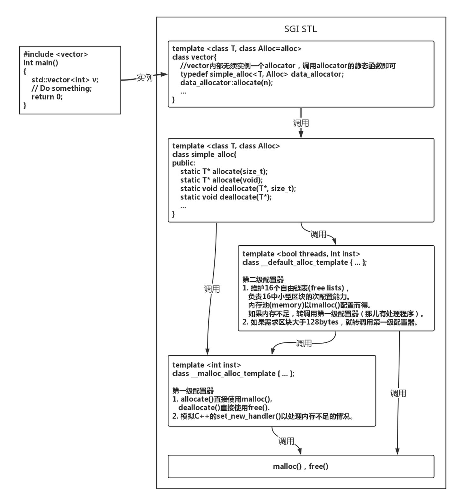
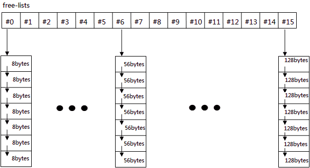

# STL相关

## **请你来介绍一下STL的allocator**

 标准库allocator类定义在头文件memory中，它帮助我们将内存分配和对象构造分离开来。它提供一种类型感知的内存分配方法，它分配的内存是原始的、未构造的。
1. STL的分配器用于封装STL容器在内存管理上的底层细节。在C++中，其内存配置和释放如下：
    1. new运算分两个阶段：(1)调用::operator new配置内存;(2)调用对象构造函数构造对象内容
    2. delete运算分两个阶段：(1)调用对象析构函数；(2)调用::operator delete释放内存**以上两点是C++而非STL中**
    3. 为了精密分工，STL allocator将两个阶段操作区分开来：内存配置由alloc::allocate()负责，内存释放由alloc::deallocate()负责；对象构造由::construct()负责，对象析构由::destroy()负责。
2. 为了提升内存管理的效率，减少申请小内存造成的内存碎片问题，SGI STL采用了两级配置器，当分配的空间大小超过128B时，会使用第一级空间配置器;第一级空间配置器直接使用malloc()、realloc()、free()函数进行内存空间的分配和释放
3. 当分配的空间小于128B时，将使用第二级空间配置器。第二级空间配置器采用了内存池技术，通过空闲链表来管理内存。SGI 第二级配置器会主动将任何小额区块的内存需求量上调至 8 的倍数。并维护 16 个 free-list，各自管理大小分别为 8，16，24，32，40，48，56，64，72，80，88，96，104，112，120，128 bytes 的小额区块;
4. 如果内存池不足，先用内存池中大的分块，再向一级空间配置器申请内存

## allocate内存管理的步骤，分配100K与100M有什么不一样

## delete 与 delete[]有什么不同

1. 对于基本数据类型，这两者使用起来并无区别
2. 对自定义数据类型，一般指类，假设通过new申请了一个对象数组，注意是对象数组，返回一个指针，对于此对象数组的内存释放，需要做两件事情：一是释放最初申请的那部分空间，二是调用析构函数完成清理工作。对于内存空间的清理，由于申请时记录了其大小，因此无论使用delete还是delete[ ]都能将这片空间完整释放，而问题就出在析构函数的调用上，当使用delete时，仅仅调用了对象数组中第一个对象的析构函数，而使用delete [ ]的话，将会逐个调用析构函数。

## **请你来说一说STL迭代器删除元素**

- 这个主要考察的是迭代器失效的问题。

1. 对于序列容器vector,deque来说，使用erase(itertor)后，后边的每个元素的迭代器都会失效，但是后边每个元素都会往前移动一个位置，但是erase会返回下一个有效的迭代器；
2. 对于关联容器(如map, set,multimap,multiset)，删除当前的iterator，仅仅会使当前的iterator失效，只要在erase时，递增当前iterator即可。这是因为map之类的容器，使用了红黑树来实现，插入、删除一个结点不会对其他结点造成影响。erase迭代器只是被删元素的迭代器失效，但是返回值为void，所以要采用erase(iter++)的方式删除迭代器。
   1. .erase(iter)之后,iter就已经失效了，所以iter无法自增，即iter++就会出bug.解决方案，就是**在iter失效之前，先自增。**
3. 对于list来说，它使用了不连续分配的内存，并且它的erase方法也会返回下一个有效的iterator，因此上面两种正确的方法都可以使用。

## **请你来说一下STL中迭代器的作用，有指针为何还要迭代器**

1. 迭代器

            Iterator（迭代器）模式又称Cursor（游标）模式，用于提供一种方法顺序访问一个聚合对象中各个元素, 而又不需暴露该对象的内部表示。或者这样说可能更容易理解：Iterator模式是运用于聚合对象的一种模式，通过运用该模式，使得我们可以在不知道对象内部表示的情况下，按照一定顺序（由iterator提供的方法）访问聚合对象中的各个元素。
            由于Iterator模式的以上特性：与聚合对象耦合，在一定程度上限制了它的广泛运用，一般仅用于底层聚合支持类，如STL的list、vector、stack等容器类及ostream_iterator等扩展iterator。

2. 迭代器和指针的区别

            迭代器不是指针，是类模板，表现的像指针。他只是模拟了指针的一些功能，通过重载了指针的一些操作符，->、*、++、--等。迭代器封装了指针，是一个“可遍历STL（ Standard Template Library）容器内全部或部分元素”的对象， 本质是封装了原生指针，是指针概念的一种提升（lift），提供了比指针更高级的行为，相当于一种智能指针，他可以根据不同类型的数据结构来实现不同的++，--等操作。
            迭代器返回的是对象引用而不是对象的值，所以cout只能输出迭代器使用*取值后的值而不能直接输出其自身。

3. 迭代器产生原因
            Iterator类的访问方式就是把不同集合类的访问逻辑抽象出来，使得**不用暴露集合内部的结构而达到循环遍历集合的效果**。

## **请你讲讲STL有什么基本组成**

- 容器迭代器仿函数算法分配器配接器
- 他们之间的关系：分配器给容器分配存储空间，算法通过迭代器获取容器中的内容，仿函数可以协助算法完成各种操作，配接器用来套接适配仿函数

## **请你回答一下STL里resize和reserve的区别**

1. reserve表示容器预留空间，但并不是真正的创建对象，需要通过insert（）或push_back（）等创建对象。resize既分配了空间，也创建了对象。
2. reserve只修改capacity大小，不修改size大小，resize既修改capacity大小，也修改size大小。
3. 两者的形参个数不一样。
    resize带两个参数，一个表示容器大小，一个表示初始值（默认为0）
    reserve只带一个参数，表示容器预留的大小。

- <https://blog.csdn.net/jackywgw/article/details/6248342?utm_medium=distribute.pc_relevant.none-task-blog-BlogCommendFromMachineLearnPai2-2.control&dist_request_id=&depth_1-utm_source=distribute.pc_relevant.none-task-blog-BlogCommendFromMachineLearnPai2-2.control>

## **请你说一说vector和list的区别，应用，越详细越好**

1. 概念：
    1. Vector

            连续存储的容器，动态数组，在堆上分配空间
            底层实现：数组
            两倍容量增长：
            vector 增加（插入）新元素时，如果未超过当时的容量，则还有剩余空间，那么直接添加到最后（插入指定位置），然后调整迭代器。
            如果没有剩余空间了，则会重新配置原有元素个数的两倍空间，然后将原空间元素通过复制的方式初始化新空间，再向新空间增加元素，最后析构并释放原空间，之前的迭代器会失效。

            性能：
            访问：O(1)
            插入：在最后插入（空间够）：很快
            在最后插入（空间不够）：需要内存申请和释放，以及对之前数据进行拷贝。
            在中间插入（空间够）：内存拷贝
            在中间插入（空间不够）：需要内存申请和释放，以及对之前数据进行拷贝。
            删除：在最后删除：很快
            在中间删除：内存拷贝
            适用场景：经常随机访问，且不经常对非尾节点进行插入删除。

        2.List

            动态链表，在堆上分配空间，每插入一个元数都会分配空间，每删除一个元素都会释放空间。
            底层：双向链表

            性能：
            访问：随机访问性能很差，只能快速访问头尾节点。
            插入：很快，一般是常数开销
            删除：很快，一般是常数开销
            适用场景：经常插入删除大量数据

2. 区别：

        1）vector底层实现是数组；list是双向链表。
        2）vector支持随机访问，list不支持。
        3）vector是顺序内存，list不是。
        4）vector在中间节点进行插入删除会导致内存拷贝，list不会。
        5）vector一次性分配好内存，不够时才进行2倍扩容；list每次插入新节点都会进行内存申请。
        6）vector随机访问性能好，插入删除性能差；list随机访问性能差，插入删除性能好。

3. 应用

        vector拥有一段连续的内存空间，因此支持随机访问，如果需要高效的随即访问，而不在乎插入和删除的效率，使用vector。

        list拥有一段不连续的内存空间，如果需要高效的插入和删除，而不关心随机访问，则应使用list。

## vector使用的注意点及其原因，频繁对vector调用push_back()对性能的影响和原因;vector如何避免经常的内存分配

- 在一个vector的尾部之外的任何位置添加元素，都需要重新移动元素。而且，向一个vector添加元素可能引起整个对象存储空间的重新分配。重新分配一个对象的存储空间需要分配新的内存，并将元素从旧的空间移到新的空间
- 可以调用**reserve函数**来扩展内存；
  

## **请你来说一下map和set有什么区别，分别又是怎么实现的？**

- map和set都是C++的关联容器，其底层实现都是红黑树（RB-Tree）。由于 map 和set所开放的各种操作接口，RB-tree 也都提供了，所以几乎所有的 map 和set的操作行为，都只是转调 RB-tree 的操作行为。
- map和set区别在于：

    （1）map中的元素是key-value（关键字—值）对：关键字起到索引的作用，值则表示与索引相关联的数据；Set与之相对就是关键字的简单集合，set中每个元素只包含一个关键字。

    （2）set的迭代器是const的，不允许修改元素的值；map允许修改value，但不允许修改key。其原因是因为map和set是根据关键字排序来保证其有序性的，如果允许修改key的话，那么首先需要删除该键，然后调节平衡，再插入修改后的键值，调节平衡，如此一来，严重破坏了map和set的结构，导致iterator失效，不知道应该指向改变前的位置，还是指向改变后的位置。所以STL中将set的迭代器设置成const，不允许修改迭代器的值；而map的迭代器则不允许修改key值，允许修改value值。

    （3）map支持下标操作，set不支持下标操作。map可以用key做下标，map的下标运算符[ ]将关键码作为下标去执行查找，如果关键码不存在，则插入一个具有该关键码和mapped_type类型默认值的元素至map中，因此下标运算符[ ]在map应用中需要慎用，const_map不能用，只希望确定某一个关键值是否存在而不希望插入元素时也不应该使用，mapped_type类型没有默认值也不应该使用。如果find能解决需要，尽可能用find。

## 请你说说STL中map与unordered_map

- 需要引入的头文件不同

        map: #include < map >
        unordered_map: #include < unordered_map >
- 内部实现机理不同

        map： map内部实现了一个红黑树（红黑树是非严格平衡二叉搜索树，而AVL是严格平衡二叉搜索树），红黑树具有自动排序的功能，因此map内部的所有元素都是有序的，红黑树的每一个节点都代表着map的一个元素。因此，对于map进行的查找，删除，添加等一系列的操作都相当于是对红黑树进行的操作。map中的元素是按照二叉搜索树（又名二叉查找树、二叉排序树，特点就是左子树上所有节点的键值都小于根节点的键值，右子树所有节点的键值都大于根节点的键值）存储的，使用中序遍历可将键值按照从小到大遍历出来。
        
        unordered_map: unordered_map内部实现了一个**哈希表**（也叫散列表，通过把关键码值映射到Hash表中一个位置来访问记录，查找的时间复杂度可达到O(1)，其在海量数据处理中有着广泛应用）。因此，其元素的排列顺序是无序的。(key->hash值来存储的，而不是key直接存储，因此无序)
        **HashMap的数据结构 = 数组 + 链表**

- 优缺点以及适用处

    1. map：

        1. 优点：
        - 有序性，这是map结构最大的优点，其元素的有序性在很多应用中都会简化很多的操作
        - 红黑树，内部实现一个红黑书使得map的很多操作在lgn的时间复杂度下就可以实现，因此效率非常的高
        2. 缺点：
        空间占用率高，因为map内部实现了红黑树，虽然提高了运行效率，但是因为每一个节点都需要额外保存父节点、孩子节点和红/黑性质，使得每一个节点都占用大量的空间

        3. 适用处：对于那些有顺序要求的问题，用map会更高效一些

    2. unordered_map：

        1. 优点： 因为内部实现了哈希表，因此其查找速度非常的快
        2. 缺点： 哈希表的建立比较耗费时间
        3. 适用处：对于频繁查找问题，unordered_map会更加高效一些，因此遇到查找问题，常会考虑一下用unordered_map

## hash_map的读写冲突

1. 多线程：如何实现无读锁，低写锁
   1. 在数据结构上，我们使用多个桶来存放数据，当哈希足够均匀时，冲突将比较少。当多线程操作不同的链表时，完全不需要加锁，但是如果操作的是同一个链表，则需要加锁来保证正确性。因此多个桶的设计，从降低锁的粒度的角度，已经减少了很多不必要的加锁操作。
   2. 同时，单向链表的使用，给我们带来了一个意想不到的好处：多个读线程和一个写线程并发操作不会出问题。
        假设链表中目前包含A和B节点，此时要在它们之间插入C节点，步骤如下：
        1. 创建C节点
        2. 将C的next指向B
        3. 将A的next指向C

        在完成1和2两步之后，读线程查询链表只能看到A和B，链表是完整的。
        在第3 步，修改next指针的操作是原子的，因此无论什么时候，读线程看到的链表都是完整的，数据没有丢失。因此读操作是不需要加锁的。
    3. 当多个线程同时执行插入时，由于next的修改可能会被覆盖，从而造成内存泄漏，因此写需要加锁。（当然这里也可以考虑CAS无锁化，效率方面看应用场景）
       1. CAS方式实现无锁写冲突

### 用开链地址法解决hash冲突时，开链法链表太长怎么办？

- java链表长度超过8转红黑树，C++STL里好像是只要元素总个数大于桶的数量，就重新开辟一块更大的内存区分配更多的桶，然后把元素全部拷贝过去

### 哈希的几种方法（常见哈希函数）

1. 直接寻址法：直接以关键字k或者k加上某个常数（k+c）作为哈希地址。
2. 除留余数法：用关键字k除以某个不大于哈希表长度m的数p，将所得余数作为哈希表地址。
3. 折叠法：按照哈希表地址位数将关键字分成位数相等的几部分，其中最后一部分可以比较短。然后将这几部分相加，舍弃最高进位后的结果就是该关键字的哈希地址。
4. 平方取中法：先求出它的平方值，然后按照需求取中间的几位作为哈希地址。
5. 伪随机数法：采用一个伪随机数当作哈希函数。

### 解决哈希冲突的几种方法与unordered_map解决哈希冲突的办法

1. 开放定址法--一旦发生了冲突，就去寻找下一个空的散列地址，只要散列表足够大，空的散列地址总能找到，并将记录存入
2. 再哈希法--有多个不同的Hash函数，当发生冲突时，使用第二个，第三个，….，等哈希函数计算地址，直到无冲突。虽然不易发生聚集，但是增加了计算时间。
3. 开链法--每个哈希表节点都有一个next指针，多个哈希表节点可以用next指针构成一个单向链表，被分配到同一个索引上的多个节点可以用这个单向链表连接起来
4. 建立公共溢出区--将哈希表分为基本表和溢出表两部分，凡是和基本表发生冲突的元素，一律填入溢出表

- unordered_map采用开链法

### **为什么一般hashtable的桶数会取一个素数**

    设有一个哈希函数
    H( c ) = c % N;
    当N取一个合数时，最简单的例子是取2^n，比如说取2^3=8,这时候
    H( 11100(二进制） ) = H( 28 ) = 4
    H( 10100(二进制) ) = H( 20 ）= 4

    这时候c的二进制第4位（从右向左数）就”失效”了，也就是说，无论第c的4位取什么值，都会导致H( c )的值一样．这时候c的第四位就根本不参与H( c )的运算，这样H( c )就无法完整地反映c的特性，增大了导致冲突的几率．

    取其他合数时，都会不同程度的导致c的某些位”失效”，从而在一些常见应用中导致冲突．
    但是取质数，基本可以保证c的每一位都参与H( c )的运算，从而在常见应用中减小冲突几率．．

    （个人意见：有时候不取质数效率也不会太差..但是无疑取质数之比较保险的..)

## STL底层数据结构实现

1. vector      底层数据结构为数组 ，支持快速随机访问

2. list            底层数据结构为双向链表，支持快速增删

3. deque       底层数据结构为一个**中央控制器和多个缓冲区**，详细见STL源码剖析P146，支持首尾（中间不能）快速增删，也**支持随机访问**

- deque是一个双端队列(double-ended queue)，也是在堆中保存内容的.它的保存形式如下:

- [堆1] --> [堆2] -->[堆3] --> ...

- 每个堆保存好几个元素,然后堆和堆之间有指针指向,看起来像是list和vector的结合品.

4. stack      是适配器， 底层一般用list或deque实现，封闭头部即可，**不用vector的原因应该是容量大小有限制，扩容耗时**

5. queue    是适配器， 底层一般用list或deque实现，封闭头部即可，不用vector的原因应该是容量大小有限制，扩容耗时（stack和queue其实是适配器,而不叫容器，因为是对容器的再封装）

6. priority_queue     的**底层采用 vector 或 deque 容器存储数据，堆heap为处理规则**来管理底层容器实现

- priority_queue< int, vector<int>, greater<int> > ipq; //建立小根堆

- priority_queue<int> Q;   //默认大根堆

7. set                   底层数据结构为红黑树，有序，不重复

- Set和multiset也可以当堆来用。 set<int，greater<int> >  set1;按照从大到小排列，即最大堆。默认是从小到大排列，是最小堆。Multiset用法一样。

8. multiset         底层数据结构为红黑树，有序，可重复

9. map                底层数据结构为红黑树，有序，不重复

10. multimap    底层数据结构为红黑树，有序，可重复

11. hash_set     底层数据结构为hash表，无序，不重复

12. hash_multiset 底层数据结构为hash表，无序，可重复

13. hash_map    底层数据结构为hash表，无序，不重复

14. hash_multimap 底层数据结构为hash表，无序，可重复

## STL中的traits技法

    type_traits
    iterator_traits
    char traits
    allocator_traits
    pointer_traits
    array_traits
