# 创建子进程

## 创建过程

1. 头文件 ：
    #include<sys/types.h>
    #include<unistd.h>
2. 使用方式
    **pid_t fork(void);**

```c++
pid_t pid = fork();

if(pid > 0){
    printf("pid : %d\n", pid);
    printf("im parent, pid:%d, ppid: %d\n", getpid(), getppid());

}
else if(pid == 0){
    //printf("pid: %d\n", pid);
    printf("i am child process, pid:%d, ppid: %d\n", getpid(), getppid());
}
```

3. 特性
    Linux 的 fork() 使用是通过**写时拷贝 (copy- on-write)** 实现。
    写时拷贝是一种可以推迟甚至避免拷贝数据的技术。
    内核此时并不复制整个进程的地址空间，而是让父子进程共享同一个地址空间。
    只用在需要写入的时候才会复制地址空间，从而使各个进行拥有各自的地址空间。
    也就是说，资源的复制是在需要写入的时候才会进行，在此之前，只有以只读方式共享。
    注意：fork之后父子进程共享文件，
    fork产生的子进程与父进程相同的文件文件描述符指向相同的文件表，引用计数增加，共享文件偏移指针。

## 父子进程关系

1. 区别：
   1. fork函数的返回值不同
        父进程：>0 返回子进程的ID
        子进程：=0
   2. pcb中的一些数据
        当前的进程的id pid
        当前的进程的父进程的id ppid
        信号集
2. 共同点：
    某些状态下：子进程刚被创建出来，还没有指向任何的写数据的操作
        - 用户区的数据
        - 文件描述符表
3. 父子进程对变量是不是共享的？
   - 刚开始的时候，是一样的，共享的。如果修改了数据，不共享了。
   - 读时共享（子进程被创建，两个进程没有做任何的写的操作），写时拷贝

## GDB调试

1. 设置调试父进程或者子进程：set follow-fork-mode [parent（默认）| child]
2. 设置调试模式：set detach-on-fork [on | off]
    默认为 on，表示调试当前进程的时候，其它的进程继续运行，如果为 off，调试当前进
    程的时候，其它进程被 GDB 挂起
3. 查看调试的进程：info inferiors
    切换当前调试的进程：inferior id
    使进程脱离 GDB 调试：detach inferiors id
4. r -- run 运行
   n -- next 下一行语句
   c -- continue 继续执行
   b 10 -- 在第10行打上断点
   clear 10 -- 取消
   i b -- 展示所有断点

## GDB调试命令

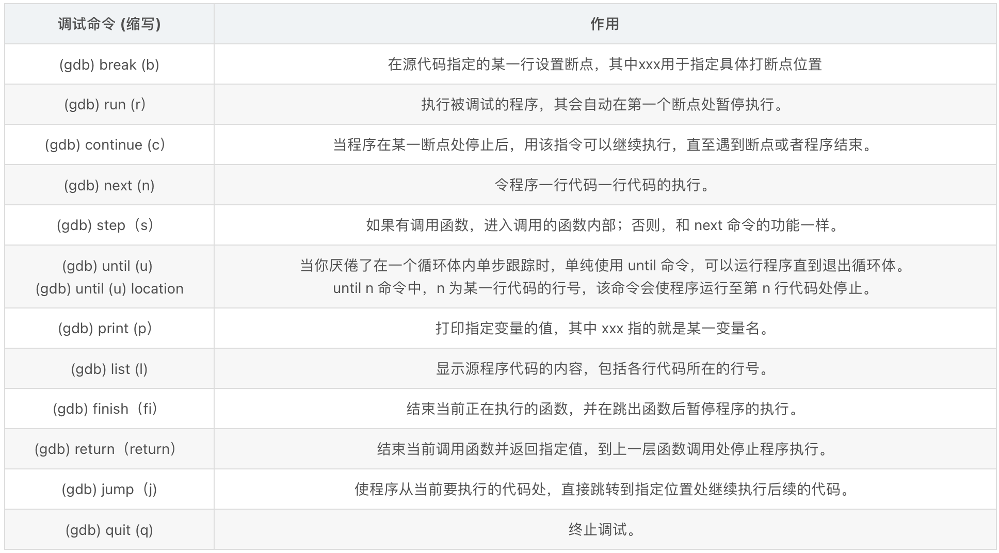
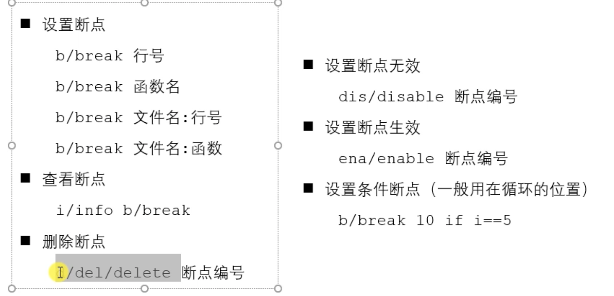
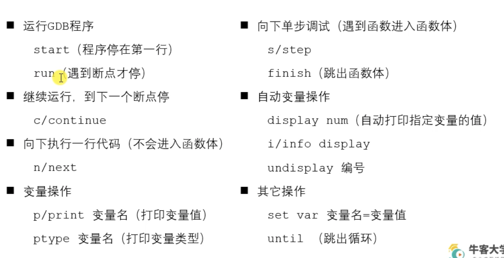
(gdb) break (b)	在源代码指定的某一行设置断点，其中xxx用于指定具体打断点位置
(gdb) run (r）	执行被调试的程序，其会自动在第一个断点处暂停执行。
(gdb) continue (c）	当程序在某一断点处停止后，用该指令可以继续执行，直至遇到断点或者程序结束。
(gdb) next (n)	令程序一行代码一行代码的执行。
(gdb) step（s）	如果有调用函数，进入调用的函数内部；否则，和 next 命令的功能一样。
(gdb) print （p）	打印指定变量的值，其中 xxx 指的就是某一变量名。
gcc test.c -o test -g  加入调试信息
gdb test 进行调试
gcc test.c -o test1

# exec函数族

## execl

1. 使用方式
    #include <unistd.h>
        int execl(const char *path, const char*arg, ...);
         - 参数：
             - path:需要指定的执行的文件的路径或者名称
                 a.out /home/nowcoder/a.out 推荐使用绝对路径
                 ./a.out hello world
             - arg:是执行可执行文件所需要的参数列表
                 第一个参数一般没有什么作用，为了方便，一般写的是执行的程序的名称
                 从第二个参数开始往后，就是程序执行所需要的的参数列表。
                 参数最后需要以NULL结束（哨兵）
         - 返回值：
             只有当调用失败，才会有返回值，返回-1，并且设置errno
             如果调用成功，没有返回值。
2. 示例

```c++
pid_t pid = fork();
if(pid > 0){
    printf("i am parent, pid: %d\n", getpid());
    sleep(1);
}
else if(pid == 0){
    //execl("hello", "hello", NULL);
    execl("/usr/bin/ps", "ps", "aux", NULL);
    printf("i am child\n");
}
```

## execlp

1. 使用方式
    #include <unistd.h>
        int execlp(const char *file, const char*arg, ... );
            - 会到**环境变量**中查找指定的可执行文件，如果找到了就执行，找不到就执行不成功。
            - 参数：
                - file:需要执行的可执行文件的文件名
                    a.out
                    ps
                - arg:是执行可执行文件所需要的参数列表
                    第一个参数一般没有什么作用，为了方便，一般写的是执行的程序的名称
                    从第二个参数开始往后，就是程序执行所需要的的参数列表。
                    参数最后需要以NULL结束（哨兵）
            - 返回值：
                只有当调用失败，才会有返回值，返回-1，并且设置errno
                如果调用成功，没有返回值。

## 其他

1. int execv(const char *path, char*const argv[]);
    argv是需要的参数的一个字符串数组
    char * argv[] = {"ps", "aux", NULL};
    execv("/bin/ps", argv);

2. int execve(const char *filename, char*const argv[], char *const envp[]);
char* envp[] = {"/home/nowcoder", "/home/bbb", "/home/aaa"};

# exit函数

1. 使用方式
    #include <stdlib.h>
    void exit(int status);

    #include <unistd.h>
    void _exit(int status);

    status参数：是进程退出时的一个状态信息。父进程回收子进程资源的时候可以获取到。
2. 示例

```c++
printf("hello\n");
printf("world");

exit(0);//会刷新缓冲区，将缓冲区的内容输出
_exit(0);
```

# 孤儿进程与僵尸进程

## 孤儿进程

1. 父进程运行结束，但子进程还在运行（未运行结束），这样的子进程就称为孤儿进程（Orphan Process）。
    每当出现一个孤儿进程的时候，内核就把孤儿进程的父进程设置为 init ，而 init
    进程会循环地 wait() 它的子进程。这样，当一个孤儿进程凄凉地结束了其生命周期的时候，init 进程就会代表党和政府出面处理它的一切善后工作。
    因此孤儿进程并不会有什么危害。
**此时子进程的ppid = 1**
1. 示例

```c++
pid_t pid = fork();

// 判断是父进程还是子进程
if(pid > 0) {

    printf("i am parent process, pid : %d, ppid : %d\n", getpid(), getppid());

} else if(pid == 0) {
    sleep(1);
    // 当前是子进程
    printf("i am child process, pid : %d, ppid : %d\n", getpid(),getppid());
}
```

## 僵尸进程

1. 概念
   每个进程结束之后, 都会释放自己地址空间中的用户区数据，内核区的 PCB 没有办法自己释放掉，需要父进程去释放。
   进程终止时，父进程尚未回收，子进程残留资源（PCB）存放于内核中，变成僵尸（Zombie）进程。
   僵尸进程不能被 kill -9 杀死，这样就会导致一个问题，如果父进程不调用 wait()或 waitpid() 的话，那么保留的那段信息就不会释放，其进程号就会一直被占用，但是系统所能使用的进程号是有限的，如果大量的产生僵尸进程，将因为没有可用的进程号而导致系统不能产生新的进程，此即为僵尸进程的危害，应当避免。
2. 示例

```c++
if(pid > 0) {
    while(1) {
        printf("i am parent process, pid : %d, ppid : %d\n", getpid(), getppid());
        sleep(1);
    }

} else if(pid == 0) {
    // 当前是子进程
    printf("i am child process, pid : %d, ppid : %d\n", getpid(),getppid());
    
}
```

## wait函数

```c++
/*
    #include <sys/types.h>
    #include <sys/wait.h>
    pid_t wait(int *wstatus);
        功能：等待任意一个子进程结束，如果任意一个子进程结束了，次函数会回收子进程的资源。
        参数：int *wstatus
            进程退出时的状态信息，传入的是一个int类型的地址，传出参数。
        返回值：
            - 成功：返回被回收的子进程的id
            - 失败：-1 (所有的子进程都结束，调用函数失败)

    调用wait函数的进程会被挂起（阻塞），直到它的一个子进程退出或者收到一个不能被忽略的信号时才被唤醒（相当于继续往下执行）
    如果没有子进程了，函数立刻返回，返回-1；如果子进程都已经结束了，也会立即返回，返回-1.

*/
#include <sys/types.h>
#include <sys/wait.h>
#include <stdio.h>
#include <unistd.h>
#include <stdlib.h>


int main() {

    // 有一个父进程，创建5个子进程（兄弟）
    pid_t pid;

    // 创建5个子进程
    for(int i = 0; i < 5; i++) {
        pid = fork();
        if(pid == 0) {
            break;
        }
    }

    if(pid > 0) {
        // 父进程
        while(1) {
            printf("parent, pid = %d\n", getpid());

            // int ret = wait(NULL);
            int st;
            int ret = wait(&st);

            if(ret == -1) {
                break;
            }

            if(WIFEXITED(st)) {
                // 是不是正常退出
                printf("退出的状态码：%d\n", WEXITSTATUS(st));
            }
            if(WIFSIGNALED(st)) {
                // 是不是异常终止
                printf("被哪个信号干掉了：%d\n", WTERMSIG(st));
            }

            printf("child die, pid = %d\n", ret);

            sleep(1);
        }

    } else if (pid == 0){
        // 子进程
         while(1) {
            printf("child, pid = %d\n",getpid());    
            sleep(1);       
         }

        exit(0);
    }

    return 0; // exit(0)
}
```

## waitpid函数

```c++
/*
    #include <sys/types.h>
    #include <sys/wait.h>
    pid_t waitpid(pid_t pid, int *wstatus, int options);
        功能：回收指定进程号的子进程，可以设置是否阻塞。
        参数：
            - pid:
                pid > 0 : 某个子进程的pid
                pid = 0 : 回收当前进程组的所有子进程    
                pid = -1 : 回收所有的子进程，相当于 wait()  （最常用）
                pid < -1 : 某个进程组的组id的绝对值，回收指定进程组中的子进程
            - options：设置阻塞或者非阻塞
                0 : 阻塞
                WNOHANG : 非阻塞
            - 返回值：
                > 0 : 返回子进程的id
                = 0 : options=WNOHANG, 表示还有子进程或者
                = -1 ：错误，或者没有子进程了
*/
#include <sys/types.h>
#include <sys/wait.h>
#include <stdio.h>
#include <unistd.h>
#include <stdlib.h>

int main() {

    // 有一个父进程，创建5个子进程（兄弟）
    pid_t pid;

    // 创建5个子进程
    for(int i = 0; i < 5; i++) {
        pid = fork();
        if(pid == 0) {
            break;
        }
    }

    if(pid > 0) {
        // 父进程
        while(1) {
            printf("parent, pid = %d\n", getpid());
            sleep(1);

            int st;
            // int ret = waitpid(-1, &st, 0);
            int ret = waitpid(-1, &st, WNOHANG);

            if(ret == -1) {
                break;
            } else if(ret == 0) {
                // 说明还有子进程存在
                continue;
            } else if(ret > 0) {

                if(WIFEXITED(st)) {
                    // 是不是正常退出
                    printf("退出的状态码：%d\n", WEXITSTATUS(st));
                }
                if(WIFSIGNALED(st)) {
                    // 是不是异常终止
                    printf("被哪个信号干掉了：%d\n", WTERMSIG(st));
                }

                printf("child die, pid = %d\n", ret);
            }
           
        }

    } else if (pid == 0){
        // 子进程
         while(1) {
            printf("child, pid = %d\n",getpid());    
            sleep(1);       
         }
        exit(0);
    }

    return 0; 
}
```

# 第二章

**进程间通信方式**
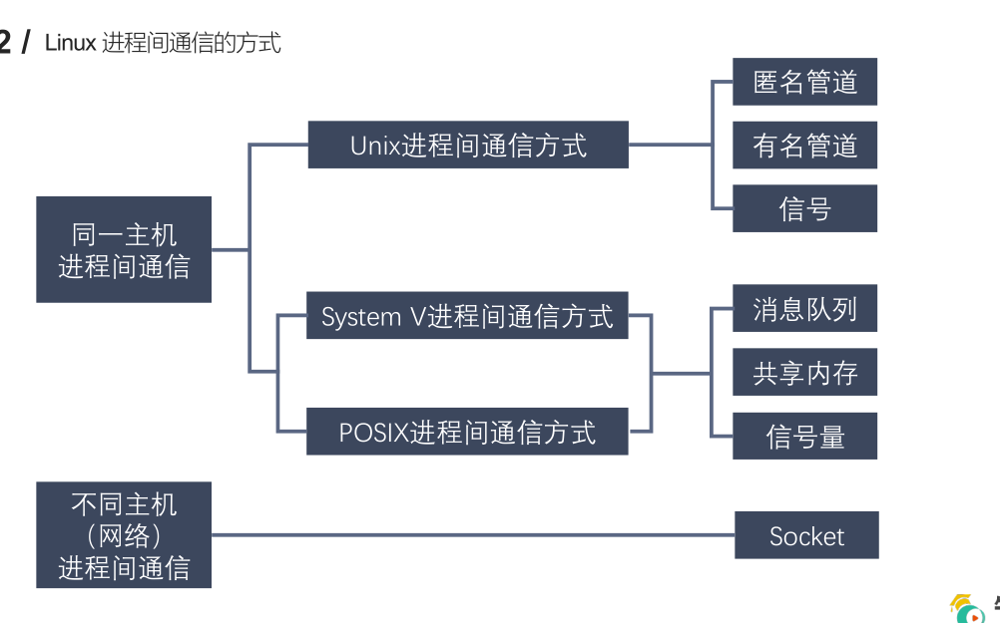

## 匿名管道通信

- 在管道中的数据的传递方向是单向的，一端用于写入，一端用于读取，管道是半双工的。
- 从管道读数据是一次性操作，数据一旦被读走，它就从管道中被抛弃，释放空间以便写更多的数据，在管道中无法使用 lseek() 来随机的访问数据。
- 匿名管道只能在具有公共祖先的进程（父进程与子进程，或者两个兄弟进程，具有亲缘关系）之间使用。

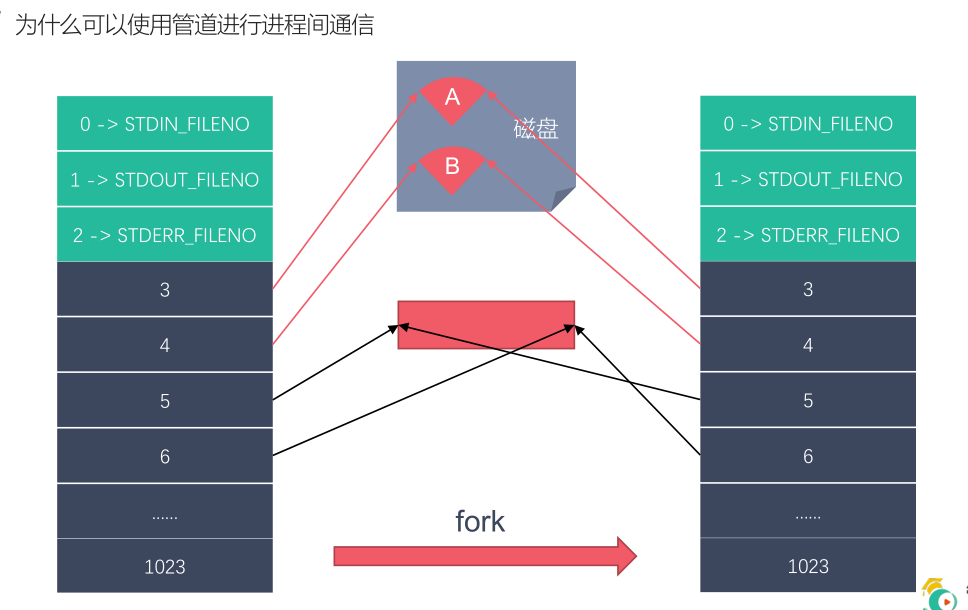

```c++
/*
    #include <unistd.h>
    int pipe(int pipefd[2]);
        功能：创建一个匿名管道，用来进程间通信。
        参数：int pipefd[2] 这个数组是一个传出参数。
            pipefd[0] 对应的是管道的读端
            pipefd[1] 对应的是管道的写端
        返回值：
            成功 0
            失败 -1

    管道默认是阻塞的：如果管道中没有数据，read阻塞，如果管道满了，write阻塞

    注意：匿名管道只能用于具有关系的进程之间的通信（父子进程，兄弟进程）
*/

// 子进程发送数据给父进程，父进程读取到数据输出
#include <unistd.h>
#include <sys/types.h>
#include <stdio.h>
#include <stdlib.h>
#include <string.h>

int main() {

    // 在fork之前创建管道
    int pipefd[2];
    int ret = pipe(pipefd);
    if(ret == -1) {
        perror("pipe");
        exit(0);
    }

    // 创建子进程
    pid_t pid = fork();
    if(pid > 0) {
        // 父进程
        printf("i am parent process, pid : %d\n", getpid());

        // 关闭写端
        close(pipefd[1]);
        
        // 从管道的读取端读取数据
        char buf[1024] = {0};
        while(1) {
            int len = read(pipefd[0], buf, sizeof(buf));
            printf("parent recv : %s, pid : %d\n", buf, getpid());
            
            // 向管道中写入数据
            //char * str = "hello,i am parent";
            //write(pipefd[1], str, strlen(str));
            //sleep(1);
        }

    } else if(pid == 0){
        // 子进程
        printf("i am child process, pid : %d\n", getpid());
        // 关闭读端
        close(pipefd[0]);
        char buf[1024] = {0};
        while(1) {
            // 向管道中写入数据
            char * str = "hello,i am child";
            write(pipefd[1], str, strlen(str));
            //sleep(1);

            // int len = read(pipefd[0], buf, sizeof(buf));
            // printf("child recv : %s, pid : %d\n", buf, getpid());
            // bzero(buf, 1024);
        }
        
    }
    return 0;
}
```

## 有名管道

- 匿名管道，由于没有名字，只能用于亲缘关系的进程间通信。为了克服这个缺点，提出了有名管道（FIFO），也叫命名管道、FIFO文件。
- 有名管道（FIFO）不同于匿名管道之处在于它提供了一个路径名与之关联，以 FIFO的文件形式存在于文件系统中，并且其打开方式与打开一个普通文件是一样的，这样即使与 FIFO 的创建进程不存在亲缘关系的进程，只要可以访问该路径，就能够彼此通过 FIFO 相互通信，因此，通过 FIFO 不相关的进程也能交换数据。
- 一旦打开了 FIFO，就能在它上面使用与操作匿名管道和其他文件的系统调用一样的I/O系统调用了（如read()、write()和close()）。与管道一样，FIFO 也有一个写入端和读取端，并且从管道中读取数据的顺序与写入的顺序是一样的。FIFO 的名称也由此而来：先入先出

**创建fifo**
```c++
/*
    创建fifo文件
    1.通过命令： mkfifo 名字
    2.通过函数：int mkfifo(const char *pathname, mode_t mode);

    #include <sys/types.h>
    #include <sys/stat.h>
    int mkfifo(const char *pathname, mode_t mode);
        参数：
            - pathname: 管道名称的路径
            - mode: 文件的权限 和 open 的 mode 是一样的
                    是一个八进制的数
        返回值：成功返回0，失败返回-1，并设置错误号

*/

#include <stdio.h>
#include <sys/types.h>
#include <sys/stat.h>
#include <stdlib.h>
#include <unistd.h>

int main() {


    // 判断文件是否存在
    int ret = access("fifo1", F_OK);
    if(ret == -1) {
        printf("管道不存在，创建管道\n");
        
        ret = mkfifo("fifo1", 0664);

        if(ret == -1) {
            perror("mkfifo");
            exit(0);
        }       

    }


    return 0;
}
```

**写端**
```c++
#include <stdio.h>
#include <sys/types.h>
#include <sys/stat.h>
#include <stdlib.h>
#include <unistd.h>
#include <fcntl.h>
#include <string.h>

// 向管道中写数据
/*
    有名管道的注意事项：
        1.一个为只读而打开一个管道的进程会阻塞，直到另外一个进程为只写打开管道
        2.一个为只写而打开一个管道的进程会阻塞，直到另外一个进程为只读打开管道

    读管道：
        管道中有数据，read返回实际读到的字节数
        管道中无数据：
            管道写端被全部关闭，read返回0，（相当于读到文件末尾）
            写端没有全部被关闭，read阻塞等待
    
    写管道：
        管道读端被全部关闭，进行异常终止（收到一个SIGPIPE信号）
        管道读端没有全部关闭：
            管道已经满了，write会阻塞
            管道没有满，write将数据写入，并返回实际写入的字节数。
*/
int main() {

    // 1.判断文件是否存在
    int ret = access("test", F_OK);
    if(ret == -1) {
        printf("管道不存在，创建管道\n");
        
        // 2.创建管道文件
        ret = mkfifo("test", 0664);

        if(ret == -1) {
            perror("mkfifo");
            exit(0);
        }       

    }

    // 3.以只写的方式打开管道
    int fd = open("test", O_WRONLY);
    if(fd == -1) {
        perror("open");
        exit(0);
    }

    // 写数据
    for(int i = 0; i < 100; i++) {
        char buf[1024];
        sprintf(buf, "hello, %d\n", i);
        printf("write data : %s\n", buf);
        write(fd, buf, strlen(buf));
        sleep(1);
    }

    close(fd);

    return 0;
}
```

**读端**
```c++
#include <stdio.h>
#include <sys/types.h>
#include <sys/stat.h>
#include <stdlib.h>
#include <unistd.h>
#include <fcntl.h>

// 从管道中读取数据
int main() {

    // 1.打开管道文件
    int fd = open("test", O_RDONLY);
    if(fd == -1) {
        perror("open");
        exit(0);
    }

    // 读数据
    while(1) {
        char buf[1024] = {0};
        int len = read(fd, buf, sizeof(buf));
        if(len == 0) {
            printf("写端断开连接了...\n");
            break;
        }
        printf("recv buf : %s\n", buf);
    }

    close(fd);

    return 0;
}
```


## 内存映射

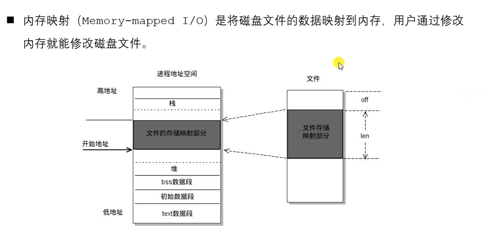

1. 如果对mmap的返回值(ptr)做++操作(ptr++), munmap是否能够成功?
    void * ptr = mmap(...);
    ptr++;  可以对其进行++操作
    munmap(ptr, len);   // 错误,要保存地址

2. 如果open时O_RDONLY, mmap时prot参数指定PROT_READ | PROT_WRITE会怎样?
    错误，返回MAP_FAILED
    open()函数中的权限建议和prot参数的权限保持一致。

3. 如果文件偏移量为1000会怎样?
    偏移量必须是4K的整数倍，返回MAP_FAILED

4. mmap什么情况下会调用失败?
    - 第二个参数：length = 0
    - 第三个参数：prot
        - 只指定了写权限
        - prot PROT_READ | PROT_WRITE
          第5个参数fd 通过open函数时指定的 O_RDONLY / O_WRONLY

5. 可以open的时候O_CREAT一个新文件来创建映射区吗?
    - 可以的，但是创建的文件的大小如果为0的话，肯定不行
    - 可以对新的文件进行扩展
        - lseek()
        - truncate()

6. mmap后关闭文件描述符，对mmap映射有没有影响？
    int fd = open("XXX");
    mmap(,,,,fd,0);
    close(fd); 
    映射区还存在，创建映射区的fd被关闭，没有任何影响。

7. 对ptr越界操作会怎样？
    void * ptr = mmap(NULL, 100,,,,,);
    4K
    越界操作操作的是非法的内存 -> 段错误

```c++
/*
    #include <sys/mman.h>
    void *mmap(void *addr, size_t length, int prot, int flags,int fd, off_t offset);
        - 功能：将一个文件或者设备的数据映射到内存中
        - 参数：
            - void *addr: NULL, 由内核指定
            - length : 要映射的数据的长度，这个值不能为0。建议使用文件的长度。
                    获取文件的长度：stat lseek
            - prot : 对申请的内存映射区的操作权限
                -PROT_EXEC ：可执行的权限
                -PROT_READ ：读权限
                -PROT_WRITE ：写权限
                -PROT_NONE ：没有权限
                要操作映射内存，必须要有读的权限。
                PROT_READ、PROT_READ|PROT_WRITE
            - flags :
                - MAP_SHARED : 映射区的数据会自动和磁盘文件进行同步，进程间通信，必须要设置这个选项
                - MAP_PRIVATE ：不同步，内存映射区的数据改变了，对原来的文件不会修改，会重新创建一个新的文件。（copy on write）
            - fd: 需要映射的那个文件的文件描述符
                - 通过open得到，open的是一个磁盘文件
                - 注意：文件的大小不能为0，open指定的权限不能和prot参数有冲突。
                    prot: PROT_READ                open:只读/读写 
                    prot: PROT_READ | PROT_WRITE   open:读写
            - offset：偏移量，一般不用。必须指定的是4k的整数倍，0表示不便宜。
        - 返回值：返回创建的内存的首地址
            失败返回MAP_FAILED，(void *) -1

    int munmap(void *addr, size_t length);
        - 功能：释放内存映射
        - 参数：
            - addr : 要释放的内存的首地址
            - length : 要释放的内存的大小，要和mmap函数中的length参数的值一样。
*/

/*
    使用内存映射实现进程间通信：
    1.有关系的进程（父子进程）
        - 还没有子进程的时候
            - 通过唯一的父进程，先创建内存映射区
        - 有了内存映射区以后，创建子进程
        - 父子进程共享创建的内存映射区
    
    2.没有关系的进程间通信
        - 准备一个大小不是0的磁盘文件
        - 进程1 通过磁盘文件创建内存映射区
            - 得到一个操作这块内存的指针
        - 进程2 通过磁盘文件创建内存映射区
            - 得到一个操作这块内存的指针
        - 使用内存映射区通信

    注意：内存映射区通信，是非阻塞。
*/

#include <stdio.h>
#include <sys/mman.h>
#include <fcntl.h>
#include <sys/types.h>
#include <unistd.h>
#include <string.h>
#include <stdlib.h>
#include <wait.h>

// 作业:使用内存映射实现没有关系的进程间的通信。
int main() {

    // 1.打开一个文件
    int fd = open("test.txt", O_RDWR);
    int size = lseek(fd, 0, SEEK_END);  // 获取文件的大小

    // 2.创建内存映射区
    void *ptr = mmap(NULL, size, PROT_READ | PROT_WRITE, MAP_SHARED, fd, 0);
    if(ptr == MAP_FAILED) {
        perror("mmap");
        exit(0);
    }

    // 3.创建子进程
    pid_t pid = fork();
    if(pid > 0) {
        wait(NULL);
        // 父进程
        char buf[64];
        strcpy(buf, (char *)ptr);
        printf("read data : %s\n", buf);
       
    }else if(pid == 0){
        // 子进程
        strcpy((char *)ptr, "nihao a, son!!!");
    }

    // 关闭内存映射区
    munmap(ptr, size);

    return 0;
}
```

## signal信号捕捉函数

```c++
/*
    #include <signal.h>
    typedef void (*sighandler_t)(int);
    sighandler_t signal(int signum, sighandler_t handler);
        - 功能：设置某个信号的捕捉行为
        - 参数：
            - signum: 要捕捉的信号
            - handler: 捕捉到信号要如何处理
                - SIG_IGN ： 忽略信号
                - SIG_DFL ： 使用信号默认的行为
                - 回调函数 :  这个函数是内核调用，程序员只负责写，捕捉到信号后如何去处理信号。
                回调函数：
                    - 需要程序员实现，提前准备好的，函数的类型根据实际需求，看函数指针的定义
                    - 不是程序员调用，而是当信号产生，由内核调用
                    - 函数指针是实现回调的手段，函数实现之后，将函数名放到函数指针的位置就可以了。

        - 返回值：
            成功，返回上一次注册的信号处理函数的地址。第一次调用返回NULL
            失败，返回SIG_ERR，设置错误号
            
    SIGKILL SIGSTOP不能被捕捉，不能被忽略。
*/

#include <sys/time.h>
#include <stdio.h>
#include <stdlib.h>
#include <signal.h>

void myalarm(int num) {
    printf("捕捉到了信号的编号是：%d\n", num);
    printf("xxxxxxx\n");
}

// 过3秒以后，每隔2秒钟定时一次
int main() {

    // 注册信号捕捉
    // signal(SIGALRM, SIG_IGN);
    // signal(SIGALRM, SIG_DFL);
    // void (*sighandler_t)(int); 函数指针，int类型的参数表示捕捉到的信号的值。
    signal(SIGALRM, myalarm);

    struct itimerval new_value;

    // 设置间隔的时间
    new_value.it_interval.tv_sec = 2;
    new_value.it_interval.tv_usec = 0;

    // 设置延迟的时间,3秒之后开始第一次定时
    new_value.it_value.tv_sec = 3;
    new_value.it_value.tv_usec = 0;

    int ret = setitimer(ITIMER_REAL, &new_value, NULL); // 非阻塞的
    printf("定时器开始了...\n");

    if(ret == -1) {
        perror("setitimer");
        exit(0);
    }

    getchar();

    return 0;
}
```

## 信号集

- 许多信号相关的系统调用都需要能表示一组不同的信号，多个信号可使用一个称之为信号集的数据结构来表示，其系统数据类型为 sigset_t。
- 在 PCB 中有两个非常重要的信号集。一个称之为 “阻塞信号集” ，另一个称之为“未决信号集” 。这两个信号集都是内核使用位图机制来实现的。但操作系统不允许我们直接对这两个信号集进行位操作。而需自定义另外一个集合，借助信号集操作函数来对 PCB 中的这两个信号集进行修改。
- 信号的 “未决” 是一种状态，指的是从信号的产生到信号被处理前的这一段时间。
- 信号的 “阻塞” 是一个开关动作，指的是阻止信号被处理，但不是阻止信号产生。
- 信号的阻塞就是让系统暂时保留信号留待以后发送。由于另外有办法让系统忽略信号，所以一般情况下信号的阻塞只是暂时的，只是为了防止信号打断敏感的操作。
**阻塞信号集与未决信号集**
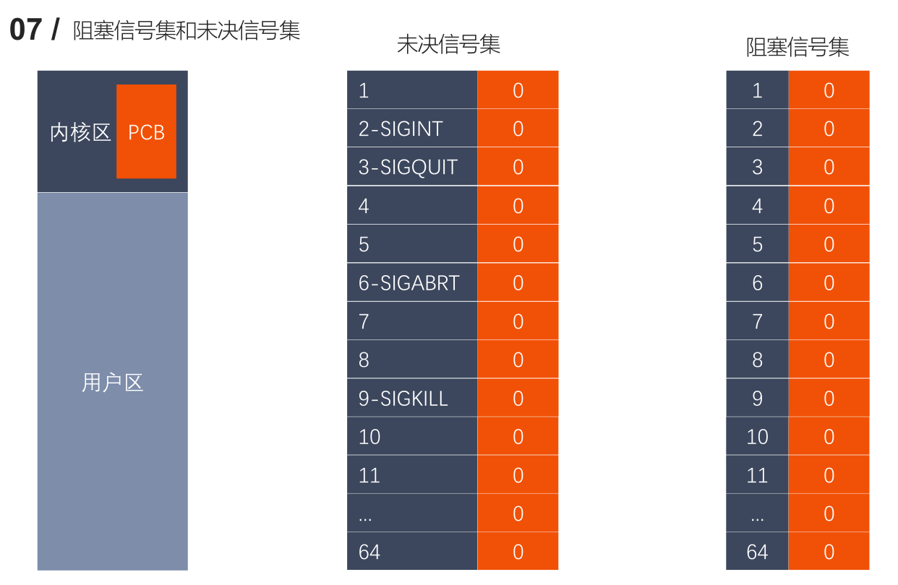

1. 用户通过键盘  Ctrl + C, 产生2号信号SIGINT (信号被创建)

2. 信号产生但是没有被处理 （未决）
    - 在内核中将所有的没有被处理的信号存储在一个集合中 （未决信号集）
    - SIGINT信号状态被存储在第二个标志位上
        - 这个标志位的值为0， 说明信号不是未决状态
        - 这个标志位的值为1， 说明信号处于未决状态

3. 这个未决状态的信号，需要被处理，处理之前需要和另一个信号集（阻塞信号集），进行比较
    - 阻塞信号集默认不阻塞任何的信号
    - 如果想要阻塞某些信号需要用户调用系统的API

4. 在处理的时候和阻塞信号集中的标志位进行查询，看是不是对该信号设置阻塞了
    - 如果没有阻塞，这个信号就被处理
    - 如果阻塞了，这个信号就继续处于未决状态，直到阻塞解除，这个信号就被处理


## sigaction API

```c++
/*
    #include <signal.h>
    int sigaction(int signum, const struct sigaction *act,
                            struct sigaction *oldact);

        - 功能：检查或者改变信号的处理。信号捕捉
        - 参数：
            - signum : 需要捕捉的信号的编号或者宏值（信号的名称）
            - act ：捕捉到信号之后的处理动作
            - oldact : 上一次对信号捕捉相关的设置，一般不使用，传递NULL
        - 返回值：
            成功 0
            失败 -1

     struct sigaction {
        // 函数指针，指向的函数就是信号捕捉到之后的处理函数
        void     (*sa_handler)(int);
        // 不常用
        void     (*sa_sigaction)(int, siginfo_t *, void *);
        // 临时阻塞信号集，在信号捕捉函数执行过程中，临时阻塞某些信号。
        sigset_t   sa_mask;
        // 使用哪一个信号处理对捕捉到的信号进行处理
        // 这个值可以是0，表示使用sa_handler,也可以是SA_SIGINFO表示使用sa_sigaction
        int        sa_flags;
        // 被废弃掉了
        void     (*sa_restorer)(void);
    };

*/
#include <sys/time.h>
#include <stdio.h>
#include <stdlib.h>
#include <signal.h>

void myalarm(int num) {
    printf("捕捉到了信号的编号是：%d\n", num);
    printf("xxxxxxx\n");
}

// 过3秒以后，每隔2秒钟定时一次
int main() {

    struct sigaction act;
    act.sa_flags = 0;
    act.sa_handler = myalarm;
    sigemptyset(&act.sa_mask);  // 清空临时阻塞信号集
   
    // 注册信号捕捉
    sigaction(SIGALRM, &act, NULL);

    struct itimerval new_value;

    // 设置间隔的时间
    new_value.it_interval.tv_sec = 2;
    new_value.it_interval.tv_usec = 0;

    // 设置延迟的时间,3秒之后开始第一次定时
    new_value.it_value.tv_sec = 3;
    new_value.it_value.tv_usec = 0;

    int ret = setitimer(ITIMER_REAL, &new_value, NULL); // 非阻塞的
    printf("定时器开始了...\n");

    if(ret == -1) {
        perror("setitimer");
        exit(0);
    }

    // getchar();
    while(1);

    return 0;
}
```

**内核实现信号捕捉的过程**
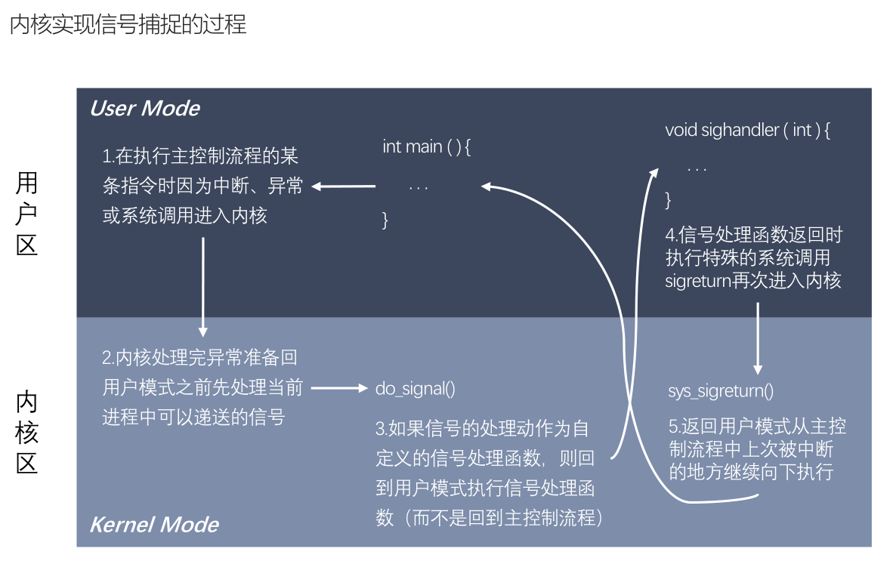

## 共享内存
- 共享内存允许两个或者多个进程共享物理内存的同一块区域（通常被称为段）。由于
    一个共享内存段会称为一个进程用户空间的一部分，因此这种 IPC 机制无需内核介
    入。所有需要做的就是让一个进程将数据复制进共享内存中，并且这部分数据会对其
    他所有共享同一个段的进程可用。
-  与管道等要求发送进程将数据从用户空间的缓冲区复制进内核内存和接收进程将数据
    从内核内存复制进用户空间的缓冲区的做法相比，这种 IPC 技术的速度更快

◼ 调用 shmget() 创建一个新共享内存段或取得一个既有共享内存段的标识符（即由其
他进程创建的共享内存段）。这个调用将返回后续调用中需要用到的共享内存标识符。
◼ 使用 shmat() 来附上共享内存段，即使该段成为调用进程的虚拟内存的一部分。
◼ 此刻在程序中可以像对待其他可用内存那样对待这个共享内存段。为引用这块共享内存，
程序需要使用由 shmat() 调用返回的 addr 值，它是一个指向进程的虚拟地址空间
中该共享内存段的起点的指针。
◼ 调用 shmdt() 来分离共享内存段。在这个调用之后，进程就无法再引用这块共享内存
了。这一步是可选的，并且在进程终止时会自动完成这一步。
◼ 调用 shmctl() 来删除共享内存段。只有当当前所有附加内存段的进程都与之分离之
后内存段才会销毁。只有一个进程需要执行这一步。

```c++
共享内存相关的函数
#include <sys/ipc.h>
#include <sys/shm.h>

int shmget(key_t key, size_t size, int shmflg);
    - 功能：创建一个新的共享内存段，或者获取一个既有的共享内存段的标识。
        新创建的内存段中的数据都会被初始化为0
    - 参数：
        - key : key_t类型是一个整形，通过这个找到或者创建一个共享内存。
                一般使用16进制表示，非0值
        - size: 共享内存的大小
        - shmflg: 属性
            - 访问权限
            - 附加属性：创建/判断共享内存是不是存在
                - 创建：IPC_CREAT
                - 判断共享内存是否存在： IPC_EXCL , 需要和IPC_CREAT一起使用
                    IPC_CREAT | IPC_EXCL | 0664
        - 返回值：
            失败：-1 并设置错误号
            成功：>0 返回共享内存的引用的ID，后面操作共享内存都是通过这个值。


void *shmat(int shmid, const void *shmaddr, int shmflg);
    - 功能：和当前的进程进行关联
    - 参数：
        - shmid : 共享内存的标识（ID）,由shmget返回值获取
        - shmaddr: 申请的共享内存的起始地址，指定NULL，内核指定
        - shmflg : 对共享内存的操作
            - 读 ： SHM_RDONLY, 必须要有读权限
            - 读写： 0
    - 返回值：
        成功：返回共享内存的首（起始）地址。  失败(void *) -1


int shmdt(const void *shmaddr);
    - 功能：解除当前进程和共享内存的关联
    - 参数：
        shmaddr：共享内存的首地址
    - 返回值：成功 0， 失败 -1

int shmctl(int shmid, int cmd, struct shmid_ds *buf);
    - 功能：对共享内存进行操作。删除共享内存，共享内存要删除才会消失，创建共享内存的进行被销毁了对共享内存是没有任何影响。
    - 参数：
        - shmid: 共享内存的ID
        - cmd : 要做的操作
            - IPC_STAT : 获取共享内存的当前的状态
            - IPC_SET : 设置共享内存的状态
            - IPC_RMID: 标记共享内存被销毁
        - buf：需要设置或者获取的共享内存的属性信息
            - IPC_STAT : buf存储数据
            - IPC_SET : buf中需要初始化数据，设置到内核中
            - IPC_RMID : 没有用，NULL

key_t ftok(const char *pathname, int proj_id);
    - 功能：根据指定的路径名，和int值，生成一个共享内存的key
    - 参数：
        - pathname:指定一个存在的路径
            /home/nowcoder/Linux/a.txt
            / 
        - proj_id: int类型的值，但是这系统调用只会使用其中的1个字节
                   范围 ： 0-255  一般指定一个字符 'a'


问题1：操作系统如何知道一块共享内存被多少个进程关联？
    - 共享内存维护了一个结构体struct shmid_ds 这个结构体中有一个成员 shm_nattch
    - shm_nattach 记录了关联的进程个数

问题2：可不可以对共享内存进行多次删除 shmctl
    - 可以的
    - 因为shmctl 标记删除共享内存，不是直接删除
    - 什么时候真正删除呢?
        当和共享内存关联的进程数为0的时候，就真正被删除
    - 当共享内存的key为0的时候，表示共享内存被标记删除了
        如果一个进程和共享内存取消关联，那么这个进程就不能继续操作这个共享内存。也不能进行关联。

    共享内存和内存映射的区别
    1.共享内存可以直接创建，内存映射需要磁盘文件（匿名映射除外）
    2.共享内存效果更高
    3.内存
        所有的进程操作的是同一块共享内存。
        内存映射，每个进程在自己的虚拟地址空间中有一个独立的内存。
    4.数据安全
        - 进程突然退出
            共享内存还存在
            内存映射区消失
        - 运行进程的电脑死机，宕机了
            数据存在在共享内存中，没有了
            内存映射区的数据 ，由于磁盘文件中的数据还在，所以内存映射区的数据还存在。

    5.生命周期
        - 内存映射区：进程退出，内存映射区销毁
        - 共享内存：进程退出，共享内存还在，标记删除（所有的关联的进程数为0），或者关机
            如果一个进程退出，会自动和共享内存进行取消关联。
```

**write_shm**
```c++
#include <stdio.h>
#include <sys/ipc.h>
#include <sys/shm.h>
#include <string.h>

int main() {    

    // 1.创建一个共享内存
    int shmid = shmget(100, 4096, IPC_CREAT|0664);
    printf("shmid : %d\n", shmid);
    
    // 2.和当前进程进行关联
    void * ptr = shmat(shmid, NULL, 0);

    char * str = "helloworld";

    // 3.写数据
    memcpy(ptr, str, strlen(str) + 1);

    printf("按任意键继续\n");
    getchar();

    // 4.解除关联
    shmdt(ptr);

    // 5.删除共享内存
    shmctl(shmid, IPC_RMID, NULL);

    return 0;
}
```


**read_shm**

```c++
#include <stdio.h>
#include <sys/ipc.h>
#include <sys/shm.h>
#include <string.h>

int main() {    

    // 1.获取一个共享内存
    int shmid = shmget(100, 0, IPC_CREAT);
    printf("shmid : %d\n", shmid);

    // 2.和当前进程进行关联
    void * ptr = shmat(shmid, NULL, 0);

    // 3.读数据
    printf("%s\n", (char *)ptr);
    
    printf("按任意键继续\n");
    getchar();

    // 4.解除关联
    shmdt(ptr);

    // 5.删除共享内存
    shmctl(shmid, IPC_RMID, NULL);

    return 0;
}
```

## 守护进程

守护进程（Daemon Process），也就是通常说的 Daemon 进程（精灵进程），是
Linux 中的后台服务进程。它是一个生存期较长的进程，通常独立于控制终端并且周
期性地执行某种任务或等待处理某些发生的事件。一般采用以 d 结尾的名字。
◼ 守护进程具备下列特征：
 生命周期很长，守护进程会在系统启动的时候被创建并一直运行直至系统被关闭。
 它在后台运行并且不拥有控制终端。没有控制终端确保了内核永远不会为守护进
程自动生成任何控制信号以及终端相关的信号（如 SIGINT、SIGQUIT）。
◼ Linux 的大多数服务器就是用守护进程实现的。比如，Internet 服务器 inetd，
Web 服务器 httpd 等。

守护进程创建步骤
- 执行一个 fork()，之后父进程退出，子进程继续执行。
- 子进程调用 setsid() 开启一个新会话。
- 清除进程的 umask 以确保当守护进程创建文件和目录时拥有所需的权限。
- 修改进程的当前工作目录，通常会改为根目录（/）。
- 关闭守护进程从其父进程继承而来的所有打开着的文件描述符。
- 在关闭了文件描述符0、1、2之后，守护进程通常会打开/dev/null 并使用dup2()使所有这些描述符指向这个设备。
- 核心业务逻辑

# 第三章

## 线程同步

- 线程的主要优势在于，能够通过全局变量来共享信息。不过，这种便捷的共享是有代价
的：必须确保多个线程不会同时修改同一变量，或者某一线程不会读取正在由其他线程
修改的变量。
- 临界区是指访问某一共享资源的代码片段，并且这段代码的执行应为原子操作，也就是
同时访问同一共享资源的其他线程不应中断该片段的执行。
- 线程同步：即当有一个线程在对内存进行操作时，其他线程都不可以对这个内存地址进
行操作，直到该线程完成操作，其他线程才能对该内存地址进行操作，而其他线程则处
于等待状态。

## 互斥锁

- 为避免线程更新共享变量时出现问题，可以使用互斥量（mutex 是 mutual exclusion的缩写）来确保同时仅有一个线程可以访问某项共享资源。可以使用互斥量来保证对任意共享资源的原子访问。
◼ 互斥量有两种状态：已锁定（locked）和未锁定（unlocked）。任何时候，至多只有一个线程可以锁定该互斥量。试图对已经锁定的某一互斥量再次加锁，将可能阻塞线程或者报错失败，具体取决于加锁时使用的方法。
◼ 一旦线程锁定互斥量，随即成为该互斥量的所有者，只有所有者才能给互斥量解锁。一般情况下，对每一共享资源（可能由多个相关变量组成）会使用不同的互斥量，每一线程在访问同一资源时将采用如下协议：
⚫ 针对共享资源锁定互斥量
⚫ 访问共享资源
⚫ 对互斥量解锁

```c++
/*
    互斥量的类型 pthread_mutex_t
    int pthread_mutex_init(pthread_mutex_t *restrict mutex, const pthread_mutexattr_t *restrict attr);
        - 初始化互斥量
        - 参数 ：
            - mutex ： 需要初始化的互斥量变量
            - attr ： 互斥量相关的属性，NULL
        - restrict : C语言的修饰符，被修饰的指针，不能由另外的一个指针进行操作。
            pthread_mutex_t *restrict mutex = xxx;
            pthread_mutex_t * mutex1 = mutex;

    int pthread_mutex_destroy(pthread_mutex_t *mutex);
        - 释放互斥量的资源

    int pthread_mutex_lock(pthread_mutex_t *mutex);
        - 加锁，阻塞的，如果有一个线程加锁了，那么其他的线程只能阻塞等待

    int pthread_mutex_trylock(pthread_mutex_t *mutex);
        - 尝试加锁，如果加锁失败，不会阻塞，会直接返回。

    int pthread_mutex_unlock(pthread_mutex_t *mutex);
        - 解锁
*/
#include <stdio.h>
#include <pthread.h>
#include <unistd.h>

// 全局变量，所有的线程都共享这一份资源。
int tickets = 1000;

// 创建一个互斥量
pthread_mutex_t mutex;

void * sellticket(void * arg) {

    // 卖票
    while(1) {

        // 加锁
        pthread_mutex_lock(&mutex);

        if(tickets > 0) {
            usleep(6000);
            printf("%ld 正在卖第 %d 张门票\n", pthread_self(), tickets);
            tickets--;
        }else {
            // 解锁
            pthread_mutex_unlock(&mutex);
            break;
        }

        // 解锁
        pthread_mutex_unlock(&mutex);
    }

    

    return NULL;
}

int main() {

    // 初始化互斥量
    pthread_mutex_init(&mutex, NULL);

    // 创建3个子线程
    pthread_t tid1, tid2, tid3;
    pthread_create(&tid1, NULL, sellticket, NULL);
    pthread_create(&tid2, NULL, sellticket, NULL);
    pthread_create(&tid3, NULL, sellticket, NULL);

    // 回收子线程的资源,阻塞
    pthread_join(tid1, NULL);
    pthread_join(tid2, NULL);
    pthread_join(tid3, NULL);

    pthread_exit(NULL); // 退出主线程

    // 释放互斥量资源
    pthread_mutex_destroy(&mutex);

    return 0;
}
```

## 死锁
- 有时，一个线程需要同时访问两个或更多不同的共享资源，而每个资源又都由不同的互斥量管理。当超过一个线程加锁同一组互斥量时，就有可能发生死锁。
- 两个或两个以上的进程在执行过程中，因争夺共享资源而造成的一种互相等待的现象，若无外力作用，它们都将无法推进下去。此时称系统处于死锁状态或系统产生了死锁。
◼ 死锁的几种场景：
1. 忘记释放锁
2. 重复加锁
3. 多线程多锁，抢占锁资源

## 读写锁

当有一个线程已经持有互斥锁时，互斥锁将所有试图进入临界区的线程都阻塞住。但是考
虑一种情形，当前持有互斥锁的线程只是要读访问共享资源，而同时有其它几个线程也想
读取这个共享资源，但是由于互斥锁的排它性，所有其它线程都无法获取锁，也就无法读
访问共享资源了，但是实际上多个线程同时读访问共享资源并不会导致问题。

- 在对数据的读写操作中，更多的是读操作，写操作较少，例如对数据库数据的读写应用。为了满足当前能够允许多个读出，但只允许一个写入的需求，线程提供了读写锁来实现。
- 读写锁的特点：
1. 如果有其它线程读数据，则允许其它线程执行读操作，但不允许写操作。
2. 如果有其它线程写数据，则其它线程都不允许读、写操作。
3. 写是独占的，写的优先级高。

```c++
/*
    读写锁的类型 pthread_rwlock_t
    int pthread_rwlock_init(pthread_rwlock_t *restrict rwlock, const pthread_rwlockattr_t *restrict attr);
    int pthread_rwlock_destroy(pthread_rwlock_t *rwlock);
    int pthread_rwlock_rdlock(pthread_rwlock_t *rwlock);
    int pthread_rwlock_tryrdlock(pthread_rwlock_t *rwlock);
    int pthread_rwlock_wrlock(pthread_rwlock_t *rwlock);
    int pthread_rwlock_trywrlock(pthread_rwlock_t *rwlock);
    int pthread_rwlock_unlock(pthread_rwlock_t *rwlock);

    案例：8个线程操作同一个全局变量。
    3个线程不定时写这个全局变量，5个线程不定时的读这个全局变量
*/

#include <stdio.h>
#include <pthread.h>
#include <unistd.h>

// 创建一个共享数据
int num = 1;
// pthread_mutex_t mutex;
pthread_rwlock_t rwlock;

void * writeNum(void * arg) {

    while(1) {
        pthread_rwlock_wrlock(&rwlock);
        num++;
        printf("++write, tid : %ld, num : %d\n", pthread_self(), num);
        pthread_rwlock_unlock(&rwlock);
        usleep(100);
    }

    return NULL;
}

void * readNum(void * arg) {

    while(1) {
        pthread_rwlock_rdlock(&rwlock);
        printf("===read, tid : %ld, num : %d\n", pthread_self(), num);
        pthread_rwlock_unlock(&rwlock);
        usleep(100);
    }

    return NULL;
}

int main() {

   pthread_rwlock_init(&rwlock, NULL);

    // 创建3个写线程，5个读线程
    pthread_t wtids[3], rtids[5];
    for(int i = 0; i < 3; i++) {
        pthread_create(&wtids[i], NULL, writeNum, NULL);
    }

    for(int i = 0; i < 5; i++) {
        pthread_create(&rtids[i], NULL, readNum, NULL);
    }

    // 设置线程分离
    for(int i = 0; i < 3; i++) {
       pthread_detach(wtids[i]);
    }

    for(int i = 0; i < 5; i++) {
         pthread_detach(rtids[i]);
    }

    pthread_exit(NULL);

    pthread_rwlock_destroy(&rwlock);

    return 0;
}
```

## 条件变量p


- 条件变量是与互斥锁一起使用以保证线程同步的
- 在本例中，如果没有条件变量的话；在没有数据的时候，消费者依旧会不断进来读数据，浪费资源
- 因此用一个条件变量来通知消费者什么时候有资源

```c++
/*
    条件变量的类型 pthread_cond_t
    int pthread_cond_init(pthread_cond_t *restrict cond, const pthread_condattr_t *restrict attr);
    int pthread_cond_destroy(pthread_cond_t *cond);
    int pthread_cond_wait(pthread_cond_t *restrict cond, pthread_mutex_t *restrict mutex);
        - 等待，调用了该函数，线程会阻塞。
    int pthread_cond_timedwait(pthread_cond_t *restrict cond, pthread_mutex_t *restrict mutex, const struct timespec *restrict abstime);
        - 等待多长时间，调用了这个函数，线程会阻塞，直到指定的时间结束。
    int pthread_cond_signal(pthread_cond_t *cond);
        - 唤醒一个或者多个等待的线程
    int pthread_cond_broadcast(pthread_cond_t *cond);
        - 唤醒所有的等待的线程
*/
#include <stdio.h>
#include <pthread.h>
#include <stdlib.h>
#include <unistd.h>

// 创建一个互斥量
pthread_mutex_t mutex;
// 创建条件变量
pthread_cond_t cond;

struct Node{
    int num;
    struct Node *next;
};

// 头结点
struct Node * head = NULL;

void * producer(void * arg) {

    // 不断的创建新的节点，添加到链表中
    while(1) {
        pthread_mutex_lock(&mutex);
        struct Node * newNode = (struct Node *)malloc(sizeof(struct Node));
        newNode->next = head;
        head = newNode;
        newNode->num = rand() % 1000;
        printf("add node, num : %d, tid : %ld\n", newNode->num, pthread_self());
        
        // 只要生产了一个，就通知消费者消费
        pthread_cond_signal(&cond);

        pthread_mutex_unlock(&mutex);
        usleep(100);
    }

    return NULL;
}

void * customer(void * arg) {

    while(1) {
        pthread_mutex_lock(&mutex);
        // 保存头结点的指针
        struct Node * tmp = head;
        // 判断是否有数据
        if(head != NULL) {
            // 有数据
            head = head->next;
            printf("del node, num : %d, tid : %ld\n", tmp->num, pthread_self());
            free(tmp);
            pthread_mutex_unlock(&mutex);
            usleep(100);
        } else {
            // 没有数据，需要等待
            // 当这个函数调用阻塞的时候，会对互斥锁进行解锁，当不阻塞的，继续向下执行，会重新加锁。
            pthread_cond_wait(&cond, &mutex);
            pthread_mutex_unlock(&mutex);
        }
    }
    return  NULL;
}

int main() {

    pthread_mutex_init(&mutex, NULL);
    pthread_cond_init(&cond, NULL);

    // 创建5个生产者线程，和5个消费者线程
    pthread_t ptids[5], ctids[5];

    for(int i = 0; i < 5; i++) {
        pthread_create(&ptids[i], NULL, producer, NULL);
        pthread_create(&ctids[i], NULL, customer, NULL);
    }

    for(int i = 0; i < 5; i++) {
        pthread_detach(ptids[i]);
        pthread_detach(ctids[i]);
    }

    while(1) {
        sleep(10);
    }

    pthread_mutex_destroy(&mutex);
    pthread_cond_destroy(&cond);

    pthread_exit(NULL);

    return 0;
}
```

## 信号量

```c++
/*
    信号量的类型 sem_t
    int sem_init(sem_t *sem, int pshared, unsigned int value);
        - 初始化信号量
        - 参数：
            - sem : 信号量变量的地址
            - pshared : 0 用在线程间 ，非0 用在进程间
            - value : 信号量中的值

    int sem_destroy(sem_t *sem);
        - 释放资源

    int sem_wait(sem_t *sem);
        - 对信号量加锁，调用一次对信号量的值-1，如果值为0，就阻塞

    int sem_trywait(sem_t *sem);

    int sem_timedwait(sem_t *sem, const struct timespec *abs_timeout);
    int sem_post(sem_t *sem);
        - 对信号量解锁，调用一次对信号量的值+1

    int sem_getvalue(sem_t *sem, int *sval);

    sem_t psem;
    sem_t csem;
    init(psem, 0, 8);
    init(csem, 0, 0);

    producer() {
        sem_wait(&psem);
        sem_post(&csem)
    }

    customer() {
        sem_wait(&csem);
        sem_post(&psem)
    }

*/

#include <stdio.h>
#include <pthread.h>
#include <stdlib.h>
#include <unistd.h>
#include <semaphore.h>

// 创建一个互斥量
pthread_mutex_t mutex;
// 创建两个信号量
sem_t psem;
sem_t csem;

struct Node{
    int num;
    struct Node *next;
};

// 头结点
struct Node * head = NULL;

void * producer(void * arg) {

    // 不断的创建新的节点，添加到链表中
    while(1) {
        sem_wait(&psem);
        pthread_mutex_lock(&mutex);
        struct Node * newNode = (struct Node *)malloc(sizeof(struct Node));
        newNode->next = head;
        head = newNode;
        newNode->num = rand() % 1000;
        printf("add node, num : %d, tid : %ld\n", newNode->num, pthread_self());
        pthread_mutex_unlock(&mutex);
        sem_post(&csem);
    }

    return NULL;
}

void * customer(void * arg) {
.
    while(1) {
        sem_wait(&csem);
        pthread_mutex_lock(&mutex);
        // 保存头结点的指针
        struct Node * tmp = head;
        head = head->next;
        printf("del node, num : %d, tid : %ld\n", tmp->num, pthread_self());
        free(tmp);
        pthread_mutex_unlock(&mutex);
        sem_post(&psem);
       
    }
    return  NULL;
}

int main() {

    pthread_mutex_init(&mutex, NULL);
    sem_init(&psem, 0, 8);
    sem_init(&csem, 0, 0);

    // 创建5个生产者线程，和5个消费者线程
    pthread_t ptids[5], ctids[5];

    for(int i = 0; i < 5; i++) {
        pthread_create(&ptids[i], NULL, producer, NULL);
        pthread_create(&ctids[i], NULL, customer, NULL);
    }

    for(int i = 0; i < 5; i++) {
        pthread_detach(ptids[i]);
        pthread_detach(ctids[i]);
    }

    while(1) {
        sleep(10);
    }

    pthread_mutex_destroy(&mutex);

    pthread_exit(NULL);

    return 0;
}

```


# 第四章  Linux网络编程

## select API

主旨思想：

1. 首先要构造一个关于文件描述符的列表，将要监听的文件描述符添加到该列表中。
2. 调用一个系统函数，监听该列表中的文件描述符，直到这些描述符中的一个或者多个进行I/O操作时，该函数才返回。
    a.这个函数是阻塞
    b.函数对文件描述符的检测的操作是由内核完成的
3. 在返回时，它会告诉进程有多少（哪些）描述符要进行I/O操作。

```c++
// sizeof(fd_set) = 128   1024
#include <sys/time.h>
#include <sys/types.h>
#include <unistd.h>
#include <sys/select.h>
int select(int nfds, fd_set *readfds, fd_set *writefds,
     fd_set *exceptfds, struct timeval *timeout);
- 参数：
   - nfds : 委托内核检测的最大文件描述符的值 + 1
      - readfds : 要检测的文件描述符的读的集合，委托内核检测哪些文件描述符的读的属性
        - 一般检测读操作
        - 对应的是对方发送过来的数据，因为读是被动的接收数据，检测的就是读缓冲区
        - 是一个传入传出参数
      - writefds : 要检测的文件描述符的写的集合，委托内核检测哪些文件描述符的写的属性
        - 委托内核检测写缓冲区是不是还可以写数据（不满的就可以写）
- exceptfds : 检测发生异常的文件描述符的集合
      - timeout : 设置的超时时间
        struct timeval {
       long   tv_sec;     /* seconds */
       long   tv_usec;     /* microseconds */
     };
- NULL : 永久阻塞，直到检测到了文件描述符有变化
        - tv_sec = 0 tv_usec = 0， 不阻塞
        - tv_sec > 0 tv_usec > 0， 阻塞对应的时间
         
   - 返回值 :
- -1 : 失败
      - >0(n) : 检测的集合中有n个文件描述符发生了变化

// 将参数文件描述符fd对应的标志位设置为0
void FD_CLR(int fd, fd_set *set);

// 判断fd对应的标志位是0还是1， 返回值 ： fd对应的标志位的值，0，返回0， 1，返回1
int  FD_ISSET(int fd, fd_set *set);

// 将参数文件描述符fd 对应的标志位，设置为1
void FD_SET(int fd, fd_set *set);
 
// fd_set一共有1024 bit, 全部初始化为0
void FD_ZERO(fd_set *set);
```

**select工作过程分析**
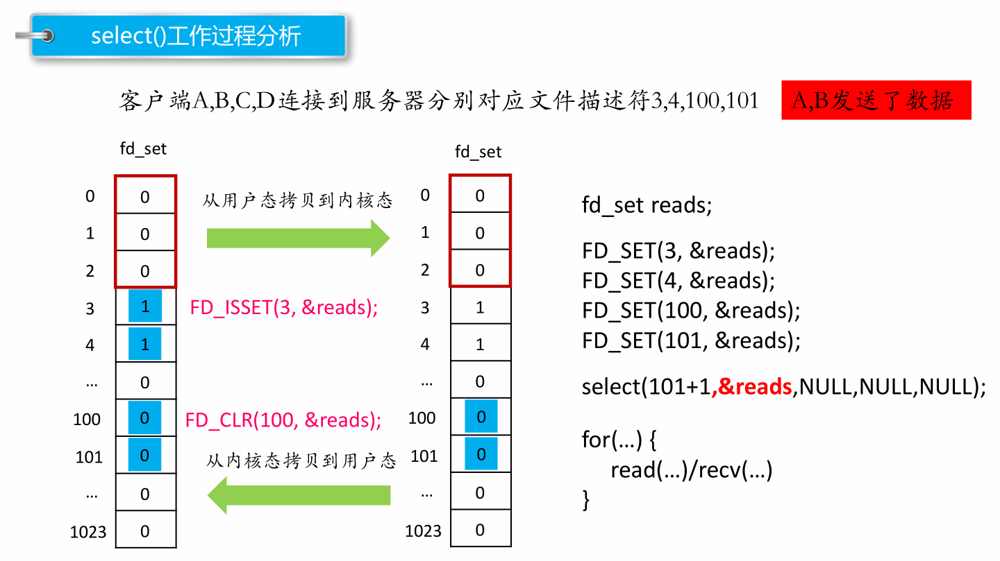

## poll API

```c++
#include <poll.h>
struct pollfd {
int  fd;     /* 委托内核检测的文件描述符 */


short events;   /* 委托内核检测文件描述符的什么事件 */
short revents;   /* 文件描述符实际发生的事件 */
};
struct pollfd myfd;
myfd.fd = 5;
myfd.events = POLLIN | POLLOUT;
int poll(struct pollfd *fds, nfds_t nfds, int timeout);
- 参数：
    - fds : 是一个struct pollfd 结构体数组，这是一个需要检测的文件描述符的集合
    - nfds : 这个是第一个参数数组中最后一个有效元素的下标 + 1
    - timeout : 阻塞时长
      0 : 不阻塞
      -1 : 阻塞，当检测到需要检测的文件描述符有变化，解除阻塞
      >0 : 阻塞的时长
  - 返回值：
    -1 : 失败
    >0（n） : 成功,n表示检测到集合中有n个文件描述符发生变化
```

**事件常用宏**
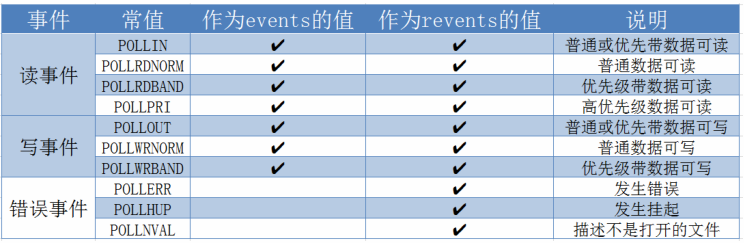

## epoll API

**epoll多路复用流程**
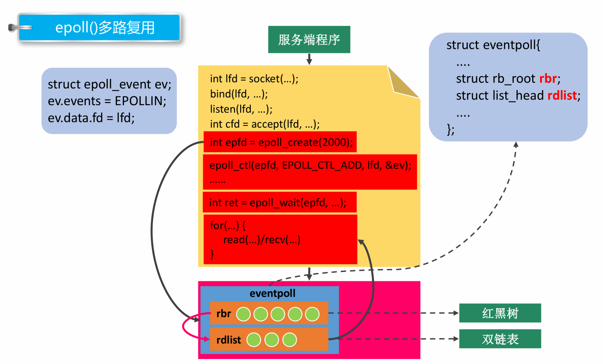

```c++
#include <sys/epoll.h>
// 创建一个新的epoll实例。在内核中创建了一个数据，这个数据中有两个比较重要的数据，一个是需要检测的文件描述符的信息（红黑树），还有一个是就绪列表，存放检测到数据发送改变的文件描述符信息（双向链表）。
int epoll_create(int size);
- 参数：
    size : 目前没有意义了。随便写一个数，必须大于0
  - 返回值：
    -1 : 失败
    > 0 : 文件描述符，操作epoll实例的

typedef union epoll_data {
void     *ptr;
int      fd;
uint32_t   u32;
uint64_t   u64;
} epoll_data_t;
---------------------------
struct epoll_event {
uint32_t   events;    /* Epoll events */
epoll_data_t data;     /* User data variable */
};
常见的Epoll检测事件：
  - EPOLLIN
  - EPOLLOUT
  - EPOLLERR
  - EPOLLET
---------------------------
// 对epoll实例进行管理：添加文件描述符信息，删除信息，修改信息
int epoll_ctl(int epfd, int op, int fd, struct epoll_event *event);
- 参数：
   - epfd : epoll实例对应的文件描述符
      - op : 要进行什么操作
        EPOLL_CTL_ADD:  添加
        EPOLL_CTL_MOD: 修改
        EPOLL_CTL_DEL: 删除
      - fd : 要检测的文件描述符
      - event : 检测文件描述符什么事情
---------------------------
// 检测函数        
int epoll_wait(int epfd, struct epoll_event *events, int maxevents, int
timeout);
- 参数：
    - epfd : epoll实例对应的文件描述符
    - events : 传出参数，保存了发送了变化的文件描述符的信息
    - maxevents : 第二个参数结构体数组的大小
    - timeout : 阻塞时间
      - 0 : 不阻塞
      - -1 : 阻塞，直到检测到fd数据发生变化，解除阻塞
      - > 0 : 阻塞的时长（毫秒）
       
  - 返回值：
    - 成功，返回发送变化的文件描述符的个数 > 0
    - 失败 -1
```

## UDP通信实现

**UDP通信**
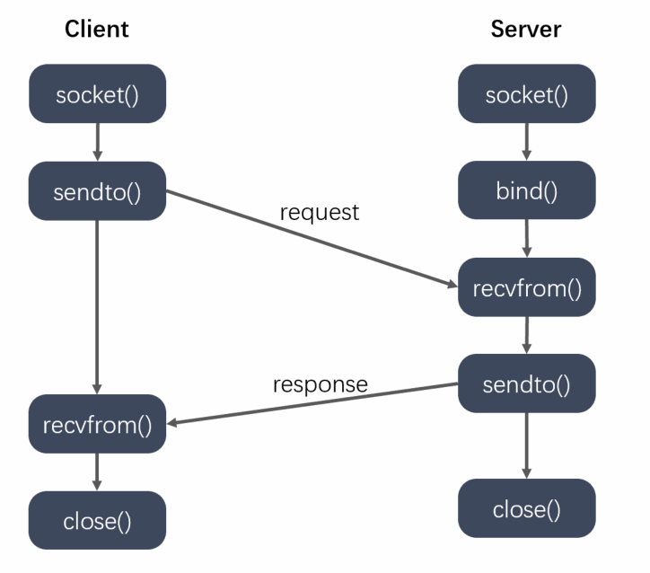

```c++
#include <sys/types.h>
#include <sys/socket.h>
ssize_t sendto(int sockfd, const void *buf, size_t len, int flags,
           const struct sockaddr *dest_addr, socklen_t addrlen);
- 参数：
      - sockfd : 通信的fd
      - buf : 要发送的数据
      - len : 发送数据的长度
      - flags : 0
      - dest_addr : 通信的另外一端的地址信息
      - addrlen : 地址的内存大小
-------------------------------------------------------------------       
ssize_t recvfrom(int sockfd, void *buf, size_t len, int flags,
            struct sockaddr *src_addr, socklen_t *addrlen);
- 参数：
      - sockfd : 通信的fd
      - buf : 接收数据的数组
      - len : 数组的大小
```

## 广播

1. 向子网中多台计算机发送消息，并且子网中所有的计算机都可以接收到发送方发送的消息，每个广播消息都包含一个特殊的IP地址，这个IP中子网内主机标志部分的二进制全部为1。
    a.只能在局域网中使用。
    b.客户端需要绑定服务器广播使用的端口，才可以接收到广播消息。

```c++
// 设置广播属性的函数
int setsockopt(int sockfd, int level, int optname,const void *optval, socklen_t
optlen);
- sockfd : 文件描述符
  - level : SOL_SOCKET
  - optname : SO_BROADCAST
  - optval : int类型的值，为1表示允许广播
  - optlen : optval的大小
```

## 组播

1. 单播地址标识单个 IP 接口，广播地址标识某个子网的所有 IP 接口，多播地址标识一组 IP 接口。单播和广播是寻址方案的两个极端（要么单个要么全部），多播则意在两者之间提供一种折中方案。多播数据报只应该由对它感兴趣的接口接收，也就是说由运行相应多播会话应用系统的主机上的接口接收。另外，广播一般局限于局域网内使用，而多播则既可以用于局域网，也可以跨广域网使用。
    a.组播既可以用于局域网，也可以用于广域网
    b.客户端需要加入多播组，才能接收到多播的数据
**组播地址**
IP 多播通信必须依赖于 IP 多播地址，在 IPv4 中它的范围从 224.0.0.0 到 239.255.255.255 ，并被划分为局部链接多播地址、预留多播地址和管理权限多播地址三类:
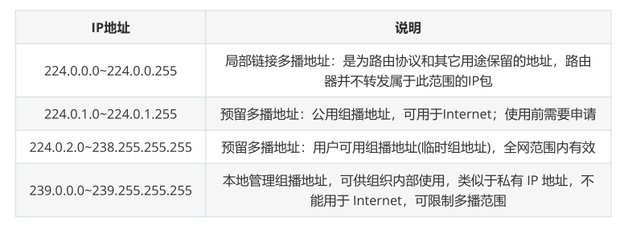

```c++
int setsockopt(int sockfd, int level, int optname,const void *optval,
socklen_t optlen);

// 服务器设置多播的信息，外出接口
  - level : IPPROTO_IP
  - optname : IP_MULTICAST_IF
  - optval : struct in_addr

  // 客户端加入到多播组：
  - level : IPPROTO_IP
  - optname : IP_ADD_MEMBERSHIP
  - optval : struct ip_mreq
-------------------------------------------------------------------------
struct ip_mreq
{
  /* IP multicast address of group. */
  struct in_addr imr_multiaddr; // 组播的IP地址
  /* Local IP address of interface. */
  struct in_addr imr_interface; // 本地的IP地址
};
typedef uint32_t in_addr_t;
struct in_addr
{
  in_addr_t s_addr;
};
```

## 本地套接字通信

    本地套接字的作用：本地的进程间通信
        有关系的进程间的通信
        没有关系的进程间的通信
    本地套接字实现流程和网络套接字类似，一般采用TCP的通信流程。

```c++
/ 本地套接字通信的流程 - tcp
------------------------------------------------------------
// 服务器端
1. 创建监听的套接字
  int lfd = socket(AF_UNIX/AF_LOCAL, SOCK_STREAM, 0);
2. 监听的套接字绑定本地的套接字文件 -> server端
struct sockaddr_un addr;
  // 绑定成功之后，指定的sun_path中的套接字文件会自动生成。
bind(lfd, addr, len);
3. 监听
  listen(lfd, 100);
4. 等待并接受连接请求
  struct sockaddr_un cliaddr;
  int cfd = accept(lfd, &cliaddr, len);
5. 通信
  接收数据：read/recv
  发送数据：write/send
6. 关闭连接
  close();
------------------------------------------------------------
// 客户端的流程
1. 创建通信的套接字
  int fd = socket(AF_UNIX/AF_LOCAL, SOCK_STREAM, 0);
2. 监听的套接字绑定本地的IP 端口
  struct sockaddr_un addr;
  // 绑定成功之后，指定的sun_path中的套接字文件会自动生成。
bind(lfd, addr, len);
3. 连接服务器
  struct sockaddr_un serveraddr;
  connect(fd, &serveraddr, sizeof(serveraddr));
4. 通信
  接收数据：read/recv
  发送数据：write/send
5. 关闭连接
  close();
------------------------------------------------------------
// 头文件: sys/un.h
#define UNIX_PATH_MAX 108
struct sockaddr_un {
sa_family_t sun_family; // 地址族协议 af_local
char sun_path[UNIX_PATH_MAX]; // 套接字文件的路径, 这是一个伪文件, 大小永远=0
};
```

# 第五章

## web服务器简介及HTTP协议

### web server

- 一个 Web Server 就是一个服务器软件（程序），或者是运行这个服务器软件的硬件（计算机）。其主要功能是通过 HTTP 协议与客户端（通常是浏览器（Browser））进行通信，来接收，存储，处理来自客户端的 HTTP 请求，并对其请求做出 HTTP 响应，返回给客户端其请求的内容（文件、网页等）或返回一个 Error 信息。
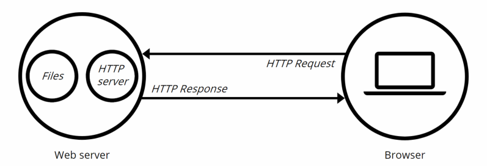
- 通常用户使用 Web 浏览器与相应服务器进行通信。在浏览器中键入“域名”或“IP地址:端口号”，浏览器则先将你的域名解析成相应的 IP 地址或者直接根据你的IP地址向对应的 Web 服务器发送一个 HTTP 请求。这一过程首先要通过 TCP 协议的三次握手建立与目标 Web 服务器的连接，然后 HTTP 协议生成针对目标 Web 服务器的 HTTP 请求报文，通过 TCP、IP 等协议发送到目标 Web 服务器上。

### HTTP协议

- 见计网

## 服务器编程基本框架

虽然服务器程序种类繁多，但其基本框架都一样，不同之处在于逻辑处理。
**基本框架**
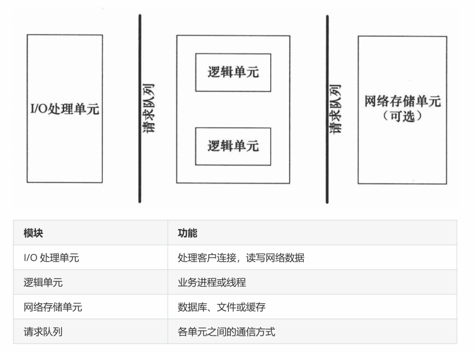

1. I/O 处理单元是服务器**管理客户连接**的模块。它通常要完成以下工作：等待并接受新的客户连接，接收客户数据，将服务器响应数据返回给客户端。但是数据的收发不一定在 I/O 处理单元中执行，也可能在逻辑单元中执行，具体在何处执行取决于事件处理模式。

2. 一个逻辑单元通常是一个进程或线程。它分析并处理客户数据，然后将结果传递给 I/O 处理单元或者直接发送给客户端（具体使用哪种方式取决于事件处理模式）。服务器通常拥有多个逻辑单元，以实现对多个客户任务的并发处理。

3. 网络存储单元可以是数据库、缓存和文件，但不是必须的。

4. 请求队列是各单元之间的通信方式的抽象。I/O 处理单元接收到客户请求时，需要以某种方式通知一个逻辑单元来处理该请求。同样，多个逻辑单元同时访问一个存储单元时，也需要采用某种机制来协调处理竞态条件。请求队列通常被实现为池的一部分。

## 两种高效的事件处理模式

- 服务器程序通常需要处理三类事件：I/O 事件、信号及定时事件。
- 两种高效的事件处理模式：Reactor和 Proactor，同步 I/O 模型通常用于实现 Reactor 模式，异步 I/O 模型通常用于实现 Proactor 模式。

### Reactor模式

- 要求主线程（I/O处理单元）只负责监听文件描述符上是否有事件发生，有的话就立即将该事件通知工作线程（逻辑单元），将 socket 可读可写事件放入请求队列，交给工作线程处理。除此之外，主线程不做任何其他实质性的工作。读写数据，接受新的连接，以及处理客户请求均在工作线程中完成。

---------------------------------------------------------------------------------

- 使用同步 I/O（以 epoll_wait 为例）实现的 Reactor 模式的工作流程是：
  
  1. 主线程往 epoll 内核事件表中注册 socket 上的读就绪事件。
  2. 主线程调用 epoll_wait 等待 socket 上有数据可读。
  3. 当 socket 上有数据可读时， epoll_wait 通知主线程。主线程则将 socket 可读事件放入请求队列。
  4. 睡眠在请求队列上的某个工作线程被唤醒，它从 socket 读取数据，并处理客户请求，然后往 epoll内核事件表中注册该 socket 上的写就绪事件。
  5. 当主线程调用 epoll_wait 等待 socket 可写。
  6. 当 socket 可写时，epoll_wait 通知主线程。主线程将 socket 可写事件放入请求队列。
  7. 睡眠在请求队列上的某个工作线程被唤醒，它往 socket 上写入服务器处理客户请求的结果。

---------------------------------------------------------------------------------
**Reactor 模式的工作流程**
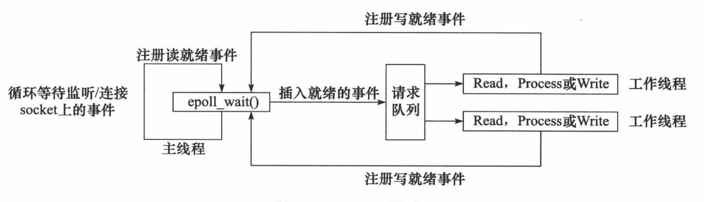

### Proactor模式

- Proactor 模式将所有 I/O 操作都交给主线程和内核来处理（进行读、写），工作线程仅仅负责业务逻辑。
- 使用异步 I/O 模型（以 aio_read 和 aio_write 为例）实现的 Proactor 模式的工作流程是：

---------------------------------------------------------------------------------

  1. 主线程调用 aio_read 函数向内核注册 socket 上的读完成事件，并告诉内核用户读缓冲区的位置，以及读操作完成时如何通知应用程序（这里以信号为例）。
  2. 主线程继续处理其他逻辑。
  3. 当 socket 上的数据被读入用户缓冲区后，内核将向应用程序发送一个信号，以通知应用程序数据已经可用。
  4. 应用程序预先定义好的信号处理函数选择一个工作线程来处理客户请求。工作线程处理完客户请求后，调用 aio_write 函数向内核注册 socket 上的写完成事件，并告诉内核用户写缓冲区的位置，以及写操作完成时如何通知应用程序。
  5. 主线程继续处理其他逻辑。
  6. 当用户缓冲区的数据被写入 socket 之后，内核将向应用程序发送一个信号，以通知应用程序数据已经发送完毕。
  7. 应用程序预先定义好的信号处理函数选择一个工作线程来做善后处理，比如决定是否关闭 socket。
**Proactor 模式的工作流程**
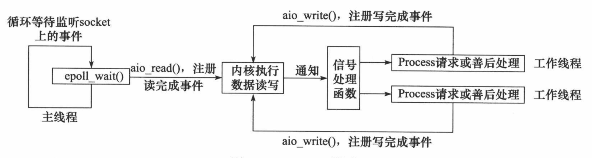

### 模拟 Proactor 模式

- 使用同步 I/O 方式模拟出 Proactor 模式。原理是：主线程执行数据读写操作，读写完成之后，主线程向工作线程通知这一”完成事件“。那么从工作线程的角度来看，它们就直接获得了数据读写的结果，接下来要做的只是对读写的结果进行逻辑处理。
- 使用同步 I/O 模型（以 epoll_wait为例）模拟出的 Proactor 模式的工作流程如下：

---------------------------------------------------------------------------------

  1. 主线程往 epoll 内核事件表中注册 socket 上的读就绪事件。
  2. 主线程调用 epoll_wait 等待 socket 上有数据可读。
  3. 当 socket 上有数据可读时，epoll_wait 通知主线程。主线程从 socket 循环读取数据，直到没有更多数据可读，然后将读取到的数据封装成一个请求对象并插入请求队列。
  4. 睡眠在请求队列上的某个工作线程被唤醒，它获得请求对象并处理客户请求，然后往 epoll 内核事件表中注册 socket 上的写就绪事件。
  5. 主线程调用 epoll_wait 等待 socket 可写。
  6. 当 socket 可写时，epoll_wait 通知主线程。主线程往 socket 上写入服务器处理客户请求的结果。
**同步 I/O 模拟 Proactor 模式的工作流程**
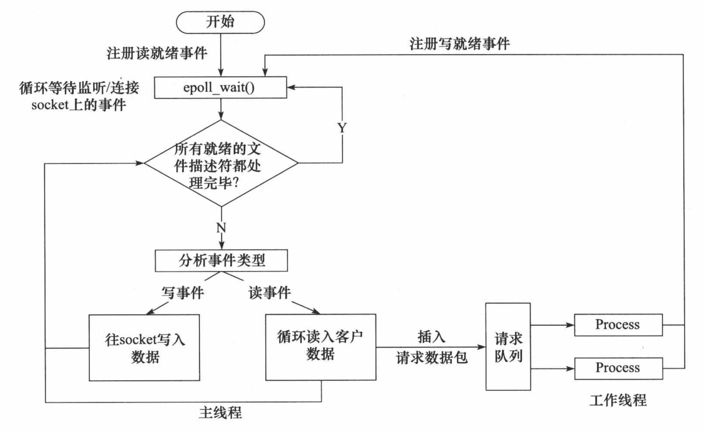

## 线程同步机制类封装及线程池实现

### 线程池

- 线程池是由服务器预先创建的一组子线程，线程池中的线程数量应该和 CPU 数量差不多。线程池中的所
  有子线程都运行着相同的代码。当有新的任务到来时，主线程将通过某种方式选择线程池中的某一个子
  线程来为之服务。相比与动态的创建子线程，选择一个已经存在的子线程的代价显然要小得多。至于主
  线程选择哪个子线程来为新任务服务，则有多种方式:

  1. 主线程使用某种算法来主动选择子线程。最简单、最常用的算法是随机算法和 Round Robin（轮流
    选取）算法，但更优秀、更智能的算法将使任务在各个工作线程中更均匀地分配，从而减轻服务器
    的整体压力。

  2. 主线程和所有子线程通过一个共享的工作队列来同步，子线程都睡眠在该工作队列上。当有新的任
    务到来时，主线程将任务添加到工作队列中。这将唤醒正在等待任务的子线程，不过只有一个子线
    程将获得新任务的”接管权“，它可以从工作队列中取出任务并执行之，而其他子线程将继续睡眠在
    工作队列上
**线程池的一般模型**
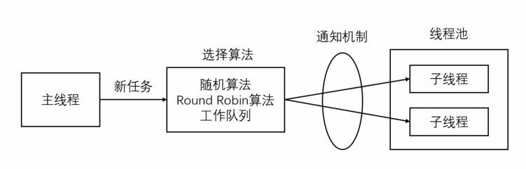

- 线程池中的线程数量最直接的限制因素是中央处理器(CPU)的处理器(processors/cores)的数量N ：如果你的CPU是4-cores的，对于CPU密集型的任务(如视频剪辑等消耗 CPU计算资源的任务)来说，那线程池中的线程数量最好也设置为4（或者+1防止其他因素造成的线程阻塞）；对于**IO密集型的任务**，一般要多于CPU的核数，因为线程间竞争的不是CPU的计算资源而是IO，IO的处理一般较慢，多于cores数的线程将为CPU争取更多的任务，不至在线程处理IO的过程造成CPU空闲导致资源浪费。

1. 空间换时间，浪费服务器的硬件资源，换取运行效率。
2. 池是一组资源的集合，这组资源在服务器启动之初就被完全创建好并初始化，这称为静态资源。
3. 当服务器进入正式运行阶段，开始处理客户请求的时候，如果它需要相关的资源，可以直接从池中
   获取，无需动态分配。
4. 当服务器处理完一个客户连接后，可以把相关的资源放回池中，无需执行系统调用释放资源。

# 第六章 整体流程及用到的知识点

## 前置准备工作

### web服务器的作用 http报文内容

- 分别见上文及计网相关部分

### 服务器编程的基本框架

### 两种事件处理模式

## 代码分析

### locker.h

1. class locker封装了一个互斥锁类 互斥锁是为了保证线程同步，同时也保证了操作的原子性
2. class conn封装了一个条件变量类 与互斥锁类一起作用实现线程同步
3. class sem信号量类  wait -1， post +1

### threadpoll模板类

1. 成员变量：
   int m_thread_number          线程的数量
   pthread_t * m_threads        描述线程池的数组，大小为m_thread_number
   int m_max_requests           请求队列中最多允许的、等待处理的请求的数量  
   std::list< T* > m_workqueue  请求队列
   locker m_queuelocker         保护请求队列的互斥锁
   sem m_queuestat              是否有任务需要处理
   bool m_stop                  是否结束线程
2. 成员函数：
   threadpool                       构造函数
   ~threadpool                      析构函数
   bool append(T*request)          向请求队列中加入任务
   static void* worker(void* arg)   工作线程运行的函数，它不断从工作队列中取出任务并执行
   void run()                       worker的具体内容

```c++
template<typename T>
class threadpool {
public:
    /*thread_number是线程池中线程的数量，max_requests是请求队列中最多允许的、等待处理的请求的数量*/
    threadpool(int thread_number = 8, int max_requests = 10000);
    ~threadpool();
    bool append(T* request);

private:
    /*工作线程运行的函数，它不断从工作队列中取出任务并执行之*/
    static void* worker(void* arg);
    void run();

private:
    // 线程的数量
    int m_thread_number;  
    
    // 描述线程池的数组，大小为m_thread_number    
    pthread_t * m_threads;

    // 请求队列中最多允许的、等待处理的请求的数量  
    int m_max_requests; 
    
    // 请求队列
    std::list< T* > m_workqueue;  

    // 保护请求队列的互斥锁
    locker m_queuelocker;   

    // 是否有任务需要处理
    sem m_queuestat;

    // 是否结束线程          
    bool m_stop;                    
};

template< typename T >
threadpool< T >::threadpool(int thread_number, int max_requests) : 
        m_thread_number(thread_number), m_max_requests(max_requests), 
        m_stop(false), m_threads(NULL) {

    if((thread_number <= 0) || (max_requests <= 0) ) {
        throw std::exception(); 
    }

    m_threads = new pthread_t[m_thread_number];
    if(!m_threads) {
        throw std::exception();
    }

    // 创建thread_number 个线程，并将他们设置为脱离线程。
    for ( int i = 0; i < thread_number; ++i ) {
        printf( "create the %dth thread\n", i);
        if(pthread_create(m_threads + i, NULL, worker, this ) != 0) {
            delete [] m_threads;
            throw std::exception();
        }
        
        if( pthread_detach( m_threads[i] ) ) {
            delete [] m_threads;
            throw std::exception();
        }
    }
}

template< typename T >
threadpool< T >::~threadpool() {
    delete [] m_threads;
    m_stop = true;
}

template< typename T >
bool threadpool< T >::append( T* request )
{
    // 操作工作队列时一定要加锁，因为它被所有线程共享。
    m_queuelocker.lock();
    if ( m_workqueue.size() > m_max_requests ) {
        m_queuelocker.unlock();
        return false;
    }
    m_workqueue.push_back(request);
    m_queuelocker.unlock();
    m_queuestat.post();
    return true;
}

template< typename T >
void* threadpool< T >::worker( void* arg )
{
    threadpool* pool = ( threadpool* )arg;
    pool->run();
    return pool;
}

template< typename T >
void threadpool< T >::run() {

    while (!m_stop) {
        m_queuestat.wait();
        m_queuelocker.lock();
        if ( m_workqueue.empty() ) {
            m_queuelocker.unlock();
            continue;
        }
        T* request = m_workqueue.front();
        m_workqueue.pop_front();
        m_queuelocker.unlock();
        if ( !request ) {
            continue;
        }
        request->process();
    }

}
```

### http_conn

1. 初始化连接
   1. int setnonblocking( int fd )                          设置文件描述符非阻塞
   2. void addfd( int epollfd, int fd, bool one_shot )      向epoll中添加需要监听的文件描述符
   3. void removefd( int epollfd, int fd )                  从epoll中移除监听的文件描述符
   4. void modfd(int epollfd, int fd, int ev)               修改文件描述符，重置socket上的EPOLLONESHOT事件，以确保下一次可读时，EPOLLIN事件能被触发

2. 解析http请求
   1. enum METHOD {GET = 0, POST, HEAD, PUT, DELETE, TRACE, OPTIONS, CONNECT};                HTTP请求方法，这里只支持GET
   2. enum HTTP_CODE { NO_REQUEST, GET_REQUEST, BAD_REQUEST, NO_RESOURCE, FORBIDDEN_REQUEST, FILE_REQUEST, INTERNAL_ERROR, CLOSED_CONNECTION };

            服务器处理HTTP请求的可能结果，报文解析的结果
            NO_REQUEST          :   请求不完整，需要继续读取客户数据
            GET_REQUEST         :   表示获得了一个完成的客户请求
            BAD_REQUEST         :   表示客户请求语法错误
            NO_RESOURCE         :   表示服务器没有资源
            FORBIDDEN_REQUEST   :   表示客户对资源没有足够的访问权限
            FILE_REQUEST        :   文件请求,获取文件成功
            INTERNAL_ERROR      :   表示服务器内部错误
            CLOSED_CONNECTION   :   表示客户端已经关闭连接了
   3. enum CHECK_STATE { CHECK_STATE_REQUESTLINE = 0, CHECK_STATE_HEADER, CHECK_STATE_CONTENT };

            解析客户端请求时，主状态机的状态
            CHECK_STATE_REQUESTLINE:当前正在分析请求行
            CHECK_STATE_HEADER:当前正在分析头部字段
            CHECK_STATE_CONTENT:当前正在解析请求体
   4. enum LINE_STATUS { LINE_OK = 0, LINE_BAD, LINE_OPEN };

            从状态机的三种可能状态，即行的读取状态，分别表示
            1.读取到一个完整的行 2.行出错 3.行数据尚且不完整
   5. void http_conn::init()       初始化解析属性
   6. HTTP_CODE process_read();    解析HTTP请求
3. 响应http请求
   1. bool process_write( HTTP_CODE ret ); 填充HTTP应答

**http_conn.h**

```c++
class http_conn
{
public:
    static const int FILENAME_LEN = 200;        // 文件名的最大长度
    static const int READ_BUFFER_SIZE = 2048;   // 读缓冲区的大小
    static const int WRITE_BUFFER_SIZE = 1024;  // 写缓冲区的大小
    
    // HTTP请求方法，这里只支持GET
    enum METHOD {GET = 0, POST, HEAD, PUT, DELETE, TRACE, OPTIONS, CONNECT};
    
    /*
        解析客户端请求时，主状态机的状态
        CHECK_STATE_REQUESTLINE:当前正在分析请求行
        CHECK_STATE_HEADER:当前正在分析头部字段
        CHECK_STATE_CONTENT:当前正在解析请求体
    */
    enum CHECK_STATE { CHECK_STATE_REQUESTLINE = 0, CHECK_STATE_HEADER, CHECK_STATE_CONTENT };
    
    /*
        服务器处理HTTP请求的可能结果，报文解析的结果
        NO_REQUEST          :   请求不完整，需要继续读取客户数据
        GET_REQUEST         :   表示获得了一个完成的客户请求
        BAD_REQUEST         :   表示客户请求语法错误
        NO_RESOURCE         :   表示服务器没有资源
        FORBIDDEN_REQUEST   :   表示客户对资源没有足够的访问权限
        FILE_REQUEST        :   文件请求,获取文件成功
        INTERNAL_ERROR      :   表示服务器内部错误
        CLOSED_CONNECTION   :   表示客户端已经关闭连接了
    */
    enum HTTP_CODE { NO_REQUEST, GET_REQUEST, BAD_REQUEST, NO_RESOURCE, FORBIDDEN_REQUEST, FILE_REQUEST, INTERNAL_ERROR, CLOSED_CONNECTION };
    
    // 从状态机的三种可能状态，即行的读取状态，分别表示
    // 1.读取到一个完整的行 2.行出错 3.行数据尚且不完整
    enum LINE_STATUS { LINE_OK = 0, LINE_BAD, LINE_OPEN };
public:
    http_conn(){}
    ~http_conn(){}
public:
    void init(int sockfd, const sockaddr_in& addr); // 初始化新接受的连接
    void close_conn();  // 关闭连接
    void process(); // 处理客户端请求
    bool read();// 非阻塞读
    bool write();// 非阻塞写
private:
    void init();    // 初始化连接
    HTTP_CODE process_read();    // 解析HTTP请求
    bool process_write( HTTP_CODE ret );    // 填充HTTP应答

    // 下面这一组函数被process_read调用以分析HTTP请求
    HTTP_CODE parse_request_line( char* text );
    HTTP_CODE parse_headers( char* text );
    HTTP_CODE parse_content( char* text );
    HTTP_CODE do_request();
    char* get_line() { return m_read_buf + m_start_line; }
    LINE_STATUS parse_line();

    // 这一组函数被process_write调用以填充HTTP应答。
    void unmap();
    bool add_response( const char* format, ... );
    bool add_content( const char* content );
    bool add_content_type();
    bool add_status_line( int status, const char* title );
    bool add_headers( int content_length );
    bool add_content_length( int content_length );
    bool add_linger();
    bool add_blank_line();

public:
    static int m_epollfd;       // 所有socket上的事件都被注册到同一个epoll内核事件中，所以设置成静态的
    static int m_user_count;    // 统计用户的数量

private:
    int m_sockfd;           // 该HTTP连接的socket和对方的socket地址
    sockaddr_in m_address;
    
    char m_read_buf[ READ_BUFFER_SIZE ];    // 读缓冲区
    int m_read_idx;                         // 标识读缓冲区中已经读入的客户端数据的最后一个字节的下一个位置
    int m_checked_idx;                      // 当前正在分析的字符在读缓冲区中的位置
    int m_start_line;                       // 当前正在解析的行的起始位置

    CHECK_STATE m_check_state;              // 主状态机当前所处的状态
    METHOD m_method;                        // 请求方法

    char m_real_file[ FILENAME_LEN ];       // 客户请求的目标文件的完整路径，其内容等于 doc_root + m_url, doc_root是网站根目录
    char* m_url;                            // 客户请求的目标文件的文件名
    char* m_version;                        // HTTP协议版本号，我们仅支持HTTP1.1
    char* m_host;                           // 主机名
    int m_content_length;                   // HTTP请求的消息总长度
    bool m_linger;                          // HTTP请求是否要求保持连接

    char m_write_buf[ WRITE_BUFFER_SIZE ];  // 写缓冲区
    int m_write_idx;                        // 写缓冲区中待发送的字节数
    char* m_file_address;                   // 客户请求的目标文件被mmap到内存中的起始位置
    struct stat m_file_stat;                // 目标文件的状态。通过它我们可以判断文件是否存在、是否为目录、是否可读，并获取文件大小等信息
    struct iovec m_iv[2];                   // 我们将采用writev来执行写操作，所以定义下面两个成员，其中m_iv_count表示被写内存块的数量。
    int m_iv_count;
};
```

**http_conn.c**

```c++
#include "http_conn.h"

// 定义HTTP响应的一些状态信息
const char* ok_200_title = "OK";
const char* error_400_title = "Bad Request";
const char* error_400_form = "Your request has bad syntax or is inherently impossible to satisfy.\n";
const char* error_403_title = "Forbidden";
const char* error_403_form = "You do not have permission to get file from this server.\n";
const char* error_404_title = "Not Found";
const char* error_404_form = "The requested file was not found on this server.\n";
const char* error_500_title = "Internal Error";
const char* error_500_form = "There was an unusual problem serving the requested file.\n";

// 网站的根目录
const char* doc_root = "/home/nowcoder/webserver/resources";

int setnonblocking( int fd ) {
    int old_option = fcntl( fd, F_GETFL );
    int new_option = old_option | O_NONBLOCK;
    fcntl( fd, F_SETFL, new_option );
    return old_option;
}

// 向epoll中添加需要监听的文件描述符
void addfd( int epollfd, int fd, bool one_shot ) {
    epoll_event event;
    event.data.fd = fd;
    event.events = EPOLLIN | EPOLLRDHUP;
    if(one_shot) 
    {
        // 防止同一个通信被不同的线程处理
        event.events |= EPOLLONESHOT;
    }
    epoll_ctl(epollfd, EPOLL_CTL_ADD, fd, &event);
    // 设置文件描述符非阻塞
    setnonblocking(fd);  
}

// 从epoll中移除监听的文件描述符
void removefd( int epollfd, int fd ) {
    epoll_ctl( epollfd, EPOLL_CTL_DEL, fd, 0 );
    close(fd);
}

// 修改文件描述符，重置socket上的EPOLLONESHOT事件，以确保下一次可读时，EPOLLIN事件能被触发
void modfd(int epollfd, int fd, int ev) {
    epoll_event event;
    event.data.fd = fd;
    event.events = ev | EPOLLET | EPOLLONESHOT | EPOLLRDHUP;
    epoll_ctl( epollfd, EPOLL_CTL_MOD, fd, &event );
}

// 所有的客户数
int http_conn::m_user_count = 0;
// 所有socket上的事件都被注册到同一个epoll内核事件中，所以设置成静态的
int http_conn::m_epollfd = -1;

// 关闭连接
void http_conn::close_conn() {
    if(m_sockfd != -1) {
        removefd(m_epollfd, m_sockfd);
        m_sockfd = -1;
        m_user_count--; // 关闭一个连接，将客户总数量-1
    }
}

// 初始化连接,外部调用初始化套接字地址
void http_conn::init(int sockfd, const sockaddr_in& addr){
    m_sockfd = sockfd;
    m_address = addr;
    
    // 端口复用
    int reuse = 1;
    setsockopt( m_sockfd, SOL_SOCKET, SO_REUSEADDR, &reuse, sizeof( reuse ) );
    addfd( m_epollfd, sockfd, true );
    m_user_count++;
    init();
}

void http_conn::init()
{
    m_check_state = CHECK_STATE_REQUESTLINE;    // 初始状态为检查请求行
    m_linger = false;       // 默认不保持链接  Connection : keep-alive保持连接

    m_method = GET;         // 默认请求方式为GET
    m_url = 0;              
    m_version = 0;
    m_content_length = 0;
    m_host = 0;
    m_start_line = 0;
    m_checked_idx = 0;
    m_read_idx = 0;
    m_write_idx = 0;
    bzero(m_read_buf, READ_BUFFER_SIZE);
    bzero(m_write_buf, READ_BUFFER_SIZE);
    bzero(m_real_file, FILENAME_LEN);
}

// 循环读取客户数据，直到无数据可读或者对方关闭连接
bool http_conn::read() {
    if( m_read_idx >= READ_BUFFER_SIZE ) {
        return false;
    }
    int bytes_read = 0;
    while(true) {
        // 从m_read_buf + m_read_idx索引出开始保存数据，大小是READ_BUFFER_SIZE - m_read_idx
        bytes_read = recv(m_sockfd, m_read_buf + m_read_idx, 
        READ_BUFFER_SIZE - m_read_idx, 0 );
        if (bytes_read == -1) {
            if( errno == EAGAIN || errno == EWOULDBLOCK ) {
                // 没有数据
                break;
            }
            return false;   
        } else if (bytes_read == 0) {   // 对方关闭连接
            return false;
        }
        m_read_idx += bytes_read;
    }
    return true;
}

// 解析一行，判断依据\r\n
http_conn::LINE_STATUS http_conn::parse_line() {
    char temp;
    for ( ; m_checked_idx < m_read_idx; ++m_checked_idx ) {
        temp = m_read_buf[ m_checked_idx ];
        if ( temp == '\r' ) {
            if ( ( m_checked_idx + 1 ) == m_read_idx ) {
                return LINE_OPEN;
            } else if ( m_read_buf[ m_checked_idx + 1 ] == '\n' ) {
                m_read_buf[ m_checked_idx++ ] = '\0';
                m_read_buf[ m_checked_idx++ ] = '\0';
                return LINE_OK;
            }
            return LINE_BAD;
        } else if( temp == '\n' )  {
            if( ( m_checked_idx > 1) && ( m_read_buf[ m_checked_idx - 1 ] == '\r' ) ) {
                m_read_buf[ m_checked_idx-1 ] = '\0';
                m_read_buf[ m_checked_idx++ ] = '\0';
                return LINE_OK;
            }
            return LINE_BAD;
        }
    }
    return LINE_OPEN;
}

// 解析HTTP请求行，获得请求方法，目标URL,以及HTTP版本号
http_conn::HTTP_CODE http_conn::parse_request_line(char* text) {
    // GET /index.html HTTP/1.1
    m_url = strpbrk(text, " \t"); // 判断第二个参数中的字符哪个在text中最先出现
    if (! m_url) { 
        return BAD_REQUEST;
    }
    // GET\0/index.html HTTP/1.1
    *m_url++ = '\0';    // 置位空字符，字符串结束符
    char* method = text;
    if ( strcasecmp(method, "GET") == 0 ) { // 忽略大小写比较
        m_method = GET;
    } else {
        return BAD_REQUEST;
    }
    // /index.html HTTP/1.1
    // 检索字符串 str1 中第一个不在字符串 str2 中出现的字符下标。
    m_version = strpbrk( m_url, " \t" );
    if (!m_version) {
        return BAD_REQUEST;
    }
    *m_version++ = '\0';
    if (strcasecmp( m_version, "HTTP/1.1") != 0 ) {
        return BAD_REQUEST;
    }
    /**
     * http://192.168.110.129:10000/index.html
    */
    if (strncasecmp(m_url, "http://", 7) == 0 ) {   
        m_url += 7;
        // 在参数 str 所指向的字符串中搜索第一次出现字符 c（一个无符号字符）的位置。
        m_url = strchr( m_url, '/' );
    }
    if ( !m_url || m_url[0] != '/' ) {
        return BAD_REQUEST;
    }
    m_check_state = CHECK_STATE_HEADER; // 检查状态变成检查头
    return NO_REQUEST;
}

// 解析HTTP请求的一个头部信息
http_conn::HTTP_CODE http_conn::parse_headers(char* text) {   
    // 遇到空行，表示头部字段解析完毕
    if( text[0] == '\0' ) {
        // 如果HTTP请求有消息体，则还需要读取m_content_length字节的消息体，
        // 状态机转移到CHECK_STATE_CONTENT状态
        if ( m_content_length != 0 ) {
            m_check_state = CHECK_STATE_CONTENT;
            return NO_REQUEST;
        }
        // 否则说明我们已经得到了一个完整的HTTP请求
        return GET_REQUEST;
    } else if ( strncasecmp( text, "Connection:", 11 ) == 0 ) {
        // 处理Connection 头部字段  Connection: keep-alive
        text += 11;
        text += strspn( text, " \t" );
        if ( strcasecmp( text, "keep-alive" ) == 0 ) {
            m_linger = true;
        }
    } else if ( strncasecmp( text, "Content-Length:", 15 ) == 0 ) {
        // 处理Content-Length头部字段
        text += 15;
        text += strspn( text, " \t" );
        m_content_length = atol(text);
    } else if ( strncasecmp( text, "Host:", 5 ) == 0 ) {
        // 处理Host头部字段
        text += 5;
        text += strspn( text, " \t" );
        m_host = text;
    } else {
        printf( "oop! unknow header %s\n", text );
    }
    return NO_REQUEST;
}

// 我们没有真正解析HTTP请求的消息体，只是判断它是否被完整的读入了
http_conn::HTTP_CODE http_conn::parse_content( char* text ) {
    if ( m_read_idx >= ( m_content_length + m_checked_idx ) )
    {
        text[ m_content_length ] = '\0';
        return GET_REQUEST;
    }
    return NO_REQUEST;
}

// 主状态机，解析请求
http_conn::HTTP_CODE http_conn::process_read() {
    LINE_STATUS line_status = LINE_OK;
    HTTP_CODE ret = NO_REQUEST;
    char* text = 0;
    while (((m_check_state == CHECK_STATE_CONTENT) && (line_status == LINE_OK))
                || ((line_status = parse_line()) == LINE_OK)) {
        // 获取一行数据
        text = get_line();
        m_start_line = m_checked_idx;
        printf( "got 1 http line: %s\n", text );

        switch ( m_check_state ) {
            case CHECK_STATE_REQUESTLINE: {
                ret = parse_request_line( text );
                if ( ret == BAD_REQUEST ) {
                    return BAD_REQUEST;
                }
                break;
            }
            case CHECK_STATE_HEADER: {
                ret = parse_headers( text );
                if ( ret == BAD_REQUEST ) {
                    return BAD_REQUEST;
                } else if ( ret == GET_REQUEST ) {
                    return do_request();
                }
                break;
            }
            case CHECK_STATE_CONTENT: {
                ret = parse_content( text );
                if ( ret == GET_REQUEST ) {
                    return do_request();
                }
                line_status = LINE_OPEN;
                break;
            }
            default: {
                return INTERNAL_ERROR;
            }
        }
    }
    return NO_REQUEST;
}

// 当得到一个完整、正确的HTTP请求时，我们就分析目标文件的属性，
// 如果目标文件存在、对所有用户可读，且不是目录，则使用mmap将其
// 映射到内存地址m_file_address处，并告诉调用者获取文件成功
http_conn::HTTP_CODE http_conn::do_request()
{
    // "/home/nowcoder/webserver/resources"
    strcpy( m_real_file, doc_root );
    int len = strlen( doc_root );
    strncpy( m_real_file + len, m_url, FILENAME_LEN - len - 1 );
    // 获取m_real_file文件的相关的状态信息，-1失败，0成功
    if ( stat( m_real_file, &m_file_stat ) < 0 ) {
        return NO_RESOURCE;
    }

    // 判断访问权限
    if ( ! ( m_file_stat.st_mode & S_IROTH ) ) {
        return FORBIDDEN_REQUEST;
    }

    // 判断是否是目录
    if ( S_ISDIR( m_file_stat.st_mode ) ) {
        return BAD_REQUEST;
    }

    // 以只读方式打开文件
    int fd = open( m_real_file, O_RDONLY );
    // 创建内存映射
    m_file_address = ( char* )mmap( 0, m_file_stat.st_size, PROT_READ, MAP_PRIVATE, fd, 0 );
    close( fd );
    return FILE_REQUEST;
}

// 对内存映射区执行munmap操作
void http_conn::unmap() {
    if( m_file_address )
    {
        munmap( m_file_address, m_file_stat.st_size );
        m_file_address = 0;
    }
}

// 写HTTP响应
bool http_conn::write()
{
    int temp = 0;
    int bytes_have_send = 0;    // 已经发送的字节
    int bytes_to_send = m_write_idx;// 将要发送的字节 （m_write_idx）写缓冲区中待发送的字节数
    
    if ( bytes_to_send == 0 ) {
        // 将要发送的字节为0，这一次响应结束。
        modfd( m_epollfd, m_sockfd, EPOLLIN ); 
        init();
        return true;
    }

    while(1) {
        // 分散写
        temp = writev(m_sockfd, m_iv, m_iv_count);
        if ( temp <= -1 ) {
            // 如果TCP写缓冲没有空间，则等待下一轮EPOLLOUT事件，虽然在此期间，
            // 服务器无法立即接收到同一客户的下一个请求，但可以保证连接的完整性。
            if( errno == EAGAIN ) {
                modfd( m_epollfd, m_sockfd, EPOLLOUT );
                return true;
            }
            unmap();
            return false;
        }
        bytes_to_send -= temp;
        bytes_have_send += temp;
        if ( bytes_to_send <= bytes_have_send ) {
            // 发送HTTP响应成功，根据HTTP请求中的Connection字段决定是否立即关闭连接
            unmap();
            if(m_linger) {
                init();
                modfd( m_epollfd, m_sockfd, EPOLLIN );
                return true;
            } else {
                modfd( m_epollfd, m_sockfd, EPOLLIN );
                return false;
            } 
        }
    }
}

// 往写缓冲中写入待发送的数据
bool http_conn::add_response( const char* format, ... ) {
    if( m_write_idx >= WRITE_BUFFER_SIZE ) {
        return false;
    }
    va_list arg_list;
    va_start( arg_list, format );
    int len = vsnprintf( m_write_buf + m_write_idx, WRITE_BUFFER_SIZE - 1 - m_write_idx, format, arg_list );
    if( len >= ( WRITE_BUFFER_SIZE - 1 - m_write_idx ) ) {
        return false;
    }
    m_write_idx += len;
    va_end( arg_list );
    return true;
}

bool http_conn::add_status_line( int status, const char* title ) {
    return add_response( "%s %d %s\r\n", "HTTP/1.1", status, title );
}

bool http_conn::add_headers(int content_len) {
    add_content_length(content_len);
    add_content_type();
    add_linger();
    add_blank_line();
}

bool http_conn::add_content_length(int content_len) {
    return add_response( "Content-Length: %d\r\n", content_len );
}

bool http_conn::add_linger()
{
    return add_response( "Connection: %s\r\n", ( m_linger == true ) ? "keep-alive" : "close" );
}

bool http_conn::add_blank_line()
{
    return add_response( "%s", "\r\n" );
}

bool http_conn::add_content( const char* content )
{
    return add_response( "%s", content );
}

bool http_conn::add_content_type() {
    return add_response("Content-Type:%s\r\n", "text/html");
}

// 根据服务器处理HTTP请求的结果，决定返回给客户端的内容
bool http_conn::process_write(HTTP_CODE ret) {
    switch (ret)
    {
        case INTERNAL_ERROR:
            add_status_line( 500, error_500_title );
            add_headers( strlen( error_500_form ) );
            if ( ! add_content( error_500_form ) ) {
                return false;
            }
            break;
        case BAD_REQUEST:
            add_status_line( 400, error_400_title );
            add_headers( strlen( error_400_form ) );
            if ( ! add_content( error_400_form ) ) {
                return false;
            }
            break;
        case NO_RESOURCE:
            add_status_line( 404, error_404_title );
            add_headers( strlen( error_404_form ) );
            if ( ! add_content( error_404_form ) ) {
                return false;
            }
            break;
        case FORBIDDEN_REQUEST:
            add_status_line( 403, error_403_title );
            add_headers(strlen( error_403_form));
            if ( ! add_content( error_403_form ) ) {
                return false;
            }
            break;
        case FILE_REQUEST:
            add_status_line(200, ok_200_title );
            add_headers(m_file_stat.st_size);
            m_iv[ 0 ].iov_base = m_write_buf;
            m_iv[ 0 ].iov_len = m_write_idx;
            m_iv[ 1 ].iov_base = m_file_address;
            m_iv[ 1 ].iov_len = m_file_stat.st_size;
            m_iv_count = 2;
            return true;
        default:
            return false;
    }

    m_iv[ 0 ].iov_base = m_write_buf;
    m_iv[ 0 ].iov_len = m_write_idx;
    m_iv_count = 1;
    return true;
}

// 由线程池中的工作线程调用，这是处理HTTP请求的入口函数
void http_conn::process() {
    // 解析HTTP请求
    HTTP_CODE read_ret = process_read();
    if ( read_ret == NO_REQUEST ) {
        modfd( m_epollfd, m_sockfd, EPOLLIN );
        return;
    }
    
    // 生成响应
    bool write_ret = process_write( read_ret );
    if ( !write_ret ) {
        close_conn();
    }
    modfd( m_epollfd, m_sockfd, EPOLLOUT);
}
```

### main.cpp

1. void addsig(int sig, void( handler )(int))  注册信号捕捉函数

```c++
#include <sys/socket.h>
#include <netinet/in.h>
#include <arpa/inet.h>
#include <stdio.h>
#include <unistd.h>
#include <errno.h>
#include <string.h>
#include <fcntl.h>
#include <stdlib.h>
#include <sys/epoll.h>
#include "locker.h"
#include "threadpool.h"
#include "http_conn.h"

#define MAX_FD 65536   // 最大的文件描述符个数
#define MAX_EVENT_NUMBER 10000  // 监听的最大的事件数量

// 添加文件描述符
extern void addfd( int epollfd, int fd, bool one_shot );
extern void removefd( int epollfd, int fd );

void addsig(int sig, void( handler )(int)){
    struct sigaction sa;
    memset( &sa, '\0', sizeof( sa ) );
    sa.sa_handler = handler;
    sigfillset( &sa.sa_mask );
    assert( sigaction( sig, &sa, NULL ) != -1 );
}

int main( int argc, char* argv[] ) {
    
    if( argc <= 1 ) {
        printf( "usage: %s port_number\n", basename(argv[0]));
        return 1;
    }

    int port = atoi( argv[1] );
    addsig( SIGPIPE, SIG_IGN );

    threadpool< http_conn >* pool = NULL;
    try {
        pool = new threadpool<http_conn>;
    } catch( ... ) {
        return 1;
    }

    http_conn* users = new http_conn[ MAX_FD ];

    int listenfd = socket( PF_INET, SOCK_STREAM, 0 );

    int ret = 0;
    struct sockaddr_in address;
    address.sin_addr.s_addr = INADDR_ANY;
    address.sin_family = AF_INET;
    address.sin_port = htons( port );

    // 端口复用
    int reuse = 1;
    setsockopt( listenfd, SOL_SOCKET, SO_REUSEADDR, &reuse, sizeof( reuse ) );
    ret = bind( listenfd, ( struct sockaddr* )&address, sizeof( address ) );
    ret = listen( listenfd, 5 );

    // 创建epoll对象，和事件数组，添加
    epoll_event events[ MAX_EVENT_NUMBER ];
    int epollfd = epoll_create( 5 );
    // 添加到epoll对象中
    addfd( epollfd, listenfd, false );
    http_conn::m_epollfd = epollfd;

    while(true) {
        
        int number = epoll_wait( epollfd, events, MAX_EVENT_NUMBER, -1 );
        
        if ( ( number < 0 ) && ( errno != EINTR ) ) {
            printf( "epoll failure\n" );
            break;
        }

        for ( int i = 0; i < number; i++ ) {
            
            int sockfd = events[i].data.fd;
            
            if( sockfd == listenfd ) {
                
                struct sockaddr_in client_address;
                socklen_t client_addrlength = sizeof( client_address );
                int connfd = accept( listenfd, ( struct sockaddr* )&client_address, &client_addrlength );
                
                if ( connfd < 0 ) {
                    printf( "errno is: %d\n", errno );
                    continue;
                } 

                if( http_conn::m_user_count >= MAX_FD ) {
                    close(connfd);
                    continue;
                }
                users[connfd].init( connfd, client_address);

            } else if( events[i].events & ( EPOLLRDHUP | EPOLLHUP | EPOLLERR ) ) {

                users[sockfd].close_conn();

            } else if(events[i].events & EPOLLIN) {

                if(users[sockfd].read()) {
                    pool->append(users + sockfd);
                } else {
                    users[sockfd].close_conn();
                }

            }  else if( events[i].events & EPOLLOUT ) {

                if( !users[sockfd].write() ) {
                    users[sockfd].close_conn();
                }

            }
        }
    }
    
    close( epollfd );
    close( listenfd );
    delete [] users;
    delete pool;
    return 0;
}
```

# 面经

## 整体流程

1. 解析参数，并捕捉SIGPIPE信号进行SIG_IGN处理；创建http_conn类型的线程池；创建http_conn任务；
2. 创建TCPsocket文件描述符listenfd，设置端口复用，绑定并开始监听
3. 创建epoll对象和事件数组，并将TCPsocket的fd添加到epoll对象中
4. 循环调用epoll_wait进行监听，如果listenfd发生变化，则代表新的client访问，建立连接并将新的clientfd置入epoll
5. 如果是clientfd并且检测到读事件，主线程负责将所有内容读取，读取后由子线程来处理读到的数据；检测到写事件则由主线程一次性写完

## 项目介绍

本项目为C++11编写的Web服务器，解析了get、head请求，可处理静态资源，支持HTTP长连接。并发模型为同步IO模拟Preactor+线程池，其中主线程负责accept连接，将接收到的连接加入到epoll轮询中，并采用IO多路复用+epoll水平触发+非阻塞IO的方式进行IO处理，IO处理后，以信号量触发的方式在线程池中选择一个线程，该线程创建时注册一个回调函数，将逻辑处理转移到线程中，线程池中的线程主要循环做2件事，1是解析读取到的HTTP请求；2是根据解析结果完成响应。主线程在轮询之外还会定时进行连接的超时处理。

## 可能的提问

### SIGPIPE是怎么产生的，为何要进行SIG_IGN处理

1. 当一个进程向一个已经关闭的fd调用write操作的时候，第一次会返回一个RST，第二次内核则会向该进程发送SIGPIPE信号；
2. 根据信号的默认处理规则SIGPIPE信号的默认执行动作是terminate(终止、退出),所以进程会退出。一般情况下我们是不希望进程退出的，所以应该把 SIGPIPE设为SIG_IGN
3. 在使用Webbench时，测试完服务器总是会挂掉，阅读Webbench源码后发现当到达设定的时间之后Webbench采取的措施是直接关闭socket而不会等待最后数据的到来。这样就导致服务器在向已关闭的socket写数据，系统发送SIGPIPE信号终止了服务器。handle_for_sigpipe函数的目的就是把SIGPIPE信号的handler设置为SIG_IGN（忽略）而非终止服务器运行。

### 如何设置socket端口复用，如何设置fd非阻塞

1.     // 端口复用
    int reuse = 1;
    setsockopt( listenfd, SOL_SOCKET, SO_REUSEADDR, &reuse, sizeof( reuse ) );
2.  int old_option = fcntl( fd, F_GETFL );
    int new_option = old_option | O_NONBLOCK;
    fcntl( fd, F_SETFL, new_option );

### 设置端口复用是为了什么

1. 当有一个有相同本地地址和端口的socket1处于TIME_WAIT状态时，而你启动的程序的socket2要占用该地址和端口，你的程序就要用到该选项。(port already in use，因此设置端口复用)
2. SO_REUSEADDR允许同一port上启动同一服务器的多个实例(多个进程)。但每个实例绑定的IP地址是不能相同的。在有多块网卡或用IP Alias技术的机器可以测试这种情况。
3. SO_REUSEADDR允许单个进程绑定相同的端口到多个socket上，但每个socket绑定的ip地址不同。这和2很相似，区别请看UNPv1。
4. SO_REUSEADDR允许完全相同的地址和端口的重复绑定。但这只用于UDP的多播，不用于TCP。
5. setsocketopt函数 需要在绑定前设置端口复用

### 设置非阻塞的原因是什么

IO多路复用的思想是：(系统不阻塞在某个具体的IO操作上，而是阻塞在select、poll、epoll这些IO复用上的)。
accept是阻塞的；IO是非阻塞

### 讲一讲同步异步IO的特点，已经有几种IO模型

见操作系统

### Reactor模型与Preactor模型各自特点，为何选择Preactor模型

- 各自特点见上

### 为什么使用长连接，怎么实现的？

1. 长连接指在一个TCP连接上可以发送多个HTTP请求和响应，可以避免重复建立TCP连接导致效率低下。

2. 在http层面，可以通过设置Connection： keep-alive，使得服务器与客户端同时保持长连接状态

3. 在TCP层面，有心跳保活机制，客户端会定期向服务器发送一个心跳包（自定义结构体），服务器收到心跳包之后，回复同样的心跳包，完成一次握手操作，保持TCP的长链接状态。

4. WEB SERVER上实现长连接主要需要以下两步：
  - 首先要将默认的blocking I/O设为non-blocking I/O，此时read有数据则读取并返回读取的字节数，没数据则返回-1并设置errno为EAGAIN，表示下次有数据来时再读取，这么做的目的是防止长连接下数据未读取完被一直阻塞住（长连接下服务端read并不知道下一次请求会在什么时候到来）。
  - 设置epoll为ET模式（边缘触发模式），只有当状态发生变化时才会被epoll_wait返回，其他时候不会重复返回。所以长连接情况下不会因为数据未读完而每次都返回，这么做的目的是为了提高系统效率，避免每次重复检查大量处于就绪中但并没有数据的描述符。

### epoll底层实现原理及核心参数？

epoll_create从slab缓存中创建一个eventpoll对象,并且创建一个匿名的fd跟fd对应的file对象,而eventpoll对象保存在struct file结构的private指针中,并且返回,该fd对应的file operations只是实现了poll跟release操作

创建eventpoll对象的初始化操作
获取当前用户信息,是不是root,最大监听fd数目等并且保存到eventpoll对象中
初始化等待队列,初始化就绪链表,初始化红黑树的头结点

epoll_ctl操作
将epoll_event结构拷贝到内核空间中
并且判断加入的fd是否支持poll结构(epoll,poll,selectI/O多路复用必须支持poll操作).
并且从epfd->file->privatedata获取event_poll对象,根据op区分是添加删除还是修改,
首先在eventpoll结构中的红黑树查找是否已经存在了相对应的fd,没找到就支持插入操作,否则报重复的错误.
相对应的修改,删除比较简单就不啰嗦了

插入操作时,会创建一个与fd对应的epitem结构,并且初始化相关成员,比如保存监听的fd跟file结构之类的
重要的是指定了调用poll_wait时的回调函数用于数据就绪时唤醒进程,(其内部,初始化设备的等待队列,将该进程注册到等待队列)完成这一步, 我们的epitem就跟这个socket关联起来了, 当它有状态变化时,
会通过ep_poll_callback()来通知.
最后调用加入的fd的file operation->poll函数(最后会调用poll_wait操作)用于完成注册操作.
最后将epitem结构添加到红黑树中

epoll_wait操作
计算睡眠时间(如果有),判断eventpoll对象的链表是否为空,不为空那就干活不睡明.并且初始化一个等待队列,把自己挂上去,设置自己的进程状态为可睡眠状态.判断是否有信号到来(有的话直接被中断醒来,),如果啥事都没有那就调用schedule_timeout进行睡眠,如果超时或者被唤醒,首先从自己初始化的等待队列删除,然后开始拷贝资源给用户空间了拷贝资源则是先把就绪事件链表转移到中间链表,然后挨个遍历拷贝到用户空间,并且挨个判断其是否为水平触发,是的话再次插入到就绪链表

### 定时器是做什么的，怎么实现的？

- 清理长时间没有动态的连接。

1. 定时器的实现
   - 利用升序链表进行实现，链表头结点为expire值最小的节点。expire = cur + 3 * timeout(5s)；
   - 当连接有新的任务时，设置超时时间expire，添加到升序链表中。存在的任务如果有IO操作，则更新expire并重新加入到链表；
   - 每次大循环对任务的expire与当前时间cur进行对比，超时的任务会被清理出去；
2. 主线程中怎么处理定时器
   - 设置定时器，并设置捕捉alarm信号，加入到epoll中，每5s产生一次alarm信号，初始timeout为false，代表无操作应该处理
   - 当有alarm信号的时候，不立即处理，而是将timeout置为true
   - 在循环过程中如果timeout为true，就对保存用户的数据结构中进行处理

### 如何实现线程池的？

- 线程池初始化时会自动创建八个线程，并且会有一个任务队列，以及一个信号量sem
- 由于使用的是同步IO模拟的Preactor模式，所以在有IO操作的时候，主线程会先将IO操作完成，然后将任务插入到线程池中
- 八个线程都在wait信号量sem，而只有任务到来的时候，sem才会进行post操作，才会有一个线程负责去处理

### 和生产者消费者问题区别？

本质上依旧是生产者消费者问题，生产者消费者模型通常是对有界缓冲区进行同步操作，但在WebServer中，如果连接缓冲的大小固定的话，有可能导致新来的连接无法投入缓冲池中导致生产者线程（监听线程）被阻塞。所以目前Task任务通过链式队列实现，但目前也在思考如果因为任务未来得及处理，但连接持续被投入线程池会不会造成溢出问题。

```c++
#include <iostream>
#include <unordered_map>
#include <algorithm>
#include <vector>
#include <functional>
#include <queue>
#include <unordered_set>
#include <sstream>
#include <semaphore.h>
#include <pthread.h>
#include <unistd.h>

using namespace std;

pthread_mutex_t mutex1;
sem_t psem;
sem_t csem;

struct Listnode {
    int num;
    Listnode* next;
};

Listnode* head = nullptr;

void * producer(void *pVoid) {
    while(1) {
        sem_wait(&psem);
        pthread_mutex_lock(&mutex1);
        Listnode* node = new Listnode;
        node->next = head;
        head = node;
        node->num = rand() % 1000;
        printf("add node, num : %d, tid : %ld \n", node->num, pthread_self());
        pthread_mutex_unlock(&mutex1);
        sem_post(&csem);
    }
    return nullptr;
}

void * consumer(void *pVoid) {
    while(1) {
        sem_wait(&csem);
        pthread_mutex_lock(&mutex1);
        Listnode* node = head;
        head = node->next;
        printf("del node, num : %d, tid : %ld \n", node->num, pthread_self());
        delete(node);
        pthread_mutex_unlock(&mutex1);
        sem_post(&psem);
    }
    return nullptr;
}

int main() {
    pthread_mutex_init(&mutex1, nullptr);
    sem_init(&psem, 0, 8);
    sem_init(&csem, 0, 0);
    vector<pthread_t> ptids(5);
    vector<pthread_t> ctids(5);
    for(int i = 0; i < 5; +i) {
        pthread_create(&ptids[i], nullptr, producer, nullptr);
        pthread_create(&ctids[i], nullptr, consumer, nullptr);
    }
    for(int i = 0; i < 5; ++i) {
        pthread_detach(ptids[i]);
        pthread_detach(ctids[i]);
    }
    while(1) {
        sleep(10);
    }

    pthread_mutex_destroy(&mutex1);
    pthread_exit(NULL);
    
    return 0;
}

```

### eventfd是什么？有什么好处？

eventfd是Linux 2.6提供的一种系统调用，它可以用来实现事件通知。eventfd包含一个由内核维护的64位无符号整型计数器，创建eventfd时会返回一个文件描述符，进程可以通过对这个文件描述符进行read/write来读取/改变计数器的值，从而实现进程间通信。好处在于相比于传统的pipe不需要管理缓存区，更高效。

### epoll的边沿触发和水平触发有什么区别？(epoll的源码并不长，从源码的角度回答比较好)，各自使用场景？

LT模式的优点在于：事件循环处理比较简单，不会丢失数据或消息，时延更低，公平（防止某个连接上的数据量过大而影响其他连接处理消息）
缺点是：可能经常上报（busy loop），可能影响性能。LT比ET多了一个开关EPOLLOUT事件的步骤

ET模式下，在调用epoll_wait 后发现此事件，programmer要保证在本次轮询中对此fd进行了读操作，并且还要循环调用recv操作，一直读到recv的返回值小于请求值，或者遇到EAGAIN错误，否则就会遗漏事件。

**ET可能需要处理饥饿**：额外设置一个active list，限制读的次数

### select/poll/epoll各自实现

### epoll为什么高效，相比select和poll

select的几大缺点：

- 每次调用select，都需要把fd集合从用户态拷贝到内核态，这个开销在fd很多时会很大
- 同时每次调用select都需要在内核遍历传递进来的所有fd，这个开销在fd很多时也很大
- select支持的文件描述符数量太小了，默认是1024

### 互斥锁底层原理

- 原子的“compare and set”操作
- 根据锁是否获得，来决定执行什么策略

### 服务器能接受的最大连接数，客户端能发起的连接数

1. 在链接发起端，受端口号的限制理论上最多可以创建64000左右链接。服务器网卡每增加一个ip，就可以允许在这个ip上再创建65535左右的链接数。
2. 链接接收端，最大的TCP链接数=所有有效ip排列组合的数量*端口数量64000
    实际情况下，每创建一个链接需要消耗一定的内存，大概是4-10kb，所以链接数也受限于机器的总内存。(链接发起端,活力全开才64000左右链接，内存最多才占用640M，一般客户端都能 满足；内存限制主要还是考虑服务器端)

### runInLoop

通过该函数确保对应的函数在对应的线程运行,为了让IO线程能立刻执行用户回调，需要通过wakeup()唤醒它。
doPendingFunctions不是简单地在临界区内依次调用Functor，而是把回调列表swap()到局部变量functors中，这一方面减少了临界区的长度，也避免了死锁（Functor可能在调用queueInLoop，此使需要在wakeup()）。
doPendingFunctions调用的Functor有可能再掉用queueInLoop，因此还需wakeup()

### 如果是HTTPS，C++里应该 怎么写

1. 可以用openssl库
2. 