# 中断，异常，系统调用

中断和异常都会有一个表，用来存放各自编号和对应的情况，然后处理中断和异常情况都是通过软件和硬件两方面来处理。

1. 中断，一般都是指外设触发的事件
   1. 硬件部分：将 中断标记置为true，并获取中断ID
   2. 软件部分：保存现场，然后切换到中断处理程序，处理完后恢复中断标记，然后恢复现场。
2. 异常是非法指令或者其他原因导致当前指令执行失败（如：内存出错）后的处理请求
   1. 硬件部分：同上
   2. 软件部分：保存现场，调用异常处理程序，然后重新执行异常指令到正常运行（或者杀死异常程序），恢复现场。
3. 系统调用，应用程序主动向操作系统发出的服务请求
   1. 应用程序运行时，可能会需要一些特定的服务，比如文件读写，网络包传输等，这些服务不能由应用程序直接执行，必须由操作系统来完成，这就需要操作系统对应用程序提供一些接口，应用程序通过**接口调用**，间接的对整个计算机系统进行控制和管理。在不同的操作系统，这些接口都是以API的形式提供出来的，使得应用程序可以像调用方法一样简单的使用系统调用接口，这些接口会**触发一个从用户态到内核态的转换。**
4. 中断类型有哪些：
   1. 输入输出中断
   2. 外中断
   3. 机器故障中断   当机器发生故障时所产生的中断叫硬件故障中断
   4. 程序性中断  在现行程序执行过程中，发现了程序性的错误或出现了某些程序的特定状态而产生的中断称为程序性中断。这些程序性错误有定点溢出、十进制溢出、十进制数错、地址错、用户态下用核态指令、越界、非法操作等。
   5. 访管中断  对操作系统提出某种需求（如请求I/O传输、建立进程等）时所发出的中断称为访管中断。

1. 硬中断是由硬件产生的，比如，像磁盘，网卡，键盘，时钟等。每个设备或设备集都有它自己的IRQ（中断请求）。基于IRQ，CPU可以将相应的请求分发到对应的硬件驱动上（注：硬件驱动通常是内核中的一个子程序，而不是一个独立的进程）。
2. 软中断是一些对I/O的请求。这些请求会调用内核中可以调度I/O发生的程序。对于某些设备，I/O请求需要被立即处理，而磁盘I/O请求通常可以排队并且可以稍后处理。根据I/O模型的不同，进程或许会被挂起直到I/O完成，此时内核调度器就会选择另一个进程去运行。I/O可以在进程之间产生并且调度过程通常和磁盘I/O的方式是相同。
   1. 缺页中断！！
3. 对于软中断就是：进程 ->内核中的设备驱动程序；对于硬中断：硬件->CPU->内核中的设备驱动程序？

软中断比硬中断少了一个硬件发送信号的步骤。产生软中断的进程一定是当前正在运行的进程，因此它们不会中断CPU。但是它们会中断调用代码的流程。

# 场景题

## float浮点数在计算机中如何存储

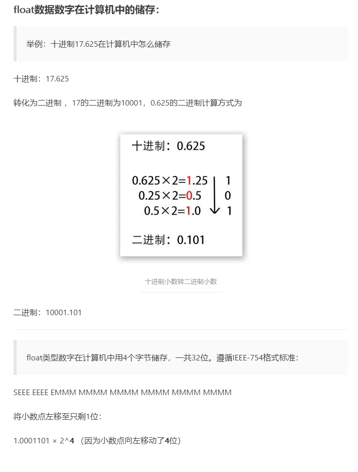
1. 格式
   SEEE EEEE EMMM MMMM MMMM MMMM MMMM MMMM

   S：符号位
   E：指数，十进制指数加上127后的值得二进制数据
   M：底数

2. 举例：
17.625在内存中的存储

首先要把17.625换算成二进制：10001.101

在将10001.101右移，直到小数点前只剩1位：
1.0001101 * 2^4  因为右移动了四位

底数：因为小数点前必为1，所以IEEE规定只记录小数点后的就好。所以，此处的底数为：0001101
指数：实际为4，必须加上127(转出的时候，减去127)，所以为131。也就是10000011
符号：整数，所以是0

综上所述，17.625在内存中的存储格式是：
01000001 10001101 00000000 00000000

## 键盘按下一个键，之后发生了什么？

- 按下按键，触发中断，中断服务程序获取上下文查找中断向量表，然后执行中断处理程序，进行对应的io操作得到按键码，查找*key_layout.kl文件得到key_event然后返回。
  应用程序调用系统接口得到key down的event， 触发调用应用程序的处理函数(假定是渲染字符)，调用系统图形库或直接调用freetype等，执行对应字符的渲染，流程结束。  

## RESTful形式下有哪些和服务器的交互方式（GET，POST，PUT，DELETE）

目前互联网公司的应用架构基本都是前后端分离，后端的接口也基本上都是采用restful架构了。
使用restful架构最主要的是遵循rest的思想：“统一资源接口“。
URI既可以看成是资源的地址，也可以看成是资源的名称，代表的就是唯一的资源
操作是结合标准的http方法（get、post、put等）来实现的。

1. GET：
   1. 特点：安全，具有幂等性
   2. 作用：用于获取资源
2. HEAD：
   1. 特点：安全，具有幂等性
   2. 作用：也是用于获取资源，但设定为获取部分资源，一般只要content-type和content-length
3. POST：
   1. 特点：不算特别安全(信息会暴露在请求中)，非幂等
   2. 作用：用于**创建子资源**
4. PUT：
   1. 特点：不算特别安全，幂等
   2. 作用：用于**创建、更新资源**
5. DELETE:
   1. 特点：非安全，幂等
   2. 作用：删除资源
6. OPTIONS：
   1. 特点：安全，具有幂等性
   2. 作用：用于url验证，验证接口服务是否正常；
7. PATCH：
   1. 特点：非幂等
   2. 作用：更新部分资源内容，不是全部更新
8. post和put的区别：
post和put的区别在于uri，或者说post用于创建子资源(即给出上级目录，然后会自动创建下级目录)，比如接口：POST /api/person/  会创建一个资源比如 /api/person/1或者/api/person/2 ... 或者/api/person/n，创建了新的uri，而put方法创建资源的uri是 PUT /api/person/1(必须是完整的url路径)，这样就创建了一个资源，如果1已经存在那么就是更新，所以put并不是只是更新操作。再有post是非幂等的。

URI，统一资源标志符(Uniform Resource Identifier， URI)，表示的是web上每一种可用的资源，如 HTML文档、图像、视频片段、程序等都由一个URI进行标识的。
URL是URI的一个子集。它是Uniform Resource Locator的缩写，译为“统一资源定位符”。URL是URI概念的一种实现方式。

## 讲一下Linux的文件系统

在根目录/下，有很多的具体目录例如

1. bin ： 包含一些二进制文件的目录，即可以运行的一些应用程序
2. boot ：包含启动系统所需的文件
3. dev ： 包含设备文件
4. etc ： 一般都存放系统配置文件
5. home ：用户个人目录
6. lib ： 库文件所在的地方
7. meida： 外部存储器挂载目录
8. opt : 编译软件（即，你从源代码构建，并不是从你的系统的软件库中安装软件）的地方
9. root: 系统的超级用户（也称为“管理员”）的主目录
10. temp : 临时文件

## Linux中的I/O模式(I/O复用)

- 典型的一次IO的两个阶段是什么？**数据就绪** 和 **数据读写**
**网络IO阶段图**

-------------------------------------------------------------------------------

- 数据就绪：根据系统IO操作的就绪状态
   阻塞
   非阻塞  **这是文件描述符的属性**
- 数据读写：根据应用程序和内核的交互方式
   同步
   异步

         在处理 IO 的时候，阻塞和非阻塞都是同步 IO，只有使用了特殊的 API 才是异步 IO

**同步异步、阻塞非阻塞**
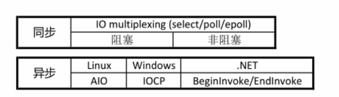
**- 一个典型的网络IO接口调用，分为两个阶段，分别是“数据就绪” 和 “数据读写”，数据就绪阶段分为阻塞和非阻塞，表现的结果就是，阻塞当前线程或是直接返回。**

**- 同步表示A向B请求调用一个网络IO接口时（或者调用某个业务逻辑API接口时），数据的读写都是由请求方A自己来完成的（不管是阻塞还是非阻塞）；异步表示A向B请求调用一个网络IO接口时（或者调用某个业务逻辑API接口时），向B传入请求的事件以及事件发生时通知的方式，A就可以处理其它逻辑了，当B监听到事件处理完成后，会用事先约定好的通知方式，通知A处理结果。**

**同步与异步**
- 同步和异步关注的是**消息通信机制** (synchronous communication/ asynchronous communication)
- 所谓同步，就是在发出一个调用时，在没有得到结果之前，该调用就不返回。但是一旦调用返回，就得到返回值了。换句话说，就是由调用者主动获得这个调用的结果。
- 而异步则是相反，调用在发出之后，这个调用就直接返回了，所以没有返回结果。换句话说，当一个异步过程调用发出后，调用者不会立刻得到结果。而是在调用发出后，被调用者通过状态、通知来通知调用者，或通过回调函数处理这个调用。

**阻塞与非阻塞**
- 阻塞和非阻塞关注的是程序在等待调用结果（消息，返回值）时的状态.
   阻塞调用是指调用结果返回之前，当前**线程会被挂起**。调用线程只有在得到结果之后才会返回。
   非阻塞调用指在不能立刻得到结果之前，当前线程还是可以去做别的事情，但是*还需要自己不断询问*
------------------------------------------------------------------------------

1. **阻塞 blocking**

- 调用者调用了某个函数，等待这个函数返回，期间什么也不做，不停的去检查这个函数有没有返回，必须等这个函数返回才能进行下一步动作。
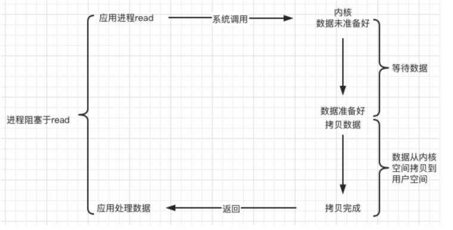
   1. 用户进程发起read，然后进行recvfrom系统调用
   2. 内核开始等待数据准备好(从磁盘到缓存)
   3. 等待数据部分，进程为阻塞状态
   4. 内核将数据拷贝到用户空间，并返回结构，然后阻塞结束。

   好处：不占用CPU宝贵的时间片
   缺点：同一时刻只能处理一个操作，效率低

   解决方法：多线程或者多进程，BIO模型
   缺点：1.线程或者进程会消耗资源  2.线程或进程调度消耗CPU资源

------------------------------------------------------------------------------

2. **非阻塞non-blocking（NIO）**

- 非阻塞等待，**每隔一段时间就去检测IO事件是否就绪。没有就绪就可以做其他事。非阻塞I/O执行系统调用总是立即返回**，不管事件是否已经发生，若事件没有发生，则返回-1，此时可以根据 errno 区分这两种情况，对于accept，recv 和 send，事件未发生时，errno 通常被设置成 EAGAIN。
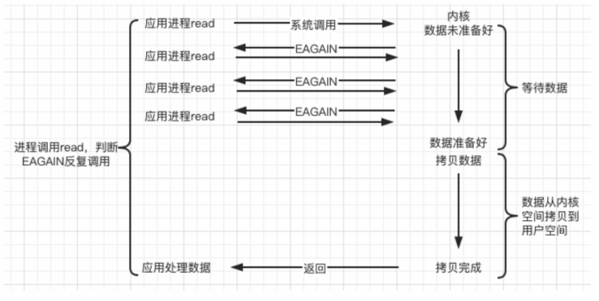
   1. 用户进程发起read，内核去判断是否数据准备好了，如果没准备好就返回error
   2. 如果接收到error，用户进程继续发起read操作，知道数据准备好
   3. 数据准备好后，内核开始将数据从缓存读到用户空间中，然后返回结果。

   好处：提高了程序的执行效率
   缺点：需要占用更多的CPU和系统资源

   NIO模型：
   1W client，每循环内O(n)系统调用

------------------------------------------------------------------------------

3. **I/O多路复用**

- Linux 用 select/poll/epoll 函数实现 IO 复用模型，这些函数也会使进程阻塞，但是和阻塞IO所不同的是**这些函数可以同时阻塞多个IO操作**。而且可以同时**对多个读操作、写操作的IO函数进行检测**。直到有数据可读或可写时，才真正调用IO操作函数。
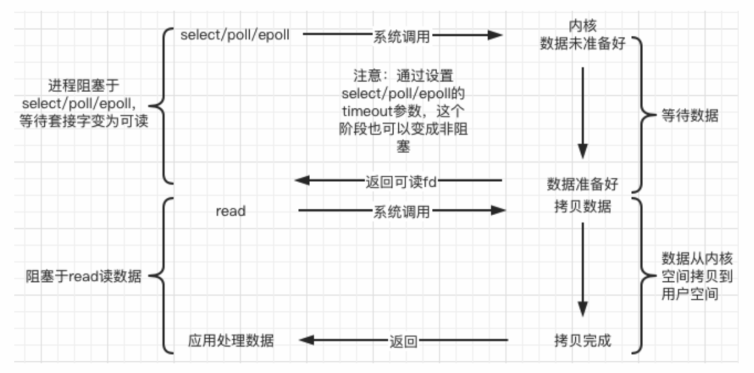
   1. 有一个进程专门用来监听的，当一个用户线程调用了select后，这个进程会阻塞，进入监听模式
   2. 监听到任何一个socket中的数据准备好了后，就会返回
   3. 然后对应用户进程进行read操作，将数据读到用户空间中。

------------------------------------------------------------------------------

4. 信号驱动（signal-driven）

- Linux 用套接口进行信号驱动 IO，安装一个信号处理函数，进程继续运行并不阻塞，当IO事件就绪，进程收到SIGIO 信号，然后处理 IO 事件。
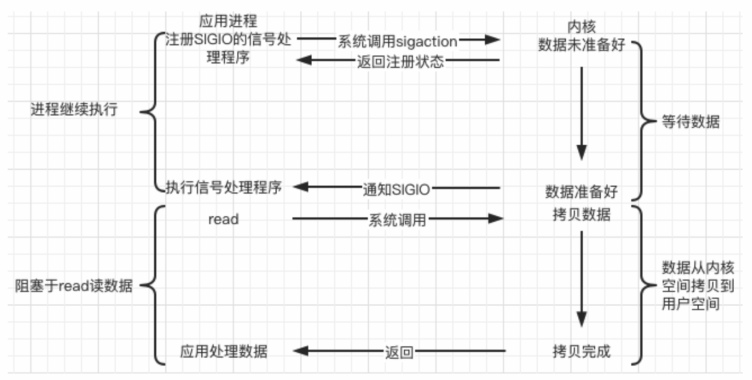
- 内核在第一个阶段是异步，在第二个阶段是同步；与非阻塞IO的区别在于它提供了消息通知机制，不需要用户进程不断的轮询检查，减少了系统API的调用次数，提高了效率。

------------------------------------------------------------------------------

5. 异步（asynchronous）

- Linux中，可以****调用 aio_read 函数告诉内核描述字缓冲区指针和缓冲区的大小、文件偏移及通知的方式，然后立即返回，当内核将数据拷贝到缓冲区后，再通知应用程序。**

   1. 用户发起read操作后，就不需要去管了，可以执行其他操作
   2. 此时内核部分，接收到异步read操作后，会返回结果(结果没实际含义，真正完成read是靠signal)，从而不让用户进程阻塞
   3. 然后等数据准备好后，内核在完成数据读取，然后发送一个singal告知用户进程read操作好了

## I/O多路复用具体解决了什么问题？

- 多路复用属于同步I/O模型

1. IO是指从文件或者程序的数据与内存交换的过程，I/O其实是对两端读写缓冲区的操作
2. I/O 多路复用使得程序能**同时监听多个fd**，能够提高程序的性能，Linux 下实现 I/O 多路复用的系统调用主要有 select、poll 和 epoll。
 **使用场景**
 TCP服务器要同时处理监听socket和连接socket。
 当服务程序需要承载大量TCP链接的时候，比如我们的消息推送系统，IM通讯，web聊天等等，使用I/O复用可以用少量的线程处理大量的连接。

## epoll()，select()，poll()的区别  (和多路I/O复用相关) 对应NIO和AIO

I/O多路复用的本质其实就还是select/poll/epoll去监听多个socket对象。

1. **select**（委托内核）： 它仅仅知道了，有I/O事件发生了，却并不知道是哪个（或者哪几个）fd发生I/O事件，我们只能无差别轮询所有fd，找出能读出数据，或者写入数据的流，对他们进行操作。所以select具有O(n)的无差别轮询复杂度，同时处理的流越多，无差别轮询时间就越长。不断轮询去监听socket，但监听的socket个数有限制，32位最多1024个，64位机默认是2048。
  O(n)
  缺点：
        （1）每次调用select，都需要把fd集合从用户态拷贝到内核态，这个开销在fd很多时会很大
        （2）同时每次调用select都需要在内核**遍历**传递进来的所有fd，这个开销在fd很多时也很大
        （3）select支持的文件描述符数量太小了，默认是1024
        （4）fds集合不能重用，每次都需要重置

---------------------------------------------------------------------------------------------------------

2. **poll**：也是不断轮询去监听，pollfd数组的方式替换原有fd_set数据结构,而使其没有连接数的限制。
  O(n)

---------------------------------------------------------------------------------------------------------

3. **epoll**（委托内核）:epoll可以理解为event poll，不同于忙轮询和无差别轮询，epoll会把哪个fd发生了怎样的I/O事件通知我们。所以说epoll实际上是事件驱动（每个事件关联上fd）的，此时我们对这些流的操作都是有意义的。（复杂度降低到了O(1)）
  epoll的优点：
   1、没有最大并发连接的限制，能打开的FD的上限远大于1024（1G的内存上能监听约10万个端口）；
   2、**效率提升**，不采用轮询的方式，有几个FD遍历几次。**只有活跃可用的FD才会被内核监听**；
   即Epoll最大的优点就在于它只管你“活跃”的连接，而跟连接总数无关，因此在实际的网络环境中，Epoll的效率就会远远高于select和poll。
   3、 内存拷贝，利用mmap()文件映射内存加速与内核空间的消息传递；即epoll使用mmap减少复制开销。

---------------------------------------------------------------------------------------------------------

4. **epoll的工作模式**
   - **LT水平触发**：LT(level triggered)是缺省的工作方式，并且同时支持block和no-block socket.在这种做法中，内核告诉你一个文件描述符是否就绪了，然后你可以对这个就绪的fd进行IO操作。如果你不作任何操作，内核还是会继续通知你的

      假设委托内核检测读事件 -> 检测fd的读缓冲区
         读缓冲区有数据 - > epoll检测到了会给用户通知
            a.用户不读数据，数据一直在缓冲区，epoll 会一直通知
            b.用户只读了一部分数据，epoll会通知
            c.缓冲区的数据读完了，不通知

   - **ET边缘触发**：ET(edge-triggered)是高速工作方式，只支持no-block socket。在这种模式下，当描述符从未就绪变为就绪时，内核通过epoll告诉你。然后它会假设你知道文件描述符已经就绪，并且不会再为那个文件描述符发送更多的就绪通知，直到你做了某些操作导致那个文件描述符不再为就绪状态了。但是请注意，如果一直不对这个 fd 作 IO 操作（从而导致它再次变成未就绪），内核不会发送更多的通知（only once）
   -
      假设委托内核检测读事件 -> 检测fd的读缓冲区
         读缓冲区有数据 - > epoll检测到了会给用户通知
            a.用户不读数据，数据一致在缓冲区中，epoll下次检测的时候就不通知了
            b.用户只读了一部分数据，epoll不通知
            c.缓冲区的数据读完了，不通知

   ET 模式在很大程度上减少了 epoll 事件被重复触发的次数，因此效率要比 LT 模式高。epoll工作在 ET 模式的时候，必须使用非阻塞套接口，以避免由于一个文件句柄的阻塞读/阻塞写操作把处理多个文件描述符的任务饿死。

5. epoll是通过内核与用户空间mmap同一块内存实现的。**mmap将用户空间的一块地址和内核空间的一块地址同时映射到相同的一块物理内存地址**（不管是用户空间还是内核空间都是虚拟地址，最终要通过地址映射映射到物理地址），使得这块物理内存对内核和对用户均可见，减少用户态和内核态之间的数据交换。内核可以直接看到epoll监听的句柄，效率高。

   红黑树将存储epoll所监听的套接字。上面mmap出来的内存如何保存epoll所监听的套接字，必然也得有一套数据结构，epoll在实现上采用红黑树去存储所有套接字，当**添加或者删除一个套接字时（epoll_ctl），都在红黑树上去处理**，红黑树本身插入和删除性能比较好，时间复杂度O(logN)。
--------------------------------------------------------------------------------------------------------

6. select，poll，epoll都是IO多路复用的机制。I/O多路复用就通过一种机制，可以监视多个描述符，一旦某个描述符就绪（一般是读就绪或者写就绪），能够通知程序进行相应的读写操作。但select，poll，epoll本质上都是同步I/O，因为他们都需要在读写事件就绪后自己负责进行读写，也就是说这个读写过程是阻塞的，而异步I/O则无需自己负责进行读写，异步I/O的实现会负责把数据从内核拷贝到用户空间。  

7. 选择方式
  在选择select，poll，epoll时要根据具体的使用场合以及这三种方式的自身特点。
  1、表面上看epoll的性能最好，但是在**连接数少并且连接都十分活跃**的情况下，select和poll的性能可能比epoll好，毕竟epoll的通知机制需要很多函数回调。
  2、select低效是因为每次它都需要轮询。但低效也是相对的，视情况而定，也可通过良好的设计改善

<https://blog.csdn.net/wteruiycbqqvwt/article/details/90299610>

## epoll底层为什么用红黑树

1. select与poll的一个缺陷在于，每次都会进行文件描述符表从内核态到用户态的拷贝；而epoll fd的管理是持久性的
2. epoll fd中插入，查找和删除的操作时常发生，因此要找一个效率都不错的数据结构来存放这些文件描述符，当然选择红黑树

## 有没有了解过cpu的内部结构,4核的cpu一次能为几个线程服务？

一般来讲4核cpu能跑4个线程，但还得看是否用了超线程技术，也有四核八线程。

## 内核态和用户态的区别？为啥要区分内核空间和用户空间？怎么实现内核态？和底层的CPU指令有关吗？

1. 区别： 内核态和用户态主要是为了**区分不同程序的不同权限**，内核态拥有更高的权限，可以执行更多的指令，这些指令对OS的稳定性有比较大的作用，使得用户态程序不能直接访问操作系统内核数据结构和程序。 **内核态和用户态的切换通过系统调用(主动切换)，中断，异常来切换。**
2. 内核态：**硬件资源**，向内管理**操作系统资源**：包括进程的调度和管理、内存的管理、文件系统的管理、设备驱动程序的管理以及网络资源的管理；**IO读写，底层应用的控制**
3. 什么时候会出现内核态到用户态的切换

         C函数库中的内存分配函数malloc()，它具体是使用sbrk()系统调用来分配内存，当malloc调用sbrk()的时候就涉及一次从用户态到内核态的切换，类似的函数还有printf()，调用的是wirte()系统调用来输出字符串，

   1）当然就是系统调用：原因如上的分析。
   2）异常事件： 当CPU正在执行运行在用户态的程序时，突然发生某些预先不可知的异常事件，这个时候就会触发**从当前用户态执行的进程转向内核态执行相关的异常事件**，典型的如**缺页异常**。
   3）外围设备的中断：当外围设备完成用户的请求操作后，会向CPU发出中断信号，此时，CPU就会暂停执行下一条即将要执行的指令，转而**去执行中断信号对应的处理程序**，如果先前执行的指令是在用户态下，则自然就发生从用户态到内核态的转换。
4. 各自优点：
   1. 内核态的程序可以访问的资源多，但可靠性、安全性要求高，维护管理都较复杂
   2. 用户态程序程序访问的资源有限，但可靠性、安全性要求低，自然编写维护起来比较简单

## sleep() 等定时机制，定时精度是由什么因素决定的？怎么实现？

## ！说一下timer定时器的时间原理

<https://www.cnblogs.com/sunsky303/p/14154190.html>

1. 低精度时钟：早期的linux内核只支持低精度时钟，内核软件定时器采用timer wheel多级时间轮的实现机制，来维护系统的定时任务。具体工作方式如下：
   1. 系统启动后，会读取时钟源设备，然后初始化当前系统的时间
   2. 内核会根据系统定时器的评率来设置时钟事件设备，启动tick中断。
   3. 每次产生tick中断后，都会更新系统时钟，并检查timer wheel，进行超时时间的处理。
2. 高精度时钟：采用了新的定时器hrtimer
   1. 通过将高精度时钟硬件的下次中断触发时间设置为红黑树中最早到期的Timer 的时间，时钟到期后从红黑树中得到下一个 Timer 的到期时间，并设置硬件，如此循环反复。
   2. hrtimer采用红黑树进行高精度定时器的管理，而不是时间轮
   3. 高精度时钟定时器不在依赖系统的tick中断，而是基于事件触发。

## ？？？操作系统有哪些模块

操作系统通常应包括下列五大功能模块：
（1）处理器管理。当多个程序同时运行时，解决处理器(CPU)时间的分配问题。
（2）作业管理。完成某个独立任务的程序及其所需的数据组成一个作业。作业管理的任务主要是为用户提供一个使用计算机的界面使其方便地运行自己的作业，并对所有进入系统的作业进行调度和控制，尽可能高效地利用整个系统的资源。
（3）存储器管理。为各个程序及其使用的数据分配存储空间，并保证它们互不干扰。
（4）设备管理。根据用户提出使用设备的请求进行设备分配，同时还能随时接收设备的请求（称为中断），如要求输入信息。
（5）文件管理。主要负责文件的存储、检索、共享和保护，为用户提供文件操作的方便。

# 进程和线程 U7-U11

## 什么是进程和线程

1. 进程：进程是对运行时程序的封装，是系统进行**资源调度和分配的的最小单位**，实现了操作系统的并发， **进程= 资源管理+线程** **进程结构= PCB(唯一标识和控制信息)+代码段+数据段**
2. 线程：线程是进程的子任务，是CPU调度和分派的基本单位，用于保证程序的实时性，实现进程内部的并发；线程是操作系统可识别的**最小执行和调度单位**。线程需要独立的寄存器、程序计数器、栈，共享代码、数据、文件。

### 线程间共享资源
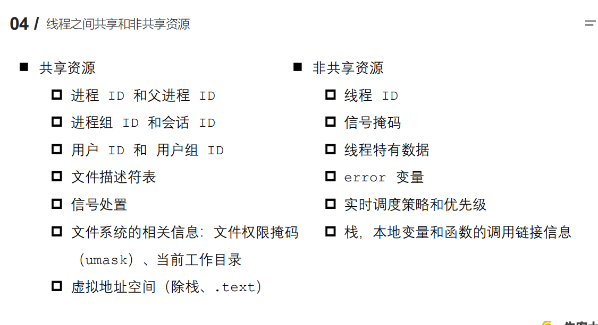
1. 线程间共享资源
   1. 进程ID与父进程ID
   2. 用户ID和用户组ID
   3. **文件描述符表**
   4. 进程的**代码段**
   5. 进程的**公有数据**
   6. 信号处理器
2. 线程独有资源
   1. 线程ID
   2. 寄存器/程序计数器
   3. 线程的堆栈
   4. error变量
   5. 调度策略与优先级

## 进程的组成，进程控制块PCB结构

1. 进程的组成
   1. 代码部分
   2. 数据部分
   3. 程序计数器部分
   4. 通用寄存器
   5. 文件资源
2. 进程控制块PCB结构
   1. 进程标识信息：例如进程号，父进程标识。
   2. 状态信息保护区，类似与上下文切换时要保存的。
   3. 进程控制信息。
   
   进程id：系统中每个进程有唯一的 id，用 pid_t 类型表示，其实就是一个非负整数
   进程的状态：有就绪、运行、挂起、停止等状态
   进程切换时需要保存和恢复的一些CPU寄存器
   描述虚拟地址空间的信息
   描述控制终端的信息
   当前工作目录（Current Working Directory）
   umask 掩码
   文件描述符表，包含很多指向 file 结构体的指针和信号相关的信息
   用户 id 和组 id
   会话（Session）和进程组
   进程可以使用的资源上限（Resource Limit）

            程序计数器（PC，Program counter），用于存放指令的地址。
            通用寄存器（GR，General register）通用寄存器可用于传送和暂存数据，也可参与算术逻辑运算，并保存运算结果。
            1、进程标识符 name：
                 每个进程都必须有一个唯一的标识符，可以是字符串，也可以是一个数字。UNIX系统中就是一个整型数。在进程创建时由系统赋予。
            2、进程当前状态 status：
                   说明进程当前所处的状态。为了管理的方便，系统设计时会将相同的状态的进程组成一个队列，如就绪进程队列，等待进程则要根据等待的事件组成多个等待队列，如等待打印机队列、等待磁盘I/O完成队列等等。
            3、进程相应的程序和数据地址，以便把PCB与其程序和数据联系起来。
            4、进程资源清单。列出所拥有的除CPU外的资源记录，如拥有的I/O设备，打开的文件列表等。
            5、进程优先级 priority：
                   进程的优先级反映进程的紧迫程序，通常由用户指定和系统设置。UNIX系统采用用户设置和系统计算相结合的方式确定进程的优先级 。
            6、CPU现场保护区 cpustatus：
                   当进程因某种原因不能继续占用CPU时（等待打印机），释放CPU，这时就要将CPU的各种状态信息保护起来，为将来再次得到处理机恢复CPU的各种状态，继续运行。
            7、进程同步与通信机制 用于实现进程间互斥、同步和通信所需的信号量等。
            8、进程所在队列PCB的链接字   根据进程所处的现行状态，进程相应的PCB参加到不同队列中。PCB链接字指出该进程所在队列中下一个进程PCB的首地址。
            9、与进程有关的其他信息。 如进程记账信息，进程占用CPU的时间等。

## 进程(线程)之间的通信方式

1. 进程间不会相互影响 ；线程一个线程挂掉将导致整个进程挂掉
2. **进程之间的通信方式**
   1. 管道：管道只能承载无格式字节流以及缓冲区大小受限等特点，管道一般可以实现数据交换，但更多的是以文件操作中用到。将一个文件的输出，重定向到令一个文件的输入，这样就可以完成一系列的操作。 ls | more中 | 就是管道的意思，主要是用于父子进程之间的传输。
   2. 系统IPC
      1. 消息队列：消息队列是由消息的链表，存放在内核中并由消息队列标识符标识。消息队列克服了信号传递信息少、管道只能承载无格式字节流以及缓冲区大小受限等缺点。，**传进去的是一个有意义的数据结构，可以实现多个不相关进程的数据交换**
      2. 信号量：信号量（semaphore）与已经介绍过的 IPC 结构不同，它是一个计数器，可以用来控制多个进程对共享资源的访问。**信号量用于实现进程间的互斥与同步**，而不是用于存储进程间通信数据。**信号量基于操作系统的PV(加减)操作，*程序对信号量的操作都是原子操作*。**
      3. signal信号：信号是一种比较复杂的通信方式，**用于通知接收进程某个事件已经发生。** 一般都是通知中断or异常情况，**不能传输数据。**
      4. 共享内存(Shared memory 直接通信，最快)：**它使得多个进程可以访问同一块内存空间**，不同进程可以及时看到对方进程中对共享内存中数据的更新。它往往**与其他通信机制，如信号量，配合使用**，来实现进程间的同步和通信。
   3. 套接字socket：socket也是一种进程间通信机制，与其他通信机制不同的是，**它可用于不同主机之间的进程通信**。
3. **线程之间的通信方式**(更多的偏向于多线程同步)
   1. 临界区Critical section ：通过多线程的**串行化来访问公共资源或一段代码**，速度快，适合控制数据访问；
   2. 互斥量Mutex ：采用互斥对象机制，只有拥有互斥对象的线程才有访问公共资源的权限。因为互斥对象只有一个，所以可以保证公共资源不会被多个线程同时访问
   3. 信号量：为控制具有有限数量的用户资源而设计的，它允许多个线程在同一时刻去访问同一个资源，但一般需要限制同一时刻访问此资源的最大线程数目
   4. 事件/信号：通过通知操作的方式来保持多线程同步，还可以方便的实现多线程优先级的比较操作

## 共享内存加锁怎么加，还有其他方式吗

1. 在**操作共享内存之前加读写锁**
2. **共享内存上**设置一个地方，专门存放当前**共享内存的读写状态；**
3. 环形数组实现共享队列
4. 最大32M，可以设置

大部分无锁队列都是用环形数组实现的，简单高效，这里也不例外。假设队列长度为queue_len，用read_index表示可读的位置，用write_index表示可写的位置。

每次修改read_index或write_index的时候都需要将其归一化：
read_index %= queue_len

队列已使用空间used_len的计算为：
write_index >= read_index ?
  write_index - read_index : queue_len - read_index + write_index

判断队列IsEmpty的条件为：
read_index == write_index

如果不做特殊处理，判断队列IsFull的条件和IsEmpty的条件一样，从而难以区分。所以我们将队列可写入长度设为queue_len-1。这样判断长度为write_len的数据是否可以写入的条件为：
// 注意是 < 而不是 <= 
used_len + write_len < queue_len
   1. 一写一读
      1. 写操作：先判断是否可以写入，如果可以，则先写数据，写完数据后再修改write_index。
      2. 读操作：先判断是否可以读取used_len > 0，如果可以，则先读数据，读完再修改read_index。
   因为read_index和write_index都只会有一个地方去写，所以其实不需要加锁也不需要原子操作，直接修改即可。需要注意读写数据的时候都需要考虑遇到数组尾部的情况。
   2. 
https://cloud.tencent.com/developer/article/1006241

## 线程模型有哪些

1. 一对一模型
   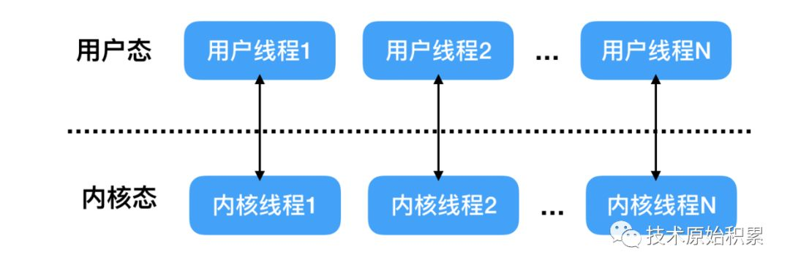
   1. 这种线程模型下用户线程与内核线程是一一对应的，当从程序入口点（比如main函数）启动后，操作系统就创建了一个进程，这个main函数所在的线程就是主线程，在main函数内当我们使用高级语言创建一个用户线程的时候，其实对应创建了一个内核线程
   2. 优点：在多处理器上，多个线程可以真正实现**并行**运行，并且当一个线程由于网络IO等原因被阻塞时候，其他的线程不受影响。
   3. 由于一般操作系统会限制内核线程的个数，所以用户线程的个数会受到限制。另外由于用户线程与系统线程一一对应，当用户线程比如执行Io操作（执行系统调用）时候，需要从用户态的用户程序的执行切换到内核态执行内核操作，然后等执行完毕后又会从内核态切换到用户态执行用户程序，而这个切换操作开销是相对比较大的。
2. 多对一模型
   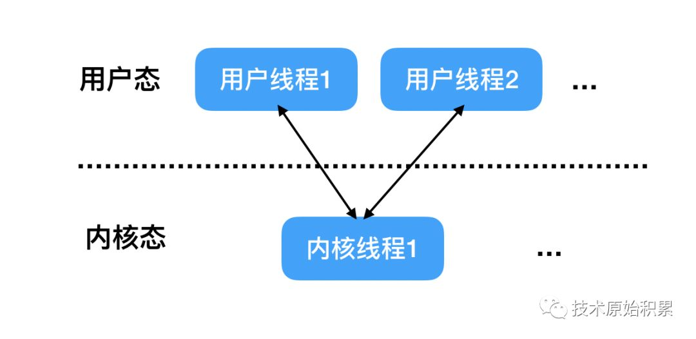
   1. 多对一模型是指多个用户线程对应一个内核线程，同时同一个用户线程只能对应一个内核线程，这时候对应同一个内核线程的多个用户线程的上下文切换是由用户态的运行时线程库来做的，而不是由操作系统调度系统来做的
   2. 优点：由于上下文切换在用户态，所以切换速度很快，开销很小；另外可创建的用户线程的数量可以很多，只受内存大小限制。
   3. 缺点：这种模型由于多个用户线程对应一个内核线程，当**该内核线程对应的一个用户线程被阻塞挂起时候，该内核线程对应的其他用户线程也不能运行**了，因为这时候内核线程已经被阻塞挂起了。另外这种模型并不能很好的利用多核CPU进行并发运行。
3. 多对多模型
   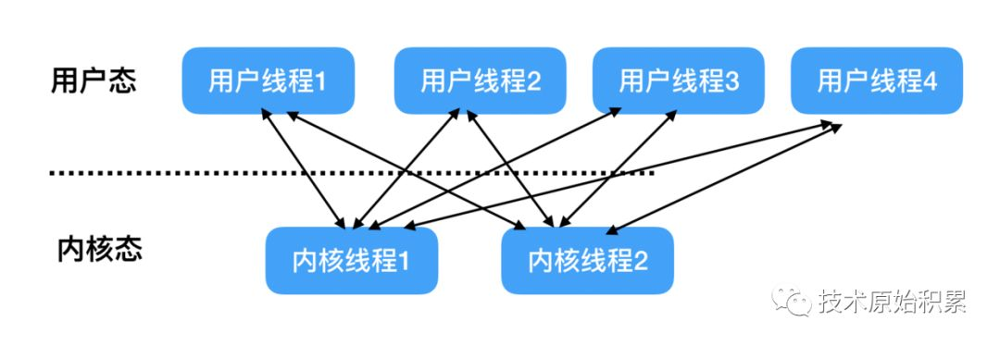
   1. 多对多模型则结合一对一和多对一模型的特点，让大量的用户线程对应少数几个内核线程
   2. 这时候每个内核线程对应多个用户线程，每个用户线程有可以对应多个内核线程，**当一个用户线程阻塞后，其对应的当前的内核线程会被阻塞，但是被阻塞的内核线程对应的其他用户线程可以切换到其他的内核线程上继续运行**，所以多对多模型是可以充分利用多核CPU提升运行效能的。
   另外多对多模型也对用户线程个数没有限制，理论上只要内存够用可以无限创建。
   
## 自旋锁与互斥锁的区别

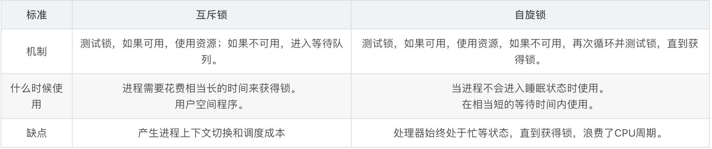
1. mutex是使用系统中任何资源的钥匙。如果拥有mutex，就可以使用资源。如果mutex没有被释放，则进程进入该特定资源的等待队列中。

2. spin-lock是一种机制，在这种机制中，需要资源的进程，轮询资源上的锁直到得到它。也称为忙等待。进程将在循环中忙碌，直到获得资源。

3. 第一个区别：即等待资源锁的方式。在mutex的情况下，进程进入等待状态，并且不使用CPU。在spin-lock中，进程继续循环，因此即使在等待时也使用CPU资源。

4. 第二个区别：什么时候使用自旋锁还是使用互斥锁。

   当一段代码无法进入睡眠状态时，最好使用自旋锁。中断请求处理程序应该使用自旋锁。(类似与用户态线程与内核态线程的阻塞区别)
   互斥锁适用于用户空间程序，其中进程的睡眠不会影响系统。

## 文件锁

1. 文件锁（也叫记录锁）的作用是，当一个进程读写文件的某部分时，其他进程就无法修改同一文件区域。
2. fcntl函数
   1. int fcntl(int fd, int cmd, .../*struct flock *flockptr*/);
      #返回值：若成功，返回值依赖于cmd，失败返回-1
   2. 
         锁类型：共享读锁F_RDLCK，独占性写锁F_WRLCK，解锁F_UNLCK
         加锁或解锁区域的起始字节偏移量（l_start, l_whence）
         区域字节长度（L_len）
         进程的id持有的锁能阻塞当前进程，仅由F_GETLK返回
   3. 
      1. 任意多个进程在一个给定的字节上可以有一把共享的读锁（F_RDLCK），但是在一个给定的字节上只能有一个进程有一把独占性写锁（F_WRLCK）
      2. 如果在一个给定字节上已经有一把或多把读锁，则不能在该字节上再加写锁，如果在一个字节上已经有一把独占性写锁，则不能再对它加任何读锁
      3. 对于单个进程而言，如果进程对某个文件区域已经有了一把锁，然后又试图在相同区域再加一把锁，则新锁会替换旧锁
      加读锁时，该描述符必须是读打开，加写锁时，该描述符必须是写打开
   4. fcntl三种cmd的使用：
      1. F_GETLK：判断由flockptr所描述的锁是否会被另一把锁所排斥（阻塞），如果存在一把锁阻止创建由flockptr所描述的锁，由该现有锁的信息将重写flockptr指向的信息。如果不存在这种情况，则除了将l_type设置为F_UNLCK之处，flockptr所指向结构中的其他信息保持不变
      2. F_SETLK：设置由flockptr所描述的锁，如果程序试图获得一把锁，而系统阻止程序获得该锁，则fcntl会立即返回错误，errno设置为EACCES或EAGAIN。当l_type=F_UNLCK时，此命令用来清除指定的锁
      3. F_SETLKW：F_SETLK的阻塞版本（wait）。如果程序尝试获得的锁无法被授予，调用进程会进入休眠直到进程获得锁或者信号中断

## 线程安全是什么

1. 线程安全: 线程安全可以简单理解为一个方法或者一个实例可以在多线程环境中使用而不会出现问题。
2. 线程不安全: 是指不提供加锁机制保护,有可能出现多个线程先后更改数据造成所得到的数据是脏数据。

## 死锁的概念，其产生的四个必要条件，以及如何避免预防

1. 死锁Deadlock是指两个或多个进程在执行的过程中，因为竞争资源而造成互相等待的现象，若无外力作用，它们都无法推进下去。
2. 产生的条件
      1.互斥条件
      一个资源每次只能被一个进程使用，即在一段时间内某资源仅为一个进程所使用。此时如果有其他进程请求该资源，则请求进程只能等待。
      2.请求与保持条件
      进程中已经保持了至少一个资源，但又提出了新的资源请求，而该资源已经被其他进程占有，此时请求进程被阻塞，但对自己已经获得资源保持不放。
      3.不可剥夺条件
      进程的资源在未使用完毕之前，不能被其他进程强行夺走，即只能由获得该资源的进程自己来释放。
      4.循环等待条件
      若干进程间形成首尾相接循环等待资源的关系。在发生死锁时必然存在一个进程等待队列{P1，P2，…,Pn},其中P1等待P2占有的资源，P2等待P3占有的资源，…，Pn等待P1占有的资源，形成一个进程等待环路，环路中每一个进程所占有的资源同时被另一个申请。
3. 如何解决
   1. 预防死锁
   - 破坏“请求与保持”条件(方法一：**静态分配**，每个进程在开始执行时就申请他所需要的全部资源。方法二：动态分配，每个进程在申请所需要的资源时他本身不占用系统资源。)
   - 破坏“不可剥夺”条件(一个进程不可获得其所需要的全部资源便处于等待状态，等待期间他占用的资源将被隐式的释放重新加入到系统的资源列表中，可以被其他进程使用，而等待的进程只有重新获得自己原有的资源以及新申请的资源才可以重新启动，执行。)
   - 破坏“循环等待”条件(采用**资源有序分配**的基本思想。将系统中的资源顺序进行编号，将紧缺的、稀少的资源采用较大的编号，**申请资源时必须按照编号的顺序执行**，一个进程只有较小编号的进程才能申请较大编号的进程。)

            一个线程如果要获取多个锁，必须按照一定的顺序去获取，比如要获取A B C 三把锁，我们规定，必须获取到了 AB 两把锁，才能去获取 C锁

            举个例子 现在有两个线程 都要去获取 ABC 三把锁

            然后 1号 线程 获取到了 A 和 B 两把锁
            2号 线程获取了 C锁

            于是 1号线程在等待 2号线程释放锁C锁
            2号线程在等待 1 号线程释放 A 和 B 锁
            于是出现了死锁

            现在采用加锁队列后，必须先 获取 A 和 B 才能获取C锁，所以 2号线程就没有机会在没有获取 AB 的情况下拿到C锁，就不会出现死锁问题

2. 避免死锁
   - 系统对进程发出每一个系统能够满足的资源申请进行动态检查，并根据检查结果决定是否分配资源，如果分配后系统可能发生死锁，则不予分配，否则分配。这是一种动态策略。典型的避免死锁的算法是银行家算法。
   - 银行家算法是一种最有代表性的避免死锁的算法。在避免死锁方法中允许进程动态地申请资源，但系统在进行资源分配之前，应先计算此次分配资源的安全性，若分配不会导致系统进入不安全状态，则分配，否则等待。为实现银行家算法，系统必须设置若干数据结构。
3. C++里面如何排查死锁
   1. Linux 下，我们可以使用 pstack + gdb 工具来定位死锁问题。
   2. pstack 命令可以显示每个线程的栈跟踪信息（函数调用过程），它的使用方式也很简单，只需要 pstack <pid> 就可以了
   3. 在定位死锁问题时，我们可以多次执行 pstack 命令查看线程的函数调用过程，多次对比结果，确认哪几个线程一直没有变化，且是因为在等待锁，那么大概率是由于死锁问题导致的。
   4. 使用 gdb 工具进一步确认。
      1. 通过 info thread 打印了所有的线程信息，可以看到有 3 个线程，一个是主线程（LWP 87746），另外两个都是我们自己创建的线程（LWP 87747 和 87748）；
      2. 通过 thread 2，将切换到第 2 个线程（LWP 87748）；
      3. 通过 bt，打印线程的调用栈信息，可以看到有 threadB_proc 函数，说明这个是线程 B 函数，也就说 LWP 87748 是线程 B;
      4. 通过 frame 3，打印调用栈中的第三个帧的信息，可以看到线程 B 函数，在获取互斥锁 A 的时候阻塞了；
      5. 通过 p mutex_A，打印互斥锁 A 对象信息，可以看到它被 LWP 为 87747（线程 A） 的线程持有着；
      6. 通过 p mutex_B，打印互斥锁 A 对象信息，可以看到他被 LWP 为 87748 （线程 B） 的线程持有着；

## 匿名管道和命名管道的区别是什么？

管道：人们把从一个进程连接到另一个进程的数据流称为“管道”
管道又分匿名管道(pipe)和命名管道(named pipe / FIFO)
**匿名管道**：
   匿名管道实际上是由内核管理**内核中的一块缓冲区 , 是一种半双工通信手段（单向）**, 通过让不同进程都能访问同一块缓冲区,来实现进程间通讯 .
   （**单工**：单工数据传输只支持数据在一个方向上传输；在同一时间只有一方能接受或发送信息，电视遥控器
     **半双工**数据传输允许数据在两个方向上传输,但是,在某一时刻,只允许数据在一个方向上传输,它实际上是一种切换方向的单工通信；在同一时间只可以有一方接受或发送信息，可以实现双向通信。举例：对讲机。
     **全双工**数据通信允许数据同时在两个方向上传输,因此,全双工通信是两个单工通信方式的结合,它要求发送设备和接收设备都有独立的接收和发送能力；在同一时间可以同时接受和发送信息，实现双向通信，举例：电话通信。）
   匿名管道**仅限于有公共祖先进程之间通信（父子进程、两个兄弟进程等）**, 结构简单, 相对于命名管道, 其占用小, 实现简单.（因为有亲缘关系的进程之间共享文件描述符，相当于可以对同一个管道进行操作）
**命名管道**：FIFO提供了一个路径名与之关联，以FIFO的文件形式存在于文件系统中，这样即使与FIFO的创建进程不存在亲缘关系的进程，只要可以访问该路径，就能够通过FIFO相互通信。

**不同点**

1. FIFO在文件系统中作为一个特殊文件存在，但是FIFO中的内容存放在内存中
2. 当时用FIFO的进程退出后，FIFO文件将继续保存在文件系统中以便以后使用
3. FIFO有名字，不相关的进程可以通过打开有名管道进行通信

## 临界区

1. 临界区是进程中的一段需要访问共享资源并且当另一个进程处于相应代码区域时便不会被执行的代码区域。简单来说，就是**访问共享资源的那段代码区域**就是临界区。
2. 属性特点：
   1. 互斥：同一个时间临界区中最多存在一个线程
   2. 前进（Progress）：如果一个线程想要进入临界区，那么它最终会成功，不会一直的死等。
   3. 有限等待：如果一个线程i处于入口区，那么在i的请求被接受之前，其他线程进入临界区的时间是有限制的。
3. 临界区的保护方法
   1. 禁用硬件中断：进入临界区时禁用中断，离开临界区时开启中断。没有中断，也就是没有了上下文切换，因此没有并发。也就保护了临界区的多线程安全
      1. 缺点：
      2. 一旦中断被禁用，线程就无法被停止，只能运行结束
      3. 整个系统都会为你停下来
   2. 基于软件的解决方法：通过设定多个变量，标识哪些要进入临界区，哪个进入。从而可以满足多个线程时，能挑出来一个进入临界区。
   3. 基于硬件原子操作的指令，有一种是用机器指令来完成原子性，例如testandset么？有点像CAS，然后也可以加lock来保护临界区。

## 谈谈信号量，信号量如何访问

1. 信号量是一个抽象数据类型，是一个整型，然后有两个原子操作PV
   1. P操作(进入)：sem-1，如果信号量sem<0，认为执行p操作的进程需要睡眠；量sem>0，认为执行p操作的进程可以继续执行，可以进入临界区
   2. v操作(离开)：sem+1，如果sem<=0,认为当前进程在等待这个信号量，然后就会唤醒这个进程。
2. 信号量的使用：
   1. 一开始通常会设定为一个大于0的数，所以一开始执行p操作不会被阻塞。但是多次执行p操作之后，执行p操作的进程就会等待在上面。

## 讲一讲管道是如何通信的,linux中管道是怎么实现的

1. 原理：实际上，管道是一个**固定大小的缓冲区**，同时是半双工的(只能单向传输)。先在父进程中创建管道，然后通过 fork 调用创建子进程，这时就可以通过管道在父子进程间传递数据了。

## 有了进程，为什么要需要线程？

1. 进程具有缺点：进程在同一时间只能干一件事，进程在执行的过程中如果阻塞，整个进程就会挂起，即使进程中有些工作不依赖于等待的资源，仍然不会执行。
2. 线程的出现是为了更细粒度的调用处理器，作为更小的并发执行基本单位。
3. 线程的优点：
   1. **进程间的信息难以共享**。由于除去只读代码段外，父子进程并未共享内存，因此必须采用一些进程间通信方式，在进程间进行信息交换。
   2. **线程之间能够方便、快速地共享信息。**只需将数据复制到共享（全局或堆）变量中即可。
   3. 调用 fork() 来创建进程的代价相对较高，即便利用写时复制技术，仍然需要复制诸如内存页表和文件描述符表之类的多种进程属性，这意味着 fork() 调用在时间上的开销依然不菲。
   4. **创建线程比创建进程通常要快 10 倍甚至更多。**线程间是共享虚拟地址空间的，无需采用写时复制来复制内存，也无需复制页表。

## 线程之间的同步方式有哪些？

1. 信号量：信号量是一种特殊的变量，可用于线程同步。它只取自然数值，并且只支持两种操作PV，PV操作本身都是原子操作
2. 互斥量：又称互斥锁，主要用于线程互斥，不能保证按序访问，可以和条件锁一起实现同步。当进入临界区时，需要获得互斥锁并且加锁；当离开临界区时，需要对互斥锁解锁，以唤醒其他等待该互斥锁的线程。
3. 条件变量：又称条件锁，用于在线程之间同步共享数据的值。条件变量提供一种线程间通信机制：当某个共享数据达到某个值时，唤醒等待这个共享数据的一个/多个线程。

## 多线程和多进程的使用场景

1. 多进程：适用于CPU密集型。同时，多进程模型也适用于多机分布式场景中，易于多机扩展。因为**进程的同步简单，线程的同步复杂。**
2. 多线程：多线程模型主要优势为线程间切换代价较小，因此适用于I/O密集型的工作场景，因此I/O密集型的工作场景经常会由于I/O阻塞导致频繁的切换线程。同时，多线程模型也适用于单机多核分布式场景。

   1. 多进程应用场景
   nginx主流的工作模式是多进程模式（也支持多线程模型）
   几乎所有的web server服务器服务都有多进程的，至少有一个守护进程配合一个worker进程，例如apached,httpd等等以d结尾的进程包括init.d本身就是0级总进程，所有你认知的进程都是它的子进程；
   chrome浏览器也是多进程方式。 （原因：①可能存在一些网页不符合编程规范，容易崩溃，采用多进程一个网页崩溃不会影响其他网页；而采用多线程会。②网页之间互相隔离，保证安全，不必担心某个网页中的恶意代码会取得存放在其他网页中的敏感信息。）
   redis也可以归类到“多进程单线程”模型（平时工作是单个进程，涉及到耗时操作如持久化或aof重写时会用到多个进程）
   2. 多线程应用场景
   线程间有数据共享，并且数据是需要修改的（不同任务间需要大量共享数据或频繁通信时）。
   提供非均质的服务（有优先级任务处理）事件响应有优先级。
   单任务并行计算，在非CPU Bound的场景下提高响应速度，降低时延。
   与人有IO交互的应用，良好的用户体验（键盘鼠标的输入，立刻响应）
   案例：
   桌面软件，响应用户输入的是一个线程，后台程序处理是另外的线程；
   memcached

   ①**需要频繁创建销毁的优先用线程**（进程的创建和销毁开销过大）
   这种原则最常见的应用就是**Web服务器**了，来一个连接建立一个线程，断了就销毁线程，要是用进程，创建和销毁的代价是很难承受的

   ②**需要进行大量计算的优先使用线程**（CPU频繁切换）
   所谓大量计算，当然就是要耗费很多CPU，切换频繁了，这种情况下线程是最合适的。
   这种原则最常见的是图像处理、算法处理。

   ③强相关的处理用线程，弱相关的处理用进程
   什么叫强相关、弱相关？理论上很难定义，给个简单的例子就明白了。
   一般的Server需要完成如下任务：消息收发、消息处理。“消息收发”和“消息处理”就是弱相关的任务，而“消息处理”里面可能又分为“消息解码”、“业务处理”，这两个任务相对来说相关性就要强多了。因此“消息收发”和“消息处理”可以分进程设计，“消息解码”、“业务处理”可以分线程设计。
   当然这种划分方式不是一成不变的，也可以根据实际情况进行调整。

   ④可能要扩展到多机分布的用进程，多核分布的用线程

   ⑤都满足需求的情况下，用你最熟悉、最拿手的方式
   至于“数据共享、同步”、“编程、调试”、“可靠性”这几个维度的所谓的“复杂、简单”应该怎么取舍，我只能说：没有明确的选择方法。但我可以告诉你一个选择原则：如果多进程和多线程都能够满足要求，那么选择你最熟悉、最拿手的那个。

   实际应用中基本上都是“进程+线程”的结合方式，千万不要真的陷入一种非此即彼的误区。

## 游戏服务器应该为每个用户开辟一个线程还是一个进程，为什么？

- 线程的话，有一个问题是一个线程出现问题会影响到整个进程中的其他线程，而进程之间不会有这种影响。

## 进程的状态转换图，以及试模式动/静态就绪，什么是动/静态阻塞？

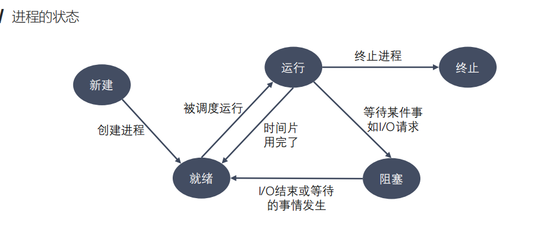

1. 状态： 创建状态 就绪状态 执行状态 等待阻塞状态 终止状态
2. 内存资源紧张：当多个进程竞争内存资源时，会造成内存资源紧张，并且，如果此时没有就绪进程，处理机会空闲，I/0速度比处理机速度慢得多，可能出现全部进程阻塞等待I/O。
   1. 交换技术：换出一部分进程到外存，腾出内存空间。
   2. 虚拟内存技术：每个进程只能装入一部分程序和数据。
3. 动态阻塞：进程在内存，但是由于某种原因被阻塞了
4. 静态阻塞：进程在外存，同时被某种原因阻塞了。
5. 活动就绪：进程在内存，处于就绪状态，只要给CPU和调度就可以直接运行。
6. 静止就绪：进程在外存，处于就绪状态，只要调度到内存，给CPU和调度就可以运行

## 僵尸进程和孤儿进程是什么？

1. 正常进程：正常情况下，子进程是通过父进程创建的，子进程再创建新的进程。子进程的结束和父进程的运行是一个异步过程，即父进程永远无法预测子进程到底什么时候结束。 当一个进程完成它的工作终止之后，它的父进程需要调用wait()或者waitpid()系统调用取得子进程的终止状态。即父进程在子进程结束后才结束。
2. 孤儿进程：一个父进程退出，而它的一个或多个子进程还在运行，那么那些子进程将成为孤儿进程。
3. 僵尸进程： • 子进程已经死亡，但父进程还没来得及回收—子进程为僵尸进程**父进程并没有调用wait或waitpid获取子进程的状态信息**
   1. 危害：如果进程不调用wait / waitpid的话， 那么保留的那段信息就不会释放，其**进程号就会一直被占用**，但是系统所能使用的进程号是有限的，如果大量的产生僵尸进程，将因为没有可用的进程号而导致系统不能产生新的进程。
   2. 如何解决：
      1. 外部解决：通过kill发送SIGTERM或者**SIGKILL**信号**消灭产生僵尸进程的进程(即杀掉父进程，让僵尸进程退化为孤儿进程)**，它产生的僵尸进程就变成了孤儿进程，由init进程接管并释放进程资源
      2. 内部解决：子进程退出时向父进程发送**SIGCHILD**信号然后父进程去响应和处理

## server端监听端口，但还没有客户端连接进来，此时进程处于什么状态？

- 需要看服务端的编程模型，正常情况下则处于阻塞状态，如果使用了epoll,select等这样的io复用情况下，处于运行状态

## 进程是资源分配的最小单位，具体分配了什么资源？cpu一次只能服务一个线程吗？怎样让它一次服务多个线程？

1. 进程分配到的资源：分配了地址空间（代码段，数据段）和打开的文件等资源
2. cpu只能服务一个线程，一般都是**时间切片的方式来满足多个线程轮询使用**

## 同一进程中的线程同享了哪些资源？

线程独享的资源有程序计数器，寄存器和自身的栈以及状态字
除此之外的进程里的堆是线程共享的，包括地址空间，全局变量这些
也可以从jvm内存管理来看，和线程相关的程序计数器，栈(虚拟机栈和本地方法栈)，此外的话，堆和方法区里的内容都是线程可以共享的。

## 进程栈和线程栈的区别

1. 进程栈属于用户态栈，和进程虚拟空间有关。也就是进程的虚拟内存中的栈区 即进程栈。进程栈的实时大小是动态的，但表面大小值在编译时就确定好了。
2. 线程栈，在linux中，线程仅仅被视为一个与其他进程共享某些资源的进程。**主线程**，其 stack 是在 fork 的时候生成的，实际上就是复制了父亲的 stack 空间地址，然后写时拷贝 (cow) 以及动态增长。然而对于主线程生成的**子线程**而言，其 stack 将不再是这样的了，而是事先固定下来的，使用 mmap 系统调用（**实际上是进程的堆的一部分**），它不带有 VM_STACK_FLAGS 标记。**线程栈是从进程的地址空间中 map 出来的一块内存区域，是一个固定大小不能动态增长**
3. 区别：
   1. 动态增长： 进程栈可以动态增长，但线程栈创建后就固定了。
   2. 栈位置： 进程栈来自于进程内存空间中的栈区，而线程则是从堆区中map一部分出来的。

## 睡眠的进程/线程怎么被唤醒？

- 在该事件的等待队列中找到进程对应的PCB。
- 将其从等待队列中移除，设置状态为就绪态。
- 将 PCB 插入就绪队列，等待调度程序调度。

1. signal (Condition)
2. notify (Object自带)

## 两个进程分别监听 TCP 和 UDP，可以监听同一个端口吗？

- 是可以两个进程同时监听的，端口这个不是真实的物理段口，其实只是一个协议栈里的标识符，TCP端口和UDP端口不一样的，因为真正传输数据的时候还是会考虑五元组的情况，传输协议不同，五元组自然不同。

## 为什么进程切换会比线程切换消耗的资源要多？

- 因为进程的话，分配的资源比较独立，然后要记录的上下文信息也更多，所以切换起来的记录 加载开销就更大，而线程的话，是基于进程空间的，有很多共享数据，上下文也较少，查询也更明确，所以开销也少。

## 协程是什么，和线程，进程之间的关系

1. 协程的话，可以理解为一个更小的线程，微线程，多协程也是在一个线程中执行。协程看上去也是子程序，但执行过程中，在子程序内部可中断，然后转而执行别的子程序，在适当的时候再返回来接着执行。  伪并发？
2. 与线程的区别：
   1. 因为都是在一个线程中执行，所以没有线程切换的开销，执行效率更高。
   2. 因为都在一个线程中执行，所以也不存在同时修改变量冲突，一般**不需要加锁同步**，开销小
   3. **协程并没有增加线程数量，只是在线程的基础之上通过分时复用的方式运行多个协程，而且协程的切换在用户态完成，切换的代价比线程从用户态到内核态的代价小很多。**

## 线程切换需要哪些流程，线程切换其实是上下文切换

1. 切换CPU的当前任务，从一个进程/线程到另一个
2. 保存当前进程/线程在PCB/TCP中的执行上下文（CPU状态）
3. 读取下一个进程/线程的上下文

2、上下文的具体内容
一个进程的上下文可以分为三个部分：

用户级上下文：正文、数据、用户堆栈以及共享存储区；
寄存器上下文：通用寄存器、程序寄存器(IP)、处理器状态寄存器(EFLAGS)、栈指针(ESP)；
系统级上下文：进程控制块task_struct、内存管理信息(mm_struct、vm_area_struct、pgd、pte)、内核栈。

3、上下文切换
所谓的上下文切换（context switch），指的是发生进程调度（进程切换）时，内核（kernel）要把当前进程的状态和数据保存起来以备以后使用，同时把之前保存的进程的相关状态调出来，这样新调度出来的进程才能运行。

## fork，exec vforck

1. fork是用来创建一个继承的子进程，这个子进程继承父进程的变量和内存以及寄存器。fork出来的子进程和父进程的区别在于childPid不一样。
2. exec是准备执行一个新的程序，所以当成功的执行了exec之后，进程就会切换，一般都是fork完后就exec组合使用
3. vfork只是复制了一小部分的进程的内容，绝大多数的内容都没有被复制。但是这会使系统调用变成两个fork，

## 请你说说fork,wait,exec函数

- 父进程产生子进程使用fork拷贝出来一个父进程的副本，此时只拷贝了父进程的页表，两个进程都读同一块内存，当有进程写的时候使用写实拷贝机制分配内存，
- exec函数可以加载一个elf文件去替换父进程，从此父进程和子进程就可以运行不同的程序了。fork从父进程返回子进程的pid，从子进程返回0.
- 调用了wait的父进程将会发生阻塞，直到有子进程状态改变,执行成功返回0，错误返回-1。exec执行成功则子进程从新的程序开始运行，无返回值，执行失败返回-1

## 系统调用System call 算法

1. 单处理器调度：
   1. **FCFS先来先服务**：根据来的时间顺序，先来的先占用CPU资源，缺点是时间波动比较大，而且耗时短的可能要等很久
   2. **短进程优先**：先满足耗时较短的进程使用CPU，有点事等待时间短，**缺点是容易出现饥饿**情况，即有些进程一直用不到CPU
   3. **HRRN最高响应比优先**：综合考虑等待时间和执行时间，让进程的等待时间给降低，避免饥饿现象。
   4. **轮询调用Poll call** ：采用时间切片和抢占来轮流执行，时间片的设定很重要
   5. **多级反馈队列**：采用了优先级队列Priority queue 的轮询，考虑了优先级，能够较好的完成较为重要的进程业务。
   6. **公平共享调度**：也划分优先级，但是优先级会调整，保证不会出现垄断资源和超长等待情况。
2. 多处理器调度和优先级反转
   1. 多处理器的话，cpu调度会更加复杂，多个单处理器组成了一个多处理器，还需要考虑负载平衡情况。
   2. 优先级反转问题：系统内的环境强制性使高优先级任务等待低优先级任务时发生。
      1. 案例：指T1T2T3三个优先级，1的执行时间受制于T2的执行时间，因为T2抢占了T3的cpu时间去执行，而T1的执行有必须等待T3处理完共享内容，所以T1的执行时间被T2延长了。结果就是T1明明是最高优先级，但是执行的却很慢。
      2. 解决方法：
         1. 优先级继承：将低优先级的进程提高到高优先级继承

# 内存管理U3-U6

## 覆盖技术，交换技术和虚存

1. 覆盖技术：在较小的可用内存中运行较大的程序。常用于多道程序系统，调用关系较少的程序使用。
   1. 原理： 把程序按照其自身逻辑结构，划分为若干个功能上相对独立的程序模块，那些不会同时执行的模块共享同一块内存区域，按时间先后来运行。常用功能的代码和数据常驻内存；不常用功能平时存放在外存中，在需要时才装入内存。
   2. 缺点： 需要先自己将程序按功能划分，然后规定各个模块之间的覆盖先后关系，编程很复杂。
2. 交换技术：让正在运行的程序或需要运行的程序获得更多的内存资源。
   1. 原理：可将暂时不能运行的程序送到外存，从而获得空闲内存空间。关键就是什么时候进行交换，一般是空间不够或者是快不够的时候进行交换
   2. 缺点：**以整个进程为单位**，交换区的大小需要比较大，然后因为是交换进行，需要重定位，地址映射就会变得麻烦。
3. 虚存技术：解决覆盖技术给程序员负担大和交换技术处理器开销大的问题。
1. 优点：1 像覆盖技术一样，**不是把程序的所有内容都放在内存中**，因而能够运行比当前的空闲内存空间还要大的程序。但做得更好，**能由操作系统自动完成，无需程序员介入**。2 能像交换技术那样，能够实现进程在内存和外存之间的交换，因而获得更多的空闲内存空间。但能做得更好，**只对进程的部分内容在内存和外存之间进行交换**，开销也就小了。

## 什么是虚拟内存和物理内存？

1. 物理内存：物理内存指通过物理内存条而获得的内存空间。基于CPU的地址线条数，例如32位系统的物理内存大概是2^32即4G，所以如果只用物理内存的话，每个进程都要分配4G内存，内存资源肯定不够，而且直接访问物理内存的，那么进程就可以修改其他进程的数据，甚至会修改内核地址空间的数据，这是我们不想看到的。
**早期出现内存不够都是用的覆盖技术和交换技术，但效率不高，后面才换成了虚存技术**
2. 虚拟内存：一个进程运行时会被分配4G的虚拟内存。进程有了虚拟内存后，每个进程都认为自己拥有4G的内存空间，当然这只是每个进程认为的。但实际上，并不是直接就真的分配了4G内存，占用了一步分物理内存，然后还占用了一部分硬盘(虚拟内存)，物理内存的使用是动态扩展的。
   1. **寻址访问**：进程将一部分的虚拟内存地址(磁盘地址)存放在物理内存上，中间的数据结构是页表(第一部分记录此页是否在物理内存上，第二部分记录物理内存页的地址)，访问地址的时候，如果在物理内存上，那就进一步直接去找就行了。如果不在当前物理内存上的话，就发生缺页异常：操作系统立即阻塞该进程，并将硬盘里对应的页换入内存，然后使该进程就绪，如果内存已经满了，没有空地方了，那就找一个页覆盖，至于具体覆盖的哪个页，就需要看操作系统的页面置换算法是怎么设计的了
3. 总结：*当每个进程创建的时候，内核会为进程分配4G的虚拟内存，当进程还没有开始运行时，这只是一个内存布局。实际上并不立即就把虚拟内存对应位置的程序数据和代码（比如.text .data段）拷贝到物理内存中，只是建立好虚拟内存和磁盘文件之间的映射关系（叫做存储器映射）。这个时候数据和代码还是在磁盘上的。当运行到对应的程序时，进程去访问页表，发现页表中地址没有存放在物理内存上，而是在磁盘上，于是发生缺页异常，于是将磁盘上的数据拷贝到物理内存中。*

## 操作系统的虚拟地址，逻辑地址，物理地址

1. 虚拟地址：和物理内存，虚拟内存相关，一个进程会分配例如4g内存，他认为自己是真实有4G内存，所以有一个地址空间00 - 0xfff这样子，这个就是虚拟地址，然后需要和物理地址进行映射，来看是在物理内存中还是磁盘中。
2. 物理地址：CPU地址总线传来的地址，由硬件电路控制其具体含义。是**真实的总线地址，具有物理意义**的。
3. 逻辑地址： 指令给出的地址一般是一个相对地址，然后需要经过寻址变换来映射到一个物理地址上面去，**逻辑地址有段标识符和段内偏移量**，因为分段处理了，所以直接物理地址会太大，不如这样的逻辑地址，中间加一个映射转换。
4. 有时把逻辑地址当成虚拟地址，两者并没有明确的界限。

## 内存碎片是什么,操作系统对内存碎片的解决方案

**MMU**
内存管理单元是介于处理器和片外存储器之间的中间层。提供对虚拟地址(VA)向物理地址(PA)的转换。一般封装于CPU芯片内部。因此虚拟地址一般只存在于CPU内部。

1. 内存碎片是指内存中的一些小的空间无法/很难被再次分配利用。
   1. 外部碎片：在分配单元间的未使用内存(块与块之间的空隙)
   2. 内部碎片：在分配单元中的未使用内存(分完一块里面没用完)、
**连续式内存分配下：**
2. 简单的分配算法：
   1. 一个程序准许运行在内存中时，分配一个动态连续的区间，可以消除内部碎片，可以实现刚好够用
   2. 策略：
      1. 首次适配：从地址低位开始找，第一个比需求大的空间就选择这块。 实现简单，空间排布有序，但是会有外部碎片，而且分配的情况不确定性比较强
      2. 最优适配：从内存中找到最小的可用空闲块，可以避免产生较多的外部碎片，但是分配会很慢。
      3. 最差适配：选最大的可用空闲块，从里面选一部分出去，可以避免大量的细微碎片，但是大块被拆分了，容易出现大需求无法满足的情况。
3. 优化解决方案：
   1. 压缩式碎片整理：会将分配好的空间进行压缩，将所有进程的内存空间都挪到低位去，可以避免外部碎片，但是这个开销是挺大的
   2. 交换式碎片整理：启用虚拟内存，每次只把运行的内存放到内存中，将等待进程的资源放在虚拟内存中。

## 分段机制、分页机制(操作系统非连续内存管理方法)

内存碎片往往都是连续分配导致的，如果可以做到物理地址空间不连续，就不会有碎片产生了，由更好的内存利用和管理。但是需要建立良好的虚拟地址和物理地址之间的转换

段的长度由相应的逻辑信息组的长度决定，因而各段长度不等，引入分段存储管理方式的目的主要是为了满足用户（程序员）在编程和使用上多方面的要求。

要注重理解，完整的逻辑意义信息，就是说将程序分页时，页的大小是固定的，只根据页面大小将程序切割开；而分段时比较灵活，只有一段程序有了完整的意义才将这一段切割开。（例如将一个人每隔50厘米切割一段，即为分页；而将一个人分割为头部、身体、腿部（有完整逻辑意义）三段，即为分段）

1. 分段机制：将进程的内存空间按段来分(逻辑地址上是连续的)，每一个段存放响应的内容，然后段与段之间的物理地址空间不连续。
   1. 寻址方式： 需要一个2维的2元组，即段号-段内偏移。段号映射到对应的物理地址空间起始处(通过段表来存储这个映射)，然后在加上段内偏移情况。
2. 分页机制：将逻辑地址空间划分成多个页，物理地址划分为同样大小的帧。然后根据页表来进行逻辑地址到物理地址的转换。
   1. 寻址： 根据二元组(帧号，帧内偏移)，帧号*页大小+帧内偏移=物理地址。
   2. 注意点：因为逻辑地址会比物理地址要大一些，所以可能逻辑地址中页数比物理地址中的帧数要多的，然后是通过页表来进行一个寻址。页映射到帧，偏移量是一致的，和页大小有关，然后页是连续的，但帧不连续，然后不是所有的页都有帧对应，因为有部分页对应的数据在虚拟内存中。然后触发丢失，然后进行页置换。
3. 多页和缓存机制
目前来看，逻辑地址空间有时候会很大，如果一页是1M左右的，可能就要有2^54个页号，非常庞大，所以需要进一步的优化，优化方案由缓存和多页两种。
1. 缓存的话，是建立一个常用页帧映射表，因为不是所有的页都是高频去查的，所以可以建立一个高频表。快表TLB实际上是CPU的MMU内存管理单元保存的一段缓存，这段缓存保存的内容是 页表 的一部分，是经常访问到的那部分页表，其余不常用的页表内容保存在内存中。
2. 多页机制：多几个映射，例如a-z然后第二字母的a-z这样子，所以会增加内存访问次数和开销情况，但是能节省页表空间以及查询时间
   1. 二级页表：第一个页表放的是页表号-二级页表中的起始位置，然后二级页表就是原来的单页表。
   2. 多级页表：就有点往树的方向靠拢了，连接多个页表，然后也不再是1对1连续。
3. 反向页表：
   1. 逻辑地址页比较多，但是物理地址帧比较少，所以将帧作为主键，可以减小空间。
   2. 实现方式由：hash查找的方式，就是建立个哈希映射。

## 操作系统的寻址有哪些方式（分页、分段、段页式）

## 段页式查询一次数据总共需要几次访存

- 段页式系统中,须三次访问内存。第一次访问是访问内存中的段表,从中取得页表始址;第二次是访问内存中的页表,从中取出该页所在的物理块号,并将该块号与业内地址一起形成指令或数据的物理地址;第三次访问从第二次访问所得的地址中,取出指令或数据。

## 如何减少访存次数

这个就是时间和空间的取舍了

## OS内存管理-页面置换算法(页面异常后，怎么调用)

前面说到了虚拟内存技术，虚拟内存技术客服了覆盖技术和交换技术的缺点，底层就是通过页面置换来实现的。
**页面置换算法：当发生缺页时，如何调入新的页面，如果内存已满，如何选择那个页面被置换。**

1. 局部页面置换算法(是指程序再编写中时符合局部性原理)：
   1. 最优页面置换算法(理想)：计算内存中每一个页面距离下一次访问还需要多长时间，换掉等待时间最长的那个页面。
   2. 先进先出算法FIFO：将在内存中驻留时间最长的页面给置换掉。实现简单，但是问题挺大的，**容易将高频页面给置换**了。
   3. LRU最近最久未使用算法：选择最久没有使用过的那个页面，在FIFO的基础上改进了高频被替换的问题，基于原理(我们要求程序访问就近页面，所以短时间频繁的会保持一定的频繁)，但是开销比较大，需要一个双向链表来记录。
      1. LRU 算法劣势在于对于偶发的批量操作，比如说批量查询历史数据，就有可能使缓存中热门数据被这些历史数据替换，造成缓存污染，导致缓存命中率下降，减慢了正常数据查询。
      2. 将链表拆分成两部分，分为热数据区，与冷数据区，如图所示。
   4. 时钟页面置换算法Clock算法：类似LRU，减小开销，将所有页面保存在一个类似时钟面环形链表中，一个表针指向最老的页面。当发生中断时，如果R位为0，则插入新页面，并把表针移动一个位置。如果R位为1,就清除R位同时移动表针。
   5. 二次机会法：
   6. LFU最不常用算法：将访问次数最少的页面替换掉，从频率方面入手。
   7. LRU和FIFO和Clock的比较
      LRU针对页面的最近访问时间，每次页面访问后都需要动态调整，FIFO则是直接根据进入内存的时间，不会动态调整，可能会出现Belady现象(如果对—个进程未分配它所要求的全部页面，有时就会出现分配的页面数增多但缺页率反而提高的异常现象。)。LRU性能好但开销大。而Clock的话，不需要LRU那么每次都去调整链表，而是简单坐下标记，开销变小了，唯一的缺点时LRU可以记录曾被访问过的页面位置信息，而这边Clock成环了，位置信息就没有了
   
2. 全局页面置换算法
   1. 工作集：根据当前时间点，选择一个时间窗口，然后我们只考虑这个窗口里的情况，窗口数据时空调调整的。当内存局部性区域访问位置未定的话，工作集大小也问题。
   2. 常驻集：考虑的不再是一个时间窗口，而是**当前时刻，还在内存中的页面集合。**
   3. 与局部置换算法的区别： 全局置换的两种方法，考虑的集合都是变化的，不是等待集合满了才操作，而是每时每刻都在操作。性能方面也是全局置换更优。

## linux 的虚拟内存的布局（堆、栈、内存低地址到高地址存的是什么）

虚拟内存是操作系统里的概念，对操作系统来说，虚拟内存就是一张张的对照表
虚拟内存分布从低到高分别为：

1. 代码程序段：代码段是用来存放可执行文件的操作指令，只准许读取操作，而不允许写入
2. 数据段(已初始化的全局，静态变量)
3. BSS段(未初始化的全局，静态变量)
4. 堆段：是用于存放进程运行中被动态分配的内存段，它的大小并不固定，可动态扩张或缩减
5. 内存映射段(线程栈的位置)mmap，栈是用户存放程序临时创建的局部变量
6. 栈段(进程段)：通常用来存放程序运行时的栈帧，包含局部变量、函数形参、数组、函数返回值、返回地址等等。
7. 内核空间

## 32位和64位系统中，进程虚拟内存的布局

1. 32位系统中内核态1G，用户态4G
   1. 内核态：1 内核的代码要在内存里 2 内核中也有全局变量 3 每个进程还有一个内核栈 4虚拟地址到物理地址的映射表
   2. 用户态(存储数据)：1 程序代码 2 全局变量 3 常量字符串 4函数栈 5堆 有一个映射表mapper

## 计算机表示负数相关

### 计算机中的负数的表示

1.计算机中，不管正数，还是负数都用二进制补码表示。

2.正数的原码、反码、补码都一样。假设整型是8位二进制表示，那么正数的表示范围是0~127。补码表示是0000 0000~0111 1111

3.下面开始理解负数的补码：假设整型是8位二进制表示，

    （1）总体规则就是：负数的补码=该负数的绝对值的原码的反码加1。

    （2）以-1为例：

        ①1的原码          ：0000 0001

        ②1的反码          ：1111 1110

        ③1的反码加1    ：1111 1111

        ④答案就出来了 ：-1的补码就是，1111 1111

    （3）以-127为例：

         ①127的原码：0111 1111

         ②127的反码：1000 0000

         ③127的反码加1:1000 0001

         ④答案就出来了 ：-127的补码就是，1000 0001

     （4）8位二进制可以表示的范围是：-128~127，那么-128如何表示呢？

          ①不适用于上述提到的规则，直接规定，-128的补码 就是：1000 0000

### 为什么计算机要用补码表示负数

      求这个值的绝对值的二进制原码
      原码取反，得到反码
      反码加1，即是补码
      例如，要求-18的二进制码，首先求18的二进制码：
      0000 0000 0000 0000 0000 0000 0001 0010
      
      求其反码：
      1111 1111 1111 1111 1111 1111 1110 1101
      
      最后反码加1
      1111 1111 1111 1111 1111 1111 1110 1110
      
      这样就求得了-18的二进制表示。

      问题来了，为什么要采用补码的形式来表示负数呢？
      答案是，为了方便计算。

      为何这么说呢？下面咱们一步一步的来看这个问题。

      为了简化这个问题，我们使用8位二进制表示整数。实际计算机使用32位表示。

      那么，正整数 1 的二进制表示就是：

      0000 0001
      我们说过了，最高位为符号位，那么 -1 的二进制应该为如下形式：

      1xxx xxxx
      对吧，最高位为1，表示负数。
      如果除了符号位之外，其他位我们使用原码表示的话，-1 的二进制是不是应该如下：

      1000 0001
      那么，我们来计算一下 -1 + 1 的值：

      1000 0001
      0000 0001
      ---------
      1000 0010
      换算成整数是多少，-2。这和正常的逻辑，-1+1=0相差甚远。为什么，除了符号位，正常位使用的是原码，那么-1和1是相同的，都是1，相加的结果是2，再加上符号位，-2.
      从这里我们可以看出，除了符号位，负数的其他位断然不能使用原码表示。否则会出现计算逻辑错误。

      开篇我们说过了，负数采用补码的形式，那么，补码这个定义怎么来的，为什么这么计算呢？
      我们慢慢来看。
      -1 + 1 = 0这个不必多说对吧，0的二进制是什么？

      0000 0000
      1
      那么，-1 + 1 = 0二进制是不是应该如下面的方式进行表示：

      1xxx xxxx
      0000 0001
      ---------
      0000 0000
      1
      2
      3
      4
      可能有人会问了，怎么可能，不管-1的二进制中x是多少，符号位 1 + 0 = 1啊，算出来的永远是个负数啊？？？
      是啊，但是如果发生进位了呢？我们采用8位表示一个整数，如果发生进位了，产生了9位，发生了溢出：

      1 0000 0000
      1
      由于发生了溢出，最高位的1被舍弃，取低8位，是多少，0 啊，对不对。
      那-1的二进制码是多少才能使计算发生进位，算一下啦，-1的二进制应该是：

      1111 1111       //-1
      0000 0001       //1
      ----------
      10000 0000      //发生进位，最高位1被舍弃，最后结果为0
      1
      2
      3
      4
      好了，到这里我们知道了，-1的二进制表示为1111 1111，那有什么规律吗，到底怎么算才能得到这个二进制表示，我们不能每次求一个负数的二进制的时候都用发生进位的二进制去减正数的二进制来获取啊？

      是的，我们来找一下规律看看。
      试想一下，什么时候会发生进位，发生溢出呢？
      所有的位都变成了1, 再加1就进位发生溢出了呀。我们再来看一下上面的计算，

      1111 1111       //-1
      0000 0001       //1
      ----------
      10000 0000      //发生进位，最高位1被舍弃，最后结果为0
      1
      2
      3
      4
      那么，对于一个二进制而言，怎么才能得到全部的位都是1呢？
      反码啊，不管你二进制的位是0还是1，加上他的反码后得到的就是全部的位都是1，好了，再加1，就得到了0.
      我们就把反码加1的这个值作为负数的二进制表示。我们把这种形式叫做补码，也就是上面我们从书里看到的，补码的计算，其反码加1.

      采用补码，正负相加为0的计算能够表示清楚了，那么其他呢计算对不对呢，比如 -5 + 3，-4 + （-2）等的形式呢？
      先来看看 -5 + 3

      1111 1011   -5的二进制： 
      0000 0011   3的二进制：  
      ---------
      1111 1110
      1
      2
      3
      4
      哪个数的二进制是1111 1110呢，首先看符号位是1，说明是一个负数，我们按照负数二进制补码的计算方式，逆运算回去

      1111 1110       
      -        1       //减1
      ---------
      1111 1101       //得到反码
      0000 0010       //取反
      1
      2
      3
      4
      5
      因此，得到的数是 0000 0010，这个数的值是2.由于符号位为1，因此这里是-2.即-5+3=-2
      如果都是负数呢，-4 + (-2)

      -4的二进制：1111 1100
      -2的二进制：1111 1110
               -----------
               11111 1010
      1
      2
      3
      4
      这里超出8位，发生溢出，最高位舍弃，最终结果 1111 1010
      符号位1，表示负数。逆运算回去：

      1111 1010
            1   //减1
      1111 1001
      0000 0110   //取反
      1
      2
      3
      4
      获得的值为 2^1 + 2^2 = 6
      由于符号位为1表示负数，最终结果是 -6

      由此看来，负数采用补码的形式，是为了方便计算机内的运算。总的下来，也明白了补码是怎么来的，怎么运算的。

# Linux

## 一些常见命令：查看内存、查看内核、查看磁盘等+

   **查看内存：free**  free -m是指以兆M为单位来显示
   **查看内核：uname -r** uname -a
   **查看硬盘大小分区： fdisk** -l | grep Disk
   **查看硬盘和：df -h** df -hT
   **查看网络连接：netstat -anp** （ifconfig）
   查看虚拟内存：pmap
   top命令是Linux下常用的性能分析工具，能够实时显示系统中各个进程的资源占用状况，类似于Windows的任务管理器
   （用户、PID、运行时间、CPU占用率、内存占用率）

## umask代表什么
umask值002 所对应的文件和目录创建缺省权限分别为6 6 4和7 7 5。

还有另外一种计算umask值的方法。我们只要记住umask是从权限中“拿走”相应的位即可

## 熟悉Linux的哪些特性，具体操作什么，用Linux做什么

- Linux的基本思想有两点：第一，一切都是文件；第二，每个软件都有确定的用途。
- 其中第一条详细来讲就是系统中的所有都归结为一个文件，包括命令、硬件和软件设备、操作系统、进程等等对于操作系统内核而言，都被视为拥有各自特性或类型的文件。至于说Linux是基于Unix的，很大程度上也是因为这两者的基本思想十分相近。

## Linux的文件描述符

1. 概念

- 文件描述符（file descriptor）是内核为了高效管理已被打开的文件所创建的索引，其是一个非负整数（通常是小整数），用于指代被打开的文件，所有执行I/O操作的系统调用都通过文件描述符。

2. 文件描述限制

- 虽然说系统内存有多少就可以打开多少的文件描述符，但是在实际实现过程中内核是会做相应的处理的，一般最大打开文件数会是系统内存的10%（以KB来计算）（称之为系统级限制），查看系统级别的最大打开文件数可以使用sysctl -a | grep fs.file-max命令查看。与此同时，内核为了不让某一个进程消耗掉所有的文件资源，其也会对单个进程最大打开文件数做默认值处理（称之为用户级限制），默认值一般是1024，使用ulimit -n命令可以查看。在Web服务器中，通过更改系统默认值文件描述符的最大值来优化服务器是最常见的方式之一，

3. 文件描述符合打开文件之间的关系

- 每一个文件描述符会与一个打开文件相对应，同时，不同的文件描述符也会指向同一个文件。相同的文件可以被不同的进程打开也可以在同一个进程中被多次打开。系统为每一个进程维护了一个文件描述符表，该表的值都是从0开始的，所以在不同的进程中你会看到相同的文件描述符，这种情况下相同文件描述符有可能指向同一个文件，也有可能指向不同的文件。

4. 总结
   1. 由于进程级文件描述符表的存在，不同的进程中会出现相同的文件描述符，它们可能指向同一个文件，也可能指向不同的文件
   2. 两个不同的文件描述符，若指向同一个打开文件句柄，将共享同一文件偏移量。因此，如果通过其中一个文件描述符来修改文件偏移量（由调用read()、write()或lseek()所致），那么从另一个描述符中也会观察到变化，无论这两个文件描述符是否属于不同进程，还是同一个进程，情况都是如此。
   3. 要获取和修改打开的文件标志（例如：O_APPEND、O_NONBLOCK和O_ASYNC），可执行fcntl()的F_GETFL和F_SETFL操作，其对作用域的约束与上一条颇为类似。
   4. 文件描述符标志（即，close-on-exec）为进程和文件描述符所私有。对这一标志的修改将不会影响同一进程或不同进程中的其他文件描述符
<https://blog.csdn.net/cywosp/article/details/38965239>
