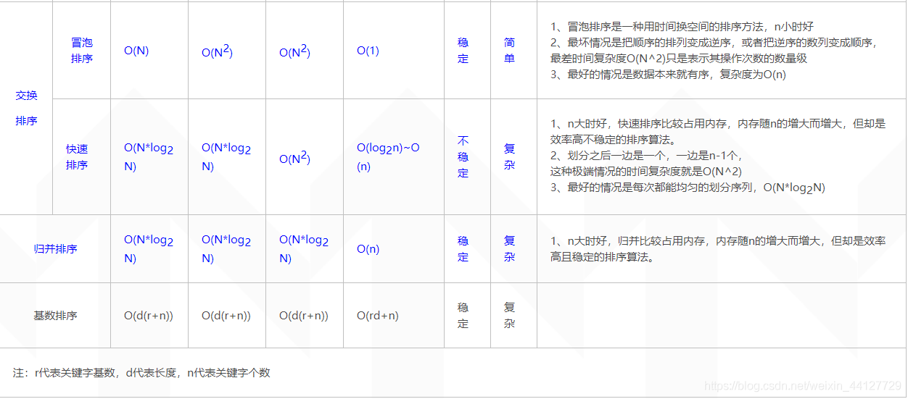
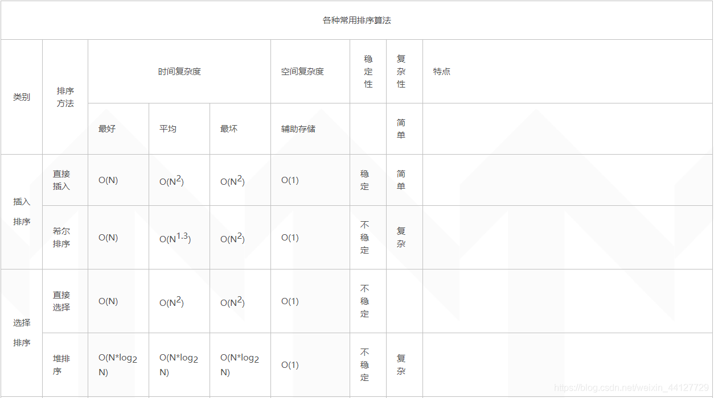

# 算法

## 排序算法




https://zhuanlan.zhihu.com/p/123048793
稳定： 直接插入，冒泡， 归并 

不稳定： 快排， 选择， 堆排， 希尔
### 冒泡排序

```c++
/// <summary>
/// 简单冒泡
/// </summary>
class solution {
public:
 vector<int> bubblesort(vector<int> nums) {
  int n = nums.size();
  for (int i = 0; i < n - 1; ++i) {
   for (int j = 0; j < n - i - 1; ++j) {
    if (nums[j] > nums[j + 1]) {
     swap(nums[j], nums[j + 1]);
    }
   }
  }
  return nums;
 }
 
};

/// <summary>
/// flag冒泡
/// </summary>
class Solution {
public:
 vector<int> bubblesort(vector<int> nums) {
  int n = nums.size();
  int i = n - 1;
  while (i) {
   int pos = 0;
   for (int j = 0; j < i; ++j) {
    if (nums[j] > nums[j + 1]) {
     swap(nums[j], nums[j + 1]);
     pos = j;
    }
   }
   i = pos;
  }
  return nums;
 }

};

/// <summary>
/// 双向冒泡
/// </summary>
class Solution {
public:
 vector<int> bubblesort(vector<int> nums) {
  int low = 0; int high = nums.size() - 1;
  while (low < high) {
   for (int j = low; j < high; ++j) {
    if (nums[j] > nums[j + 1]) {
     swap(nums[j], nums[j + 1]);
    }
   }
   high--;
   for (int j = high; j > low; j--) {
    if (nums[j] < nums[j - 1]) {
     swap(nums[j], nums[j - 1]);
    }
   }
   low++;
  }
  return nums;
 }
};
```

### 快速排序

```c++
/// <summary>
/// 快排
/// </summary>
class Solution {
public:
 void quicksort(vector<int>& nums, int left, int right) {
  if (left >= right) return;
  int i = left; int j = right;
  int key = nums[right];
  while (i < j) {
   while (i < j && nums[i] < key) {
    i++;
   }
   while (i < j && nums[j] >= key) {
    j--;
   }
   swap(nums[i], nums[j]);
  }
  swap(nums[i], nums[right]);
  int index = i;
  quicksort(nums, left, i - 1);
  quicksort(nums, i + 1, right);
 }
};

```

### 堆排序

堆排分三部分 ：
    构造最大堆
    排序
```c++
#include <iostream>
#include <algorithm>
using namespace std;
void max_heapify(int arr[], int start, int end) {
    //建立父节点指标和子节点指标
    int dad = start;
    int son = dad * 2 + 1;
    while (son <= end) { //若子节点指标在范围内才做比较
        if (son + 1 <= end && arr[son] < arr[son + 1]) //先比较两个子节点大小，选择最大的
            son++;
        if (arr[dad] > arr[son]) //如果父节点大于子节点代表调整完毕，直接跳出函数
            return;
        else { //否则交换父子内容再继续子节点和孙节点比较
            swap(arr[dad], arr[son]);
            dad = son;
            son = dad * 2 + 1;
        }
    }
}
void heap_sort(int arr[], int len) {
    //初始化，i从最后一个父节点往前开始建堆
    for (int i = len / 2 - 1; i >= 0; i--)
        max_heapify(arr, i, len - 1);
    //先将第一个元素和已经排好的元素前一位做交换，再重新调整(刚调整的元素之前的元素)，直到排序完毕
    for (int i = len - 1; i > 0; i--) {
        swap(arr[0], arr[i]);
        max_heapify(arr, 0, i - 1);
    }
}
int main() {
    int arr[] = { 3, 5, 3, 0, 8, 6, 1, 5, 8, 6, 2, 4, 9, 4, 7, 0, 1, 8, 9, 7, 3, 1, 2, 5, 9, 7, 4, 0, 2, 6 };
    int len = (int) sizeof(arr) / sizeof(*arr);
    heap_sort(arr, len);
    for (int i = 0; i < len; i++)
        cout << arr[i] << ' ';
    cout << endl;
    return 0;
}
```

### 归并排序

```c++
/// <summary>
/// 归并排序
/// </summary>
class Solution {
public:
 vector<int> mergesort(vector<int>& nums) {
  if (nums.size() <= 1) return nums;
  int left = 0; int right = nums.size() - 1;
  int len = nums.size();
  int mid = left + (right - left) / 2;
  vector<int> a(nums.begin(), nums.begin() + mid + 1);
  vector<int> b(nums.begin() + mid + 1, nums.end());
  return merge(mergesort(a), mergesort(b));
 }

 vector<int> merge(vector<int> a, vector<int> b) {
  int i = 0; int j = 0; int m = 0;
  vector<int> vec(a.size() + b.size());
  while (i < a.size() && j < b.size()) {
   if (a[i] <= b[j]) {
    vec[m++] = a[i++];
   }
   else {
    vec[m++] = b[j++];
   }
  }
  while (i < a.size()) {
   vec[m++] = a[i++];
  }
  while (j < b.size()) {
   vec[m++] = b[j++];
  }
  return vec;
 }
};
```


## 回溯算法（排列与组合）

1. 只要是含start的， **for循环中一定用到 i = start**

### 全排列

1. 只要是全排列，必须要有visited，维护每个元素的访问情况；
2. 含重复数字的应当注意以下几点
   1. 对nums进行排序
   2. 对相邻重复数字进行判断，如1112，只对三个1是按顺序的1112进行记录
3. 不需要start参数

#### 不含重复数字

leetcode 46 https://leetcode-cn.com/problems/permutations/
```c++
class Solution {
public:
    vector<vector<int>> res;
    vector<vector<int>> permute(vector<int>& nums) {
        vector<int> path;
        vector<bool> visited(nums.size(), false);
        backtrack(nums, path, visited);
        return res;
    }

    void backtrack(vector<int>& nums, vector<int>& path, vector<bool>& visited) {
        if(path.size() == nums.size()) {
            res.push_back(path);
            return;
        }

        for(int i = 0; i < nums.size(); ++i) {
            if(visited[i]) continue;
            path.push_back(nums[i]);
            visited[i] = true;
            backtrack(nums, path, visited);
            path.pop_back();
            visited[i] = false;
        }
    }
};
```

#### 含重复数字

leetcode 47 https://leetcode-cn.com/problems/permutations-ii/submissions/
```c++
class Solution {
public:
    vector<vector<int>> res;
    vector<vector<int>> permuteUnique(vector<int>& nums) {
        vector<int> path;
        vector<bool> visited(nums.size(), false);
        sort(nums.begin(), nums.end());
        backtrack(nums, path, visited);
        return res;
    }   

    void backtrack(vector<int>& nums, vector<int>& path, vector<bool>& visited) {
        if(path.size() == nums.size()) {
            res.push_back(path);
            return;
        }

        for(int i = 0; i < nums.size(); ++i) {
            if(visited[i]) continue;
            if(i > 0 && nums[i] == nums[i - 1] && !visited[i - 1]) continue;
            path.push_back(nums[i]);
            visited[i] = true;
            backtrack(nums, path, visited);
            path.pop_back();
            visited[i] = false;
        }
    }
};
```

### 组合

1. 组合一般都需要start参数
2. 不需要visited的原因在于，start参数能起到排除已使用元素的作用
3. nums[i] == nums[i - 1] 与 start= i + 1一起，对元素的顺序进行了限制；如1112，只有第一个顺序的1112会被记录
#### 无重复数的数组子集

leetcode 78 https://leetcode-cn.com/problems/subsets/submissions/
```c++
class Solution {
public:
    vector<vector<int>> res;
    vector<vector<int>> subsets(vector<int>& nums) {
        vector<int> path;
        for(int k = 0; k <= nums.size(); ++k) {
            backtrack(nums, path, k, 0);
        }
        return res;
    }

    void backtrack(vector<int>& nums, vector<int>& path, int k, int start) {
        if(path.size() == k) {
            res.push_back(path);
            return;
        }
        for(int i = start; i < nums.size(); ++i) {
            path.push_back(nums[i]);
            backtrack(nums, path, k, i + 1);
            path.pop_back();
        }
    }
};
```

#### 有重复数的数组子集

leetcode 79 https://leetcode-cn.com/problems/subsets-ii/
```c++
class Solution {
public:
    vector<vector<int>> res;
    vector<vector<int>> subsetsWithDup(vector<int>& nums) {
        vector<int> path;
        sort(nums.begin(), nums.end());
        for(int k = 0; k <= nums.size(); ++k) {
            backtrack(nums, path, k, 0);
        }
        return res;
    }

    void backtrack(vector<int>& nums, vector<int>& path, int k, int start) {
        if(path.size() == k) {
            res.push_back(path);
            return;
        }
        for(int i = start; i < nums.size(); ++i) {
            if(i > start && nums[i] == nums[i - 1]) continue;
            path.push_back(nums[i]);
            backtrack(nums, path, k, i + 1);
            path.pop_back();
        }
    }
};
```

#### 无重复数的target

leetcode 39 https://leetcode-cn.com/problems/combination-sum/
```c++
class Solution {
public:
    vector<vector<int>> res;
    vector<vector<int>> combinationSum(vector<int>& candidates, int target) {
        vector<int> path;
        backtrack(candidates, path, target, 0);
        return res;
    }

    void backtrack(vector<int>& candidates, vector<int>& path, int target, int start) {
        if(target == 0) {
            res.push_back(path);
            return;
        }
        if(target < 0) return;
        for(int i = start; i < candidates.size(); ++i) {
            path.push_back(candidates[i]);
            target -= candidates[i];
            backtrack(candidates, path, target, i);
            path.pop_back();
            target += candidates[i];
        }
    }
};
```

#### 有重复数的target

leetcode 40 https://leetcode-cn.com/problems/combination-sum-ii/
```c++
class Solution {
public:
    vector<vector<int>> res;
    vector<vector<int>> combinationSum2(vector<int>& candidates, int target) {
        vector<int> path;
        sort(candidates.begin(), candidates.end());
        backtrack(candidates, path, target, 0);
        return res;
    }

    void backtrack(vector<int>& candidates, vector<int>& path, int target, int start) {
        if(target == 0) {
            res.push_back(path);
            return;
        }
        if(target < 0) return;
        for(int i = start; i < candidates.size(); ++i) {
            if(i > start && candidates[i] == candidates[i - 1]) continue;
            path.push_back(candidates[i]);
            target -= candidates[i];
            backtrack(candidates, path, target, i + 1);
            path.pop_back();
            target += candidates[i];
        }
    }
};
```

## 背包问题

### 01背包问题

1. 01背包问题要用二维的dp来做
2. 用一维dp倒序的原因：这是01背包问题，只有倒序才能够保证，nums[i]仅用了一次！

经典背包问题
```c++
    vector<int> weight = {1, 2, 3, 4, 5};
    vector<int> value = {1, 3, 4, 5, 6};
    int w = 8;
    int n = 5;
    vector<int> dp(9);
    dp[0] = 0;
    for(int i = 0; i < 5; ++i) {
        for(int j = 8; j >= weight[i]; --j) {
                dp[j] = max(dp[j], dp[j - weight[i]] + value[i]);
            }
    }
    cout << dp[8] << endl;
```

416 分割等和子集 https://leetcode-cn.com/problems/partition-equal-subset-sum/submissions/

```c++
class Solution {
public:
    bool canPartition(vector<int>& nums) {
        int sum = 0;
        int len = nums.size();
        for(auto num : nums) {
            sum += num;
        }
        if(sum % 2 != 0) {
            return false;
        }
        int target = sum / 2;
        vector<vector<bool>> dp(len + 1, vector<bool> (target + 1));
        for(int i = 0; i <= len; ++i) {
            dp[i][0] = true;
        }
        for(int j = 1; j <= target; ++j) {
            dp[0][j] = false;
        }
        for(int i = 1; i <= len; ++i) {
            for(int j = 1; j <= target; ++j) {
                if(j >= nums[i - 1]) {
                    dp[i][j] = dp[i - 1][j] || dp[i - 1][j - nums[i - 1]];
                }
                else {
                    dp[i][j] = dp[i - 1][j];
                }
            }
        }
        return dp[len][target];
    }
};
```

494 目标和 https://leetcode-cn.com/problems/target-sum/
```c++
class Solution {
public:
    int findTargetSumWays(vector<int>& nums, int target) {
        int sum = 0;
        int len = nums.size();
        for(int num : nums) {
            sum += num;
        }
        int need2 = sum - target;
        if(need2 < 0 || need2 % 2 != 0) return 0;
        int need = need2 / 2;
        vector<int> dp(need + 1);
        dp[0] = 1;
        for(auto num : nums) {
            for(int j = need; j >= num; j--) {
                dp[j] += dp[j - num];
            }
        }
        return dp[need];
    }
};
```

474 一和零 
```c++
class Solution {
public:
    int findMaxForm(vector<string>& strs, int m, int n) {
        int l = strs.size();
        vector<vector<int>> help(l + 1, vector<int>(2));
        for(int i = 0; i < l; ++i) {
            int zero = 0;
            int one = 0;
            string tmp = strs[i];
            for(auto c : tmp) {
                if(c == '0') {
                    zero++;
                }
                else if(c == '1') {
                    one++;
                }
            }
            help[i][0] = zero;
            help[i][1] = one;
        }
        vector<vector<int>> dp(m + 1, vector<int>(n + 1));
        for(int i = 0; i < l; ++i) {
            int zero = help[i][0];
            int one = help[i][1];
            for(int j = m; j >= zero; --j) {
                for(int k = n; k >= one; --k){
                    dp[j][k] = max(dp[j][k], dp[j - zero][k - one] + 1);
                }
            }
        }
        return dp[m][n];
    }
};
```

### 完全背包问题

1. 关于组合与排序的不同
2. 正序的一维dp是完全背包问题的特点

322 零钱兑换 https://leetcode-cn.com/problems/coin-change/
```c++
class Solution {
public:
    int coinChange(vector<int>& coins, int amount) {
        vector<int> dp(amount + 1, amount + 1);
        dp[0] = 0;
        for(auto& coin : coins) {
            for(int i = 1; i <= amount; ++i) {
                if(i - coin >= 0) {
                    dp[i] = min(dp[i], dp[i - coin] + 1);
                }
            }
        }
        return dp[amount] == amount + 1 ? -1 : dp[amount];
    }
};
```

518 零钱兑换II https://leetcode-cn.com/problems/coin-change-2/
70 爬楼梯 https://leetcode-cn.com/problems/climbing-stairs/
- 两种题目的不同点在于，爬楼梯是求排列， 而零钱兑换求的是组合数；
- 因此爬楼梯的话，内循环是提供的数组；而零钱兑换外循环才是提供的数组

## 拓扑排序（图）

### 入度表与邻接表

1. 重点在于**入度表，邻接表与出度表**的定义
2. 邻接表：索引-内容的关系，索引能够解放内容里的入度！
leetcode 207 https://leetcode-cn.com/problems/course-schedule/
```c++
class Solution {
public:
    bool canFinish(int numCourses, vector<vector<int>>& prerequisites) {
        vector<int> indegree(numCourses);
        vector<vector<int>> adjacency(numCourses, vector<int>());
        queue<int> zero;
        int nums = numCourses;
        for(int i = 0; i < prerequisites.size(); ++i) {
            int a = prerequisites[i][0];
            int b = prerequisites[i][1];
            indegree[a]++;
            adjacency[b].push_back(a);
        }
        for(int i = 0; i < numCourses; ++i) {
            if(indegree[i] == 0) {
                zero.push(i);
                nums--;
            }
        }
        while(!zero.empty()) {
            int pre = zero.front();
            zero.pop();
            for(auto course : adjacency[pre]) {
                indegree[course]--;
                if(indegree[course] == 0) {
                    nums--;
                    zero.push(course);
                }
            }
        }
        return nums == 0 ? true : false;
    }
};
```

leetcode 210 https://leetcode-cn.com/problems/course-schedule-ii/

```c++
class Solution {
public:
    vector<int> findOrder(int numCourses, vector<vector<int>>& prerequisites) {
        vector<int> indegree(numCourses);
        vector<vector<int>> adjacency(numCourses, vector<int>());
        queue<int> zero;
        vector<int> res;
        int nums = numCourses;
        for(int i = 0; i < prerequisites.size(); ++i) {
            int a = prerequisites[i][0];
            int b = prerequisites[i][1];
            indegree[a]++;
            adjacency[b].push_back(a);
        }
        for(int i = 0; i < numCourses; ++i) {
            if(indegree[i] == 0) {
                zero.push(i);
                res.push_back(i);
                nums--;
            }
        }
        while(!zero.empty()) {
            int pre = zero.front();
            zero.pop();
            for(auto course : adjacency[pre]) {
                if(--indegree[course] == 0) {
                    zero.push(course);
                    res.push_back(course);
                    nums--;
                }
            }
        }
        if(nums != 0) return {};
        return res;
    }
};
```

## 树

### 判断二叉树性质

1. 对于判断某节点的性质来说，除了对当前节点进行判断，一般还要对当前节点的左右子树进行判断
2. 类似：树的子结构JO26

## Dijkstra

### 算法详解

- https://blog.csdn.net/qq_35644234/article/details/60870719

算法特点：

迪科斯彻算法使用了广度优先搜索解决赋权有向图或者无向图的单源最短路径问题，算法最终得到一个最短路径树。该算法常用于路由算法或者作为其他图算法的一个子模块。

算法的思路

Dijkstra算法采用的是一种贪心的策略，声明一个数组dis来保存源点到各个顶点的最短距离和一个保存已经找到了最短路径的顶点的集合：T，初始时，原点 s 的路径权重被赋为 0 （dis[s] = 0）。若对于顶点 s 存在能直接到达的边（s,m），则把dis[m]设为w（s, m）,同时把所有其他（s不能直接到达的）顶点的路径长度设为无穷大。初始时，集合T只有顶点s。 
然后，从dis数组选择最小值，则该值就是源点s到该值对应的顶点的最短路径，并且把该点加入到T中，OK，此时完成一个顶点，
然后，我们需要看看新加入的顶点是否可以到达其他顶点并且看看通过该顶点到达其他点的路径长度是否比源点直接到达短，如果是，那么就替换这些顶点在dis中的值。 
然后，又从dis中找出最小值，重复上述动作，直到T中包含了图的所有顶点。

### 例题

万圣节的早上，小Hi和小Ho在经历了一个小时的争论后，终于决定了如何度过这样有意义的一天——他们决定去闯鬼屋！

在鬼屋门口排上了若干小时的队伍之后，刚刚进入鬼屋的小Hi和小Ho都颇饥饿，于是他们决定利用进门前领到的地图，找到一条通往终点的最短路径。

鬼屋中一共有N个地点，分别编号为1..N，这N个地点之间互相有一些道路连通，两个地点之间可能有多条道路连通，但是并不存在一条两端都是同一个地点的道路。那么小Hi和小Ho至少要走多少路程才能够走出鬼屋去吃东西呢？

输入

每个测试点（输入文件）有且仅有一组测试数据。

在一组测试数据中：

第1行为4个整数N、M、S、T，分别表示鬼屋中地点的个数和道路的条数，入口（也是一个地点）的编号，出口（同样也是一个地点）的编号。

接下来的M行，每行描述一条道路：其中的第i行为三个整数u_i, v_i, length_i，表明在编号为u_i的地点和编号为v_i的地点之间有一条长度为length_i的道路。

对于100%的数据，满足N<=10^3，M<=10^4, 1 <= length_i <= 10^3, 1 <= S, T <= N, 且S不等于T。

对于100%的数据，满足小Hi和小Ho总是有办法从入口通过地图上标注出来的道路到达出口。

输出

对于每组测试数据，输出一个整数Ans，表示那么小Hi和小Ho为了走出鬼屋至少要走的路程

样例输入

5 23 5 4
1 2 708
2 3 112
3 4 721
4 5 339
5 4 960
1 5 849
2 5 98
1 4 99
2 4 25
2 1 200
3 1 146
3 2 106
1 4 860
4 1 795
5 4 479
5 4 280
3 4 341
1 4 622
4 2 362
2 3 415
4 1 904
2 1 716
2 5 575
样例输出

123
### 解答

```c++
const int UNREACHABLE = INT_MAX;
class solution
{
public:
	int dijkstra(vector<vector<int>>& topo, int N, int S, int T)
	{
		vector<vector<int>> graph(N, vector<int>(N, UNREACHABLE));
		for (int i = 0; i < graph.size(); ++i)
		{
			graph[i][i] = 0;
		}
		for (int i = 0; i < topo.size(); ++i)
		{
			int s = topo[i][0] - 1; int t = topo[i][1] - 1; int cost = topo[i][2];
			if (graph[s][t] == UNREACHABLE || graph[s][t] > cost)
			{
				graph[s][t] = cost;
			}
			if (graph[t][s] == UNREACHABLE || graph[t][s] > cost)
			{
				graph[t][s] = cost;
			}
		}
		int index = S - 1;
		vector<int> start = graph[index];
		int vertexs = N;
		unordered_set<int> rest_vertexs;

		for (int i = 0; i < vertexs; ++i)
		{
			if (i != index) rest_vertexs.insert(i);
		}
		int min_vertex;

		while (!rest_vertexs.empty())
		{
			min_vertex = *rest_vertexs.begin();
			for (int vertex : rest_vertexs)
			{
				if (start[vertex] != UNREACHABLE && start[vertex] < start[min_vertex])
				{
					min_vertex = vertex;//找出离起点S - 1最近的点
				}
			}
			rest_vertexs.erase(min_vertex);

			for (int vertex : rest_vertexs)
			{
				if (graph[vertex][min_vertex] != UNREACHABLE && start[min_vertex] != UNREACHABLE)
				{
					if (start[vertex] == UNREACHABLE)
					{
						start[vertex] = graph[vertex][min_vertex] + start[min_vertex];
                        //此处graph[vertex][min_vertex] = graph[min_vertex][vertex]
					}
					else if (start[vertex] > graph[vertex][min_vertex] + start[min_vertex])
					{
						start[vertex] = graph[vertex][min_vertex] + start[min_vertex];
					}
				}
			}

		}
		return start[T - 1];

	}
	
};
```
以下为自己写的
```c++
const int x = INT_MAX;
class solution {
    int dijkstra(vector<vector<int>>& topo, int n, int source, int target) {
        vector<vector<int>> graph(n, vector<int> (n, x));
        for(int i = 0; i < n; ++i) {
            graph[i][i] = 0;
        }
        for(int i = 0; i < topo.size(); ++i) {
            int s = topo[i][0] - 1;
            int t = topo[i][1] - 1;
            int cost = topo[i][2];
            graph[s][t] = min(graph[s][t], cost);
            graph[t][s] = min(graph[s][t], cost);
        }
        unordered_set<int> set;
        int index = source - 1;
        vector<int> start = graph[source];
        for(int i = 0; i < n; ++i) {
            if(i != index) {
                set.insert(i);
            }
        }
        while(!set.empty()) {
            int min_vertex = *set.begin();
            for(int vertex : set) {
                if(start[vertex] < start[min_vertex]) {
                    min_vertex = vertex;
                }
            }
            set.erase(min_vertex);
            for(int vertex : set) {
                start[vertex] = min(start[vertex], start[min_vertex] + graph[min_vertex][vertex]);
            }
        }
        return start[target - 1];
    }
};
```

## 最小生成树

### 例题
最近，小Hi很喜欢玩的一款游戏模拟城市开放出了新Mod，在这个Mod中，玩家可以拥有不止一个城市了！

但是，问题也接踵而来——小Hi现在手上拥有N座城市，且已知这N座城市中任意两座城市之间建造道路所需要的费用，小Hi希望知道，最少花费多少就可以使得任意两座城市都可以通过所建造的道路互相到达（假设有A、B、C三座城市，只需要在AB之间和BC之间建造道路，那么AC之间也是可以通过这两条道路连通的）

输入

每个测试点（输入文件）有且仅有一组测试数据。

在一组测试数据中：

第1行为1个整数N，表示小Hi拥有的城市数量。

接下来的N行，为一个N*N的矩阵A，描述任意两座城市之间建造道路所需要的费用，其中第i行第j个数为Aij，表示第i座城市和第j座城市之间建造道路所需要的费用。

对于100%的数据，满足N<=10^3，对于任意i，满足Aii=0，对于任意i, j满足Aij=Aji, 0<Aij<10^4.

输出

对于每组测试数据，输出1个整数Ans，表示为了使任意两座城市都可以通过所建造的道路互相到达至少需要的建造费用。

样例输入

5
0 1005 6963 392 1182 
1005 0 1599 4213 1451 
6963 1599 0 9780 2789 
392 4213 9780 0 5236 
1182 1451 2789 5236 0 
样例输出

4178

### 解答
```c++
class Solution {
public:
    int mintree(vector<vector<int>>& graph)
    {
        if (graph.empty() || graph.size() != graph[0].size()) return 0;
        int vertexs = graph.size();
        vector<int> start = graph[0];
        unordered_set<int> rest_vertex;
        for (int i = 0; i < vertexs; ++i)
        {
            if (i != 0) rest_vertex.insert(i);
        }
        int min_vertex;
        while (!rest_vertex.empty())
        {
            min_vertex = *rest_vertex.begin();
            for (int vertex : rest_vertex)
            {
                if (start[vertex] < start[min_vertex])
                {
                    min_vertex = vertex;
                }
            }
            rest_vertex.erase(min_vertex);

            for (int vertex : rest_vertex)
            {
                if (graph[min_vertex][vertex] < start[vertex])
                {
                    start[vertex] = graph[min_vertex][vertex];
                }
            }
        }
        int res = 0;
        for (int vertex : start)
        {
            res += vertex;
        }
        return res;
    }
};
```

## 大根堆与小根堆

- priority_queue<int, vector< int>, less< int>> maxheap;
- priority_queue<int, vector< int>, greater< int>> minheap;
- STL中操作有**top,push,pop***

## Dijkstra算法与SPFA算法

【最短路算法】Dijkstra+heap和SPFA的区别
单源最短路问题(SSSP)常用的算法有Dijkstra，Bellman-Ford，这两个算法进行优化，就有了Dijkstra+heap、SPFA(Shortest Path Faster Algorithm)算法。这两个算法写起来非常相似。下面就从他们的算法思路、写法和适用场景上进行对比分析。如果对最短路算法不太了解，可先看一下相关ppt:最短路

为了解释得简单点，以及让对比更加明显，我就省略了部分细节。

我们先看优化前的：

**O(V2+E)的Dijkstra**
n-1次循环

-->找到未标记的d最小的点

-->标记，松弛它的边

**O(VE)的Bellman-Ford**
n-1次循环

-->对所有边松弛

还能再松弛则有负环

Dijkstra是每次确定了到一个点的最短距离，再用该点更新到其它点的距离。**不能处理有负边的图。**
Bellman-Ford是每次对所有边松弛。可以计算出有负边无负环的最短路，可以判断是否存在负环。
接下来再看优化后的：

**O((V+E)lgV)的Dijkstra+heap优化**
用STL中的优先队列实现堆：
while(优先队列非空)

-->队头出队，松弛它的边

-->松弛了的<新距离,点>入队

删了部分定义和初始化的代码：

typedef pair<int,int> PII;
priority_queue<PII,vector<PII>,greater<PII> > q;
...
while(!q.empty()){  // O(V) 加上count<n可以优化一点点
    int w=q.top().first, u=q.top().second;
    q.pop();   // O(lgV)
    if(b[u])continue; b[u]=true;
    //++count;
    for(int i=head[u];i;i=e[i].next){ // Sum -> O(E)
        int v=e[i].to;
        if(d[u]+e[i].w<d[v]){
            d[v]=d[u]+e[i].w;
            q.push(PII(d[v],v));  // O(lgV)
        }
    }
}
**O(kE)O(VE)的SPFA**
while(队非空)

-->队头出队，松弛它的边

-->松弛了且不在队内的点入队

while(!q.empty()){
    int u=q.front(); q.pop();
    b[u]=false;
    for(int i=head[u];i;i=e[i].next){
        int v=e[i].to;
        if(d[u]+e[i].w<d[v]){
            d[v]=d[u]+e[i].w;
            if(!b[v])b[v]=true,q.push(v);
        }
    }
}
算法思路对比
Dijkstra+heap是用小根堆，每次取出d最小的点，来更新距离，那么这个点来说，最小距离就是当前的d。
SPFA是用双端队列，每次取出队头，来更新距离，它之后可能还会入队。它是一种动态逼近法，因为每次松弛距离都会减小，所以松弛一定会有结束的。如果一个点入队超过n次就是存在负环。
复杂度分析对比
Dijkstra+heap

因为是堆，取队头需要O(lgV)。
松弛边时，因为点的d改变了，所以点v需要以新距离重新入堆，O(lgV)，总共O(ElgV)。
因此总的是O((V+E)lgV)
SPFA

论文证明也不严格。复杂度不太好分析。
总的是O(kE)。k大概为2。
复杂度应该是 O(VE)。
适用场景
如果是稠密图，Dijkstra+heap比SPFA快。稀疏图则SPFA更快。SPFA可以有SLF和LLL两种优化，SLF就是d比队头小就插入队头，否则插入队尾。

另外，Dijkstra和Prim也很相似，它们的区别主要是d的含义，前者是到s的临时最短距离，后者是到树的临时最短距离，相同点是，每次找d最小的更新其它点的距离。
<https://www.cnblogs.com/flipped/p/6830073.html>

## 输入输出

对于每组测试用例，输出一行排序过的字符串，每个字符串通过空格隔开对于每组测试用例，输出一行排序过的字符串，每个字符串通过空格隔开

a c bb
f dddd
nowcoder

```c++
#include<iostream>
#include<vector>
#include<algorithm>
#include<string>
#include<sstream>
using namespace std;
int main(){
    string str;
    vector<string> res;
    while(getline(cin, str)) {
        istringstream ss(str);
        string tmp;
        while(getline(ss, tmp, ' ')) {
            res.push_back(tmp);
        }
        sort(res.begin(), res.end());
        for(string s : res) {
            cout << s << ' ';
        }
        cout << endl;
        res.clear();
    }
}
```

## 创建三个线程,分别打印 a,b,c. 无论程序运行多少次、如何运行，都能使整个程序依次打印 a b c a b c a b c 

1. 信号量
```c++
#include<stdio.h>
#include<stdlib.h>
#include<string.h>
#include<assert.h>
#include<unistd.h>

#include<pthread.h>
#include<sys/sem.h>
#include<semaphore.h>


#define MAX 3
sem_t sem1;
sem_t sem2;
sem_t sem3;
void *fun1(void *arg)
{   
    while(1)   
    {        
        sem_wait(&sem1);
        printf("a\n");     
        sem_post(&sem2); 
    }
}

void *fun2(void *arg)
{    
    while(1) 
    {       
        sem_wait(&sem2);
        printf("b\n"); 
        sem_post(&sem3);
    }
}
void *fun3(void *arg)
{   
    while(1)  
    {      
        sem_wait(&sem3);    
        printf("c\n");   
        sem_post(&sem1); 
    }
}
int main()
{   
    pthread_t id[MAX];
    pthread_create(&id[0],NULL,fun1,NULL); 
    pthread_create(&id[1],NULL,fun2,NULL);
    pthread_create(&id[2],NULL,fun3,NULL); 
    sem_init(&sem1,0,1);  
    sem_init(&sem2,0,0);   
    sem_init(&sem3,0,0);  
    int i = 0;   
    for (;i < MAX;i++)  
    {       
        pthread_join(id[i],NULL);  
    }   
    sem_destroy(&sem1);   
    sem_destroy(&sem2);  
    sem_destroy(&sem3); 
    exit(0);
}
```

2. 条件变量


# 海量数据处理

## 两个文件共同的url

- 给定a、b两个文件，各存放50亿个url，每个url各占64字节，内存限制是4GB。找出a、b文件共同的url

- 解答

可以估计每个文件的大小为5Gx64B=320GB，远远大于内存限制的4GB。所以不可能将其完全加载到内存中处理。考虑分治法

1. 遍历文件a，对每个url求取hash(url)%1024，然后根据所取得的值将url分别存储到1024个小文件中，这样每个小文件大约为300MB
   1. 为什么要做hash？每个文件中可能包含相同的url，同一文件中相同的url可能分布在同一文件的不同位置。不同文件中相同的url可能也分布在不同位置。hash可以保证相同url映射到同一个小文件中
   2. 为什么是1024个小文件？这里1024应该不是唯一值，分成1024个小文件，每个只有300多M，在后面查找过程中，将小文件中的url存储set时不会超过4G的限制
2. 遍历文件b，采取和a相同的方式，将url分别存储到1024个小文件中。这样处理后，所有可能相同的url都在对应的小文件[(a0,b0),(a1,b1),...,(a1023,b1023)]中，不对应的小文件不可能有相同的url（也就是hash的目的）
3. 求出1024对小文件中相同的url：把其中一个小文件的url存储到hash_set中。然后遍历另一个小文件的每个url，看其是否在刚才构建的hash_set中，如果是，那么就是共同的url


## 按频率排序多个文件中的query记录

- 有10个文件，每个文件1GB，每个文件的每一行存放的都是用户的query，每个文件中的query都有可能重复。请按照query的频度排序

解答

1）方案一

顺序读取10个文件，按照hash(query)%10的结果将query写入到另外10个文件中，记为[a0,a1,...,a9]，这样新生成的文件每个大小约为1GB

找到一台内存在2GB左右的机器，依次对[a0,a1,...,a9]用hash_map(query,query_count)来统计每个query出现的次数，并利用快速/堆/归并排序按照出现次数进行排序。将排序好的query和对应的query_count输出到文件中。这样得到了10个排好序的文件，记为[b0,b1,...,b9]。对这10个文件进行归并排序（可利用败者树进行多路归并）

2）方案二

一般query的总量是有限的，只是重复的次数比较多，若所有的query一次性就可以加入到内存中，就可以采用Trie树/hash_map等直接来统计每个query出现的次数，然后按出现次数做快速/堆/归并排序

##  找出文件中频率最高的100个词

- 有一个1GB大小的一个文件，里面每一行是一个词，词的大小不超过16字节，内存限制大小是1MB。返回频数最高的100个词

解答

采用分治的思想

顺序读文件，对于每个词x，取hash(x)%5000，然后按照该值存到5000个小文件中，记为[x0,x1,...,x4999]。这样每个文件为200KB左右（如果文件里面全是同一个词？）。如果其中有的文件超过了1MB，还可以按照类似的方法继续往下分，直到分解得到的小文件的大小都不超过1MB

对每个小文件，统计每个文件中出现的词以及相应的频度（可以采用Trie树或hash_map等），并分别取出出现频度最大的100个词（可以用含100个结点的最小堆），并把这100个词及相应的频率存入文件，这样又得到了5000个有序(逆序)文件（每个文件有100个词）。下一步就是把这5000个文件进行归并排序（可利用败者树采用多路归并）

## 海量日志中提取访问百度次数最多的IP

- 海量日志数据，提取出某日访问百度次数最多的那个IP，假设当前机器可用内存较小，无法一次性读入日志文件

解答

采用分治的思想

使用hash(ip)%n将日志记录分到n个小文件中，在每个小文件中使用hash_map的方法统计每个ip的频度，再利用堆排序按频度对ip进行排序：

1. IP地址最多有2^32=4G种可能的取值，按照IP地址的hash(IP)%1024值，将海量日志存储到1024个小文件中。每个小文件最多包含4M个IP地址
2. 对于每个小文件，可以构建一个IP作为key，出现次数作为value的hash_map，并记录当前出现次数最多的1个IP地址
3. 有了1024个小文件中的出现次数最多的IP，就可以得到总体上出现次数最多的IP

## 100亿个整数的中位数

- 100亿个整数，内存足够，如何找到中位数？内存不足，如何找到中位数？

解答

1. **内存足够时**：采用快排，找到第n大的数。
    • 随机选取一个数，将比它小的元素放在它左边，比它大的元素放在右边 
    • 如果它恰好在中位数的位置，那么它就是中位数，直接返回 
    • 如果小于它的数超过一半，那么中位数一定在左半边，递归到左边处理（还是第几大） 
    • 否则中位数一定在右半边，根据左半边的元素个数计算出中位数是右半边的第几大（重新算第几大），然后递归到右半边处理
2. 内存不足时：分桶法
    把所有数划分到各个小区间，把每个数映射到对应的区间里，对每个区间中数的个数进行计数，数一遍各个区间，看看中位数落在哪个区间，若够小，使用基于内存的算法，否则继续划分。
    比如数是32位的，根据每个整数的二进制前5位，划分为32个桶，把数放进对应桶中。如果该桶放不下，继续划分，直至内存可以放下为止。统计每个桶中元素个数，算出中位数一定出现在哪个桶中，而且计算出是该桶中的第几大。

## 位图

### 统计不同号码的个数

已知某文件内包含一些电话号码，每个号码为8位数字，统计不同号码的个数

解答

8位数字表示的最大数为99999999，可以理解为从[0,99999999]的数字，用位图解决，则每个数字对应一个bit，只需要约12MB，依次读入每个号码，然后将位图相应位置设为1，最后统计位图中1的位数的个数   10^8 / (8) byte

### 查找某个数是否在40亿个数当中

给40亿个不重复的unsigned int的整数，没排过序，然后再给一个数，如何快速判断这个数是否在40亿个数当中？

解答

- 方法1 ： 看到问题的想法是采用bitmap：**1个字节可以表示8个整数**是否出现的情况（出现则对应的位置1，否则为0），那么表示40亿个整数的情况需要40亿/8=5亿，约500M的空间.空间复杂度是O(n)+O(1);

这个问题在《编程珠玑》里有很好的描述，大家可以参考下面的思路，探讨一下：
- 方法二：又因为2^32为40亿多，所以给定一个数可能在，也可能不在其中；
这里我们把40亿个数中的每一个用32位的二进制来表示
假设这40亿个数开始放在一个文件中。

然后将这40亿个数分成两类:
  1.最高位为0
  2.最高位为1
并将这两类分别写入到两个文件中，其中一个文件中数的个数<=20亿，而另一个>=20亿（这相当于折半了）；

与要查找的数的最高位比较并接着进入相应的文件再查找

再然后把这个文件为又分成两类:
  1.次最高位为0
  2.次最高位为1
并将这两类分别写入到两个文件中，其中一个文件中数的个数<=10亿，而另一个>=10亿（这相当于折半了）；
与要查找的数的次最高位比较并接着进入相应的文件再查找。
.......
以此类推，就可以找到了,而且时间复杂度为O(logn)

### 2.5亿整数中只出现一次的整数

在2.5亿个整数中找出只出现一次的整数，内存不足以容纳这2.5亿个整数

解答

方案一：采用2bit位图（每个数分配2bit，00表示不存在，01表示出现一次，10表示多次，11无意义），共需内存(2^32)*2bit=1GB内存，然后依次扫描2.5亿个整数，查看Bitmap中对应位，如果是00则变为01，01变为10，10保持不变。扫描结束后，查看bitmap，把对应位是01的整数输出

方案二：也可以采用Hash映射的方法，划分成多个小文件。然后在小文件中利用hash_map找出不重复的整数

### 1000瓶毒药，几只老鼠能一次测出哪个有毒

转换为二进制形式
      2的10次方 = 1024 > 1000 即1000 都可以表示成10位二进制的形式
      则取10个碗，对应10位
     
      1 2 3 4 5 6 7 8 9 10
      0 0 0 0 0 0 0 0 0 0
      对应第一瓶酒，则在第10个碗中加一滴（因为1的二进制为0000000001）
      对应第1000瓶, 则在1,2,3,4,5,7碗中加一滴（1111101000）

      然后让老鼠喝酒，取死老鼠的二进制（死为1）

      若第一瓶有毒 其它无毒，则只有第10个老鼠死
      若第15瓶有毒           78910碗对应的老鼠都死

      依次类推

## 布隆过滤器

布隆过滤器可视为对位图的扩展

如果需要判断一个元素是否在一个集合中，位图的做法是申请一个N位（N为集合中最大整数）的数组，然后每一位对应一个特定整数

布隆过滤器的基本原理是位数组与Hash函数联合使用。具体而言，布隆过滤器是一个包含了m位的位数组，数组的每一位都初始化为0。然后定义k个不同的Hash函数，每个Hash函数都可以将集合中的元素映射到位数组中的某一位

**插入**：当向集合中插入一个元素时，根据k个Hash函数可以得到位数组中的k个位，将这些位全部设置为1

**查询**：当要查询某个元素是否属于集合时，就使用k个哈希函数得到此元素对应的k个位，如果所有点都是1，那么判断为元素在集合内（注意，这种情况下只能说明元素可能在集合内，并不一定），如果有0，则元素不在集合内（因此，其实布隆过滤器的思想是“宁可误杀也不放过”，适用于黑名单网站的查询）


插入元素时，对任意一个元素x，第i个哈希函数映射的位置hi(x)会被置为1（1<=i<=k）

布隆过滤器的位数m通常要比集合中的最大元素小的多，可见，布隆过滤器是一种空间效率和时间效率很高的随机数据结构，但这种高效是有一定代价：在判断一个元素是否属于某个集合时，有可能会把不属于这个集合的元素误认为属于这个集合。因此，布隆过滤器不适合那些“零错误”应用场合，而在能容忍低错误率的应用场合下，布隆过滤器通过极少的错误换取了存储空间的极大节省


# 面试算法题记录

1. 求数组中比左边元素都大同时比右边元素都小的元素，返回这些元素的索引。要求时间复杂度O(N)
```
输入：[2, 3, 1, 8, 9, 20, 12]
输出：3, 4
解释：数组中 8, 9 满足题目要求，他们的索引分别是 3、4
```

解答： 遍历形成left_max 与 right_max数组，保存当前位置最左侧与最右侧的最大值；然后将当前值与之对比，满足条件则ok
```c++
#include <iostream>
#include <vector>
#include <climits>
using namespace std;

vector<int> find(vector<int> nums) {
    vector<int> res;
    int n = nums.size();
    vector<int> left_max(n, INT_MIN);
    vector<int> right_min(n, INT_MAX);
    for (int i = 1; i < n; i++) {
        left_max[i] = max(left_max[i - 1], nums[i - 1]);
    }
    for (int i = n - 2; i >= 0; i--) {
        right_min[i] = min(right_min[i + 1], nums[i + 1]);
    }
    for (int i = 0; i < n; i++) {
        if (left_max[i] < nums[i] && nums[i] < right_min[i]) {
            res.push_back(i);
        }
    }
    return res;
}
int main()
{
    vector<int> arr = {2,3,1,8,9,20,12};
    auto res = find(arr);
    for (int i = 0; i < res.size(); i++)
    {
        cout << res[i] << ' ';
    }
}
```

2. 36进制加法

36进制由 0 - 9 ，a - z，共 36 个字符表示。
要求按照加法规则计算出任意两个 36 进制正整数的和，如1b + 2x = 48 （解释：47 + 105 = 152）
要求：不允许使用先将 36 进制数字整体转为 10 进制，相加后再转回为36进制的做法

```c++
#include <iostream>
#include <algorithm>
using namespace std;

char getChar(int n)
{
    if (n <= 9)
        return n + '0';
    else
        return n - 10 + 'a';
}
int getInt(char ch)
{
    if ('0' <= ch && ch <= '9')
        return ch - '0';
    else
        return ch - 'a' + 10;
}
string add36Strings(string num1, string num2)
{
    int carry = 0;
    int i = num1.size() - 1, j = num2.size() - 1;
    int x, y;
    string res;
    while (i >= 0 || j >= 0 || carry)
    {
        x = i >= 0 ? getInt(num1[i]) : 0;
        y = j >= 0 ? getInt(num2[j]) : 0;
        int temp = x + y + carry;
        res += getChar(temp % 36);
        carry = temp / 36;
        i--, j--;
    }
    reverse(res.begin(), res.end());
    return res;
}

int main()
{
    string a = "1b", b = "2x", c;
    c = add36Strings(a, b);
    cout << c << endl;
}
```

3. 灯泡开关
一个圆环上有 100 个灯泡，灯泡有亮和暗两种状态。按一个灯泡的开关可以改变它和与它相邻两个灯泡的状态。 设计一种算法，对于任意初始状态，使所有灯泡全亮。

解答：
    将灯泡编号 1 ~ 100
步骤一：将灯泡变为全亮或只剩一个为暗
    从 1 循环到 98 ，遇到暗的则按它下一个，使之变亮。循环完毕，1 ~ 98 必然全亮。99 和 100可能为亮亮、暗亮、亮暗、暗暗四种状态。
    若为亮亮，皆大欢喜，满足题目要求
    暗亮、亮暗，达到只剩一个为暗的状态；
    若为暗暗。则按下编号 100 的灯泡，使编号 99 、100 变为亮，编号 1 的灯泡变为暗，从而达到只剩一个为暗的状态。
步骤二：将灯泡变为全暗
    由于灯泡环形摆放，我们指定暗的灯泡编号为 1 ，将剩下 99 个亮着的灯泡每 3 个为一组。按下每组中间的灯泡后，使得所有灯泡变为暗。
步骤三：将灯泡变为全亮
    将所有灯泡按一下，灯泡变为全亮。

对于这道题，以下两个状态可以相互转化
大家可以琢磨下，对理解这道题会有帮助。
全暗 <=> 全亮。全暗和全亮状态可以相互转化，方法就是将每个灯泡按一次。这样每个灯泡都被改变了 3 次状态，使得全暗变为全亮，全亮也可变为全暗。
剩一个为暗 <=> 剩两个相邻为暗。剩一个为暗时，按下该灯泡左右任意一个，就变成了剩两个相邻为暗的状态；剩两个相邻为暗时，按下第二个暗，便可变成了剩一个为暗的状态。

扩展：对于 N 个灯泡的任意初始状态 ( N > 3 ) ，能否经过若干次操作使得所有灯泡全亮？
答案：N 个灯泡做分类讨论。
N = 3*k+1一定可以。方法与上述步骤相同，在步骤二中可以将3k个亮的灯泡分为k组。
N = 3*k+2一定可以。将上述步骤一目标状态的只剩一个为暗改成剩两个相邻为暗，其余 3 * k 个灯泡分组按即可。因为，对于任意只剩一个为暗的状态，按下该灯泡左右任意一个就可以变成剩两个相邻为暗的状态！
N = 3*k不一定。如果经过上述步骤一可以将灯泡变成全亮的状态则有解；否则，无解。（该结论有待证明）

4. 烧绳子

两个一样的绳子，粗细不均匀，每根燃烧需要1个小时，如何利用这两根绳子做个15分钟的计时？

- 假设一根绳子A，一根绳子B。
  点燃A的一头，点燃B的两头，B烧完时（过了半个小时），A肯定只烧了一半，还剩半个小时
  此时马上点染A的另一头，从这个时间开始，到A烧完，就正好过了15分钟。

5. 有十个机器，九个生产的金币是5g，只有一个生产是4g，给你一个可以称，怎么一次找出那个生产4g的机器

- 将机器从1开始编号到10，每个机器取对应编号个硬币，共计55个硬币。
  假设每个机器生产的硬币都是5g，则这55个硬币总总量为275g；
  与实际的重量做差值，即为生产4g硬币对应机器的编号。
  （如果是1号机器，因为只取了1个硬币，重量比275少1；如果是2号机器，取了2个硬币，重量比275少2......）

6. 将一条绳子切两刀，求可以构成三角形的概率

- 1/4
- 答案：四分之一。
首先，设绳子总长为L，分为三段的长度分别为x，y，L-x-y。
显然x > 0，y > 0， L-x-y > 0，将这三个约束条件反应在坐标系，如蓝色区域所示。
该区域表示绳子任意切两刀的可行域。

构成三角形的条件是：任意两边之和大于第三边。

因此以下不等式需成立：
① x + y > L – x – y 等价于 y > -x + L/2
② x + (L – x - y) > y 等价于 y < L/2
③ y + (L – x - y) > x 等价于 x < L/2
不等式在坐标系中如绿色区域所示，表示满足三角形条件的可行域，占蓝色区域的1/4。