# 整体架构问题

## 详述一下滑动窗口的机制

滑动机制是TCP协议中的一种数据包传输方式。数据的传输肯定是一片一片的去传输，这一片就可以认为是窗口，这个窗口的大小和设备的缓存大小有关。TCP的前两次握手会互相发送自己能接受的最大窗口大小MSS，然后第三次握手的时候，由客户端确定下来两者之间的MSS大小。

1. 滑动窗口机制
早些时候发包，都是一发一收，每次服务器都要接收到客户端的已收到消息才会继续发送，**发送端和接收端有很长的时间在等待对方的应答信息**。所以想到采用窗口发送数据，例如每次发多个包过去，接收端接受一个包就回一个包的应答信息，发送端收到应答信息后刚好结束上一轮的发送，开始下一轮的发送，**大大减少了双端等待接受对方的应答信息的时间**。
1. 数据重发情况
在数据包传输的时候，会存在数据丢失的情况：
   1. 第一种：如果未使用滑动窗口机制，发送的数据包没有收到确认应答包，那么数据都会被重发；如果使用了滑动窗口机制，即时确认应答包丢失，也不会导致数据包重发。
   2. 第二种，发送的数据包丢失(触发连续三次一样的应答包)，将导致数据包重发。

**确认应答包(反馈信息丢失)丢失**(除非三个确认包都丢失且下一轮发的时候还没有应答包，否则不会重发)：
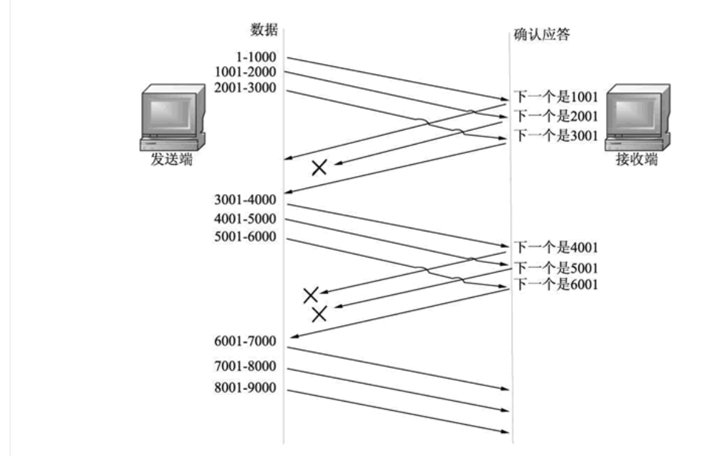
这种情况指的是前面发送的数据包没有收到对应的确认应答。当收到后面数据包的确认应答包，表示前面的数据包已经成功被接收端接收了，发送端不需要重新发送前面的数据包了。如图所示。

1. 发送端第 1 次发送数据包：这里设置的窗口大小为 3，可以最大发送 3 个数据包。发送端同时发送 3 个数据包 1-1000、1001-2000 和 2001-3000。
2. 接收端返回确认应答包：接收端接收到这些数据，并给出确认应答包。数据包 1-1000 和数据包 2001-3000 的确认应答包没有丢失，**但是数据包 1001-2000 的确认应答包丢失了**。
3. 发送端第 2 次发送数据包：发送端收到接收端发来的确认应答包，虽然没有收到数据包 1001-2000 的确认应答包，但是收到了数据包 2001-3000 的确认应答包。判断第一次发送的 3 个数据包都成功到达了接收端(**根据收到的其他确认应答判断是包应该送达，所以继续往后发**)。再次发送 3 个数据包 3001-4000、4001-5000 和 5001-6000。
4. 接收端返回确认应答包：接收端接收到这些数据，并给出确认应答包。**数据包 3001-4000 和数据包 4001-5000 的确认应答包丢失了**，但是数据包 5001-6000 没有丢失。
5. 发送端第 3 次发送数据包：发送端收到接收端发来的确认应答包，**查看到数据包 5001-6000 收到了确认应答包。判断第 2 次发送的 3 个数据包都成功到达了接收端**。再次发送 3 个数据包 6001-7000、7001-8000 和 8001-9000。

**发送数据包(数据信息丢失)丢失**
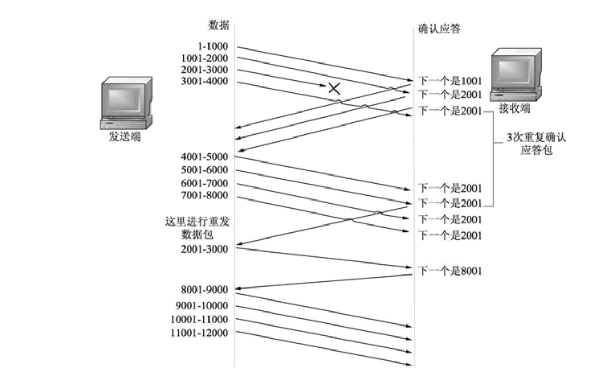

1. 发送端发送数据包：这里窗口大小为 4，发送端发送 4 个数据包，分别为 1-1000、1001-2000、2001-3000 和 3001-4000。
2. 接收端返回确认应答包：接收端接收到这些数据，并给出确认应答包。接收端收到了数据包 1-1000，返回了确认应答包；收到了数据包 1001-2000，返回了确认应答包；**但是数据包 2001-3000，在发送过程中丢失了，没有成功到达接收端**。数据包 3001-4000 没有丢失，成功到达了接收端，但是该数据包不是接收端应该接收的数据包，数据包 2001-3000 才是真正应该接收的数据包。因此**收到数据包 3001-4000 以后，接收端第一次返回下一个应该发送 2001 的数据包的确认应答包。**
3. 发送端发送数据包：发送端仍然继续向接收端发送 4 个数据包，分别为 4001-5000、5001-6000、6001-7000 和 7001-8000。
4. 接收端返回确认应答包：接收端接收到这些数据，并给出确认应答包。当**接收端收到数据包 4001-5000 时，发现不是自己应该接收的数据包 2001-3000，第二次返回下一个应该发送 2001 的数据包的确认应答包**。当接收端收到数据包 5001-6000 时，仍然发现不是自己应该接收的数据包 2001-3000，第三次返回下一个应该发送 2001 的数据包的确认应答包。以此类推直到接收完所有数据包，接收端都返回下一个应该发送 2001 的数据包的确认应答包。
5. 发送端重发数据包：**发送端连续 3 次收到接收端发来的下一个应该发送 2001 的数据包的确认应答包**，认为数据包 2001-3000 丢失了，就进行重发该数据包。
6. 接收端收到重发数据包：接收端收到重发数据包以后，查看这次是自己应该接收的数据包 2001-3000，并返回确认应答包，告诉发送端，**下一个该接收 8001 的数据包了(需要接收端处理，返回新的应答包表示开启新的数据发送)**。
7. 发送端发送数据包：发送端收到确认应答包后，继续发送窗口大小为 4 的数据包，分别为 8001-9000、9001-10000、10001-11000 和 11001-12000。

**TCP流控制**

窗口机制有个问题就是窗口的大小要和发送端，接收端达成平衡。
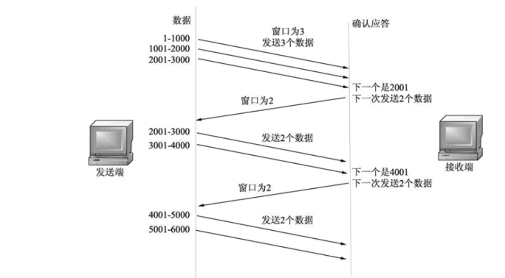

1. 如果窗口过小，发送端发送少量的数据包，接收端很快就处理了，并且还能处理更多的数据包。这样当传输比较大的数据时需要不停地等待发送方，造成很大的延迟。
2. 如果窗口过大，发送端发送大量的数据包，而接收端处理不了这么多的数据包，这样，就会堵塞链路。如果丢弃这些本应该接收的数据包，又会触发重发机制。
3. 为了避免这种现象的发生，TCP 提供了流控制。所谓的流控制就是使用不同的窗口大小发送数据包。发送端第一次以窗口大小（该窗口大小是根据链路带宽的大小来决定的）发送数据包，接收端接收这些数据包，并返回确认应答包，告诉发送端自己下次希望收到的数据包是多少（新的窗口大小），发送端收到确认应答包以后，将以该窗口大小进行发送数据包。
   1. 发送端根据当前链路带宽大小决定发送数据包的窗口大小。接收端接收这些数据包，但是只能处理 2 个数据包, 因此返回确认应答包，设置窗口大小为 2，告诉发送端自己现在只能处理 2 个数据包，下一次请发送 2 个数据包。
   2. 发送端接收到确认应答包，查看到接收端返回窗口大小为 2，知道接收端只处理了 2 个数据包。则第三个没处理的包得重发。
   3. 发送端接收到确认应答包，查看到接收端返回窗口大小为 2。说明接收端接收了上次发送的 2 个数据包。此时窗口大小没变小，所以不需要重发。按照正常顺序往下发即可。

## 网络中数据传输格式有哪些，区别和特点

1. JSON(JavaScript Object Notation)：JSON是一种轻量级的文本数据交换格式，在**语法上与创建JavaScript对象的代码相同**，由key|value（键|值）构成。
   1. 优点：1. 易于阅读编写，也易于机器解析与生成。2. JSON 解析器和 JSON 库支持许多不同的编程语言(脱离javascript束缚) 3. 非常适用于服务器与JavaScript交互
2. XML(Extensible Markup Language)：XML是可扩展标记语言，标准通用标记语言的子集.用标记来定义结构数据的，就像HTML那样.
3. YAML(Yet Another Markup Language)：YAML是一种直观的能够被电脑识别的的数据序列化格式,YAML使用的是缩进来定义结构化数据,有点像python。
   1. 实现简单，解析成本低，特别适合在脚本语言中使用
   2. YAML比较适合做序列化
   3. YAML做配置文件也不错。
4. 适用场景：
   1. 数据传输： JSON更常见，XML也还可以。
   2. 数据文件大小： YAML最小，XML最大
   3. 复杂程度： YAML最复杂。

## 网络通信协议

1. TCP/IP协议
TCP/IP协议是协议中的老大，用得最多，只有TCP/IP协议允许与internet进行完全连接。现今流行的网络软件和游戏大都支持TCP/IP协议。

2. IPX/SPX协议
IPX/SPX协议是Novell开发的专用于NetWare网络的协议，现在已经不光用于NetWare网络，大部分可以联机的游戏都支持IPX/SPX协议，例如星际、cs。虽然这些游戏都支持TCP/IP协议，但通过IPX/SPX协议更省事，不需要任何设置。IPX/SPX协议在局域网中的用途不大。它和TCP/IP协议的一个显著不同是它不使用ip地址，而是使用mac地址。

3. NetBEUI协议
NetBEUI协议是有IBM开发的非路由协议，实际上是NetBIOS增强用户接口，是Windows 98前的操作系统的缺省协议，特别适用于在“网上邻居”传送数据，大大提高了在“网上邻居”查找电脑的速度。如果一台只装了TCP/IP协议的Windows 98电脑想加入到WINNT域，也必须安装NetBEUI协议。

## BGP与OSPF协议区别

1. BGP协议支持的路由条目比较多，试用大型跨域的网络。
   OSPF一般应用在企业网的内网，支持的路由条目毕BGP少很多。
2. OSPF:AS内部路由（本质区别），采用链路状态路由选路技术
3. BGP(边界网关协议):AS外部路由，采用距离向量路由选择

## 有了IP为什么还要TCP；有了MAC为啥还要IP

1. IP 层是「不可靠」的，它只负责数据包的发送，但它不保证数据包能够被接收、不保证网络包的按序交付、也不保证网络包中的数据的完整性。
   如果需要保障网络数据包的可靠性，那么就需要由上层（传输层）的 TCP 协议来负责
2. ip地址表达的是当前机器在网络中的位置；mac地址一般不变

## 你们学的是哪种模型（楼主回答 OSI七层、TCP四层以及课本整合的5层都有学习过）那具体讲一下OSI的七层分别是哪七层，数据链路层具体有什么功能，dns在哪一层，tcp在哪一层

- osi7层
  - **应用层**：直接向用户提供服务，完成用户希望在网络上完成的各种工作
    - 常用协议：
        - SMTP （Simple Mail Transfer Protocol ）简单邮件传输协议 <端口号25> 用于发送邮件。 
        - HTTP    （Hypertext Transfer Protocol ）超文本传输协议 <端口号 80>， 面向事务的应用层协议。      
        - FTP   （File Transfer Protocol ）文件传输协议<端口号21>减少或消除不同操作系统下处理文件的不兼容性。 
        - DHCP(Dynamic Host Configuration Protocol)动态主机分配协议，使用 UDP 协议工作，主要有两个用途：给内部网络或网络服务供应商自动分配 IP 地址，给用户或者内部网络管理员作为对所有计算机作中央管理的手段。实 现即插即用连网。
        - DNS即域名系统,其作用是将字符串域名解析成相对于的服务器IP地址,免除人们记忆IP地址的单调和苦恼,属于为用户排忧解难之举,因此划归为应用层。 
  - **表示层**：处理用户信息的表示问题，如编码、数据格式转换和加密解密等
    - 常用协议：
  - **会话层**：向两个实体的表示层提供建立和使用连接的方法。将不同实体之间的表示层的连接称为会话。
    - 常用协议：
  - **传输层**：向用户提供可靠的端到端的差错和流量控制，保证报文的正确传输
    - 常用协议：TCP UDP
  - **网络层**：通过路由选择算法，为报文或分组通过通信子网选择最适当的路径。该层控制数据链路层与传输层之间的信息转发，建立、维持和终止网络的连接
    - 常用协议：
        - IP 
        - BGP（Border Gateway Protocol ）边界网关协议，用来连接Internet 上独立系统的路由选择协议.采用路径向量路由选择协议。
        - OSPF (Open Shortest Path Firs)开放式最短路径优先,分布式链路状态协议。 
        - ICMP (Internet Control Message Protocol ）Internet 控制报文协议。它是TCP/IP 协议族的一个子协议，用于在IP 主机、路由器之间传递控制消息。 
        - ARP (Address Resolution Protocol) 即地址解析协议，实现通过IP 地址得 知其物理地址。 
  - **数据链路层**：通过各种控制协议(差错控制、流量控制)，将有差错的物理信道变为无差错的、能可靠传输数据帧的数据链路。
    - 常用协议：
        - ARQ（Automatic Repeat-reQuest ）自动重传请求协议，错误纠正协议之一，包括停止等待ARQ 协议和连续ARQ 协议，错误侦测、正面确认、逾时重传与负面确认继以重传等机制。
        - PPP(Point-to-Ponit Protocol)点对点协议面向字节，由三部分组成：一个将IP 数据报封装到串行链路的方法；一个用于建立、配置和测试数据链路连接的链路控制协议
  - **物理层**：利用传输介质为数据链路层提供物理连接，实现**比特流的透明传输(只负责作为传输载体)**。
    - 常用协议：IEEE 802.1A  IEEE 802.2
- osi5层
  - 应用层
    - 常用协议：HTTP，FTP,SMTP,DNS
  - 传输层
  - 网络层
  - 数据链路层
  - 物理层
- osi4层
  - 应用层
  - 传输层
  - 网络层
  - 链路层  

## 子网掩码是干什么用的，实现原理？

子网掩码(subnet mask)又叫网络掩码、地址掩码、子网络遮罩，**它是一种用来指明一个IP地址的哪些位标识的是主机所在的子网，以及哪些位标识的是主机的位掩码。也相当于指明一个IP地址所标示的主机是处于哪个子网中的**
子网掩码不能单独存在，它必须结合IP地址一起使用。子网掩码只有一个作用，就是将某个**IP地址划分成网络地址和主机地址两部分()**。
**不同网络号的IP地址访问需要路由；同一子网内的可以直接通信**

例如我们在cmd中或则linux命令行里输入ipconfig和ifconfig，可以看到IP地址：114.212.121.36 子网掩码为255.255.240.0
IP地址由网络地址+主机地址构成，**图中用“.”隔开的子网掩码中第四个单元为0，就说明IP地址最后一个字节代表为主机地址，前面三个是网络字节**
IP地址网络位和主机位的不同组合，有不同的分类，对于A类地址来说，默认的子网掩码是255.0.0.0；对于B类地址来说默认的子网掩码是255.255.0.0；对于C类地址来说默认的子网掩码是255.255.255.0。
A类IP地址 子网掩码是255.0.0.0
B类IP地址 子网掩码是255.255.0.0
C类IP地址 子网掩码是255.255.255.0
所以IP + 子网掩码，例如172.20.0.4，子网掩码255.255.0.0，可以说明这是个B类IP，172.20是网络标识，0.4是主机标识。也即子网掩码AND IP地址的部分是网络标识，子网掩码取反后AND IP地址的部分即为主机标识。

1. 分割网络：IP地址数量很快要不够用了，每个IP都规定一定子网掩码，把*IP地址与子网掩码进行二进位的或，得到的就是网络号*，如果**网络号相同就表示二台电脑在同一网段，可以直接通讯，不需要路由器帮忙**。这时的IP地址由于需要靠子网掩码来计算网络号
2. 通过子网掩码，就可以判断两个IP在不在一个局域网内部。
例1 不同子网下的主机能否直接通信
   假设两个IP地址分别是172.20.0.18和172.20.1.16，子网掩码都是255.255.255.0。
   我们可以知道两者的网络标识分别是172.20.0和172.20.1，无法直接通信，也就无法PING通。要想能相互通信，需要将子网掩码改成255.255.0.0。

例2 如何确定子网掩码
   1）将主机数目转化为二进制来表示，总位数是N；例如700台主机转换成二进制看以下需要多少位
   2）将掩码地址全部置1，然后从后向前的将N位全部置为0，即为子网掩码值。

   如欲将B类IP地址168.195.0.0划分成若干子网，每个子网内有主机700台：
   1)700=1010111100，该二进制为十位数，N = 10
   2)将子网掩码255.255.255.255从后向前的10位全部置0,即为： 11111111.11111111.11111100.00000000，也即255.255.252.0。
   255.255.252.0就是168.195.0.0的700台主机的子网掩码了。

例3 如何理解172.20.1.0/26
   上文中的26代表主机ID的掩码地址长度，从前往后有26位，即子网掩码的地址是255.255.255.192。即255.255.255.128+64即192

## (计算题)根据IP地址+子网掩码 算出网关地址

193.6.7.0/24那么他的默认网关地址是多少呢?
可以直到IP地址是193.6.7.0， 子网掩码是255.255.255.0，
可以看出网络前缀位是24位，所以后面8位的主机位最后一位取0即是网关地址11111110即254
默认网关地址193.6.7.11111110/24(这个24要跟着的)

如果是193.6.7.0/26的话，子网掩码是255.255.255.192
网络前缀位26，主机位6，所以111110即62
所以网关是193.6.7.62/26

## 如果已经建立了连接，但是客户端突然出现故障了怎么办？

- TCP还设有一个**保活计时器**，显然，客户端如果出现故障，服务器不能一直等下去，白白浪费资源。服务器每收到一次客户端的请求后都会重新复位这个计时器，时间通常是设置为**2小时**，若两小时还没有收到客户端的任何数据，服务器就会发送一个探测报文段，以后**每隔75s**发送一次。若一连**发送10个探测报文**仍然没反应，服务器就认为客户端出了故障，接着就关闭连接。

## 交换机和路由机有什么区别？

1. 工作所处的OSI层不一样：路由机是IP层，交换机是数据链路层。
2. 寻址方式不一样：交换机根据MAC地址寻址，路由器根据IP地址寻址(跟OSI有关)
3. 转发速度不同：交换机的转发速度快，路由器转发速度相对较慢

## ICMP协议是什么？

ICMP是InternetControl Message Protocol，**因特网控制报文协议**。它是TCP/IP协议族的一个子协议，用于在IP主机、路由器之间**传递控制消息**。

## PING用什么协议，为什么

1. 用的是ICMP协议，因为ICMP必会有应答机制？？
2. traceroute用的应该就是ICMP

## DHCP协议是什么？

**动态主机配置协议**，是一种让系统得以连接到网络上，并获取所需要的配置参数手段。通常被应用在大型的局域网络环境中，主要作用是**集中的管理、分配IP地址**，使网络环境中的主机**动态的获得IP地址、Gateway地址、DNS服务器地址**等信息，并能够提升地址的使用率。

## IP地址有哪些分类：A、B、C三类，为什么分类

**IP地址其实分成网络ID和主机ID，针对网络ID部分，有进一步分成了五类(ABC三类比较重要)**

1. A类：A类IP地址由**1字节的网络地址**和3字节主机地址组成，主要为大型网络而设计的，网络地址的最高位必须是“0”， **地址范围从1.0.0.0 到127.0.0.0**），所以A类网络有127个
2. B类：B类IP地址由**2个字节的网络地址**和2个字节的主机地址组成，网络地址的最高位必须是“10”，**地址范围从128.0.0.0到191.255.255.255**。可用的B类网络有16382
3. C类：C类IP地址由**3字节的网络地址**和1字节的主机地址组成，网络地址的最高位必须是“110”。范围从**192.0.0.0到223.255.255.255**。C类网络可达209万余个
**为什么IP地址要分类**
主要还是为了方便检索，我们连网需要一个具体IP，然后通过路由器中的路由表去查询，如果不做分类，IPV4下，那么一个路由表就非常大了，所以分类是为了使得路由表能够做的非常小, 路由器能够快速地处理网络转发.

## 同一局域网内主机与不同子网主机通信过程异同

https://www.cnblogs.com/gtea/p/12801443.html
- 同一局域网，直接ARP
- 不同子网，通过NAT等

## socket编程的具体步骤是怎么样的？

3. TCP服务端Socket编程
   1、创建一个socket，用函数socket()；
   2、设置socket属性，用函数setsockopt(); * 可选
   3、绑定IP地址、端口等信息到socket上，用函数bind();
   4、开启监听，用函数listen()；
   5、调用socket的accept()方法获得客户端的连接请求，通过accept()方法返回的socket实例，建立与客户端的连接。 ---> 第二次握手
   6、收发数据，用函数send()和recv()，或者read()和write();
   7、关闭网络连接；
   8、关闭监听；
4. TCP客户端Socket编程
   1、创建一个socket，用函数socket()；
   2、设置socket属性，用函数setsockopt();* 可选
   3、绑定IP地址、端口等信息到socket上，用函数bind();* 可选
   4、设置要连接的对方的IP地址和端口等属性； --->这中间应该是bind这块附近完成第一次握手
   5、连接服务器，用函数connect()； ---> 第三次握手
   6、收发数据，用函数send()和recv()，或者read()和write();
   7、关闭网络连接；
5. UDP服务端Socket编程
   1、创建一个socket，用函数socket()；
   2、设置socket属性，用函数setsockopt();* 可选
   3、绑定IP地址、端口等信息到socket上，用函数bind();
   4、循环接收数据，用函数recvfrom();
   5、关闭网络连接；
6. UDP客户端Socket编程
   1、创建一个socket，用函数socket()；
   2、设置socket属性，用函数setsockopt();* 可选
   3、绑定IP地址、端口等信息到socket上，用函数bind();* 可选 
   4、设置对方的IP地址和端口等属性;
   5、发送数据，用函数sendto();
   6、关闭网络连接；
7. 两者在编程方面的区别
   1.socket()的参数不同
   2.UDP Server不需要调用listen和accept
   3.UDP收发数据用sendto/recvfrom函数，TCP就直接是send 和 rece
   4.TCP：地址信息在connect/accept时确定
   5.UDP：在sendto/recvfrom函数中每次均需指定地址信息
   6.UDP：shutdown函数无效

## 同一个计算机上的应用可以使用Socket进行通信么(socket通信五元组)？

在socket网络编程中，都是端到端通信，由客户端端口+服务端端口+客户端IP+服务端IP+传输协议组成的五元组可以明确的标识一条连接
我们虽然都说Socket是完成不同计算机之间的通信的，但如果在同一台计算机上的话，只要开两个进程分别运行客户端和服务端，一般只要端口号区别开来就可以通信。因为socket当中是要指定端口号的。

TCP、UDP可以同时绑定一个端口8888，但是一个端口在同一时刻不可以被TCP或者UDP绑定2次。 原因如下：

tcp的端口不是物理概念，仅仅是协议栈中的两个字节；
TCP和UDP的端口完全没有任何关系，完全有可能又有一种XXP基于IP，也有端口的概念，这是完全可能的；
TCP和UDP传输协议监听同一个端口后，接收数据互不影响，不冲突。因为数据接收时时根据五元组**{传输协议，源IP，目的IP，源端口，目的端口}**判断接受者的。

## 对于socket编程，accept方法是干什么的，在三次握手中属于第几次，可以猜一下，为什么这么觉得

调用socket的accept()方法获得客户端的连接请求，通过accept()方法返回的socket实例，建立与客户端的连接
应该是第二次握手
因为accept返回的socket实例后，客户端调用connect()方法，然后就开始收发数据了，说明connect是第三次握手

## socket通信 TCP还是UDP的 发送的协议是什么 发送的信号如何定义的

socket通信，TCP/UDP都可以吧，只不过UDP步骤简单些

## socket里的accept方法？ 会阻塞么，可不可以不阻塞？

Accept默认会阻塞进程，直到有一个客户连接建立后返回

# 传输层

## 什么是TCP

TCP 是一个工作在传输层的可靠数据传输的服务，它能确保接收端接收的网络包是**无损坏、无间隔、非冗余和按序**的。
TCP 是**面向连接的、可靠的、基于字节流**的传输层通信协议

1. 面向连接：一定是「一对一」才能连接，
2. 可靠的：无论的网络链路中出现了怎样的链路变化，TCP 都可以保证一个报文一定能够到达接收端
3. 字节流：消息是「没有边界」的，所以无论我们**消息有多大都可以进行传输**。**并且消息是「有序的」**

## TCP首部(头格式)有哪些

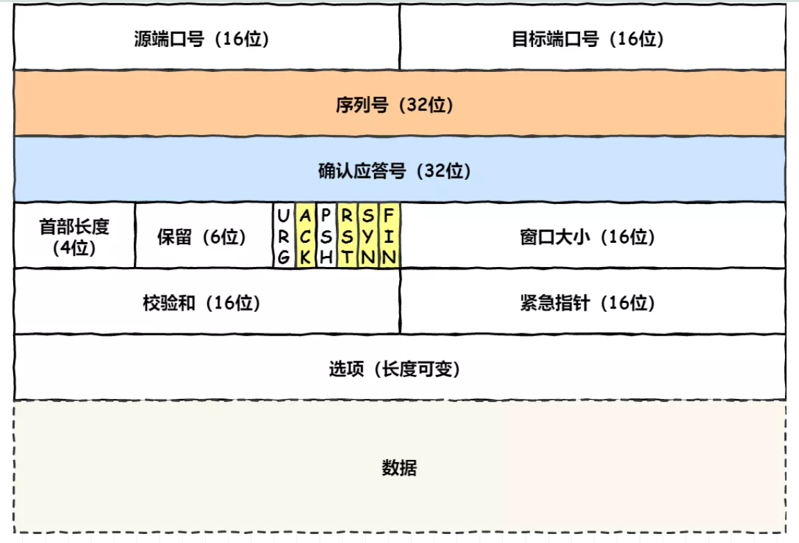

1. 源端口号 16位
2. 目的端口号 16位
3. 序列号(Seq)32位：在建立连接时由计算机生成的随机数作为其初始值，通过 SYN 包传给接收端主机，每发送一次数据，就「累加」一次该「数据字节数」的大小。**用来解决网络包乱序问题**。
4. 确认应答号(ack)32位:指下一次「期望」收到的数据的序列号，发送端收到这个确认应答以后可以认为在这个序号以前的数据都已经被正常接收。**用来解决不丢包的问题**。
5. 常用的控制位6位：
   1. ACK：该位为 1 时，**「确认应答」的字段变为有效**，除了最初建立连接时的 SYN 包之外该位必须设置为 1 。
   2. RST：该位为 1 时，表示 TCP 连接中出现异常必须**强制断开连接**。
   3. SYN：该位为 1 时，表示希望**建立连接**，并在其「序列号」的字段进行序列号初始值的设定。
   4. FIN：该位为 1 时，表示今后不会再有数据发送，希望**断开连接**。当通信结束希望断开连接时，通信双方的主机之间就可以相互交换 FIN 位置为 1 的 TCP 段
6. 校验和
7. 窗口大小
8. MTU

## UDP首部格式

2. UDP首部字段和长度(8个字节)：
   1. 源端口号16位
   2. 目的端口号16位
   3. UDP长度16位 ：UDP用户数据报的长度，最小值是8
   4. UDP校验和16位：检测UDP用户数据报在传输中是否有错，有错就丢弃

## 如何唯一确定一个TCP连接(TCP四元组的作用)

1. 源**地址**：32位，是IP头部，表示TCP协议应该发送报文到哪个**主机**。
2. 源**端口**： 16位， 是TCP头部，表示TCP协议应该把报文发给哪个**进程**。
3. 目的地址：32位，是IP头部，表示报文从哪个主机来的。
4. 目的端口：16位，是TCP头部，表示报文从哪个进程来的。

## 字节流与数据报

- 两者的区别在于TCP接收的是一堆数据，而每次取多少由主机决定;而UDP发的是数据报，客户发送多少就接收多少。

## UDP和TCP的区别和应用

1. TCP与UDP基本区别
  1.基于连接与无连接
  2.TCP要求系统资源较多，UDP较少；
  3.UDP程序结构较简单
  4.字节流流模式（TCP）与数据报模式(UDP);
  5.TCP保证数据正确性，UDP可能丢包
  6.TCP保证数据顺序，UDP不保证
  7.每一条TCP连接只能是点到点的;UDP支持一对一，一对多，多对一和多对多的交互通信
  8.TCP首部开销20字节;UDP的首部开销小，只有8个字节
2. UDP应用场景
   1. 包总量较少的通信（DNS、SNMP等）；
   2. 视频、音频等多媒体通信（即时通信）；
   3. 限定于 LAN 等特定网络中的应用通信；
   4. 广播通信（广播、多播）
3. TCP服务端Socket编程
   1、创建一个socket，用函数socket()；
   2、设置socket属性，用函数setsockopt(); * 可选
   3、绑定IP地址、端口等信息到socket上，用函数bind();
   4、开启监听，用函数listen()；
   5、接收客户端上来的连接，用函数accept()；
   6、收发数据，用函数send()和recv()，或者read()和write();
   7、关闭网络连接；
   8、关闭监听；
4. TCP客户端Socket编程
   1、创建一个socket，用函数socket()；
   2、设置socket属性，用函数setsockopt();* 可选
   3、绑定IP地址、端口等信息到socket上，用函数bind();* 可选
   4、设置要连接的对方的IP地址和端口等属性；
   5、连接服务器，用函数connect()；
   6、收发数据，用函数send()和recv()，或者read()和write();
   7、关闭网络连接；
5. UDP服务端Socket编程
   1、创建一个socket，用函数socket()；
   2、设置socket属性，用函数setsockopt();* 可选
   3、绑定IP地址、端口等信息到socket上，用函数bind();
   4、循环接收数据，用函数recvfrom();
   5、关闭网络连接；
6. UDP客户端Socket编程
   1、创建一个socket，用函数socket()；
   2、设置socket属性，用函数setsockopt();* 可选
   3、绑定IP地址、端口等信息到socket上，用函数bind();* 可选 4、设置对方的IP地址和端口等属性;
   5、发送数据，用函数sendto();
   6、关闭网络连接；
7. 两者在编程方面的区别
   1.socket()的参数不同
   2.UDP Server不需要调用listen和accept
   3.UDP收发数据用sendto/recvfrom函数，TCP就直接是send 和 rece
   4.TCP：地址信息在connect/accept时确定
   5.UDP：在sendto/recvfrom函数中每次均需指定地址信息
   6.UDP：shutdown函数无效

1. UDP：不提供复杂的控制机器，不保证可靠传输，可以一对多连接，传输不需要先建立连接。
2. TCP：提供复杂的控制机制，保证可靠传输，只能一对一连接，且传输前要先建立连接，头部字节较大，效率较低。
3. 应用场景：
1. TCP：FTP文件传输， HTTP / HTTPS
2. UDP：**DNS**,SNMP，音频，视频

## UDP最大包长MSS多少？ 为什么最大包长是1500字节？

1. 根据链路层中，数据帧的内容最大为1500(不包括帧头和帧尾)，即MTU(Maximum Transmission Unit)为1500； 　然后IP包的首部要占用20字节， UDP首部8个字节，所以UDP中的包长应该是1472，如果是TCP的话，应该是1440。
2. UDP首部字段和长度(8个字节)：
   1. 源端口号16位
   2. 目的端口号16位
   3. UDP长度16位 ：UDP用户数据报的长度，最小值是8
   4. UDP校验和16位：检测UDP用户数据报在传输中是否有错，有错就丢弃
3. 最大传输单元（Maximum Transmission Unit，MTU）用来通知对方所能接受 数据服务 单元 的最大尺寸，说明发送方能够接受的 有效载荷 大小。

## 流量控制

如果应用程序读取的速度较慢，而发送方发送得太快，就会使接收缓存溢出，TCP 通过流量控制解决该问题。

TCP 通过接收窗口实现流量控制，接收窗口告诉发送方自己可用的缓存空间，发送方的发送窗口不能超过接收方的接收窗口。

当接收窗口=0 时就不再允许发送方发送数据，但可能存在一种情况：在发送零窗口报文不久后，接收方的接收缓存又有了存储空间，因此发送报文说明新的接收窗口，但该报文在传输中丢失。发送方会一直等待接收方的非零窗口通知，而接收方也一直在等待发送方发送数据，形成死锁。为解决该问题，TCP 为每个连接设有**持续计时器**，只要 TCP 连接的一方收到对方的零窗口通知，就启动该计时器，到期后发送一个**零窗口探测报文**，避免死锁。

有一种问题叫**糊涂窗口综合症**，当接收方处理数据很慢时，应用进程间传送的有效数据很小， 极端情况下有效数据只有 1B 但传输开销却有 40B（IP 首部及TCP 首部各占 20B) ，导致通信效率极低。为解决该问题，可以等到接收方有足够空间容纳一个最长报文段，或接收缓存已有一半空间再发送；发送方也不要发送太小的报文，而是把数据积累成足够大的报文，或达到接收方缓存一半时才发送。

## 拥塞控制

RTT (Round-Trip Time): 往返时延

TCP 的拥塞控制算法包括了慢启动、拥塞避免和快恢复。慢启动和拥塞避免是 TCP 的强制部分，差异在于对收到的 ACK 做出反应时拥塞窗口增加的方式，慢启动比拥塞避免增加得更快。快恢复是推荐部分，对 TCP 发送方不是必须的。
**1. 慢启动**
拥塞窗口 cwnd 以一个 MSS 最大报文段开始，每当传输的报文段首次被确认就增加一个 MSS。因此每经过一个 RTT 往返时间，拥塞窗口就会翻倍，发送速率也会翻倍。
结束慢启动的情况：① 发生超时事件，发送方将 cwnd 设为 1，重新开始慢启动，并将慢启动阈值设置为 cwnd/2。② 当拥塞窗口达到慢启动阈值时就结束慢启动而进入拥塞避免模式。③ 如果检测到三个冗余的 ACK，TCP 就会执行快重传并进入快恢复状态。
**2. 拥塞避免**
一旦进入拥塞避免状态，cwnd 值大约是上次拥塞时的 1/2，距离拥塞并不遥远。因此 TCP 不会每经过一个 RTT 就将 cwnd 翻倍，而是较为保守地在每个 RTT 后将 cwnd 加 1
发生超时事件时，拥塞避免和慢启动一样，将 cwnd 设为 1，并将慢启动阈值设置为 cwnd/2。
**3. 快恢复**
有时个别报文段丢失，但网络中并没有出现拥塞，如果使用慢启动会降低传输效率。这时应该使用快重传来让发送方尽早知道出现了个别分组的丢失，快重传要求接收端不要等待自己发送数据时再捎带确认，而是要立即发送确认。即使收到了乱序的报文段也要立即发出对已收到报文段的重复确认。当发送方连续收到三个冗余 ACK 后就知道出现了报文段丢失的情况，会立即重传并进入快恢复状态。
在快恢复中，会调整慢启动阈值为 cwnd/2，并进入拥塞避免状态。

## TCP的流量控制和拥塞控制的区别？

1. 流量控制：**流量控制解决的是发送方和接收方速率不匹配的问题**，发送方发送过快接收方就来不及接收和处理。采用的机制是滑动窗口的机制，控制的是发送了但未被Ack的包数量。
   1. 流量控制是通过滑动窗口来实现的。 滑动窗口分为发送端窗口和接收端窗口。
   2. 窗口有大小限制，窗口大小是接收端用来告诉发送端目前接收端能接收的最大字节数。
   3. 窗口的大小在TCP协议头里，大小为16位。然而在TCP协议的可选项里，还可以定义窗口的比例因子，因此实际的窗口大小可以超过64KB。窗口的含义实际上就是接收缓冲区的大小。
   4. 发送窗口维护了发送端发送的已被接收端ACK的序号，以及已经发送的最大序号，这样就可以知道还能发送多少的新数据。
   5. 接收窗口维护了已经ACK的序号，以及所有接收到的包序号。
   6. 窗口大小在特定的一次连接通信过程中，大小是不变的。而滑动窗口是一种机制，滑动窗口的大小在发送端代表的是可发送的数据大小，在接收端代表的是可接收的数据大小，它们是动态变化的。
2. 拥塞控制：**拥塞控制就是防止过多的数据注入到网络中**，这样可以使网络中的路由器或链路不致过载。
   1. 拥塞控制是通过拥塞窗口来实现的。拥塞窗口指发送端在一个RTT内可以最多发送的数据包数。
   2. 拥塞控制一般包括慢启动、拥塞避免两个阶段。
   3. 慢启动阶段是从1开始指数增长到限定大小的过程。
   4. 拥塞避免阶段时超过限定大小之后线性增加的过程，以及发现丢包后将拥塞窗口改为1，并把限定大小减半的过程。

## 三次握手(SYN, Synchronize Sequence Numbers同步序列号)⭐

TCP 是全双工通信，任何一方都可以发起连接请求，假设 A 是客户端，B 是服务器。

初始 A 和 B 均处于 CLOSED 状态，B 会创建传输进程控制块 TCB 并进入 LISTEND 状态，监听端口是否收到连接请求。

1. 第一次握手：当 A 要发送数据时，就向 B 发送连接请求报文SYN，其中 SYN=1，ACK=0，SYN不可以携带数据，但要消耗一个序号（假设 seq=x）。发送后 A 进入SYN-SENT同步已发送状态。
2. 第二次握手：当 B 收到 A 的连接请求报文后，进入SYN-RCVD同步已接收状态，如果同意建立连接就会发送给 A 一个连接响应报文，其中 SYN=1，ACK=1，ack=x+1，seq=y。ack 的值为 A 发送的序号加 1，ACK 可以携带数据，如果不携带的话则不消耗序号。
3. 第三次握手：当 A 收到 B 的确认后，还要对该确认再进行一次确认，报文的 ACK=1，ack=y+1，seq=x+1，发送后 A 进入 ESTABLISHED 状态，当 B 接收到该报文后也进入 ESTABLISHED 状态，客户端会稍早于服务器端建立连接。
三次握手的原因：

- 从信息对等的角度看，双方只有确定 4 类信息才能建立连接，即 A 和 B 分别确认自己和对方的发送和接收能力正常。
1. 在第二次握手后，B还不能确定自己的发送能力和A的接收能力，只有在第三次握手后才能确认(此时说明B发出去了，且A接收到了)。
2. 防止出现脏连接。报文的生存时间往往会超过 TCP 请求的超时时间，A 的某个超时连接请求可能会在双方释放连接后到达 B，B 会误以为是 A 创建了新的连接请求，然后发送确认报文创建连接。由于 A 的状态不是 SYN_SENT，将直接丢弃 B 的确认数据。如果是两次握手，连接建立，服务器资源被白白浪费；如果是三次握手，B 由于长时间没有收到确认，最终超时导致连接失败，不会出现脏连接。

## 三次握手还协商了什么

TCP在三次握手建立连接过程中，会在SYN报文中使用MSS（Maximum Segment Size）选项功能，协商交互双方能够接收的最大段长MSS值，此值以两端最小值为准
MTU 最大传输单元（Maximum Transmission Unit，MTU）
MSS是传输层TCP协议范畴内的概念，顾名思义，其标识TCP能够承载的最大的应用数据段长度，因此，MSS=MTU-20字节TCP报头-20字节IP报头，那么在以太网环境下，MSS值一般就是1500-20-20=1460字节（一般是1440）

## 四次挥手⭐

1. 第一次挥手 ：当A没有要发送的数据时就会向 B 发送终止连接报文FIN，其中 FIN=1，seq=u，u的值为之前A发送的最后一个序号加 1，发送后A进入 FIN-WAIT-1 状态。

2. 第二次挥手 ：B 收到后响应给A一个确认报文，ACK=1，ack=u+1，seq=v，v 的值为B之前发送的最后一个序号加1。此时A进入FIN-WAIT-2 状态，B进入 **CLOSE-WAIT** 状态，但连接并未完全释放，B 会通知应用进程结束 A 到 B 方向的连接，此时 TCP 处于半关闭状态。

3. 第三次挥手：当 B 也准备释放连接时就向 A 发送连接终止报文，FIN=1，同时还要重发 ACK=1，ack=u+1，seq=w，seq 改变的原因是在半关闭状态 B 可能又发送了数据，之后 B 进入 LAST-ACK 状态。

4. 第四次挥手：A 收到连接终止报文后还要再进行一次确认，确认报文中 ACK=1，ack=w+1，seq=u+1，发送完后进入 **TIME-WAIT** 状态，等待 2MSL 后进入 CLOSED 状态。B 收到该确认后进入 CLOSED 状态，服务器端会稍早于客户端释放连接。

**四次挥手的原因**：TCP 是全双工通信，两个方向的连接需要单独断开。

**等待 2MSL 的原因**：

- 保证被动关闭方可以进入 CLOSED 状态。MSL 是最大报文段寿命，等待 2MSL 可以保证 A 发送的最后一个确认报文被 B 接收，如果该报文丢失，B 会超时重传之前的 FIN+ACK 报文，而如果 A 在发送确认报文后立即释放连接就无法收到 B 可能超时重传的报文，也不会再次发送确认报文段，B 就无法正常进入 CLOSED 状态。

- 2MSL = 第四次挥手的ACK包的MSL + 服务端重传的FIN包的MSL

- 2MSL 时间后，本连接中的所有报文就都会从网络中消失，防止已失效连接的请求数据包与正常连接的请求数据包混淆而发生异常。

除此之外，TCP 还设有一个**保活计时器**，用于解决客户端故障问题，服务器每收到一次数据就重新设置保活计时器，如果 2 小时内没有收到数据就间隔 75 秒发送一次探测报文，连续 10 次没有响应后关闭连接。

**TIME-WAIT**

在高并发短连接的 TCP 服务器上，服务器处理完请求后立刻主动关闭连接，该场景下大量 socket 处于 TIME-WAIT 状态。TIME-WAIT 状态无法真正释放句柄资源，socket 使用的本地端口在默认情况下不能再被使用，会限制有效连接数量，成为性能瓶颈。

解决：调小 `tcp_fin_timeout` 的值、将 `tcp_tw_reuse` 设为 1 开启重用，将 `tcp_tw_recycle` 设为 1 开启快速回收。

## TCP建立连接时的ISN号是否固定

1. 双方都会发送SYN报文并初始化序号（英文为：Initial Sequence Number，简称ISN）
2. 但是初始化序号的方式（通过算法来随机生成序号）就会使序号难以猜出，也就不容易利用这种缺点来进行一些恶意攻击行为。

## 三次握手和四次挥手中的状态有哪些？

1. SYN-SENT：第一次握手，A发出SYN包后进入SYN-SENT
2. SYN-RCVD：第二次握手中，B收到了A的SYN包，进入SYN-RCVD
3. ESTABLISHED：第三次握手中，A收到了第二次握手中B的ACK包进入，B收到第三次握手中A的ACK包进入
4. FIN-WAIT-1： 第一次挥手中，A发出了FIN包，进入
5. FIN-WAIT-2： 第二次挥手中，A收到了B的ACK包进入
6. CLOSE-WAIT： 第二次挥手中，B收到了A的第一次挥手中发的FIN包进入
7. LAST-ACK：   第三次挥手中，B发送FIN包后进入
8. TIME-WAIT：  第四次挥手中，A发出第三次挥手中的ACK包后进入TIME_WAIT
9. CLOSED   ：  B收到A的ACK，以及A等待2MSL后进入

## 三次握手和四次挥手中的一些异常情况

**三次握手中的异常**

1. 第一次握手中的SYN包丢失，接收不断服务器的ACK，则客户端会重传，但是如果重传时间超过一定时长，会认为服务器不可连接。服务器方面则是无感。
2. 第二次握手中，服务器收到了client的syn，并发出了syn+ack包，syn+ack包丢失。客户端会和1一样，重传SYN包，然后服务器没有收到第三次握手的ACK，也会重传SYN+ACK包
3. 第三次握手的ACK包丢失的话，服务器会重发SYN+ACK，一般以3S,6S 12S间隔重发，等待客户端回复ACK。如果一直没收到，服务器会关闭连接。
**四次挥手中的异常**
1. 第一次挥手中client发的FIN包丢失：客户端一直收不到ACK，会一直重传然后上限次数后关系连接，服务器此时是无感的。
2. 第二次挥手中的ACK信息丢了，客户端和1中一样，重传，服务器端则会在客户端重传FIN报文后再发ACK
3. 如果client收到ACK后，server直接跑路，此时客户端完成了关闭诉求，处于半关闭状态，如果没有服务器的FIN，则会一直处于半关闭状态，可以设置处于这个状态的最大时长来避免。
4. server发的FIN包丢了(第三次挥手的FIN包), 服务器会进行重传，如果客户端跑路了(例如半关闭太久了，被系统kill了然后有重新和新的服务器连接了)，客户端会不认这个FIN包，然后回个RST给服务器，服务器也会直接关闭连接。
5. 第四次挥手中，ACK丢失了，为了防止回复给服务器的ACK丢失，所以一般等待2MSL(最大报文存活时间)，如果真丢失了，还能接受到新的FIN包，然后再回复ACK。以及防止客户端这边直接断开连接了，然后可能会继续和新的服务器建立连接，这个时候新旧连接就会比较容易混在一起，等待2MSL也是避免前后连接混淆。

## tcp三次握手，如何优化？

第三次握手中就可以直接携带数据了，一方面第一次和第二次握手中，AB就已经有对方的随机数了，因为第三次握手中的ack和seq都是基于前两次握手的，只不过是为了验证B的发送能力和A的接受能力，这个时候直接传数据问题不大。

## tcp通信下，一次发送的消息，缓冲区存不下怎么办

每个数据链路都有一个输出队列，如果该队列已满，**那么新到的分组将被丢弃**，并沿协议栈向上返回一个错误，从链路层到IP层，再从IP层到TCP层。TCP将注意到这个错误，并在以后某个时刻重传相应分片。应用进程并不知道这种暂时情况。然后会产生反馈，触发TCP的流量控制(主要是流量控制，不知道会不会出发拥塞控制)。

## 服务端和客户端同时调用 close() 会怎么样

TCP是允许同时关闭连接的，其实四次挥手就是两个两次挥手，对应的是两端关闭，所以同时关闭的话，就是服务器端也会直接发送FIN包，然后双方接收到另一个ACK后就关闭了连接。2MSL还是存在的，在接收到服务器的ACK后。

## TCP流量控制(滑动窗口)和拥塞控制

1. 流量控制：如果发送者发送数据过快，接收者来不及接收，那么就会有分组丢失。为了避免分组丢失，控制发送者的发送速度，使得接收者来得及接收，这就是流量控制。流量控制根本目的是防止分组丢失，**由滑动窗口协议（连续ARQ协议）实现**
   1. 主要的方式就是接收方返回的 ACK 中会包含自己的接收窗口的大小，并且利用大小来控制发送方的数据发送。第一次根据自己的情况，设定一个窗口大小，然后根据方返回的窗口大小来调整，如果小了就加大窗口，如果大了就减小窗口并且重发过去的一部分数据。
2. 拥塞控制是**作用于网络的**，它是防止过多的数据注入到网络中，**避免出现网络负载过大的情况**
   1. 慢启动：一点一点的提高发送数据包的数量，当发送方每收到一个 ACK，就拥塞窗口cwnd的大小增加，**为了快速去试探到当前网络的上限，cwnd增加会快些**
   2. 当cwnd增加到一个慢启动门限，到了慢启动门限后会触发拥塞避免算法(进入重传机制)，此时就开始慢慢的增加cwnd来更精确感知网络上限。一旦出现大量拥塞(增加过头)就进入快重传来解决拥塞。
   3. 快重传(和超时重传作区分)：快重传要求接收方在收到一个失序的报文段后就立即发出重复确认（为的是使发送方及早知道有报文段没有到达对方）而不要等到自己发送数据时捎带确认。**快重传算法规定，发送方只要一连收到三个重复确认就应当立即重传对方尚未收到的报文段**，而不必继续等待设置的重传计时器时间到期。
   4. 快恢复: 经过快重传后，收到了三个ACK，表示此事网络拥塞已经好了一些了，就执行“乘法减小”算法，把ssthresh门限减半。然后在增加，慢慢触发到新门限进而到拥塞避免算法。

## TCP如何做到可靠传输？

1. ACK： TCP每发送一个数据包都要期待收到这个包的ACK信息确保交付了。
2. seq：保证有序性
3. 超时重传： 每个包发出去后都有个计时器，如果到了时间还没收到返回的ACK包的话，说明可能丢包了，要重传。
4. 滑动窗口机制：
5. 拥塞控制：慢启动-拥塞避免-快重传-快恢复
6. 首部校验（不能保证数据传输不出错）

## 当 TCP 两端 A、B 建立了连接后，如果一端拔掉网线或者拔掉电源，会发生什么

1. 首先， 另一端不会收到相关通知
2. 如果网线断开的时间短暂，在SO_KEEPALIVE设定的探测时间间隔内，并且两端在此期间没有任何针对此长连接的网络操作。当连上网线后此TCP连接可以自动恢复，继续进行正常的网络操作。
3. 如果网线断开的时间很长，超出了SO_KEEPALIVE设定的探测时间间隔，或者两端期间在此有了任何针对此长连接的网络操作。当连上网线时就会出现ETIMEDOUT或者ECONNRESET的错误。你必须重新建立一个新的长连接进行网络操作。

## 计算机网络中，TCP如何保证可靠

1. 应用数据会被分割成tcp认为最适合的大小的数据块(滑动窗口机制)
2. tcp会给发送的每一个包进行编号，发送到接收端后，会进行排序，然后传给应用层
3. **校验和**，tcp会**检测首部与数据的校验和**，发送到接收端后，接收端会检测校验和是否正确，如果不正确，那么就会丢弃这个数据，并且不确定收到此报文段。
4. tcp的接收端会丢弃重复数据
5. 流量控制，接收端只允许接收发送端发送接收端缓冲区能容纳的数据。当接收端来不及处理数据的时候，会减缓传输速率，防止包丢失。(流量控制协议是可变大小的滑动窗口协议)
6. 拥塞控制，网络拥堵的时候，减少数据的发送(发送方维护一个拥塞窗口(cwnd)，tcp的拥塞控制采用了慢开始、拥塞避免、快恢复和快重传(fast retransmit and recovery，FFR )四种算法。
7. 停止等待ARQ协议，当发送完一个分组后，发送端会立刻停止发送，**直到收到来自接收端的确认收到信号，才会继续发送**
8. 重传机制，当发送一个数据包后，**发送端的定时器会立刻开始计时，如果在定时器的结束时间之前没有收到来自接收端的确认收到信号，就会重新发送**。

## tcp如何维护长连接
 
**TCP的实现**
TCP的KeepAlive机制（此机制并不是TCP协议规范中的内容，由操作系统去实现）KeepAlive机制开启后，在一定时间内（一般时间为7200s，参数tcp_keepalive_time）在链路上没有数据传送的情况下，TCP层将发送相应的KeepAlive探针以确定连接可用性，探测失败后重试10（参数tcp_keepalive_probes）次，每次间隔时间75s（参数tcp_keepalive_intvl），所有探测失败后，才认为当前连接已经不可用。这些参数是机器级别，可以调整。KeepAlive的保活机制只在链路空闲的情况下才会起到作用。

一个可靠的系统，长连接的保活肯定是要依赖应用层的心跳来保证的。

**应用层实现：**
如果客户端已经消失而连接未断开，则会使得服务器上保留一个半开放的连接，而服务器又在等待来自客户端的数据，此时服务器将永远等待客户端的数据。保活功能就是试图在服务端器端检测到这种半开放的连接。

如果一个给定的连接在两小时内没有任何动作，服务器就向客户发送一个探测报文段，根据客户端主机响应探测4个客户端状态：

客户主机依然正常运行，且服务器可达。此时客户的TCP响应正常，服务器将保活定时器复位。
客户主机已经崩溃，并且关闭或者正在重新启动。上述情况下客户端都不能响应TCP。服务端将无法收到客户端对探测的响应。服务器总共发送10个这样的探测，每个间隔75秒。若服务器没有收到任何一个响应，它就认为客户端已经关闭并终止连接。
客户端崩溃并已经重新启动。服务器将收到一个对其保活探测的响应，这个响应是一个复位，使得服务器终止这个连接。
客户机正常运行，但是服务器不可达。这种情况与第二种状态类似。

**差别**
应用层的心跳数据包会耗费更多的带宽，因为 TCP 协议的保活机制发送的是数据长度为零心跳包，而应用层的心跳数据包长度则必然会大于 0。
应用层的心跳数据包可以带一些应用所需要的数据，随应用自己控制，而 TCP 协议的保活机制则是对于应用层透明的，无法利用心跳携带数据。

## TCP有哪些定时器

1. 重传定时器
   1. 没有得到正常ACK反馈的，都会启动一个重传机制。这个重传机制使用一个重传定时器，当发现在规定时间内，没有收到ACK，那么，重新发送消息
2. 坚持定时器
   1. 坚持定时器是使用在一方滑动窗口为0之后，另外一方停止传输数据，进入坚持定时器的轮询，直到滑动窗口不再为0了。
3. 保活定时器
   1. 这个就是我们经常说的tcp的keepalive了。实际使用场景是在应用层没有数据进行传输的时候，一定时间（tcp_keepalive_time，默认每2个小时）发送一次保持心跳的包，如果发送成功，则继续保持端口活跃，如果没有正常返回，则在指定次数内（tcp_keepalive_probes，默认是9次），指定间隔（tcp_keepalive_intvl，默认是17s）发送心跳包。如果最后都没有获得正常的ACK，那么才算连接失败
4. 2MSL定时器
   1. 主动发起TCP断开的一方需要保持2MSL的TIME_WAIT的状态。这个保持的一方就会开启2MSL定时器来计算TIME_WAIT的状态保持时间。

## 111TCP粘包是什么，什么原因造成的，如何解决TCP粘包？

在TCP的socket编程中，发送端和接收端都有成对的socket。发送端为了将多个发往接收端的包，更加高效的的发给接收端，于是采用了优化算法（Nagle算法），*将多次间隔较小、数据量较小的数据，合并成一个数据量大的数据块，然后进行封包*。
**什么是TCP粘包**
TCP粘包就是指发送方发送的若干包数据到达接收方时粘成了一包，从接收缓冲区来看，后一包数据的头紧接着前一包数据的尾，出现粘包的原因是多方面的，可能是来自发送方，也可能是来自接收方。
**造成TCP粘包的原因**

1. 发送方：TCP默认使用Nagle算法（主要作用：减少网络中报文段的数量），而Nagle算法主要做两件事：1只有上一个分组得到确认，才会发送下一个分组2收集多个小分组，在一个确认到来时一起发送。Nagle算法造成了发送方可能会出现粘包问题
2. 接收方：TCP接收到数据包时，并不会马上交到应用层进行处理，或者说应用层并不会立即处理。实际上，**TCP将接收到的数据包保存在接收缓存里**，然后**应用程序主动从缓存读取收到的分组**。这样一来，**如果TCP接收数据包到缓存的速度大于应用程序从缓存中读取数据包的速度，多个包就会被缓存，应用程序就有可能读取到多个首尾相接粘到一起的包**。
**什么时候处理粘包问题**
如果多个分组毫不相干，甚至是并列关系，那么这个时候就一定要处理粘包现象了，如果这些分组是同一块数据的话，其实是不需要处理粘包问题的。
**如何处理粘包问题**
1. 发送方：对于发送方造成的粘包问题，可以通过关闭Nagle算法来解决，使用TCP_NODELAY选项来关闭算法。
2. 接收方：接收方没有办法来处理粘包现象，只能将问题交给应用层来处理
3. 应用层(最好的解决方案)：循环处理，应用程序从接收缓存中读取分组时，读完一条数据，就应该循环读取下一条数据，直到所有数据都被处理完成，但是如何判断每条数据的长度呢？
   1. **格式化数据**：每条数据有固定的格式（开始符，结束符），这种方法简单易行，但是选择开始符和结束符时一定要确保每条数据的内部不包含开始符和结束符。
   2. **发送长度**：发送每条数据时，将数据的长度一并发送，例如规定数据的前4位是数据的长度，应用层在处理时可以根据长度来判断每个分组的开始和结束位置。

**UDP会产生粘包问题**
TCP为了保证可靠传输并减少额外的开销（每次发包都要验证），采用了基于流的传输，基于流的传输不认为消息是一条一条的，是无保护消息边界的（**保护消息边界：指传输协议把数据当做一条独立的消息在网上传输，接收端一次只能接受一条独立的消息**）。

UDP则是面向消息传输的，是有保护消息边界的，接收方一次只接受一条独立的信息，所以不存在粘包问题。

## TCP的序号机制有什么用处

每次发包都会生成一个随机的seq序列号，接收包的时候根据接收到的包的ack是否是seq+1表明这个接受的包是否是我们发出去这个包的响应，避免了包乱序的问题。

## TCP三次握手和四次挥手过程,会有三次挥手的情况吗？

1. TCP协议的三次握手过程：TCP是面向连接的，所以发送端和接收端需要在传输之前建立连接。
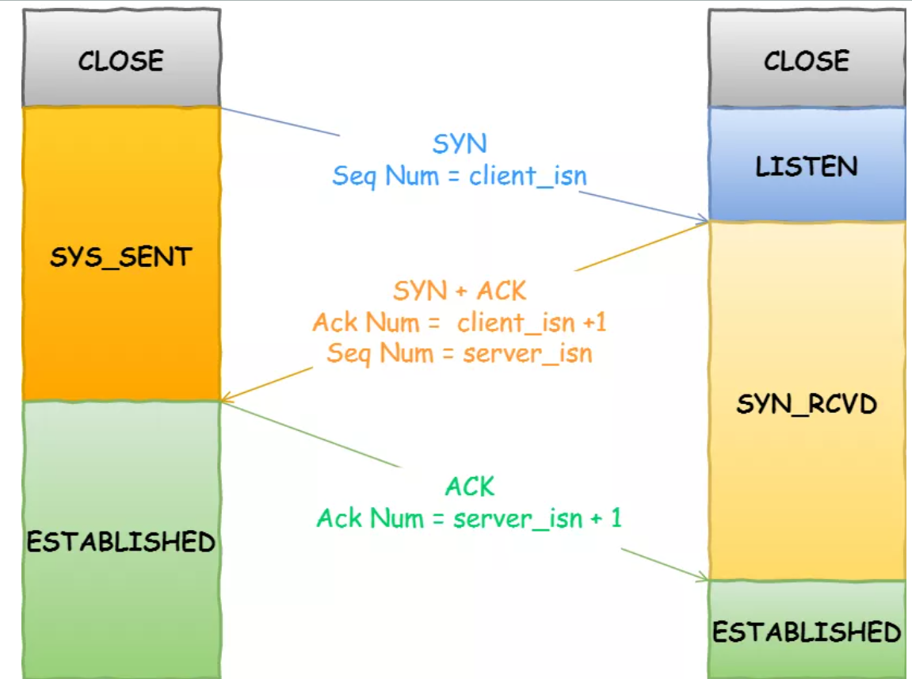

   1. 一开始，客户端和服务端都处于 CLOSED 状态。先是服务端主动监听某个端口，处于 LISTEN 状态
   2. 客户端会随机初始化序号（client_isn），将此序号置于 TCP 首部的「序号」字段中，同时把 SYN 标志位置为 1 ，表示 SYN 报文。然后**客户端发送SYN报文，表示想建立连接。**
   3. 服务端收到客户端的 SYN 报文后，首先服务端也随机初始化自己的序号（server_isn），将此序号填入 TCP 首部的「序号」字段中，其次把 TCP 首部的「确认应答号」字段填入 client_isn + 1, 接着把 SYN 和 ACK 标志位置为 1。最后把该报文发给客户端，该报文也不包含应用层数据，之后服务端处于 SYN-RCVD 状态。**(SYN-ACK包中的seq也是随机的，但是ack是SYN包的seq+1)**
   4. 客户端收到服务端报文后，还要向服务端**回应最后一个应答报文**，首先该应答报文 TCP 首部 ACK 标志位置为 1 ，其次「确认应答号」字段填入 server_isn + 1 ，最后把报文发送给服务端，这次报文可以携带客户到服务器的数据，之后客户端处于 ESTABLISHED 状态。**(ack是SYN-ACK中的seq+1，这个ACK报文不需要对面回复信息，所以可以没有seq)**

1. TCP协议的四次挥手过程：TCP 断开连接既可以是由客户端发起的，也可以是由服务器端发起的；如果由客户端发起断开连接操作，则称客户端主动断开连接；如果由服务器端发起断开连接操作，则称服务端主动断开连接。

1. 客户端发送一个FIN=1,seq = X的报文给服务器端，表示在客户端关闭链路前要发送的数据已经安全发送完毕，可以开始关闭链路操作，并请求服务器端确认关闭客户端到服务端的链路操作。此时客户端处于FIN-WAIT-1状态。
2. 服务端收到FIN消息后，回应一个ACK=1, seq=Y, ack = X + 1的消息给客户端，表示已经收到客户端断开链路的请求，TCP服务器端进程通知高层应用进程释放客户端到服务器端的连接，服务器处于**CLOSE_WAIT状态(半关闭状态)**。客户端在收到ACK消息后处于FIN-WAIT-2状态。
3. 服务器将**主动关闭连接请求的FIN=1**,  ACK = 1, ack = X + 1, seq = Z的消息给客户端，表示在服务端关闭链路前要发送的数据已经安全发送完毕，可以**开始关闭链路操作**， 此时进入LAST_ACK状态，等待客户端最终断开链路。
4. 客户端在收到FIN消息之后，**发送ACK** = 1, ack = Z + 1, seq = W的消息**给服务端**，然后**客户端进入TIME_WAIT状态**，TCP还没有释放连接，还需要等到2 *MSL最长报文段寿命时间后，客户端进入CLOSE状态。
5. seq序号不会重复，一直增大，而且客户端依次出现的状态为: FIN-WAIT-1, FIN-WAIT-2, TIME_WAIT、 CLOSE， 服务度端依次进入的状态有CLOSE_WAIT，LAST_ACK_CLOSE

6. 为什么客户端进入TIME_WAIT后还需要经过2MSL的时间等待？
    1. 防止第四次挥手发送的ACK信息超时，预留时间应对超时问题。
    2. tcp连接是： A(1.2.3.4:8888)------B(6.7.8.9:9999), 这就是一个tcp四元组。 **当tcp连接关闭后， 四元组释放**。 后面的**新连接可能会重用到这个四元组**（有这个可能性）， 那么问题就来了： 新四元组和旧四元组完全一致， 他们的网络包会混乱吗？所以相当于让这个旧的tcp连接消失一会，避免混乱了

## 为什么不是两次握手和四次握手？

1. 两次握手：无法防止历史连接的建立(旧的重复连接初始化造成混乱)，会造成双方资源的浪费，也无法可靠的同步双方序列号；关键可能是三次握手后，双方能建立稳定的序列号，通过seq和ack，避免连接的混淆。还有一个就是第三次握手是用来验证B的发送能力和A的接受能力的，第一次是A发B收，第二次是B发A收，第三次是A发B收(此时AB收发都正常)
2. 「四次握手」：三次握手就已经理论上最少可靠连接建立，所以不需要使用更多的通信次数。(**握手太多了有点浪费了**)

## 什么是 SYN 攻击？怎么预防

- 什么是SYN攻击：我们都知道 TCP 连接建立是需要三次握手，假设攻击者短时间伪造不同 IP 地址的 SYN 报文，服务端每接收到一个 SYN 报文，就进入SYN_RCVD 状态，但服务端发送出去的 ACK + SYN 报文，无法得到未知 IP 主机的 ACK 应答，久而久之就会占满服务端的 SYN 接收队列（未连接队列），使得服务器不能为正常用户服务
1. 过滤网关防护
   1. **网关超时设置**：防火墙设置SYN转发超时参数（状态检测的防火墙可在状态表里面设置），该参数远小于服务器的timeout时间。当客户端发送完SYN包，服务端发送确认包后（SYN+ACK），**防火墙如果在计数器到期时还未收到客户端的确认包（ACK），则往服务器发送RST包，以使服务器从队列中删去该半连接。**值得注意的是，网关超时参数设置不宜过小也不宜过大，超时参数设置过小会影响正常的通讯，设置太大，又会影响防范SYN攻击的效果，必须根据所处的网络应用环境来设置此参数。
   2. **SYN网关**：SYN网关收到客户端的SYN包时，直接转发给服务器；**SYN网关收到服务器的SYN/ACK包后，将该包转发给客户端，同时以客户端的名义给服务器发ACK确认包。**此时服务器由半连接状态进入连接状态。当客户端确认包到达时，如果有数据则转发，否则丢弃。事实上，服务器除了维持半连接队列外，还要有一个连接队列，如果发生SYN攻击时，将使连接队列数目增加，但一般服务器所能承受的连接数量比半连接数量大得多，所以这种方法能有效地减轻对服务器的攻击。
   3. **SYN代理**：当客户端SYN包到达过滤网关时，**SYN代理并不转发SYN包**，而是以服务器的名义主动回复SYN/ACK包给客户，如果收到客户的ACK包，表明这是正常的访问，此时防火墙向服务器发送ACK包并完成三次握手。**SYN代理事实上代替了服务器去处理SYN攻击**，此时要求过滤网关自身具有很强的防范SYN攻击能力。 
2. 加固tcp/ip协议栈
   1. SYN cookies技术   
      1. 在TCP实现中，当收到客户端的SYN请求时，服务器需要回复SYN+ACK包给客户端，客户端也要发送确认包给服务器。通常，服务器的初始序列号由服务器按照一定的规律计算得到或采用随机数，但在SYN cookies中，服务器的初始序列号是通过对客户端IP地址、客户端端囗、服务器IP地址和服务器端囗以及其他一些安全数值等要素进行hash运算，加密得到的，称之为cookie。当服务器遭受SYN攻击使得backlog队列满时，服务器并不拒绝新的SYN请求，而是回复cookie（回复包的SYN序列号）给客户端， 如果收到客户端的ACK包，服务器将客户端的ACK序列号减去1得到cookie比较值，并将上述要素进行一次hash运算，看看是否等于此cookie。如果相等，直接完成三次握手（注意：此时并不用查看此连接是否属于backlog队列）。
   2. 缩短超时时间

## TCP 的 CLOSE_WAIT 和 TIME_WAIT 状态(四次挥手)

TCP协议规定，对于已经建立的连接，**网络双方要进行四次握手才能成功断开连接，如果缺少了其中某个步骤，将会使连接处于假死状态，连接本身占用的资源不会被释放**。为了保证服务器资源，需要了解每个连接的状态。

1. TIME_WAIT：TIME_WAIT 是**主动关闭链接**时形成的，等待2MSL时间，约4分钟。主要是防止最后一个ACK丢失。由于TIME_WAIT 的时间会非常长，server端应尽量减少主动关闭连接。
   1. 为什么需要TIME_WAIT: **假设最终的ACK丢失**，server将重发FIN，client必须维护TCP状态信息以便可以重发最终的ACK，否则会发送RST，结果server认为发生错误。**TCP实现必须可靠地终止连接的两个方向**
   2. 作用：1. 防止具有相同「四元组」的「旧」数据包被收到(进入TIME_WAIT状态后不会再发送数据) 2. 确保连接正常关闭。
2. CLOSE_WAIT：CLOSE_WAIT是被动关闭连接形成的。根据TCP状态机，**服务器端收到客户端发送的FIN**，则按照TCP实现发送ACK，因此**进入CLOSE_WAIT状态**。
   1. close_wait告诉被关闭方，他已经被人关了，他需要尽快的主动去关闭和那个人的连接，防止忙忘了。
   2. 如果一直保持在CLOSE_WAIT状态，那么只有一种情况，就是在对方关闭连接之后服务器程序自己没有进一步发出ack信号。换句话说，就是在对方连接关闭之后，程序里没有检测到，或者程序压根就忘记了这个时候需要关闭连接，于是这个资源就一直 被程序占着。查代码。因为问题出在服务器程序里头啊。

## UDP可靠传输的实现说一下

UDP本身是不保证可靠传输的，但是可以通过应用层来入手，类似模仿TCP，加入seq/ack以及超时重传机制。

目前有如下开源程序利用udp实现了可靠的数据传输。分别为RUDP、 实时传输协议（RTP）、基于UDP的数据传输协议（UDP-basedData Transfer Protocol，简称UDT）。

## UDP真的是不可靠的协议吗？

本身不是不可靠协议，只不过是复杂的网络环境中，网络拥塞，负载过高等经常发生，这些情况导致的丢包，而不是UDP本身传输就丢包，然后也只不过是UDP本身没有加入确认，重传，超时机制，设置包序号，不重排，不会发生队首阻塞。

## TCP快连接(TCP fast open)

## NAT协议

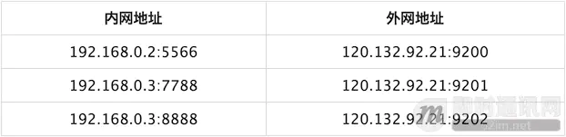
- NAT（Network Address Translation，网络地址转换）
- NAT不仅能解决了iP地址不足的问题，而且还能够有效地避免来自网络外部的攻击，隐藏并保护网络内部的计算机。把内网的私有地址，转化成外网的公有地址。使得内部网络上的（被设置为私有IP地址的）主机可以访问Internet。

1.宽带分享：这是 NAT 主机的最大功能。

2.安全防护：NAT 之内的 PC 联机到 Internet 上面时，他所显示的 IP 是 NAT 主机的公共 IP，所以 Client 端的 PC 当然就具有一定程度的安全了，外界在进行 portscan（端口扫描） 的时候，就侦测不到源Client 端的 PC 。
3. 虚拟机也可以借助主机上的NAT访问Internet，但是外部网络无法访问虚拟机上的服务。
4. 桥接模式可以互相访问

1. 网络被分为私网,公网两部分,NAT网关设置私网到公网的路由出口.
2. 网络只能由私网侧发起,公网无法主动访问私网主机(是这样设计的,但是可以通过打洞)
3. NAT网关在两个访问方向上完成两次地址的转换,出口替换源地址,入口替换目的地址
4. NAT网关的存在对通信双方保持透明
5. NAT网关为了实现双向翻译,需要维持一张关联表,将会话信息保存

# 应用层

## HTTP协议（应用层）

- 超文本传输协议（Hypertext Transfer Protocol，HTTP）是一个简单的请求 - 响应协议，它通常运行在TCP 之上。它指定了客户端可能发送给服务器什么样的消息以及得到什么样的响应。请求和响应消息的头以 ASCII 形式给出；而消息内容则具有一个类似 MIME 的格式。HTTP是万维网的数据通信的基础。
- 默认端口为80

         HTTP的发展是由蒂姆·伯纳斯-李于1989年在欧洲核子研究组织（CERN）所发起。HTTP的标准制定由万维网协会（World Wide Web Consortium，W3C）和互联网工程任务组（Internet Engineering TaskForce，IETF）进行协调，最终发布了一系列的RFC，其中最著名的是1999年6月公布的 RFC 2616，定义了HTTP协议中现今广泛使用的一个版本——HTTP 1.1。

-------------------------------------------------------------------------------------------
**以下是 HTTP 请求/响应的步骤：**

1. 客户端连接到 Web 服务器
   一个HTTP客户端，通常是浏览器，与 Web 服务器的 HTTP 端口（默认为 80 ）建立一个 TCP 套接字连接。例如，<http://www.baidu.com>（URL）
2. 发送 HTTP 请求
   通过 TCP 套接字，客户端向 Web 服务器发送一个文本的请求报文，一个**请求报文由请求行、请求头部、空行和请求数据 4 部分组成**。
3. 服务器接受请求并返回 HTTP 响应
   Web 服务器解析请求，定位请求资源。服务器将资源复本写到 TCP 套接字，由客户端读取。一个**响应由状态行、响应头部、空行和响应数据 4 部分组成**。
4. 释放连接 TCP 连接
   若 connection 模式为 close，则服务器主动关闭 TCP连接，客户端被动关闭连接，释放 TCP 连接；若connection 模式为 keepalive，则该连接会保持一段时间，在该时间内可以继续接收请求;
5. 客户端浏览器解析 HTML 内容
   客户端浏览器首先解析状态行，查看表明请求是否成功的状态代码。然后解析每一个响应头，响应头告知以下为若干字节的 HTML 文档和文档的字符集。客户端浏览器读取响应数据 HTML，根据HTML 的语法对其进行格式化，并在浏览器窗口中显示。

-------------------------------------------------------------------------------------------
**在浏览器地址栏键入URL，按下回车之后会经历以下流程：**

1. 浏览器向 DNS 服务器请求解析该 URL 中的域名所对应的 IP 地址;
2. 解析出 IP 地址后，根据该 IP 地址和默认端口 80，和服务器建立 TCP 连接;
3. 浏览器发出读取文件（ URL 中域名后面部分对应的文件）的 HTTP 请求，该请求报文作为 TCP 三次握手的第三个报文的数据发送给服务器;
4. 服务器对浏览器请求作出响应，并把对应的 HTML 文本发送给浏览器;
5. 释放 TCP 连接;
6. 浏览器将该 HTML 文本并显示内容。

## 输入<https://www.shopee.com> 以后的过程？(完整的计网流程，ARP那块不能忘，有多少次网络交互)

1. 流程
   1. 浏览器获取输入的域名www.baidu.com
   2. 浏览器向DNS请求解析www.baidu.com的IP地址
   3. 浏览器与该服务器建立TCP连接(默认端口号80)
   4. 浏览器发出HTTP请求，请求百度首页
   5. 服务器通过HTTP响应把首页文件发送给浏览器
   6. TCP连接释放
   7. 浏览器将首页文件进行解析，并将Web页显示给用户。
2. 涉及哪些协议
   从上到下，经历过的协议
   1. dns协议，将域名解析为对应的ip地址
   2. tcp协议，连接服务器
   3. ip协议，tcp连接发送的数据在网络层中使用ip协议
   4. 开放式最短路径优先协议(open shortest path fast，ospf)，路由器之间的选择使用ospf协议
   5. NAT（网络地址转换协议）协议，NAT的实现方式有三种，即静态转换Static Nat、动态转换Dynamic Nat和端口多路复用OverLoad。
      1. 端口多路复用（Port address Translation,PAT）是指改变外出数据包的源端口并进行端口转换，即端口地址转换（PAT，Port Address Translation）.采用端口多路复用方式。内部网络的所有主机均可共享一个合法外部IP地址实现对Internet的访问，从而可以最大限度地节约IP地址资源。同时，又可隐藏网络内部的所有主机，有效避免来自internet的攻击。因此，网络中应用最多的就是端口多路复用方式。
   6. arp协议(地址解析协议)，路由器与服务器通信，需要通过arp协议**将ip地址转换为mac地址**，arp协议的原理如下：
      1. 首先，**每个主机都会在自己的ARP缓冲区中建立一个ARP列表**，以表示IP地址和MAC地址之间的对应关系。
      2. 当源主机要发送数据时，**首先检查ARP列表中是否有对应IP地址的目的主机的MAC地址**，如果有，则直接发送数据，如果没有，**就向本网段的所有主机发送ARP数据包，该数据包包括的内容有：源主机IP地址，源主机MAC地址，目的主机的IP地址**。
      3. 当本网络的所有主机收到该ARP数据包时，首先检查数据包中的目的IP地址是否是自己的IP地址，如果不是，则忽略该数据包，如果是，则首先从数据包中取出源主机的IP和MAC地址写入到ARP列表中，如果已经存在，则覆盖，然后将自己的MAC地址写入ARP响应包中，告诉源主机自己是它想要找的MAC地址。
      4. 源主机收到ARP响应包后。将目的主机的IP和MAC地址写入ARP列表，并利用此信息发送数据。如果源主机一直没有收到ARP响应数据包，表示ARP查询失败。
      5. **广播发送ARP请求，单播发送ARP响应。**
      6. ARP只在局域网中传播
   7. http协议，在tcp连接后，采用http协议访问网页

## http是有状态还是无状态？是有连接还是无连接？

1. **http协议本身是无状态的**(即不同的客户访问同一个页面的时候或者再次访问的时候，结果应该是一致的)，但现在有些网页会要求记录用户信息，是通过借助Cookies来实现的。
2. **http协议本身是无连接的**，http采用的是TCP连接，所以需要有一个TCP的三次握手建立连接，但是http本身之间是不需要建立连接的。

## 非持续连接和持续连接

非持续连接必须为每个请求维护一个连接，对于每个连接，在客户和服务器中都要分配 TCP 缓冲区，给服务器造成很大负担。每次请求到响应大约需要花费两个 RTT 加上服务器传输文件的时间，RTT 指分组从客户到服务器再返回客户的时间。三次握手的前两部分占用一个 RTT，第三部分向服务器发送请求报文，服务器收到后做出响应，占用另一个 RTT。

HTTP1.1 使用持续连接，服务器响应后保持连接打开。在相同客户与服务器之间，后续的请求和响应报文能够通过相同的连接进行传送。

## HTTP请求报文

- 请求报文包含请求的方法、URL、协议版本、请求头部和请求数据
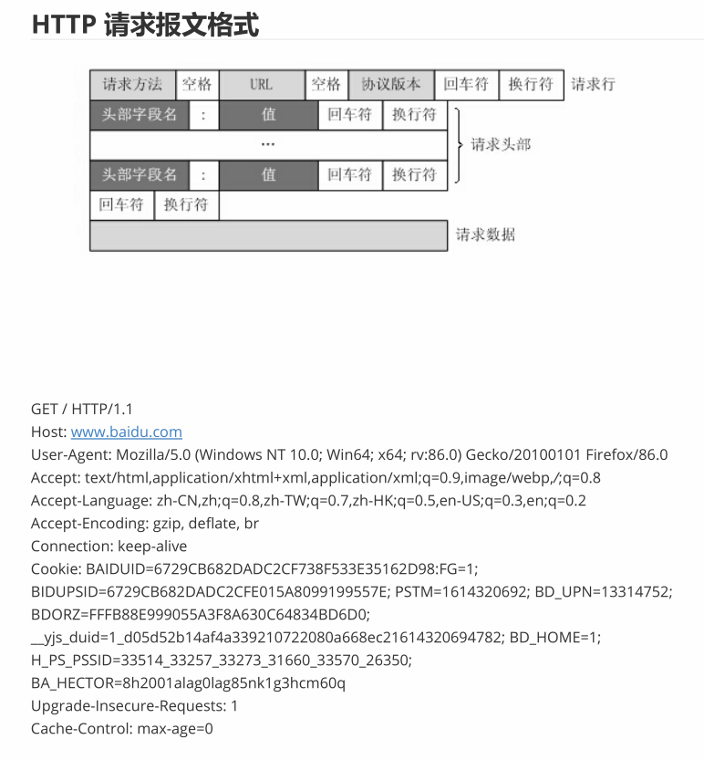
**HTTP请求报文由请求行、请求头部、空行、请求数据三部分组成。**

1. 请求报文的第一行：请求方法(GET/POST)+URL+HTTP版本的形式。
2. 后面部分是请求头：包含的属性信息，服务器通过请求头部分来了解客户端的信息，缓存部分也是属性。
3. 请求体：它将一个页面表单中的组件值(用户名，密码)通过param1=value1&param2=value2的键值对形式编码成一个格式化串

## HTTP的响应报文

- 响应的内容包括协议的版本、成功或者错误代码、服务器信息、响应头部和响应数据
**响应由响应行、响应头部、空行和响应数据 4 部分组成**
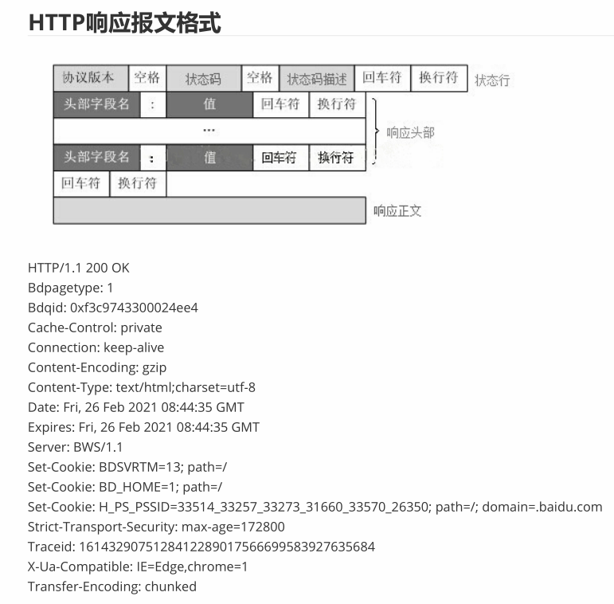

1. 响应行：报文协议(HTTP协议版本号) + 状态码
2. 响应头：同理，也是由多个属性情况组成。(Cookies)
3. 响应报文体，即我们真正要的“干货”，是针对请求报文的答复信息。

## HTTP头部有哪些字段，有哪些状态码，有哪些方法

HTTP的头域包括通用头，请求头，响应头和实体头四个部分。每个头域由一个域名，冒号（:）和域值三部分组成。

1. 通用头域：通用头域包含请求和响应消息都支持的头域，通用头域包含Cache-Control、 Connection、Date、Pragma、Transfer-Encoding、Upgrade、Via。
   1. Cache-Control缓存控制头域：指定请求和响应遵循的缓存机制。在请求消息或响应消息中设置 Cache-Control并不会修改另一个消息处理过程中的缓存处理过程。客户端和服务端可以有独立的缓存机制
   2. Date头域：date头域表示消息发送的时间，时间的描述格式由rfc822定义。
   3. Pragma头域用来包含实现特定的指令，最常用的是Pragma:no-cache。
   4. Connection表示是否需要持久连接
2. 响应头：　响应头向客户端提供一些额外信息，比如谁在发送响应、响应者的功能，甚至与响应相关的一些特殊指令。这些头部有助于客户端处理响应，并在将来发起更好的请求。
   1. Age：当代理服务器用自己缓存的实体去响应请求时，用该头部表明该实体从产生到现在经过多长时间了。
   2. Location：Location可以将响应接收方引导至与当前请求url位置不同的资源(重定向有关)
   3. Server：WEB 服务器表明自己是什么软件及版本等信息。例如：Server：Apache/2.0.61 (Unix)
3. 请求头：是请求报文特有的，它们为服务器提供了一些额外信息，比如客户端希望接收什么类型的数据，如Accept头部。
   1. Accept:text/html,image/*支持的文件格式；*/*表示任何类型，type/* 表示该类型下的所有子类型，
   2. Accept-Charset:ISO-8859-1,unicode-1-1 //支持的字符集
   3. Accept-Language：浏览器申明自己接收的语言。语言跟字符集的区别：中文是语言，中文有多种字符集，比如big5，gb2312，gbk等等。
   4. Accept-Encoding:gzip,compress //支持的编码方式
   5. Proxy-Authenticate：代理服务器响应浏览器，要求其提供代理身份验证信息。
   6. Host：客户端指定自己想访问的WEB服务器的域名/IP 地址和端口号。如Host：rss.sina.com.cn
4. 实体头部：实体头部提供了有关实体及其内容的大量信息，从有关对象类型的信息，到能够对资源使用的各种有效的请求方法。总之，实体头部可以告知接收者它在对什么进行处理。请求消息和响应消息都可以包含实体信息，大部分和content相关
   1. ALLOW：服务器支持哪些请求方法（如GET、POST等）。
   2. Content-Encoding: WEB服务器表明自己使用了什么压缩方法（gzip，deflate）压缩响应中的对象。例如：Content-Encoding：gzip
   3. Content-Language: WEB服务器告诉浏览器理解主体时最适宜使用的自然语言。
   4. Content-Location: 资源实际位置
   5. Content-Length:800  //大小
   6. Content-Type:text/html;charset=GB2312  //指定文件类型，和字符集
   7. Content-Location:HTTP://www.php-oa.com/index.html   //重定向到

## HTTP请求方法

1. GET：向指定的资源发出“显示”请求。使用 GET 方法应该只用在读取数据，而不应当被用于产生“副作用”的操作中，例如在 Web Application 中。其中一个原因是 GET 可能会被网络蜘蛛等随意访问。
2. HEAD：与 GET 方法一样，都是向服务器发出指定资源的请求。只不过服务器将不传回资源的本文部分。它的好处在于，使用这个方法可以在不必传输全部内容的情况下，就可以获取其中“关于该资源的信息”（元信息或称元数据）。
3. POST：向指定资源提交数据，请求服务器进行处理（例如提交表单或者上传文件）。数据被包含在请求本文中。这个请求可能会创建新的资源或修改现有资源，或二者皆有。
4. PUT：向指定资源位置上传其最新内容。
5. DELETE：请求服务器删除 Request-URI 所标识的资源。
6. TRACE：回显服务器收到的请求，主要用于测试或诊断。
7. OPTIONS：这个方法可使服务器传回该资源所支持的所有 HTTP 请求方法。用'*'来代替资源名称，向 Web 服务器发送 OPTIONS 请求，可以测试服务器功能是否正常运作。
8. CONNECT：HTTP/1.1 协议中预留给能够将连接改为管道方式的代理服务器。通常用于SSL加密服务器的链接（经由非加密的 HTTP 代理服务器）。

-------------------------------------------------------------------------------------------------------

1. get和post
   1. GET 方式通过 URL 提交数据，数据在 URL 中可以看到，GET是幂等性的，用做查询更好
   2. POST 方式，数据放置在 HTML HEADER 内提交。post是非幂等，所以用作新增比较好。
   3. 如果传输较大的数据的话，post可以实现，因为get传输的数据量有限。
   4. GET在浏览器回退时是无害的，而POST会再次提交请求
   5. GET产生一个TCP数据包；POST产生两个TCP数据包(对于GET方式的请求，浏览器会把http header和data一并发送出去而POST是分开发送，服务器响应200（返回数据）
2. post和put
   1. post和put的区别在于uri，post创建资源，url可以是上级目录格式，put是更新资源，url是完整的。
   2. 从restful的资源角度来看，put幂等，post非幂等。
3. put和patch
   1. PUT 表示更新全部资源，PATCH 表示更新部分资源
   2. PATCH 方法是非幂等的，所以使用起来需要更加小心

## HTTP状态码

- 所有HTTP响应的第一行都是状态行，依次是当前HTTP版本号，3位数字组成的状态代码，以及描述状态的短语，彼此由空格分隔。
   状态代码的第一个数字代表当前响应的类型：

   **1xx信息性状态码**——接受的请求正在处理
      100： 继续(Continue)。客户端继续其请求
   **2xx成功状态码**——请求正常处理完毕
      200: 请求成功
      202: 已接受。已经接受请求，但未处理完成
   **3xx重定向状态码**——需要进行附加操作以完成请求
      301：资源/网页等被永久转移到新的URL
   **4xx客户端错误状态码**——请求含有词法错误或者无法被执行
      404：请求的资源/网页不存在
   **5xx服务器错误状态码**——服务器在处理某个正确请求时发生错误
      500：内部服务器错误
      502 是报错类型代码 bad gateway 错误的网关。
      
         虽然 RFC 2616 中已经推荐了描述状态的短语，例如"200 OK"，"404 Not Found"，但是WEB开发者仍
         然能够自行决定采用何种短语，用以显示本地化的状态描述或者自定义信息。

**状态码**
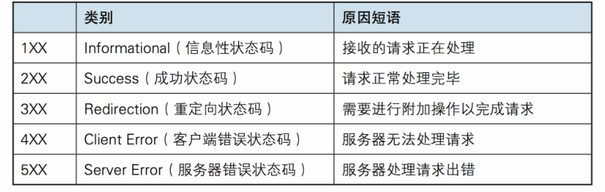

## 111HTTP各个版本之间的关系(1.0 1.1 2.0)

1. HTTP协议(超文本传输协议)：所有的WWW文件都必须遵守这个标准。设计HTTP最初的目的是为了提供一种发布和接收HTML页面的方法。**HTTP连接使用的是“请求—响应”的方式**，不仅在请求时需要先建立连接，而且需要客户端向服务器发出请求后，服务器端才能回复数据。

2.**HTTP 1.0**：HTTP 1.0规定浏览器与服务器只**保持短暂的连接**，浏览器的**每次请求都需要与服务器建立一个TCP连接**，服务器**完成请求处理后立即断开TCP连接**，服务器**不跟踪每个客户也不记录过去的请求**。 HTTP1.0最大的问题就是**连接无法复用和head of line blocking**这两个问题。每次请求都要进行一个TCP三次握手和慢启动。head of line blocking会导致带宽的利用率不足。
3. HTTP 1.1：为了克服HTTP 1.0的短暂连接缺陷，HTTP 1.1支持持久连接(先是长连接模型，它会保持连接去完成多次连续的请求，减少了不断重新打开连接的时间)，**在一个TCP连接上可以传送多个HTTP请求和响应**，减少了建立和关闭连接的消耗和延迟。HTTP 1.1还允许客户端不用等待上一次请求结果返回，就可以发出下一次请求(**可以不用严格遵守一应一答制度**)。**HTTP 1.1通过增加更多的请求头和响应头来改进和扩充HTTP 1.0的功能**
4. HTTP 2.0

   1. 多路复用特性：多路复用允许同时**通过单一的 HTTP/2 连接发起多重的请求-响应消息**，因此 HTTP/2 可以很容易的去实现**在一个TCP连接上多流并行**而不用依赖建立多个 TCP 连接。 因为服务区很多时候都会限制请求的连接数量。
   2. 二进制分帧(多个HTTP请求在一个TCP连接上完成)：HTTP/2在 应用层(HTTP/2)和传输层(TCP or UDP)之间增加一个二进制分帧层来实现HTTP 1.x中的低延时和高吞吐量的问题。在二进制分帧层中， **HTTP/2 会将所有传输的信息分割为更小的消息和帧**（frame）,并对它们采用二进制格式的编码 ，其中 HTTP1.x 的首部信息会被封装到 HEADER frame，而相应的 Request Body 则封装到 DATA frame 里面。HTTP/2 通信都在**一个连接上完成，这个连接可以承载任意数量的双向数据流**。HTTP/2 通过**让所有数据流共用同一个连接**，可以更有效地使用 TCP 连接，让高带宽也能真正的服务于HTTP的性能提升。**这种单连接多资源的方式，减少服务端的链接压力,内存占用更少,连接吞吐量更大**
   3. 首部压缩： HTTP/2 则使用了专门为首部压缩而设计的 HPACK 算法。HTTP1.X都是不支持首部压缩的，**首部压缩可以节省空间**
   4. **服务端推送：在 HTTP/2 中，服务器可以对客户端的一个请求发送多个响应**

**另一种总结**
5. HTTP1.1默认使用长连接，可有效减少TCP的三次握手开销。HTTP 1.0还是短链接
6. HTTP 1.1支持只发送header信息(不带任何body信息)
7. HTTP1.0是没有host域的，HTTP1.1才支持这个参数。
8. **HTTP2.0使用多路复用技术**(Multiplexing),多路复用允许同时通过**单一的 HTTP/2 连接发起多重的请求-响应**消息。HTTP1.1在同一时间对于同一个域名的请求数量有限制，超过限制就会阻塞请求。多路复用底层采用"**增加二进制分帧层**"的方法，使得不改变原来的语义、首部字段的情况下提高传输性能，降低延迟。
9. 二进制分帧将所有传输信息分割为更小的帧，用二进制进行编码，多个请求都在同一个TCP连接上完成，可以承载任意数量的双向数据流。
<https://blog.csdn.net/alexkx/article/details/107582427>

## HTTP长短连接适合用于哪些情况/场景(**http的长连接和短连接实际上是TCP的长连接和短连接**)？

1. 长连接
   1. 长连接适用于**操作频繁/点对点通讯等连接数不太多**的情况，如：一些游戏/即时通讯场景应该使用长连接；如：老师端和学生端的即时通讯教学软件； 最经典的案例是：数据库使用的连接
2. 短连接
   1. 短连接适用于Web【wapWeb/H5等】的http服务，长连接对于服务端来说会耗费一定资源。对于电子商务Web的访问量可能是千万级别甚至亿万级别的。如果使用长连接的方式 当一万个用户访问时会占用一万个连接，假设服务器站点（IIS等）的通信吞吐量只有1千个，那么另外九千人就彻底挂啦，所以**并发量大且用户不需要频繁的交互式操作**时 用短连接为上策。

**长短连接的区分**
区分长/短连接：整个客户端和服务端的(某一段时间)通讯过程是利用一个Socket还是多个Socket进行的。

## HTTP并发的时候长连接会出现什么问题，该怎么解决？

长连接表示的是连接→数据传输→保持连接(心跳)→数据传输→保持连接(心跳)→……→关闭连接（一个TCP连接通道多个读写通信), 这个过程其实是和TCP也有关联的，所以如果长连接很多的情况下，TCP的连接数也会越来越多，直到把服务器的TCP连接数给撑爆了，对于服务器来说，服务器里的这些个长连接其实很有数据库连接池的味道，大家都是为了节省连接重复利用嘛
所以**长连接多用于操作频繁，点对点的通讯，而且连接数不能太多情况**。一些游戏/即时通讯场景应该使用长连接，最典型的就是数据库连接。
所以如果是特别高并发的话，可能还是短链接好，对服务器的负担不会太大？

## ？？？HTTP的高可用性怎么实现？

1. 同样的业务用多个服务器，加负载均衡
2. 做拆分，类似的把业务更细分，以及数据库表也细分，将请求更细分到位把
3. 动态的资源静态化(CSS,JS)，缓存
4. 数据缓存，例如用Redis等高速缓存，Redis再做集群等

## HTTP无状态(Cookies和Session的区别和联系)

https://www.cnblogs.com/endlessdream/p/4699273.html

1. HTTP实现有状态可以借助于两种技术，Cookies和Session。
   1. **Cookie是客户端的存储空间**，由浏览器来维持。具体来说**cookie机制采用的是在客户端保持状态的方案**。
   2. **Session是保存在服务器上的**，客户端浏览器访问服务器的时候，服务器把客户端信息以某种形式记录在服务器上，这就是 Session。Session依据该 Cookie 来识别是否为同一用户。
2. session和cookies的区别
   1. 存储数据类型方面：session 能够存储多种类型，cookie 只能存储 String 类型的对象
   2. 存储位置不同：一个在客户端一个在服务端。因Cookie在客户端所以可以编辑伪造，不是十分安全。Session 会在一定时间内保存在服务器上，会比较占用你*服务器的性能*。考虑到减轻服务器性能方面，应当使用COOKIE；
   3. 单个cookie在客户端的限制是3K，就是说一个站点在客户端存放的COOKIE不能3K，Session一般不怎么提大小限制
3. 联系：Session是需要在Cookies使用的前提下才有用的
一般来说如果我们禁用Cookies的话，Session也就失效了，因为Session是通过Session ID来确定来确定当前对话所对应的服务器Session，而Session ID是通过Cookie来传递的，禁用Cookie相当于失去了Session ID，也就得不到Session了。一般默认由客户端的Cookie来保存Session ID。**解决方法是：**Session ID附着在URL中，这样再通过Session ID就能跨页使用Session变量了。
4. 总结
Cookies有点像用户自带的通行证，Session有点像服务器存着的用户明细表。Session需要Cookies的支持。
4. 场景
**免登录服务**->Cookies，
**购物车信息服务端维护服务**->Session
5. session的创建：
   1. 当程序需要为某个客户端的请求创建一个session时，服务器首先检查这个客户端的请求里是否已包含了sessionId，如果已包含则说明以前已经为此客户端创建过session，服务器就按照sessionId把这个session检索出来使用（检索不到，会新建一个），如果客户端请求不包含sessionId，则为此客户端创建一个session并且生成一个与此session相关联的sessionId，sessionId的值是一个既不会重复，又不容易被找到规律以仿造的字符串，这个sessionId将被在本次响应中返回给客户端保存。
6. session共享
   1. 对于多网站(同一父域不同子域)单服务器，我们需要解决的就是来自不同网站之间SessionId的共享。由于域名不同(aaa.test.com和bbb.test.com)，而SessionId又分别储存在各自的cookie中，因此服务器会认为对于两个子站的访问,是来自不同的会话。解决的方法是通过修改cookies的域名为父域名达到cookie共享的目的,从而实现SessionId的共享。带来的弊端就是，子站间的cookie信息也同时被共享了。  

## Cookies和Session工作原理

1. Cookies工作原理
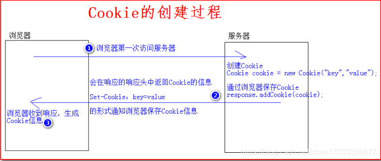
   1. 浏览器端第一次发送请求到服务器端
   2. 服务器端创建Cookie，该Cookie中包含用户的信息(Cookies其实是一个key-val对，然后再响应头中返回Cookies信息)，然后将该Cookie发送到浏览器端
   3. 浏览器端再次访问服务器端时会携带服务器端创建的Cookie
   4. 服务器端通过Cookie中携带的数据区分不同的用户
2. Session工作原理
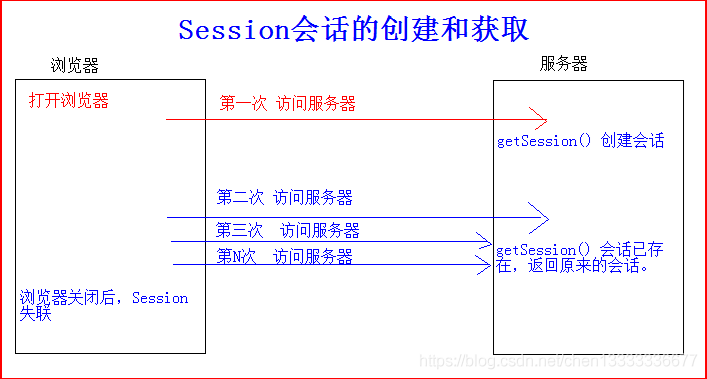
   1. 浏览器端第一次发送请求到服务器端，服务器端创建一个Session，同时会创建一个特殊的Cookie(name为JSESSIONID的固定值，value为session对象的ID)，然后将该Cookie发送至浏览器端
   2. 浏览器端发送第N（N>1）次请求到服务器端,浏览器端访问服务器端时就会携带该name为JSESSIONID(**session id**)的Cookie对象
   3. 服务器端根据name为JSESSIONID的Cookie的value,去查询Session对象，从而区分不同用户。
      1. name为JSESSIONID的Cookie不存在（关闭或更换浏览器），返回1中重新去创建Session与特殊的Cookie
      2. name为JSESSIONID的Cookie存在，**根据value中的SessionId去寻找session对象**
      3. value为SessionId不存在**（Session对象默认存活30分钟）**，返回1中重新去创建Session与特殊的Cookie
      4. value为SessionId存在，返回session对象

## Cookies攻击的话，该怎么防守？

Cookies攻击的话，应该是指攻击者利用用户存在本地的cookie进行认证，然后伪造用户发出请求
**怎么预防**

1. 给Cookie添加HttpOnly属性(可以在response.addHeader或则setHeader中设置HttpOnly), 这种属性设置后, 只能在http请求中传递, 在脚本中, document.cookie无法获取到该Cookie值.
2. cookie中session id的定时更换, 让session id按一定频率变换, 同时对用户而言, 该操作是透明的, 这样保证了服务体验的一致性.
3. **在cookie中添加校验信息(攻击者和用户大概率不在一个空间), 这个校验信息和当前用户外置环境有些关系,比如ip,user agent等有关**. 这样当cookie被人劫持了, 并冒用, 但是在服务器端校验的时候, 发现校验值发生了变化, 因此要求重新登录, 这样也是种很好的思路, 去规避cookie劫持.

## HTTP如何实现缓存（**强制缓存和对比缓存**），怎样告诉浏览器这个可以被缓存以及缓存时间

在HTTP报文中，报文信息主要分为两部分，首部header和主体部分body，和缓存相关的cookies以及缓存信息都存放在header中。

1. 缓存规则机制：我们认为浏览器存在一个缓存数据库,用于存储缓存信息。在客户端第一次请求数据时，此时缓存数据库中没有对应的缓存数据，需要请求服务器，服务器返回后，将数据存储至缓存数据库中
   1. 强制缓存： 是指如果请求的资源在缓存中，即缓存命中，则直接参考缓存数据库，不会去向服务器咨询。
      1. 强制缓存中，header部分有两个字段来标明失效规则->expires(有效时间，在HTTP 1.1中被cache-control替代) / cache-control(Cache-Control 是最重要的规则)，具体如下
         1. private：客户端可以缓存
         2. public：客户端和代理服务器都可缓存
         3. max-age=xx：缓存的内容将在 xxx 秒后失效
         4. no-cache：需要使用对比缓存来验证缓存数据
         5. no-store：所有内容都不会缓存，强制缓存，对比缓存都不会触发
   2. 对比缓存： 是指尽管缓存命中了，但是会向服务器验证，验证成功后，才会去缓存数据库中读取。虽然必须和服务器对比一次，但是因为只需要缓存信息的标识号，所以还是速度比较快的，**对比缓存的核心还是缓存标识**
      1. Last-Modified：服务器在响应请求时，告诉浏览器资源的最后修改时间
      2. If-Modified-Since：再次请求服务器时，**通过此字段通知服务器上次请求时，服务器返回的资源最后修改时间**。服务器收到请求后发现有头If-Modified-Since 则与被请求资源的最后修改时间进行比对。**若资源的最后修改时间大于If-Modified-Since，说明资源又被改动过，则响应整片资源内容，返回状态码200**；若资源的**最后修改时间小于或等于If-Modified-Since，说明资源无新修改**，则响应HTTP **304**，告知浏览器继续使用所保存的cache。

## 缓存更新策略

缓存数据会和真实数据有一段时间的不一致，需要利用某种策略进行更新。低一致性业务建议配置最大内存并使用算法剔除，高一致性业务可以结合超时剔除和主动更新，即使主动更新出错也能保证数据过期后删除脏数据。
**算法剔除**

- **FIFO 先进先出**
  判断存储时间，离当前时间最远的数据优先淘汰。
  新数据插入队列尾部，数据在队列中顺序移动；淘汰队列头部的数据。
- **LRU 最近最少使用**
  判断最近使用时间，离当前时间最远的数据优先被淘汰。
  新数据插入到队列头部；每当缓存命中则将数据移到队列头部；当队列满的时候，将队列尾部的数据丢弃。
- **LFU 最不经常使用**
  在一段时间内，被使用次数最少的数据优先淘汰。LFU 的每个数据块都有一个引用计数，所有数据块按照引用计数排序，具有相同引用计数的数据块按时间排序。
  新数据插入到队列尾部；数据被访问后引用计数增加，队列重新排序；当需要淘汰数据时，将队列尾部数据删除。
剔除算法常用于缓存使用量超过预设最大值时对现有数据进行剔除，数据一致性最差。

**2 超时剔除**
通过给缓存设置过期时间实现，例如 Redis 的 expire 命令。如果业务可以容忍一段时间内缓存数据和真实数据不一致，可以为其设置过期时间，在数据过期后再从数据源获取数据，更新缓存并设置过期时间。数据一致性较差。

**3 主动更新**
在真实数据更新后立即更新缓存，可以利用消息系统实现。数据一致性强，但如果主动更新出错会导致脏数据，建议结合超时剔除使用。

## 11Cookie怎么开启，什么时候开启，什么时候不开启等  ·

- Cookie
当服务器收到 HTTP 请求时，服务器可以在响应头里面添加一个 Set-Cookie 选项。浏览器收到响应后通常会保存下 Cookie，之后对该服务器每一次请求中都通过  Cookie 请求头部将 Cookie 信息发送给服务器。
- 怎么开启

## 11你知道webSocket工作在哪一层吗？HTTP，socket和webSOCKET的区别

1. webSocket工作在应用层，webSocket的最大特点是服务器可以主动向客户端推送信息，客户端也可以主动向服务器发送信息，是真正的双向平等对话(HTTP只能客户端发起)，实现了全双工通信。
2. socket和HTTP的区别
   1. HTTP是基于TCP连接的，主要解决如何包装数据
   2. socket是对TCP/IP的封装，是一个调用接口API。
   3. HTTP早期就还是短连接(后面的长连接，维持的时间也比较短1min左右)，服务器响应完就会断开连接，socket是长连接，建立连接后，不会主动断掉，一般只有在比较特殊的情况下断开。
3. socket原理：
   1. Socket 是对 TCP/IP 协议的封装，Socket 只是个接口不是协议，通过 Socket 我们才能使用 TCP/IP 协议。TCP 三次握手：握手过程中并不传输数据，握手完后才会有数据传输，一般TCP连接一旦建立，只有主动断开才会断开(长连接)
   2. **Socket 连接,至少需要一对套接字分为 clientSocket，serverSocket**连接分为3个步骤:
      1. 服务器监听:服务器并不定位具体客户端的套接字，而是时刻处于监听状态
      2. 客户端请求:客户端的套接字要描述它要连接的服务器的套接字，提供地址和端口号，然后向服务器套接字提出连接请求
      3. 连接确认:当服务器套接字收到客户端套接字发来的请求后，就响应客户端套接字的请求,并建立一个新的线程,把服务器端的套接字的描述发给客户端。一旦客户端确认了此描述，就正式建立连接。
4. webSocket：webSocket必须依赖 HTTP 协议进行一次握手 ，握手成功后，数据就直接从 TCP 通道传输，与 HTTP 无关了即 **webSocket分为握手和数据传输阶段，即进行了HTTP握手 + 双工的TCP连接。**
   1. 连接阶段：通过第一次HTTP Request建立了连接之后，后续的数据交换都不用再重新发送HTTP Request，节省了带宽资源。
   2. 传输阶段：Websocket的数据传输是frame形式传输的，比如会将一条消息分为几个frame，按照先后顺序传输出去。

## 怎么用tcp实现websocket的功能

## HTTP HTTPS的区别

- HTTP：
    默认工作端口是TCP 80，HTTP采用**明文方式**发松内容，不提供数据加密，不适合传输敏感信息
- HTTPS：
    超文本传输安全协议。HTTPS经过HTTP进行通信，但**利用SSL/TLS来加密数据包**，默认工作端口是TCP 443.  **HTTPS = HTTP + SSL**
- 两者的区别
  - HTTP安全性较差，但是响应速度更快，因为HTTP除了TCP三次握手外还需要SSL握手的
  - 段口号也不一样，分别是TCP80和TCP443
  - HTTPS可以理解为是建立在SSL/TLS上的HTTP，所以更耗费服务器资源

## 知道HTTPS的证书具体是怎么交换的吗(5个步骤)

1. 客户端向服务器发出加密请求
2. 服务器用自己的私钥加密网页后，**连同自己的证书一起发给客户端**
3. 客户端会有一个证书管理器，如果服务器的证书是CA机构颁发的，就会在管理器上有记录，然后客户端就会获取到服务器的公钥
4. 如果证书管理器上的证书对应网址和服务器网址不对应，说明可能证书被盗用，或者证书不是通过CA机构颁发的，会提醒安全警告。
5. 验证完证书后，就可以通过服务器的公钥进行加密，然后和服务器通信了。

## HTTPS 原理和流程(简单版)

**HTTPS 原理**
HTTP over SSL，在 HTTP 传输上增加了 SSL 安全套接字层，通过机密性、数据完整性、身份鉴别为 HTTP 事务提供安全保证。SSL 会对数据进行加密并把加密数据送往 TCP 套接字，在接收方，SSL 读取 TCP 套接字的数据并解密，把数据交给应用层。HTTPS 采用混合加密机制，使用非对称加密传输对称密钥保证传输安全，使用对称加密保证通信效率。
HTTPS 流程：

1. 客户发送它支持的算法列表以及一个不重数。不重数就是在协议的生存期只使用一次的数，用于防止重放攻击，每个 TCP 会话使用不同的不重数，可以使加密密钥不同，重放记录无法通过完整性检查。
2. 服务器从该列表中选择一种对称加密算法（例如 AES），一种公钥加密算法（例如 RSA）和一种报文鉴别码算法，然后把它的选择、证书，一个不重数返回给客户。
3. 客户通过 CA 提供的公钥验证证书，成功后提取服务器的公钥，生成一个前主密钥 PMS 并发送给服务器。
4. 客户和服务器独立地从 PMS 和不重数中计算出仅用于当前会话的主密钥 MS，然后通过 MS 生成密码和报文鉴别码密钥。此后客户和服务器间发送的所有报文均被加密和鉴别。

## HTTPS 流程(详细版) + 证书链

1. 客户端向服务器发出加密请求
   1. 告诉服务器自身支持的加密通信协议版本，TLS1.0
   2. 一个客户端生成的随机random1，用于生成对话秘钥
   3. 告诉服务器，自己支持的加密方法，例如RSA非对称
   4. 支持的压缩方法
2. 服务器收到请求,然后响应
   1. 确认使用的加密通信协议版本，比如TLS 1.0版本。如果双方的加密协议版本不同，关闭连接。
   2. 一个服务器自身的随机数random2.
   3. 确认服务器使用的加密方法
   4. **服务器证书**
3. 客户端要对收到的证书进行验证。
   1. 验证：查找操作系统中已内置的受信任的证书发布机构CA，与服务器发来的证书中的颁发者CA比对，用于校验证书是否为合法机构颁发。如果不是CA购买的，而是自己认证的，会提出不安全网站。
   2. 生成通话随机数：验证通过之后，客户端会生成一个随机数pre-master secret，然后**使用证书中的公钥进行加密**，然后传递给服务器端
4. 服务器收到使用公钥加密的内容，在**服务器端使用私钥解密之后获得随机数pre-master-secret**，然后**根据radom1、radom2、pre-master-secret通过一定的算法得出session Key和MAC算法秘钥**，作为后面交互过程中使用对称秘钥。
5. 然后再后续的交互中就使用**session Key和MAC算法的秘钥**对传输的内容进行加密和解密。

- **客户端如何验证证书的合法性**
1. 首先浏览器读取证书中的证书所有者、有效期等信息进行校验，校验证书的网站域名是否与证书颁发的域名一致，校验证书是否在有效期内
2. 浏览器开始查找操作系统中已内置的受信任的证书发布机构CA，与服务器发来的证书中的颁发者CA比对，用于校验证书是否为合法机构颁发
3. 如果找不到，浏览器就会报错，说明服务器发来的证书是不可信任的。
4. 如果找到，那么浏览器就会从操作系统中取出颁发者CA 的公钥(多数浏览器开发商发布版本时，会事先在内部植入常用认证机关的公开密钥)，然后对服务器发来的证书里面的签名进行解密
5. 浏览器使用相同的hash算法计算出服务器发来的证书的hash值，将这个计算的hash值与证书中签名做对比对比结果一致，则证明服务器发来的证书合法，没有被冒充

**证书链**
但事实上，证书的验证过程中还存在一个证书信任链的问题，因为我们向 CA 申请的证书一般不是根证书签发的，而是由中间证书签发的，比如百度的证书，从下图你可以看到，证书的层级有三级：

1. 客户端收到 http://baidu.com 的证书后，发现这个证书的签发者不是根证书，就无法根据本地已有的根证书中的公钥去验证 http://baidu.com 证书是否可信。于是，客户端根据 http://baidu.com 证书中的签发者，找到该证书的颁发机构是 “GlobalSign Organization Validation CA - SHA256 - G2”，然后向 CA 请求该中间证书。
2. 请求到证书后发现 “GlobalSign Organization Validation CA - SHA256 - G2” 证书是由 “GlobalSign Root CA” 签发的，由于 “GlobalSign Root CA” 没有再上级签发机构，说明它是根证书，也就是自签证书。应用软件会检查此证书有否已预载于根证书清单上，如果有，则可以利用根证书中的公钥去验证 “GlobalSign Organization Validation CA - SHA256 - G2” 证书，如果发现验证通过，就认为该中间证书是可信的。
3. “GlobalSign Organization Validation CA - SHA256 - G2” 证书被信任后，可以使用 “GlobalSign Organization Validation CA - SHA256 - G2” 证书中的公钥去验证 http://baidu.com 证书的可信性，如果验证通过，就可以信任 http://baidu.com 证书。

## HTTP和RPC的区别，各适用范围

- RPC: 远程过程调用，基于TCP通信，速度快，效率高。
  - RPC常用框架有webservie，dubbo
- RPC和HTTP的异同点
  - 相同点：
  底层的通信都是基于socket，都可以实现远程调用
  - 不同点：
    - RPC框架有dubbo，cxf等，要求双方**必须使用同一个框架和编程语言**，优势是处理快，
    - http调用时不需要保证编程语言的一致性，只要都符合**RESTful原则**就可以。优势是通用新能强。
    - 总结来看就是**RPC更快更复杂，HTTP更灵活通用**
- 各自的适用范围/场景
  - 对效率较高场景以及技术栈统一的话，用RPC更快
  - 如果需要更加灵活，进行跨平台跨语言开发的话，选择HTTP。

## 在浏览器中输入 www.douyin.com 浏览器提示找不到 IP 地址是什么原因

首先www.douyin.com是一个域名，报错的是IP地址找不到，那最有可能出现问题的地方是**DNS解析的过程中出了问题**，即本地域名服务器查询后发现无法解析www.douyin.com这个域名。

## DNS解析有哪两种(递归和迭代解析)，分别讲一下具体流程，控制查询类型的标志位

1. **递归解析**：本地域名服务器向根域名服务器发起请求，如果根域名服务器不能完全响应，则根域名服务器再向顶级域名服务器，以此类推最终到权限域名服务器。**每次的查询主体是变的。**
2. 迭代解析： 本地域名服务器向根域名服务器发起请求，如果根域名服务器不能完全响应，则响应对应的顶级域名服务器，然后本地域名服务器去访问对应的顶级域名服务器，以此类推到权限域名服务器，每次的查询主体是本地域名服务器。
3. 两种查询都会涉及到本地缓存的情况，本地缓存能帮助我们减少查询的次数。
4. RD（1bit）表示期望递归 Recursion Desired 如果设置了RD，就建议域名服务器进行递归解析，递归查询的支持是可选的。

## DNS 访问流程？ 传输协议？ DNS劫持，怎么防御？

主机与本地域名服务器递归查询，本地域名服务器迭代查询

1. 本地DNS服务器 - 根DNS服务器 - 顶级域DNS服务器 - 权限DNS服务器；
2. UDP协议
3. 采用HTTPS加密传输

## SSL握手和工作流程，SSH/SSL的区别，加密算法有哪些，各适用哪些场景  

- SSL工作流程
  - 记录协议(SSL Record Protocol)：说明SSL的数据包应该如何封装的。
  - 握手协议：说明通信双方如何协商共同决定使用什么算法以及算法使用的key
- SSH和SSL的区别
  - SSL是一种保护网络传输数据的方法，即数据加密
  - SSH是一种用于登录和共享数据的网络程序，ssh只是加密的shell，相当于让其他协议通过ssh的隧道shell来实现加密效果(也涉及数据加密)。
  - SSH和SSL都采用RSA非对称加密，都通过公有和私有秘钥来实现。
  - SSH和SSL的加密方式略有不同：
SSH：加密的消息与明文消息的身份验证代码(MAC)并列，SSL：将身份验证代码(MAC)与明文并列，然后对它们进行加密
- 加密算法有哪些
  - 根据对称，非对称，摘要分成三类
  - 摘要加密(Hash加密)：
    - MD5：安全性不错，生成128位，效率还行
    - SHA-1：安全性高，生成160位，效率较低
  - 对称加密算法：
    - DES：秘钥长度56位，安全性低，比较简单
    - AES：秘钥长度128 192 256位，安全性高，运行块，消耗低，比较优秀的对称加密算法
  - 非对称加密算法：
    - RSA：比较常用，安全性高，运算速度适中
    - ECC：安全性更高，但运算速度和资源效率一般。
- 加密算法的适用场景
  - 摘要加密：适用于强安全性，一般都是密码存储(每个密码对应一个hash编码，但编码无法反推明文)和完整性校验
  - 对称加密算法：加密的算法效率会很高，所以多用于实时性较强的数据加密，即保证低延时。例如vpn代理等
  - 非对称加密算法：适用于秘钥交换和证书交换等场景，因为就是符合他的公有秘钥和私有秘钥的特性

## 对称加密和非对称加密

- 对称加密： 加密和解密的密钥是同一个即对称。
  - 优点： 计算量小、加密速度快，且很难被破译(密钥不泄露的情况下)
  - 缺点： 需要针对每一个不同的情况建立不同的密钥，所以需要大量的密钥管理
- 非对称加密： 需要两个密钥，公开密钥和私有密钥(用公开密钥对数据进行加密，只有用对应的私有密钥才能解密；如果用私有密钥对数据进行加密，那么只有用对应的公开密钥才能解密),即双方都持有私有密钥，然后公有密钥发送给对方。
  - 安全性不错
  - 速度较慢即效率低下
- Hash算法(摘要算法)：另一种加密算法，用于不可还原的密码存储、信息完整性校验
Hash算法特别的地方在于它是一种单向算法，用户可以通过hash算法对目标信息生成一段特定长度的唯一hash值，却**不能通过这个hash值重新获得目标信息。**

## md5的原理

- MD5属于Hash算法(摘要算法)，MD5算法对输入任意长度的消息进行运行，产生一个128位的消息摘要(32位的数字字母混合码)。
- 特点和性质：
  - 不可逆，即可以转换为128的摘要，但不能返回去计算
  - 压缩性->任意长度都可以转换成128位
  - 容易计算->采用hash算法
  - 抗修改性->改变任何一个地方，结果值可能会差很大
  - 抗碰撞性->很难找到具有相同md5值的数
- 原理
    1. 数据填充
   对消息进行数据填充，使消息的长度对512取模得448，设消息长度为X，即满足X mod 512=448。**填充方法**：在消息后面进行填充，填充第一位为1，其余为0。N*512+448
    2. 添加消息长度
   在第一步结果之后再填充上原消息的长度，可用来进行的存储长度为64位，超过的话就取低64位，凑成512的整数倍，(N+1)*512。
    3. 数据处理
   有4个常数值分别是32位的数(ABCD),然后有4个非线性函数FGHI(包含与或非异或运算),然后还涉及到4种操作FF,GG,HH,II(涉及移位和加减运算)
    4. MD5运算
   64次循环构成，分成4轮，每轮16次。每轮使用FF，GG，HH，II中的一种操作，最终求出来的4个变量ABCD即为最终的128位MD5编码

## SSH 协议你知道它工作在哪一层吗？

- SSH协议是应用层安全协议，应该也是一种加密算法和SSL有一定的关联

## 幂等性及网站应用

幂等性这个主要是用来修饰HTTP的操作指令的，例如put post get这些。**幂等是指无论调用多少次都不会有不同结果的 HTTP 方法**
具有幂等特性的方法有：

1. GET: 查询操作的话，结果肯定不变
2. HEAD： 同上
3. PUT：虽然涉及到修改和创建资源，但是只会创建一次，所以具有幂等性，因为url是完整的
4. DELETE： 也只会删除具体url一次，删完了再去删也不会有新的变化

# 场景题

## 平台大量timewait什么原因，timewait最长多久，怎么结局

1. 在高并发短连接的TCP服务器上，当服务器处理完请求后立刻主动正常关闭连接。这个场景下会出现大量socket处于TIME_WAIT状态。如果客户端的并发量持续很高，此时部分客户端就会显示连接不上。
2. 为什么我们要关注这个高并发短连接呢？有两个方面需要注意：

1. 高并发可以让服务器在短时间范围内同时占用大量端口，而端口有个0~65535的范围，并不是很多，刨除系统和其他服务要用的，剩下的就更少了。

         在这个场景中，短连接表示“业务处理+传输数据的时间 远远小于 TIMEWAIT超时的时间”的连接。

         这里有个相对长短的概念，比如取一个web页面，1秒钟的http短连接处理完业务，在关闭连接之后，这个业务用过的端口会停留在TIMEWAIT状态几分钟，而这几分钟，其他HTTP请求来临的时候是无法占用此端口的(占着茅坑不拉翔)。

         单用这个业务计算服务器的利用率会发现，服务器干正经事的时间和端口（资源）被挂着无法被使用的时间的比例是 1：几百，服务器资源严重浪费。（说个题外话，从这个意义出发来考虑服务器性能调优的话，长连接业务的服务就不需要考虑TIMEWAIT状态。同时，假如你对服务器业务场景非常熟悉，你会发现，在实际业务场景中，一般长连接对应的业务的并发量并不会很高。

        综合这两个方面，持续的到达一定量的高并发短连接，会使服务器因端口资源不足而拒绝为一部分客户服务。同时，这些端口都是服务器临时分配，无法用SO_REUSEADDR选项解决这个问题。
2. time_wait机制可以保证服务器程序健壮，服务功能正常。遇到大量timewait应该首先考虑负载均衡，用多台服务器处理请求
3. net.ipv4.tcp_syncookies = 1 表示开启SYN Cookies。当出现SYN等待队列溢出时，启用cookies来处理，可防范少量SYN攻击，默认为0，表示关闭；
   net.ipv4.tcp_tw_reuse = 1 表示**开启重用。允许将TIME-WAIT sockets重新用于新的TCP连接**，默认为0，表示关闭；
   net.ipv4.tcp_tw_recycle = 1 表示**开启TCP连接中TIME-WAIT sockets的快速回收**，默认为0，表示关闭。
   net.ipv4.tcp_fin_timeout 修改系默认的 TIMEOUT 时间

## 网卡收发包的具体过程

1. 网卡收包

网线上的物理帧首先被网卡芯片获取，网卡芯片会检查物理帧的CRC（循环冗余校验），保证完整性。

然后网卡芯片将物理帧头去掉，得到MAC包。

网卡芯片会检查MAC包内的目的MAC地址，如果和本网卡的MAC地址不一样则丢弃(混杂模式除外)。

之后网卡芯片将MAC帧拷贝到网卡内部的缓冲区，触发硬中断。

网卡的驱动程序通过硬中断处理函数，构建sk_buff，把它拷贝到内存中，接下来交给内核处理。

在这个过程中，网卡芯片对物理帧进行了MAC匹配过滤，以减小系统负荷。

2. 网卡发包

网卡驱动程序将IP包添加14字节的MAC头，构成MAC包。

MAC包中含有发送端和接收端的MAC地址，由于是驱动程序创建MAC头，所以可以随便输入地址

进行主机伪装。

驱动程序将MAC包拷贝到网卡芯片内部的缓冲区，接下来由网卡芯片处理。

网卡芯片将MAC包再次封装为物理帧，添加头部同步信息和CRC校验，然后丢到网线上，就完成

一个IP报的发送了，所有接到网线上的网卡都可以看到该物理帧。
