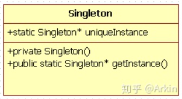
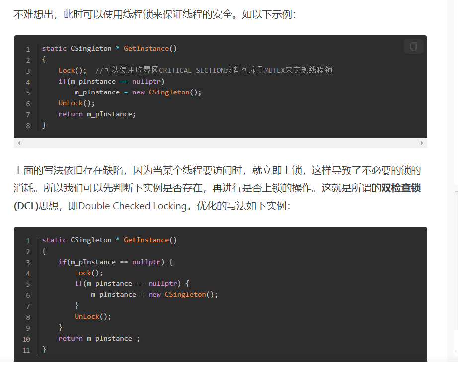
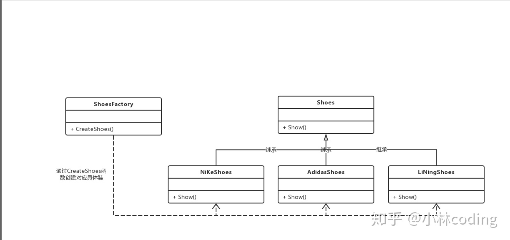
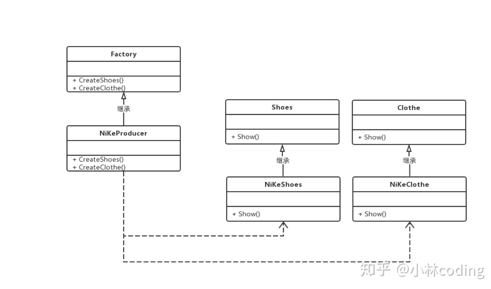
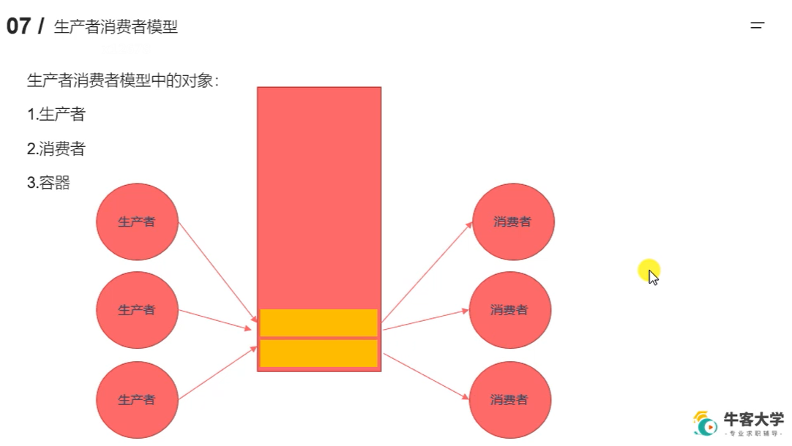

# 什么是设计模式

- 设计模式（Design pattern） 是解决软件开发某些特定问题而提出的一些解决方案也可以理解成解决问题的一些思路。通过设计模式可以帮助我们增强代码的可重用性、可扩充性、 可维护性、灵活性好。我们使用设计模式最终的目的是实现代码的 高内聚 和 低耦合。

## 什么是高内聚和低耦合？

- 举例一个现实生活中的例子，例如一个公司，一般都是各个部门各司其职，互不干涉。各个部门需要沟通时通过专门的负责人进行对接。在软件里面也是一样的 一个功能模块只是关注一个功能，一个模块最好只实现一个功能。这个是所谓的内聚，模块与模块之间、系统与系统之间的交互，是不可避免的， 但是我们要尽量减少由于交互引起的单个模块无法独立使用或者无法移植的情况发生， 尽可能多的单独提供接口用于对外操作， 这个就是所谓的低耦合

# 设计模式的六大原则

1. 开闭原则（Open Close Principle）
    开闭原则的意思是：对扩展开放，对修改关闭。即软件实体应尽量在不修改原有代码的情况下进行扩展。简言之，是为了使程序的扩展性好，易于维护和升级。想要达到这样的效果，我们需要使用接口和抽象类

2. 里氏代换原则（Liskov Substitution Principle）
    所有引用基类（父类）的地方必须能透明地使用其子类的对象。
    在软件中将一个基类对象替换成它的子类对象，程序将不会产生任何错误和异常，反过来则不成立，如果一个软件实体使用的是一个子类对象的话，那么它不一定能够使用基类对象。
   1. 老爸能干的事情，儿子都能干。
   2. 但是儿子能干的事情老爸不一定能干。

    里氏代换原则是开闭原则的重要方式之一。

3. 依赖倒转原则（Dependence Inversion Principle）
    抽象不应该依赖于细节，细节应当依赖于抽象。换言之，要面向接口编程，而不是面向实现编程。

    开闭原则是目标，里氏代换原则是基础，依赖倒转原则是手段，它们相辅相成，相互补充，目标一致，只是分析问题时所站角度不同而已。

4. 接口隔离原则（Interface Segregation Principle）
    接口最小化。接口中的方法应该尽量少。和单一职责原则类似

    单一职责针对的是类，
    接口隔离针对的是接口

```c++
  Animal dog1 = new Dog();//面向接口
  Dog dog2 = new Dog();//面向实现
```

5. 迪米特法则，又称最少知道原则（Demeter Principle）
    类向外公开的方法应该尽可能的少，
    依赖的对象尽可能的少（只依赖应该依赖的对象）。
    例如一个电脑 有 关闭电脑是要按照下面方式依次执行
      1. 保存当前任务
      2. 关闭服务
      3. 关闭屏幕
      4. 关闭电源

  当我们执行时候这4个操作不用对操作人都开放 只要有一个关闭电脑的行为方法即可 ，而这个关闭电脑行为包含 保存当前任务，关闭服务，关闭屏幕，关闭电源。如果按照单一职责原则我们可以将电脑拆分为 操作系统 和 硬件设备容器 操作人只需要依赖 硬件设配容器即可，而我们的硬件设备容器依赖操作系统。

6. 合成复用原则（Composite Reuse Principle）
    合成复用原则是指：尽量使用合成/聚合的方式，而不是使用继承。

# 设计模式的几种分类

1. 创建型
    创建对象时，不再由我们直接实例化对象；而是根据特定场景，由程序来确定创建对象的方式，从而保证更大的性能、更好的架构优势。创建型模式主要有简单工厂模式（并不是23种设计模式之一）、工厂方法、抽象工厂模式、单例模式、生成器模式和原型模式。

2. 结构型
    用于帮助将多个对象组织成更大的结构。结构型模式主要有适配器模式adapter、桥接模式bridge、组合器模式component、装饰器模式decorator、门面模式、亨元模式flyweight和代理模式proxy。

3. 行为型
    用于帮助系统间各对象的通信，以及如何控制复杂系统中流程。行为型模式主要有命令模式command、解释器模式、迭代器模式、中介者模式、备忘录模式、观察者模式、状态模式state、策略模式、模板模式和访问者模式。

# 单例模式的实现

## 什么是单例模式

- 单例模式(Singleton Pattern，也称为单件模式)，使用最广泛的设计模式之一。其意图是**保证一个类仅有一个实例**，并**提供一个访问它的全局访问点**，该实例被所有程序模块共享。

- 定义一个单例类：
    **1. 私有化它的构造函数，以防止外界创建单例类的对象；**
    **2. 使用类的私有静态指针变量指向类的唯一实例；**
    **3. 使用一个公有的静态方法获取该实例。**


### 为何要用静态成员变量

1. 类的静态成员变量就是指的类共享的对象，而单例模式的对象设成静态就是**为了让该类所有成员共享同一个对象**
2. 常见的单例模式都是通过一个静态方法（如getInstance)返回其单例，因为**静态方法的内部不能直接使用非静态变量**，所以返回的这个实例就是静态的

## 懒汉（Lazy Singleton）

- 教学版，即懒汉版（Lazy Singleton）：单例实例在第一次被使用时才进行初始化，这叫做延迟初始化。

```c++
class singleton{
private:
    static singleton* instance;
private:
    singleton(){}
    ~singleton(){}
    singleton(const singleton&);
public:
    static singleton* getsingleton() {
        if(instance == nullptr) {
            instance = new singleton();
        }
        return instance;
    }
};
singleton* singleton::instance = nullptr;
```


```c++
// version 1.0
class Singleton
{
private:
 static Singleton* instance;
private:
 Singleton() {};
 ~Singleton() {};
 Singleton(const Singleton&);
 Singleton& operator=(const Singleton&);
public:
 static Singleton* getInstance() 
        {
  if(instance == NULL) 
   instance = new Singleton();
  return instance;
 }
};

// init static member
Singleton* Singleton::instance = NULL;
```

--------------------------------------------------------------------------------------------------------

- 问题1：Lazy Singleton存在内存泄露的问题，有两种解决方法：

    使用智能指针
    使用静态的嵌套类对象

对于第二种解决方法，代码如下：

```c++
// version 1.1
class Singleton
{
private:
 static Singleton* instance;
private:
 Singleton() { };
 ~Singleton() { };
 Singleton(const Singleton&);
 Singleton& operator=(const Singleton&);
private:
 class Deletor {
 public:
  ~Deletor() {
   if(Singleton::instance != NULL)
    delete Singleton::instance;
  }
 };
 static Deletor deletor;
public:
 static Singleton* getInstance() {
  if(instance == NULL) {
   instance = new Singleton();
  }
  return instance;
 }
};

// init static member
Singleton* Singleton::instance = NULL;
```

- 在程序运行结束时，系统会调用静态成员deletor的析构函数，该析构函数会删除单例的唯一实例。使用这种方法释放单例对象有以下特征：

    在单例类内部定义专有的嵌套类。
    在单例类内定义私有的专门用于释放的静态成员。
    利用程序在结束时析构全局变量的特性，选择最终的释放时机。

在单例类内再定义一个嵌套类，总是感觉很麻烦。

--------------------------------------------------------------------------------------------------------

- 问题2：这个代码在单线程环境下是正确无误的，但是当拿到多线程环境下时这份代码就会出现race condition，注意version 1.0与version 1.1都不是线程安全的。要使其线程安全，能在多线程环境下实现单例模式，我们首先想到的是利用同步机制来正确的保护我们的shared data。可以使用双检测锁模式（DCL: Double-Checked Locking Pattern）：

```c++
static Singleton* getInstance() {
 if(instance == NULL) {
  Lock lock;  // 基于作用域的加锁，超出作用域，自动调用析构函数解锁
        if(instance == NULL) {
         instance = new Singleton();
        }
 }
 return instance;
}
```

注意，线程安全问题仅出现在第一次初始化（new）过程中，而在后面获取该实例的时候并不会遇到，也就没有必要再使用lock。双检测锁很好地解决了这个问题，它通过加锁前检测是否已经初始化，避免了每次获取实例时都要首先获取锁资源。


**BEST OF ALL**

- C++11规定了local static在多线程条件下的初始化行为，要求编译器保证了内部静态变量的线程安全性。在C++11标准下，《Effective C++》提出了一种更优雅的单例模式实现，使用**函数内的 local static 对象**。这样，只有当第一次访问getInstance()方法时才创建实例。这种方法也被称为Meyers' Singleton。

```c++
class singleton {
private:
    singleton(){};
    ~singleton(){};
    singleton(const singleton&);
    singleton& operater=(const singleton&);
public:
    static getsingleton() {
        static singleton instance;
        return instance;
    }

};
```

```C++
// version 1.2
class Singleton
{
private:
 Singleton() { };
 ~Singleton() { };
 Singleton(const Singleton&);
 Singleton& operator=(const Singleton&);
public:
 static Singleton& getInstance() 
        {
  static Singleton instance;
  return instance;
 }
};
```

## 饿汉版（Eager Singleton）

- 饿汉版（Eager Singleton）：指单例实例在程序运行时被立即执行初始化

```C++
// version 1.3
class Singleton
{
private:
 static Singleton instance;
private:
 Singleton();
 ~Singleton();
 Singleton(const Singleton&);
 Singleton& operator=(const Singleton&);
public:
 static Singleton& getInstance() {
  return instance;
 }
}

// initialize defaultly
Singleton Singleton::instance;
```

由于在main函数之前初始化，所以没有线程安全的问题。但是潜在问题在于no-local static对象（函数外的static对象）在不同编译单元中的初始化顺序是未定义的。也即，static Singleton instance;和static Singleton& getInstance()二者的初始化顺序不确定，如果在初始化完成之前调用 getInstance() 方法会返回一个未定义的实例。

## 总结

- Eager Singleton 虽然是线程安全的，但存在潜在问题；
- Lazy Singleton通常需要加锁来保证线程安全，但局部静态变量版本在C++11后是线程安全的；
- 局部静态变量版本（Meyers Singleton）最优雅。

## 何时使用单例模式

意图：保证一个类仅有一个实例，并提供一个访问它的全局访问点。

主要解决：一个全局使用的类频繁地创建与销毁。

何时使用：当您想控制实例数目，节省系统资源的时候。

如何解决：判断系统是否已经有这个单例，如果有则返回，如果没有则创建。

关键代码：构造函数是私有的。

应用实例：
1、一个班级只有一个班主任。
2、Windows 是多进程多线程的，在操作一个文件的时候，就不可避免地出现多个进程或线程同时操作一个文件的现象，所以所有文件的处理必须通过唯一的实例来进行。
3、一些设备管理器常常设计为单例模式，比如一个电脑有两台打印机，在输出的时候就要处理不能两台打印机打印同一个文件。

优点：
1、在内存里只有一个实例，减少了内存的开销，尤其是频繁的创建和销毁实例（比如管理学院首页页面缓存）。
2、避免对资源的多重占用（比如写文件操作）。

缺点：没有接口，不能继承，与单一职责原则冲突，一个类应该只关心内部逻辑，而不关心外面怎么样来实例化。

使用场景：
1、要求生产唯一序列号。
2、WEB 中的计数器，不用每次刷新都在数据库里加一次，用单例先缓存起来。
3、创建的一个对象需要消耗的资源过多，比如 I/O 与数据库的连接等。

## 补充：C++中static对象的初始化

1. non-local static对象（函数外）

- C++规定，**non-local static 对象的初始化发生在main函数执行之前**，也即main函数之前的单线程启动阶段，所以不存在线程安全问题。但C++没有规定多个non-local static 对象的初始化顺序，尤其是来自多个编译单元的non-local static对象，他们的初始化顺序是随机的。

2. local static 对象（函数内）

- 对于**local static 对象，其初始化发生在控制流第一次执行到该对象的初始化语句时**。多个线程的控制流可能同时到达其初始化语句。

- 在C++11之前，在多线程环境下local static对象的初始化并不是线程安全的。具体表现就是：如果一个线程正在执行local static对象的初始化语句但还没有完成初始化，此时若其它线程也执行到该语句，那么这个线程会认为自己是第一次执行该语句并进入该local static对象的构造函数中。这会造成这个local static对象的重复构造，进而产生内存泄露问题。所以，local static对象在多线程环境下的重复构造问题是需要解决的。

- 而C++11则在语言规范中解决了这个问题。C++11规定，在一个线程开始local static 对象的初始化后到完成初始化前，其他线程执行到这个local static对象的初始化语句就会等待，直到该local static 对象初始化完成。

# 工厂模式

- 工厂模式属于创建型模式，它提供了一种创建对象的最佳方式。
- 在工厂模式中，我们在创建对象时不会对客户端暴露创建逻辑，并且是通过使用一个共同的接口来指向新创建的对象。
- 简单说，**使用了C++多态的特性，将存在继承关系的类，通过一个工厂类创建对应的子类（派生类）对象。在项目复杂的情况下，可以便于子类对象的创建。**

工厂模式的实现方式可分别简单工厂模式、工厂方法模式、抽象工厂模式，每个实现方式都存在优和劣。

## 简单工厂模式



简单工厂模式的结构组成：

1. 工厂类：工厂模式的核心类，会定义一个用于创建指定的具体实例对象的接口。

2. 抽象产品类：是具体产品类的继承的父类或实现的接口。

3. 具体产品类：工厂类所创建的对象就是此具体产品实例。

简单工厂模式的**特点**：

- 工厂类封装了创建具体产品对象的函数。

简单工厂模式的**缺陷**：

- 扩展性非常差，新增产品的时候，需要去修改工厂类。

简单工厂模式的代码：

Shoes为鞋子的抽象类（基类），接口函数为Show()，用于显示鞋子广告。

NiKeShoes、AdidasShoes、LiNingShoes为具体鞋子的类，分别是耐克、阿迪达斯和李宁鞋牌的鞋，它们都继承于Shoes抽象类。

```c++
// 鞋子抽象类
class Shoes
{
public:
    virtual ~Shoes() {}
    virtual void Show() = 0;
};

// 耐克鞋子
class NiKeShoes : public Shoes
{
public:
    void Show()
    {
        std::cout << "我是耐克球鞋，我的广告语：Just do it" << std::endl;
    }
};

// 阿迪达斯鞋子
class AdidasShoes : public Shoes
{
public:
    void Show()
    {
        std::cout << "我是阿迪达斯球鞋，我的广告语:Impossible is nothing" << std::endl;
    }
};

// 李宁鞋子
class LiNingShoes : public Shoes
{
public:
    void Show()
    {
        std::cout << "我是李宁球鞋，我的广告语：Everything is possible" << std::endl;
    }
};
```

ShoesFactory为工厂类，类里实现根据鞋子类型创建对应鞋子产品对象的CreateShoes(SHOES_TYPE type)函数。

```c++
enum SHOES_TYPE
{
    NIKE,
    LINING,
    ADIDAS
};

// 总鞋厂
class ShoesFactory
{
public:
    // 根据鞋子类型创建对应的鞋子对象
    Shoes *CreateShoes(SHOES_TYPE type)
    {
        switch (type)
        {
        case NIKE:
            return new NiKeShoes();
            break;
        case LINING:
            return new LiNingShoes();
            break;
        case ADIDAS:
            return new AdidasShoes();
            break;
        default:
            return NULL;
            break;
        }
    }
};
```

## 工厂模式


工厂方法模式的结构组成：

1. 抽象工厂类：工厂方法模式的核心类，提供创建具体产品的接口，由具体工厂类实现。

2. 具体工厂类：继承于抽象工厂，实现创建对应具体产品对象的方式。

3. 抽象产品类：它是具体产品继承的父类（基类）。

4. 具体产品类：具体工厂所创建的对象，就是此类。

工厂方法模式的**特点**：

1. 一个调用者想创建一个对象，只要知道其名称就可以了。
2. 扩展性高，如果想增加一个产品，只要扩展一个工厂类就可以。
3. 屏蔽产品的具体实现，调用者只关心产品的接口。

工厂方法模式的**缺陷**：

- 每新增一个产品，就需要增加一个对应的产品的具体工厂类。相比简单工厂模式而言，工厂方法模式需要更多的类定义。
  一条生产线只能一个产品。

**使用场景：**

1. 日志记录器：记录可能记录到本地硬盘、系统事件、远程服务器等，用户可以选择记录日志到什么地方。
2. 数据库访问，当用户不知道最后系统采用哪一类数据库，以及数据库可能有变化时。
3. 设计一个连接服务器的框架，需要三个协议，"POP3"、"IMAP"、"HTTP"，可以把这三个作为产品类，共同实现一个接口。

工厂方法模式的代码：

ShoesFactory抽象工厂类，提供了创建具体鞋子产品的纯虚函数。

NiKeProducer、AdidasProducer、LiNingProducer`具体工厂类，继承持续工厂类，实现对应具体鞋子产品对象的创建。

```c++
// 总鞋厂
class ShoesFactory
{
public:
    virtual Shoes *CreateShoes() = 0;
    virtual ~ShoesFactory() {}
};

// 耐克生产者/生产链
class NiKeProducer : public ShoesFactory
{
public:
    Shoes *CreateShoes()
    {
        return new NiKeShoes();
    }
};

// 阿迪达斯生产者/生产链
class AdidasProducer : public ShoesFactory
{
public:
    Shoes *CreateShoes()
    {
        return new AdidasShoes();
    }
};

// 李宁生产者/生产链
class LiNingProducer : public ShoesFactory
{
public:
    Shoes *CreateShoes()
    {
        return new LiNingShoes();
    }
};
```

## 抽象工厂模式



抽象工厂模式的结构组成（和工厂方法模式一样）：

1. 抽象工厂类：工厂方法模式的核心类，提供创建具体产品的接口，由具体工厂类实现。

2. 具体工厂类：继承于抽象工厂，实现创建对应具体产品对象的方式。

3. 抽象产品类：它是具体产品继承的父类（基类）。

4. 具体产品类：具体工厂所创建的对象，就是此类。

抽象工厂模式的**特点**：

1. 封装了产品的创建，使得不需要知道具体是哪种产品，只需要知道是哪个工厂就行了。

2. 可以支持不同类型的产品，使得模式灵活性更强。

3. 可以非常方便的使用一族中间的不同类型的产品。

抽象工厂模式的**缺陷**：

1. 结构太过臃肿，如果产品类型比较多，或者产品族类比较多，就会非常难于管理。

2. 每次如果添加一组产品，那么所有的工厂类都必须添加一个方法，这样违背了开放-封闭原则。所以一般**适用于产品族变化不大**的情况。

**使用场景：**

1. QQ 换皮肤，一整套一起换。
2. 生成不同操作系统的程序。

抽象工厂模式的代码：

Clothe和Shoes，分别为衣服和鞋子的抽象产品类。

NiKeClothe和NiKeShoes，分别是耐克衣服和耐克衣服的具体产品类。

```c++
// 基类 衣服
class Clothe
{
public:
    virtual void Show() = 0;
    virtual ~Clothe() {}
};

// 耐克衣服
class NiKeClothe : public Clothe
{
public:
    void Show()
    {
        std::cout << "我是耐克衣服，时尚我最在行！" << std::endl;
    }
};

// 基类 鞋子
class Shoes
{
public:
    virtual void Show() = 0;
    virtual ~Shoes() {}
};

// 耐克鞋子
class NiKeShoes : public Shoes
{
public:
    void Show()
    {
        std::cout << "我是耐克球鞋，让你酷起来！" << std::endl;
    }
};
```

Factory为抽象工厂，提供了创建鞋子CreateShoes()和衣服产品CreateClothe()对象的接口。

NiKeProducer为具体工厂，实现了创建耐克鞋子和耐克衣服的方式。

```c++
// 总厂
class Factory
{
public:
    virtual Shoes *CreateShoes() = 0;
 virtual Clothe *CreateClothe() = 0;
    virtual ~Factory() {}
};

// 耐克生产者/生产链
class NiKeProducer : public Factory
{
public:
    Shoes *CreateShoes()
    {
        return new NiKeShoes();
    }
 
 Clothe *CreateClothe()
    {
        return new NiKeClothe();
    }
};
```

## 总结

以上三种工厂模式，在新增产品时，都存在一定的缺陷。

- 简单工厂模式，，需要去修改工厂类，这违背了开闭法则。
- 工厂方式模式和抽象工厂模式，都需要增加一个对应的产品的具体工厂类，这就会增大了代码的编写量。

## 模板工厂类
<https://zhuanlan.zhihu.com/p/83537599>

# 生产者消费者模型



```c++
/*
    生产者消费者模型（粗略的版本）
*/
#include <stdio.h>
#include <pthread.h>
#include <stdlib.h>
#include <unistd.h>

// 创建一个互斥量
pthread_mutex_t mutex;

struct Node{
    int num;
    struct Node *next;
};

// 头结点
struct Node * head = NULL;

void * producer(void * arg) {

    // 不断的创建新的节点，添加到链表中
    while(1) {
        pthread_mutex_lock(&mutex);
        struct Node * newNode = (struct Node *)malloc(sizeof(struct Node));
        newNode->next = head;
        head = newNode;
        newNode->num = rand() % 1000;
        printf("add node, num : %d, tid : %ld\n", newNode->num, pthread_self());
        pthread_mutex_unlock(&mutex);
        usleep(100);
    }

    return NULL;
}

void * customer(void * arg) {

    while(1) {
        pthread_mutex_lock(&mutex);
        // 保存头结点的指针
        struct Node * tmp = head;

        // 判断是否有数据
        if(head != NULL) {
            // 有数据
            head = head->next;
            printf("del node, num : %d, tid : %ld\n", tmp->num, pthread_self());
            free(tmp);
            pthread_mutex_unlock(&mutex);
            usleep(100);
        } else {
            // 没有数据
            pthread_mutex_unlock(&mutex);
        }
    }
    return  NULL;
}

int main() {

    pthread_mutex_init(&mutex, NULL);

    // 创建5个生产者线程，和5个消费者线程
    pthread_t ptids[5], ctids[5];

    for(int i = 0; i < 5; i++) {
        pthread_create(&ptids[i], NULL, producer, NULL);
        pthread_create(&ctids[i], NULL, customer, NULL);
    }

    for(int i = 0; i < 5; i++) {
        pthread_detach(ptids[i]);
        pthread_detach(ctids[i]);
    }

    while(1) {
        sleep(10);
    }

    pthread_mutex_destroy(&mutex);

    pthread_exit(NULL);

    return 0;
}
```
