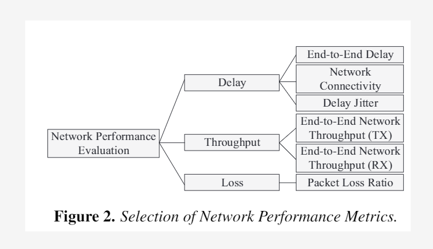
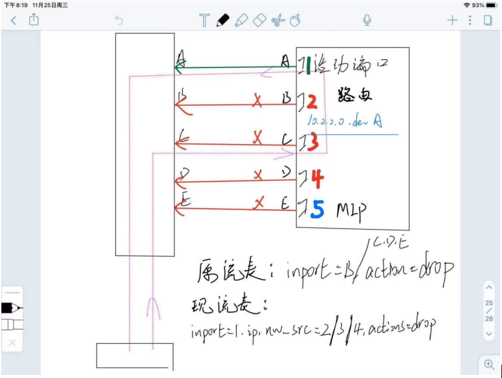
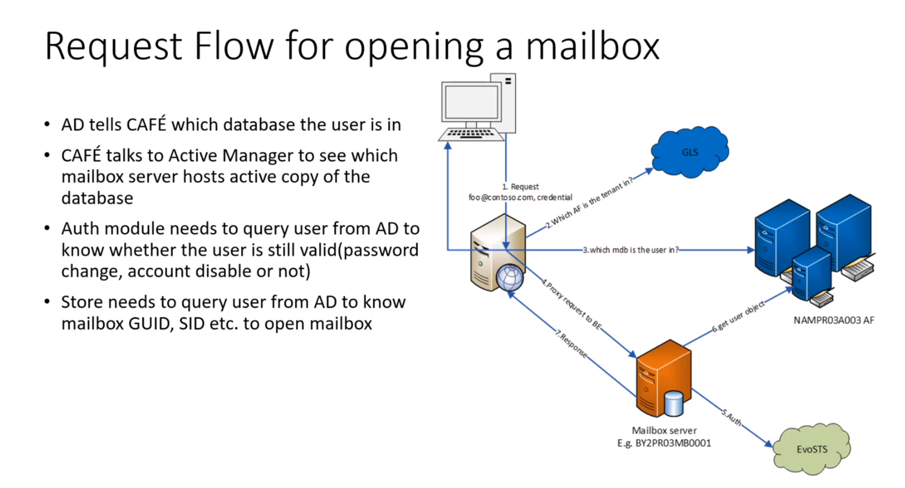
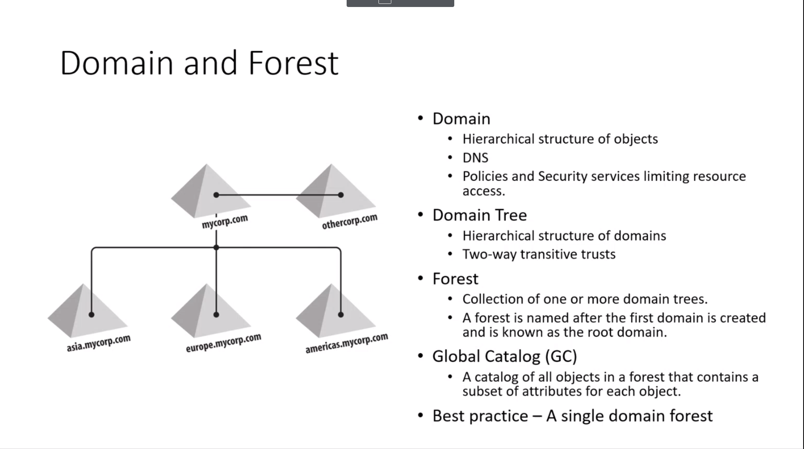
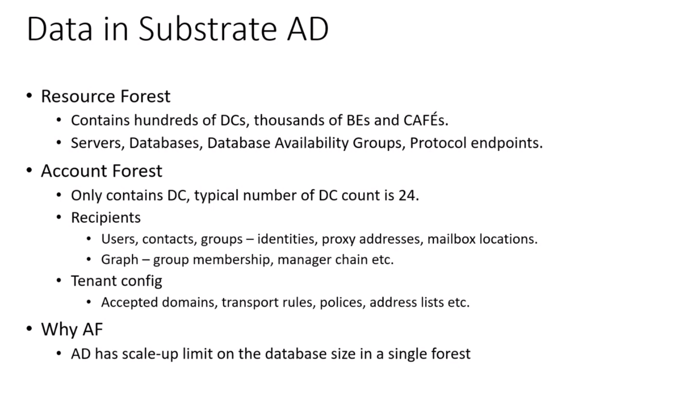
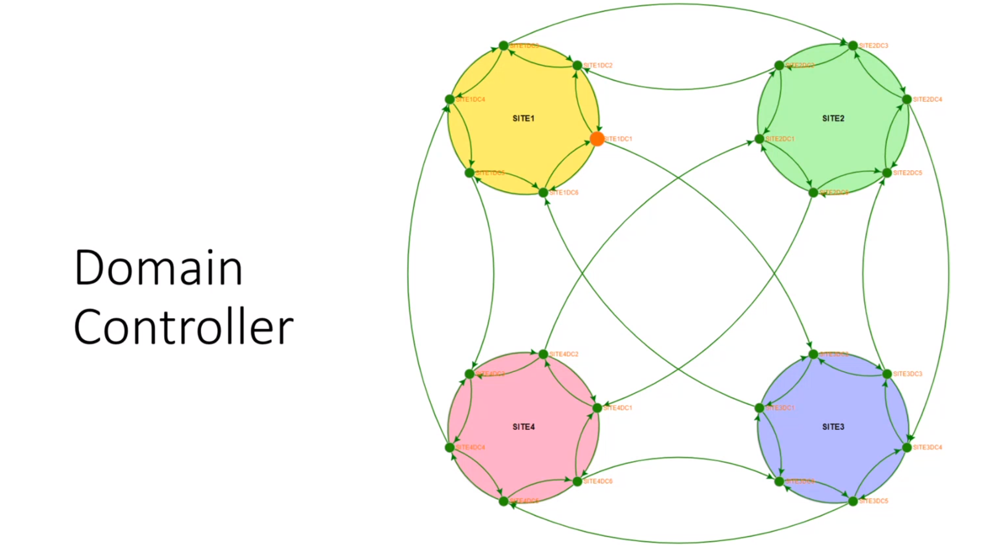
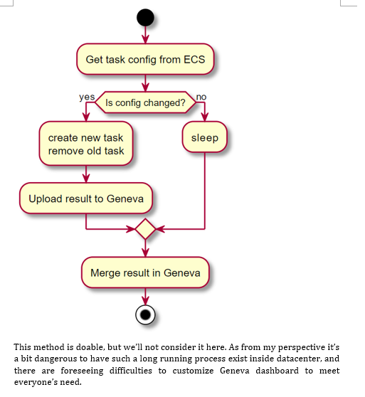

# Docker相关

## 概念

1. 核心概念有容器(container)、镜像(image)、仓库(registry)三个。 **基于内核**
    - 之所以被称为容器技术，是因为docker对进程进行封装，隔离于宿主系统和其它的进程，类似于一个装东西的容器，而且在容器里面装有一系列文件系统、网络、依赖包等应用程序运行需要的环境，开发人员可以快速将他们的应用程序部署到容器内运行。
2. 容器：具体的运行应用程序的一个进程，它里面包含应用程序的各种依赖。
3. 镜像：创建容器的模板，根据不同配置的镜像来创建不同的容器使用。镜像和容器的关系可以理解为面向对象中类和实例对象的关系。
4. 仓库：一个镜像只可以创建一种类型的容器，镜像多了就需要放到镜像仓库中存起来，仓库有本地镜像仓库和公共镜像仓库，平时使用本地仓库的镜像，没有的话去Registry hub公共镜像仓库下载。

## 为什么轻量化，和虚拟机有何不同

1. 容器相当于直接在宿主机操作系统的基础上开启一个进程，各个容器**共享宿主机的硬件资源和操作系统**，可以实现资源的动态分配，并且启动容器就是启动一个进程，速度很快，应用程序直接在各个容器内运行，互不影响。资源和时间都开销很低。
2. 虚拟机技术是完全虚拟出一个单独的系统，由这个系统去处理应用的各种运行请求
    虚拟机需要先在宿主机操作系统上安装虚拟机管理软件Hypervisor，然后在每台虚拟机内用户安装需要的操作系统和依赖文件，并且需要预分配一定的硬件资源。虚拟机一旦开启，无论应用程序需要的资源量大小，预分配的资源将被全部占用，造成很大的资源浪费，而且每次启动虚拟机，都需要启动一次虚拟机内的操作系统，很耗时。
3. Docker 技术由于还是一个普通的进程，所以隔离不是很彻底，还是共用宿主机的内核，在隔离级别和安全性上没有虚拟机高，这也是它的一个劣势。

## docker怎么实现相互隔离的

1. Docker 主要就是借助 Linux **内核技术 Namespace 来做到隔离**的，文件的隔离，资源的隔离都是在新的命名空间下通过 mount 挂载的方式来隔离的。
2. Cgroup 其功能就是限制进程组所使用的最大资源(这些资源可以是 CPU、内存、磁盘等等)。
3. namespace是对内核内的全局资源的封装，使得每一个namespace中都有一份独立的资源，因此不同进程在各自的namespace中对同一份资源进行操作互不影响。
      举个例子：sethostname系统调用，会改变主机名，而这个主机名就是一个内核全局资源，linux内核通过实现UTS namespace，将不同的进程分割在不同namespace中，某个进程在namespace A中调用了sethostname，则namespaceA中的主机名变化了，但是其他namespace中的主机名没有变化。
      Linux内核实现了6种namespace：
      IPC：隔离system V IPC和POSIX消息队列
      Network：隔离网络资源
      Mount：隔离文件系统挂载点
      PID：隔离进程PID
      UTS：隔离主机名和域名
      User：隔离用户ID和组ID

# SDN相关

1. 软件定义网络（Software Defined Network，SDN）是一种新型网络创新架构，是网络虚拟化的一种实现方式。其**核心技术OpenFlow，将网络设备的控制面与数据面分离开来，实现了网络流量的灵活控制**，使网络作为管道变得更加智能
2. 传统网络架构，控制平面数据平面都在路由器上。
  IP网络管理太复杂，举个运营商部署VPN的例子：要配置IGP、BGP、VPNV4、要绑定接口…且需要在每个PE(运营商边缘路由器）上配置；当新增加一个PE时，还需要回去修改每个涉及到的PE。
  传统网络设备的维护都是依靠传统网络管理软件等方式辅助人工进行维护，运维效率低下，容易出现由于个人能力的差异以及响应等原因， 影响运维的效率，增加运维的成本。
3. SDN将控制平面与数据平面分离，基于OpenFlow技术实现网络的可编程能力。通过在网络中增加一个集中的SDN控制器，可以简化网络和快速进行业务创新。
  SDN网络具备快速网络创新能力，如果这个新业务有价值则保留，没有价值可以快速下线。不像传统网络那样，一个新业务上线需要经过需求提出、讨论和定义开发商开发标准协议，然后在网络上升级所有的网络设备，经过数年才能完成一个新业务。SDN使得新业务的上线速度从几年提升到几个月或者更快。

- 可以轻松配置网络的流量带宽等。SDN控制器可以根据网络流量状态智能调整网络流量路径，提升网络利用率

**SDN-数据控制分离**

**数据平面：**

1. 数据平面的首要工作是通过一系列链路级操作采集传入的数据分组，并执行基本的完整性检查。
2. 接下来，数据平面将查找FIB表（FIB表已通过控制平面生成，并通过镜像复制到数据平面），识别数据分组的目的地址，这样的流程被称为快速数据分组处理。快速数据分组处理主要体现在不再需要每次都到控制平面进行查询匹配，从而有效节省了处理时间。
3. 当报文不能匹配已有规则时，这些数据分组将会被发送到控制平面进行处理。数据平面的查表采用硬件查表和通用处理器查表两类技。
4. 主要使用硬件查表技术的原因：
    由于硬件查表具有更高的数据分组转发性能。当然，硬件转发的设计目标主要是针对数据分组维持线速转发，在设计时需要考虑多种因素，包括板卡和机架的空间、预算、电源利用率和吞吐量等，在这些因素条件下设计出来的数据平面会存在转发特点可扩展性的差别，例如，不同的转发表数、不同的转发表项数等。（中低性能需求的场景下，可以使用通用处理器进行查表，这样可以在定制功能时节约成本，）
5. 为解决数据报文中的标签经过城域网后可能存在标签不一致问题：
  SDN以网络设备的FIB表为界分割数据控制平面，其中交换设备只是一个轻量的、“哑”的数据平面，保留FIB和高速交换转发能力，而上层的控制决策全部由远端的统一控制器节点完成，在这个节点上，网络管理员可以看到网络的全局信息，并根据该信息做出优化的决策，
  数据控制平面之间采用SDN南向接口协议相连接，这个协议将提供数据平面可编程性。
6. SDN的数据控制分离的特征主要体现在：
    一是采用逻辑集中控制，对数据平面采用开放式接口。（即开放接口打乱了传统网络设备商的垄断地位，因此将面临巨大的阻力。）
7. **SDN数控分离的优点**：

   1. 全局集中控制和分布高速转发
   2. 灵活可编程与性能的平衡：FIB为分界线实际上降低了SDN的编程灵活性，但是没有暴露商用设备的高速转发实现细。
   3. 开放性和IT化：
      数据控制分离在一定程度上可以降低网络设备和控制软件的成本。当前的网络设备是捆绑控制平面功能软件一起出售的，由于软件开发由网络设备公司完成，对用户不透明，因此网络设备及其控制平面软件的定价权完全掌握在少数公司手中，造成了总体价格高昂。在数据控制平面分离以后，尤其是使用开放的接口协议后，将会实现交换设备的制造与功能软件的开发相分离，这样可以实现模块的透明化，从而有效降低成本。虽然硬件价格降低后，相应的软件成本会增加，不过总体来说，IT 化将会是一个有效的节约成本的方案。
8. **SND数控分离的不足：**
   1. 可扩展性问题：这是SDN面临的最大问题，数据控制分离后，原来分布式的控制平面集中化了，即随着网络规模扩大，单个控制节点的服务能力极有可能会成为网络性能的瓶颈。因此控制架构的可扩展性是数据控制分离后的主要研究方向之一。
   2. 一致性问题：在传统网络中，网络状态一致性是由分布式协议保证的，在SDN数据控制分离后，集中控制器需要负起这个责任，如何快速侦测到分布式网络节点的状态不一致性，并快速解决这类问题，也是数据控制分离后的主要研究方向之一。
   3. 可用性问题：可用性是指网络无故障的时间占总时间的比例，传统网络设备是高可用的，即发向控制平面的请求会实时得到响应，因此，网络比较稳定，但是在SDN数据控制分离后，控制平面网络的延迟可能会导致数据平面可用性问题。

## OVS介绍

1. Open vSwitch的官方定义：Open vSwitch是一个具有工业级质量的多层虚拟交换机。通过可编程扩展，可以实现大规模网络的自动化（配置、管理、维护）。它支持现有标准管理接口和协议（比如netFlow，sFlow，SPAN，RSPAN，CLI，LACP，802.1ag等，熟悉物理网络维护的管理员可以毫不费力地通过Open vSwitch转向虚拟网络管理）。
2. 四、Open vSwitch相关术语
Open vSwitch中许多网络上的概念与平时接触到的不同，这里介绍一下Open vSwitch中用到的一些名词及概念。
    Packet （数据包）

    网络转发的最小数据单元，每个包都来自某个端口，最终会被发往一个或多个目标端口，转发数据包的过程就是网络的唯一功能。

    Bridge （网桥）

    Open vSwitch中的一个网桥就是一台以太网交换机交换机，可以创建一个或者多个 Bridge 设备。

    其功能是根据一定流规则，把从端口收到的数据包转发到另一个或多个端口。

    Port （端口）

    端口是收发数据包的单元，和物理以太网交换机的端口概念类似。Open vSwitch中，每个端口都属于一个特定的网桥。端口收到的数据包会经过流规则的处理，发往其他端口；也会把其他端口来的数据包发送出去。Open vSwitch支持的端口有以下几种：

          Normal Port: 用户可以把操作系统中的网卡绑定到Open vSwitch上，Open vSwitch会生成一个普通端口处理这块网卡进出的数据包。
          Internal Port: 当设置端口类型为internal，Open vSwitch会创建一快虚拟网卡，此端口收到的所有数据包都会交给这块网卡，网卡发出的包会通过这个端口交给Open vSwitch。
          当Open vSwitch创建一个新网桥时，默认会创建一个与网桥同名的Internal Port

          Patch Port: 当机器中有多个Open vSwitch网桥时，可以使用Patch Port把两个网桥连起来。Patch Port总是成对出现，分别连接在两个网桥上，在两个网桥之间交换数据。
          Tunnel Port: 隧道端口是一种虚拟端口，支持使用gre或vxlan等隧道技术与位于网络上其他位置的远程端口通讯。
                    Interface （iface/接口）

          它是连接到 Port 的网络接口设备。Open vSwitch通过Interface与外部交换数据包。在通常情况下，Port 和 Interface 是一对一的关系, 只有在配置 Port 为 bond 模式后，Port 和 Interface 才是一对多的关系。一个接口就是操作系统的一块网卡，这块网卡可能是Open vSwitch生成的虚拟网卡，也可能是物理网卡挂载在Open vSwitch上，也可能是操作系统的虚拟网卡（TUN/TAP）挂载在Open vSwitch上。

    Flow （流）

    流定义了端口之间数据包的交换规则。每条流分为匹配和动作两部分，匹配部分选择哪些数据包需要可以通过这条流处理，动作决定这些匹配到的数据包如何转发。流描述了一个网桥上，端口到端口的转发规则。比如我可以定义这样一条流：

    当数据包来自端口A，则发往端口B

    来自端口A 就是匹配部分，发往端口B 就是动作部分。

    流的定义可能非常复杂，比如：

    当数据包来自端口A，并且其源MAC是aa:aa:aa:aa:aa:aa，并且其拥有vlan tag为a，并且其源IP是a.a.a.a，并且其协议是TCP，其TCP源端口号为a，则修改其源IP为b.b.b.b，发往端口B

    Datapath

    由于流可能非常复杂，对每个进来的数据包都去尝试匹配所有流，效率会非常低，所以有了datapath。Datapath对流进行缓存，把流的执行结果保存起来，当下次遇到匹配到同一条流的数据包，直接通过datapath处理。考虑到转发效率，datapath完全是在内核态实现的，并且默认的超时时间非常短，好像是3秒。

    再重新看一下上面的模块图，datapath是不是可以视作一个交换机，或者说一个桥的实体模块？ 因为传统交换机缓存MAC地址并根据MAC地址进行数据包的转发，而Datapath缓存Flow（流）并根据流进行数据包的转发。

    Controller

    OpenFlow 控制器。OVS 可以同时接受一个或者多个基于 OpenFlow 的控制器的管理。

    Flow table

    每个 datapath 都和一个"flow table"关联，当 datapath 接收到数据之后， OVS 会在 flow table 中查找可以匹配的 flow，执行对应的操作, 例如转发数据到另外的端口。


# Socket通信相关

## 怎么标识一个进程

- 网络层的“ip地址”可以唯一标识网络中的主机，而传输层的“协议+端口”可以唯一标识主机中的应用程序（进程）。这样利用三元组（ip地址，协议，端口）就可以标识网络的进程了，网络中的进程通信就可以利用这个标志与其它进程进行交互。

## 网络字节序与主机字节序

1. 主机字节序就是我们平常说的大端和小端模式：不同的CPU有不同的字节序类型，这些字节序是指整数在内存中保存的顺序，这个叫做主机序。引用标准的Big-Endian和Little-Endian的定义如下：

- a) Little-Endian就是低位字节排放在内存的低地址端，高位字节排放在内存的高地址端。

- b) Big-Endian就是高位字节排放在内存的低地址端，低位字节排放在内存的高地址端。

2. 网络字节序：4个字节的32 bit值以下面的次序传输：首先是0～7bit，其次8～15bit，然后16～23bit，最后是24~31bit。这种传输次序称作大端字节序。由于TCP/IP首部中所有的二进制整数在网络中传输时都要求以这种次序，因此它又称作网络字节序。字节序，顾名思义字节的顺序，就是大于一个字节类型的数据在内存中的存放顺序，一个字节的数据没有顺序的问题了。
3. 所以：在将一个地址绑定到socket的时候，请先将主机字节序转换成为网络字节序，而不要假定主机字节序跟网络字节序一样使用的是Big-Endian。

计算机硬件有两种储存数据的方式：大端字节序（big endian）和小端字节序（little endian）。

举例来说，数值0x2211使用两个字节储存：高位字节是0x22，低位字节是0x11。

大端字节序：高位字节在前，低位字节在后，这是人类读写数值的方法。
小端字节序：低位字节在前，高位字节在后，即以0x1122形式储存。

首先，为什么会有小端字节序？

答案是，计算机电路先处理低位字节，效率比较高，因为计算都是从低位开始的。所以，计算机的内部处理都是小端字节序。

但是，人类还是习惯读写大端字节序。所以，除了计算机的内部处理，其他的场合几乎都是大端字节序，比如网络传输和文件储存。


计算机处理字节序的时候，不知道什么是高位字节，什么是低位字节。它只知道按顺序读取字节，先读第一个字节，再读第二个字节。

如果是大端字节序，先读到的就是高位字节，后读到的就是低位字节。小端字节序正好相反

```c++
    int num = 0x1234;
    char* num1 = reinterpret_cast<char *>(&num);
    printf("low : %x, high : %x", num1[0], num1[1]);

```

# 项目细节

## 项目整体介绍

- 我做的实验室项目是一个对空间场景进行仿真评估的仿真平台。通过这个仿真平台，我们可以评估出同一空间网络场景下，使用何种网络协议最优。它由四大平面组成，逻辑平面、控制平面、数据平面与分析平面。其中，逻辑平面代表用户提供的空间场景，如几百颗LEO的星座或者几颗GEO加上几百LEO以及其他组网节点的场景。逻辑平面将场景在STK仿真软件中进行建模后，将参数导入到我们的仿真平台中从而形成基础场景；控制平面负责对实验的开始结束以及实验的配置进行控制，比如：卫星个数、卫星所用协议、星间链路特性、测试流量大小等；数据平面则是指仿真平台开始实验，平台上会运行多种业务进行测试，并将测试流量等传输给分析平面；分析平面则是对数据平面传输进来的数据进行分析，以完成对此网络场景下，所用协议效果的评分。

## 仿真平台具体做了哪些事情，对哪些协议进行测试对比

1. 仿真平台主要是对某空间网络场景配置相应网络协议的表现进行评估。
2. 我们做了AOS协议的仿真，做了TCP/IP与BP/LTP的协议仿真；实现MIP功能；验证了视频音频的传输功能
3. 能够比较OSPF(Open Shortest Path First开放式最短路径优先）与OSPF+（备份）两种路由协议对性能的影响
4. 

## 仿真平台怎么进行数据采集功能的

1. 我们的基础镜像包括两种，一种是仿真节点的，一种是数据捕获节点；
2. 通过yaml文件进行节点的配置，并由k8s（kubexec）创建和编排节点，k8s下最小的编排单位为pod，同一个pod中可包含多个docker容器，这些容器共享网络命名空间，共享网络命名空间的多个容器，网络流量共享。
3. 使用moloch，从镜像端口获取流量，同时会将捕捉到的流量以pcap包导入到特定的文件夹中
  
         1. 数据的来源是交换机的镜像端口，moloch 系统主要涉及三个组件 Capture，elasticsearch 和 Viewer Capture 用来抓取 流量会以pcap的格式存储到硬盘上面，还会存一份对应关系到es中，Viewer提供web界面。

## 项目的评估标准是什么



1. 层次分析法（The analytic hierarchy process,简称AHP）
2. 
  1. 端到端时延
  2. 网络连通率
  3. 时延抖动
  4. RX吞吐量
  5. TX吞吐量
  6. 丢包率
3. 采用AHP，对这6个特性构造成对比较矩阵，计算权向量(列求和；每一列除和；行平均值)；
   https://tellyouwhat.cn/p/ahp-users-value-score/#toc-heading-8

   再对6个变量进行归一化处理；
   设标准化的变量分别为N1,N2,N3... 权向量分别为W1,W2,W3...
   AHP = N1W1 + N2W2 + N3W3...
4. 算法

        比较简单和常用的两种标准化方法：
        （1）min-max标准化：各组将最小-最大的数据线性映射到0-1的范围内
        （2）z-score标准化：各组将数据标准化为均值为0，标准差为1的形式
        （3）不过但就你的问题而言，个人觉得0-max标准化可能是更加简洁而贴切的选择。e.g. 0.3可以直观地理解为该曝光量是最高曝光量的30%


## 怎么确定的最终网络架构

1. 网络场景大致可以分为网关节点、组网节点以及用户节点。在我们的场景中每一个节点都是由一个docker构成的。所有的docker都会连接到一个虚拟交换机，即Open vSwitch下；
2. 我们讨论的时候有两种方案：分别是所有节点连接到一个OVS上，以IP地址来进行网络的划分；另一个方案是所有的网关节点在一个OVS上，组成骨干网络，其他的节点分别与其所在GEO连接到另外的OVS下，称为接入网；
3. 因为项目的标准对网关节点之间的通信链路的带宽是有明确要求的，我们担心全部节点在一个网桥下，会影响网桥的性能，导致链路带宽不够。
4. 我们做了一个9节点的环形拓扑以及一个9节点总线拓扑。利用iperf工具测试节点之间的速率。
5. 结论表明，整个Open vSwitch软件共用系统的资源，在没有其他网桥存在的情况下，单网桥与多网桥对速率影响不大，并考虑到后续拓扑控制的难度，我们最后选择了单OVS方案。

## 关于拓扑变化的控制方案

1. 所谓拓扑变化就是把，一个正常的空间场景中GEO与LEO的位置是在不断变化的，我们怎么将这种变化映射到仿真平台中。有一个前提是，在这个场景中有6个GEO，每个LEO回周期性在6个GEO下发生切换，因此每个LEO都有6张网卡。
2. 我们整个平台是基于SDN技术，因此我们遵循Open Flow协议来进行网络的控制。我们可以在OVS上下发不同的流表，来控制网络的通断；
3. 举个例子，有n个docker连接到同一个网桥上，docker端与OVS端都会有端口号。每个LEO都有6个端口，我们要做的就是利用openflow控制这些端口的通断。
   ovs-ofctl add-flow dl_dst,dl_src，nw_src,nw_dst， in_port = , actions = drop. normal , output:
   因为每条数据流其实都要经过OVS，所以我们可以在OVS下发流表，细致得进行控制，匹配条件有目的Mac，目的IP，端口，操作有drop，output(指定输出到)
4. 由此诞生了几种拓扑控制方式。一种是保留洪泛流表，由于同时仅有一张网卡生效，因此可以将其余5个端口的流量全部drop；另一种是删除洪泛流表，然后每次LEO运动重新下发output流表，工作量很大


## 项目中遇到的难点以及解决方案

### 确定拓扑控制方案



1. 左侧代表OVS，右侧及下侧代表节点。
  A,B,C,D,E为端口名，1，2，3，4，5分别为各端口的IP。
  现在流变下发方式：假设此时刻A为活动端口，则对B,C,D,E进行drop操作。
  此方案现在的问题：现在的下发的几条路由，其网关设备都会是当前的活动端口，即A端口。所以任何数据都会从A端口出，B,C,D,E端口就不会有数据，下发的流表就并没有起作用。现象：比如此时ping3这个IP，依旧通，同时在A端口能够抓到源IP为3的reply包。因此想到如下解决方案

  改变后的方案：在A端口生效的情况下，使得从A端口到OVS的、源IP为B,C,D,E的数据全部drop（5为MIP端口，不drop）。
  Ovs-ofctl add-flow ovsbr0 in_port=A,ip,nw_src=2/3/4,actions=drop（此为三条流表）
  对B,C,D端口同样如此
  对E端口，因为5为MIP，所以当它生效的时候，应当将其他所有端口的IP全部drop
  Ovs-ofctl add-flow ovsbr0 in_port=E,ip,nw_src=1/2/3/4,actions=drop
  如果一个节点6个端口，也就是5*4+1*5=25条流表，且这25条流表一旦下发无需更改切换，一直保留即可。
  
### 迁移并完善MIP协议

1. 首先简单说一下移动IP的概念，由于一个LEO会在六颗GEO下切换，所以这颗LEO在整个切换过程中会拥有六个不同的IP，我们希望，每颗LEO能有一个全局可用的IP，否则，如果在传输任务进行时，发生了切换，会引起传输中断
2. MIP实现了这样的功能，场景开始时，每颗LEO会向GEO进行一次注册，此GEO为LEO的家乡代理，并给LEO一个全局可用的home IP；每当LEO切换至其他GEO下，拥有另一个IP时，LEO会向家乡代理GEO中注册一个home IP - 当前IP 的key-value对；从而保证传输不中断；
3. 将MIP移植到仿真平台上的时候，由于本来的MIP仅支持home agent与node一对一的映射，现在的需求是支持一对多，使用过程中发现经常报错；然后看了它的源码之后发现，注册机制是这样的：每次注册，则在dictionary里加入一个key-value对；同时会新建一个gre通道用来连接home IP和当前IP，重新注册的时候会先删除这个key-value对，然后根据key在dictionary里的index删除gre tunnel。由于dictionary的一个无序性，在注册很多node的时候，可能会修改key的index值，所以我们需要ordereddict
4. 所以我修改了一下逻辑，在重新注册的删除阶段，将key-value对的值置空，然后再设置

### 自动生成配置文件的脚本

1. 由于每个docker都有自己的name，并且有自己的拓扑计划以及IP，所以我们写了一个python脚本，让docker启动时自动运行，然后生成对应的config文件

### 负责与硬件部分的对接

1. 学会使用SDN交换机，将硬件部分的端口纳入软件管理

## shell脚本获取ip
ifconfig -a|grep inet|grep -v 127.0.0.1|grep -v inet6|awk '{print $2}'|tr -d "addr:"

命令解释
 ifconfig -a  　　　　 和window下执行此命令一样道理，返回本机所有ip信息
 grep inet               　   截取包含ip的行
 grep -v 127.0.0.1      去掉本地指向的那行
 grep -v inet6             去掉包含inet6的行
 awk { print $2}         $2 表示默认以空格分割的第二组 同理 $1表示第一组​
 tr -d "addr:               删除"addr:"这个字符串

# 关于MIP的实现

## MIP相关概念

1. 移动IP（Mobile IP，MIP）是Internet工程任务小组（Internet Engineering Task Force，IETF）制订的标准通信协议，允许移动节点（不限于手机）在不改变IP地址的情况下可以从一个子网移动到其他子网。MIP是IP协议的增强，增加了当移动设备连通时把Internet转接进移动设备的机制。
2. MIP技术的作用就是一个移动节点通常由它的“归属IP地址（Home IP Address）”来设定其地址，这个地址是在“归属子网（Home Subnetwork）”上分配给移动节点的，此地址的子网前缀是“归属子网”的子网前缀。使用“归属IP地址”发送到移动节点的数据包，首先到达“归属代理（Home Agent，HA）”，查找移动节点的注册信息，获得用户当前所在子网的“外部代理（Foreign Agent，FA）”地址，然后访问FA，从而最终找到移动节点，继续保持通信。由于移动节点的“归属IP地址”保持不变，所以它的移动对于传输层和更高层来说是透明的

## 空间网络特性

1. 根据Mobile IP协议并结合空间场景中高延迟、拓扑变化频繁以及缓存能力有限等特性，在仿真平台上实现有空间特点的Mobile IP。


# BP与LTP

## BP

1. BP 协议（Bundle Protocol）是 DTN 网络中的主要协议，它可以作为覆盖层协议兼容底层不同类型的传输层协议，是 DTN 实现异构网络互联的主要实现方式。在 DTN 网络中，传输层协议可以根据不同区域的网络环境选择，BP 协议则通过相应的汇聚层适配器完成传输层异构网络互联，完成多区域复杂环境内的通信 。
2. Bundle 引擎，负责管理控制 BP 层其余功能模块；Bundle 路由负责完成路由策略实现；存储管理模块，节点中的永久存储模块，负责存储 Bundle 数据；数据块管理模块，负责对上层数据进行分块封装处理；连接管理模块，管理节点与其他节点之间的连接；应用服务接口负责接收来自应用层的数据，并将处理好的信息以及反馈信息返回应用层；控制配置接口负责对 BP 层进行调试、配置。
3. 由于深空环境复杂，会出现链路频繁中断的问题，如何在有限的链路有效时间内保证数据的可靠传输，是 BP 协议需要解决的首要问题。托管传输是指发送节点或者中继节点将要发送的数据存储在自身的存储设备中，当与下一跳建立连接时，将数据发送出去。当数据被完整接收并确认托管后，会返回一个托管确认信息，接收到确认信息号，发送节点或者中继节点将数据从存储设备中删除。由于深空环境通信距离长，环境复杂，很难建立端到端的长时有效链路。BP 协议通过托管传输机制可以在发送端到目的端将数据逐跳发送，只需要与下一跳节点完成连接时就可以发送数据。同时逐跳发送避免了链路中误码率的累加，降低链路总误码率。

## LTP

1. LTP 在深空环境中的解决方案主要有以下几点：
  1. 深空通信环境具有频繁中断、较长传输延时和信噪比极低等特点，接收确认报告需要很长时间才能返回至发送端，甚至在返回途中丢失。如果发送端收到上一次发送数据的接收确认回执后再发送新的数据块，会浪费本就紧缺的深空链路的连接时间和带宽，因此，LTP 协议通过**建立多个会话（Session）机制，并行传输数据，提高链路利用率。**
  2. LTP 使用类似 ARQ（Automatic Repeat-reQuest ）自动重传请求协议 服务的状态机制，来保证数据传输的可靠性。接收端收到数据后会向发送端发送 RS 报文段，发送端通过 RS 报文段决定重传丢失的部分数据或者整个数据块。
  3. LTP 协议没有设计流量控制机制，简化了协议信息交互过程，发送数据时无需建立端到端连接，只需找到下一跳链路即可开启发送会话。
  4. LTP 协议采用**单向会话机制**，并且支持不同速率的数据传输。LTP 可以处理比 TCP 协议更大的超时间隔。
   
2. LTP 协议将数据分为红色数据段和绿色数据段，来满足数据传输中的不同服务需求。LTP 协议需要通过接收确认来保证**红色数据段的可靠传输**，传输失败时进行重传。绿色部分是不可靠传输部分，对于**绿色数据段部分只需进行尝试性传输**。这两种数据段的大小都可能为 0，因此一个 LTP 数据块可能只包含红色数据段，这样的数据块叫做红块。只包含绿色数据段叫做绿块

# 实习经历

## Active Directory

### 概念

1. AD 是一个multi-master分布式系统，用于提供有关用户、组、设备、应用程序等的配置文件信息。
2. 它可以处理大量的读操作，但不太擅长写操作。
3. 它在 Exchange 中被广泛使用。（Exchange Server 是微软公司的一套电子邮件服务组件，是个消息与协作系统。 简单而言，Exchange server可以被用来构架应用于企业、学校的邮件系统。）

### AD的用途

1. 写邮件输入to alias，会去读AD解析对应的user是谁
2. 在teams中查看report line的时候，看group下面有哪些人，都是从AD里面读的
3. 
   1. client先将request发送到一个CAFE上，然后CAFE会去找，你这个tenant是属于哪个forest的
   2. 
### AD结构





1. RF存的是infrastructure的信息（机器，database）
2. AF里存的是tenant的信息（用户）
3. 找user的时候先去找Global Locator Service，确定在哪个AF上



- 四个完全一样的备份，但是同时只有一个是active的
- 任何两个site之间都有直接连接，保证任何两个dc之间只需要3+1+3七次

## 实习项目

1. 当前我们进行性能测试的方法是，将可执行文件复制到多台data center上进行测试。这种方法有三个主要缺点：
  首先，使用SAW登录数据中心很不方便，并且需面临dll不同更改配置参数的痛苦
  其次，在需要时很难跟踪和重新运行测试。
  第三，必须手动合并来自多台机器的结果以获得最终结果。
  
  因此，最好有一些机制来自动运行测试并聚合来自多个服务器的结果并具有重新运行任务的能力。

2. 我们可以使用workflow engine来模拟性能测试，该过程可以分为三个阶段：
    通过DMS代理脚本参数触发不同的性能任务。
    workflow engine引擎向多台机器发出测试任务并等待执行完成。
    从不同的机器检索任务结果，执行预定义的合并逻辑并发送结果电子邮件。

3. 为了减轻采用工作流架构的痛苦，我们应该允许用户在 Substrate 内部定义 Performance 任务，这将大大减少统一 ControlPlane 和 Substrate 之间的 dll 依赖项的工作。
  将当前实现分为两个存储库
  为substrate dll 创建新的部署组件。
  将 subWorkflow 实现更改为反射 dll 调用


##  Microsoft Project

### 项目介绍

1. Purpose

Engineers has suffered from having to copy same executable to multiple datacenter machines to do some performance test for a long time. This method has three major drawbacks:
    First, using SAW(Secure Admin Workstation)  to log on to datacenter is not a pleasant experience.
    Second, it’s hard to track and rerun test when needed.
    Third, manual efforts have to put to merge result from multiple machines to get final result.
So it would be nice to have some mechanism to automatically run the test and aggregate result from multiple servers and have the ability to rerun task.

2. Proposal 

It’s natural to think the whole performance test architecture as one coordinator and multiple workers. There are two ways to implement this under current Exchange infra.

  1. Workflow

  We can use workflow engine to mimic the performance test, the process can separate into 3 phases:
      Trigger different performance task through DMS proxy script arguments.
      Workflow engine issue number of performance task to multiple machines and wait for execution complete.
      Retrieve task results from different machines, do the predefined merge logic and send out a result email.

  2. Servicelet

  Setup a new service inside the datacenter machine would also be an option.
    Control different task running by changing ECS flighting
    Upload result from multiple running machines to Geneva
    Perform complicated aggregate logic inside Geneva and create a dashboard.
    
    This method is doable, but we’ll not consider it here. As from my perspective it’s a bit dangerous to have such a long running process exist inside datacenter, and there are foreseeing difficulties to customize Geneva dashboard to meet everyone’s need.

3. Workflow Design

  1. Features
  There are a few must support features and some optional features we want to support.
    Must support features:
      –	Support customized performance result.
      –	Support customized performance task arguments.
      –	Support customized subtask result merge logic.
      –	Support authorization mechanism to prevent unintentional use of this workflow.
      –	Support running at specific QPS.
      –	Support latency distribution.
    Optional support features:
      –	Put machine to MM before running.
      –	Auto select machines by specify forest.
      –	Maintain same machine count when some machine failed.

  2. Implementation

   As described in 2.1, the whole logic can be separated into two parts: First workflow architecture, Second user defined Performance task.

    1. Workflow
    
    As shown in the picture, workflow will distribute the perf test to multiple machines as remote workflow, and then merge the results returned by remote workflows. Then an email containing the test result will be sent.

    2. User defined task support
    
    In the following picture, there are few base classes that would be useful:
      RunnerOption: providing user argument control for PeriodicScheduler
      RunnerResult: test results contain various statistics about this test.
      IRunnable: interface wait for user to implements. This interface represents a single query to server side.
      

      For different task scenarios, it can be integrated into workflow in two ways.
      First, like in the picture we already have PeriodicScheduler built in, which contains all the functionality of QPS controlling, set running duration, latency distribution calculates. User can simply implement IRunnable interface, and call PeriodicScheduler.Excecute. For advanced usage, user can inherient from both RunnerOption and RunnerResult to add more needed statistics, and override Merge function to do the merge logic.
      Second, User can also write their own task schedule as long as it returns a class inherient from RunnerResult.

  3. Result example

  Request-ADLoadGeneration.ps1 -TargetMachines SN6SPR01MB0055 -EmailTo wenjw@microsoft.com -Duration 00:01:00 -RunType DirProxyLdap -NumThreads 3 -QPS -1 -Label "test1" -DC "CY4P117DC0002.NAMP117.PROD.OUTLOOK.COM" -DistinguishedName "" -Filter "(baseclass=*)" -SearchScope 0

  We can get following information from workflow:
    –	RunType
    –	Labels 
    –	Iteration 
    –	RequestedQPS 
    –	RequestedDuration 
    –	ActualDuration 
    –	NumThreads 
    –	MachineCount 
    –	StartTime 
    –	ActualQPS
    –	ActualIteration

4. Progress
   
   We already have the code support runs at a specified query per second (qps) and records a histogram of execution time and calculates percentiles (e.g., p99 i.e. the response time such as 99% of the requests take less than that number). And also support run for a set duration, or for a fixed number of calls.

### 项目细节

#### introduce your project

My project is called Performance Test Platform. 

Because of lots of drawbacks in current methods about performance test, such as the inconvenience of using Secure Admin Workstation, the hardness of tracking and rerun test, and needing manual efforts to merge results, So it would be nice to have some mechanism to automatically run the test and aggregate result from multiple servers and have the ability to rerun task. 

It's natural to separate the the whole performance test architecture as one controller and multiple workers. Workflow and Servicelet all can implement this under current Exchange infra.

In workflow, I divided the whole architecture into two parts, the logic processing part of performance test was built into one dll, which was deployed to BE, and the workflow engine part was in repo control plane, which was deployed in Management machine. And I complete the callback function in both parts. Then we can trigger different performance task through DMS proxy script arguments. Workflow engine issue numbers of performance task to multiple machines and wait for execution complete. It also get task results from different machines, do the predefined merge logic and send out a result email.

In Servicelet, we setup a new service inside the datacenter machine. The service gets task config from (ECS)Experimentation Configuration Service first, and then It compares the configs list already exists and new config list. It will create new task and remove old task, and can use Event.log to upload result from multiple running machines to Geneva.

进度
We already have the code support runs at a specified query per second (qps) and records a histogram of execution time and calculates percentiles (e.g., p99 i.e. the response time such as 99% of the requests take less than that number). And also support run for a set duration, or for a fixed number of calls. 


#### 做的工作

1. 将task进行分割，具体的task逻辑部分，在substrate上形成dll，然后deploy到datacenter上，在control plane上利用workflow对dll进行调用
2. 具体一点就是，两部分的Result code中，callback部分都是自己写的
3. servicelet部分全部是自己写的

#### 难点部分

```c#
using System;
using System.IO;
using System.Runtime.Serialization;
using System.Xml;

namespace ConsoleApp2
{
    class Program
    {
        static void Main(string[] args)
        {
            string fileName = "abcde";
            WriteObject(fileName);
            ReadObject(fileName);
        }

        public static void WriteObject(string fileName)
        {
            Console.WriteLine("Creating a Person object and serializing it.");
            DerivedClass p1 = new DerivedClass();
            p1.Property = 10;
            p1.BaseProperty = 1;
            FileStream writer = new FileStream(fileName, FileMode.Create);
            DataContractSerializer ser = new DataContractSerializer(typeof(DerivedClass));
            ser.WriteObject(writer, p1);
            writer.Close();
        }

        public static void ReadObject(string fileName)
        {
            Console.WriteLine("Deserializing an instance of the object.");
            FileStream fs = new FileStream(fileName, FileMode.Open);
            XmlDictionaryReader reader = XmlDictionaryReader.CreateTextReader(fs, new XmlDictionaryReaderQuotas());
            DataContractSerializer ser = new DataContractSerializer(typeof(BaseClass));

            // Deserialize the data and read it from the instance.

            DerivedClass deserializedPerson = (DerivedClass)ser.ReadObject(reader, true);
            reader.Close();
            fs.Close();
            Console.WriteLine(deserializedPerson.BaseProperty);
        }

        [DataContract]
        [KnownType(typeof(BaseClass))]
        [KnownType(typeof(DerivedClass))]
        public class c3
        {

        }

        [DataContract]
        public class BaseClass
        {
            [DataMember]
            public int BaseProperty { get; set; }
        }

        [DataContract]
        public class DerivedClass : BaseClass
        {
            [DataMember]
            public int Property { get; set; }

        }
    }
}

```

1. 基类与派生类的动态类型转换
   1. In one part of this project, we need to write baseclass into one file and read from this to a derived class. We use DataContractSerializer to write object or read object, and this function need to specify the struct type. At first we add prefix (Knowntype derived class)before baseclass, and It does't work.It cannot transform successfully. So I turned to Microsoft documents for help. Then I learned how to use Data Contract and Known Types in class. I creat one new class which contains both baseclass and derivedclass, and use key word knowntype to both of them. At last I solved this.

2. 不同repo的依赖版本不同
   1. Another that gave me a deep impression is, the version of dll repo substrate rely on are different from that in repo contron plane. This caused a lot of trouble when migrating the code. I had to modify the dll version in csproj.
  
3. workflow工作机制问题
   1. workflow is a process started by DMS and delivers multiple sub workflows. These sub workflows perform in order. Therefore, when a sub workflow sleeps, all tasks will be blocked, so there is a problem with this solution. . Then we turned to the servicelet, which also uses DMS to configure the parameters, but after configuring the parameters, what the workflow does is to modify the value in the (ECS) Experiment Configuration Service to start the service. These services are isolated from each other. So it gona work.

4. workflow作为一个process，由DMS启动并下发多个sub workflow，而这些sub workflow是顺序进行的，因此当一个sub workflow进行sleep的时候，会将所有的任务都阻塞住，所以这个方案现在存在问题。然后我们转向了servicelet，同样由DMS进行参数的配置，但是配置完参数后，workflow所做的仅仅是修改(ECS)Experimentation Configuration Service中的值，从而启动service，这个互相之间是隔离的，不会有上述情况。

#### Workflow

1. workflow部分如何设计

  1. 有一些参数：RunType NumThreads Iteration RequestedQPS DC SearchScope
  2. 
2. task performance部分如何设计

3. callback部分如何设计
   1. callback在substrate与control plane的DirProxyTestResult部分均有。Newtonsoft.Json
   2. 在substrate部分，callback实现了option与result的json与类的互转，用的是JsonConvert.SerializeObject与JsonConvert.DeserializeObject<DirProxyTestResult>(resultstring)，传入option的json串，传出result的json串
   3. 在control plane部分，先查询当前的DC是否包含相应的dll(how?)，然后调用dll中的getJsonMethod方法，输入string，输出result
   ```c#
               AppDomain ad = AppDomain.CurrentDomain;
            try
            {
                ad.AssemblyResolve += MyHandler;

                if (!File.Exists(loadGenerationDll))
                {
                    runtime.Logger.Log(TraceEventType.Error, 0, "dll not fount");
                }

                Assembly loadGenerationAsssembly = Assembly.LoadFile(loadGenerationDll);
                Type dirProxyTestRunner = loadGenerationAsssembly.GetType("Microsoft.Exchange.Directory.LoadGeneration.DirProxy.DirProxyTestResult");
                MethodInfo getJsonMethod = dirProxyTestRunner.GetMethod("GenResultJson");

                try
                {
                    string optionstring = OptionToJson(result.option);
                    string resultstring;
                    object response = getJsonMethod.Invoke(null, new object[] { optionstring });
                    resultstring = response.ToString();
                    result = JsonToResult(resultstring);
                    return result;
                }
   ```

4. why we need callback and how do we do this 

Because we have class Result and class Option in both part of the architectur, but element acannot transform successfully in the state of class, it must be seriallized into json.

In substrate, we accomplish the transformation of option class and option in jasn string by using JsonConvert.SerializeObject
In control plane, first we need to check out wheather the current machine contains the specific dll, then we LoadFile,GetType and GetMethod.  

5. logic performance部分


#### servicelet

1. servicelet实现

  1. 首先在ServiceHost中新增一个ModuleMap，并在ServiceHost.bond中加入LoadGen的struct,其中有两个参数，一个是bool Enabled，一个是list<string> configs
  2. 设计一个TaskElement类，用于start以及abort任务
  3. 具体的Servicelet应该包含 Dictionary<string, TaskElement> syncTasks、 List<string> curConfigs、Mutex mut = new Mutex();
  4. 对提供的config list进行读取，并与现存的list进行对比，利用HashSet.ExceptWith求差集，已经不存在的任务直接abort并在Dic中删除，新加的任务start并加入Dic

2. TaskElement 
   以option的string进行初始化，传入到RunnerOptions判断Runtype
```c#
// ---------------------------------------------------------------------------
// <copyright file="TaskElement.cs" company="Microsoft">
//     Copyright (c) Microsoft Corporation.  All rights reserved.
// </copyright>
// ---------------------------------------------------------------------------

namespace Microsoft.Exchange.Servicelets
{
    using System;
    using System.Collections;
    using System.Collections.Generic;
    using System.Diagnostics;
    using System.IO;
    using System.Linq;
    using System.Runtime.Serialization;
    using System.Threading;
    using System.Threading.Tasks;
    using Microsoft.Exchange.Directory.LoadGeneration;
    using Microsoft.Exchange.Directory.LoadGeneration.DirProxy;
    using Newtonsoft.Json;

    /// <summary>
    /// This struct contains class DirProxyTestOptions and Aborter to stop mession
    /// </summary>
    public class TaskElement
    {
        /// <summary>
        /// option strings will be used here
        /// </summary>
        private RunnerOptions mOption;

        /// <summary>
        /// runtype is DirProxy
        /// </summary>
        private DirProxyTestOptions mDpOption;

        /// <summary>
        /// the construct
        /// </summary>
        /// <param name="optionstring">string in list:inConfigs</param>
        public TaskElement(string optionstring)
        {
            this.mOption = JsonConvert.DeserializeObject<RunnerOptions>(optionstring);
            if (this.mOption.RunType == RunnerOptions.PerfType.DirProxyLdap.ToString())
            {
                this.mDpOption = JsonConvert.DeserializeObject<DirProxyTestOptions>(optionstring);
                this.mDpOption.Stop = new Aborter();
            }
        }

        /// <summary>
        /// to stop curent mession
        /// </summary>
        public void AbortMession()
        {
            if (this.mOption.RunType == RunnerOptions.PerfType.DirProxyLdap.ToString())
            {
                this.mDpOption.Stop.Abort();
            }
        }

        /// <summary>
        /// used for async
        /// </summary>
        public void Start()
        {
            if (this.mOption.RunType == RunnerOptions.PerfType.DirProxyLdap.ToString())
            {
                Func<Task<DirProxyTestResult>> func = () =>
                {
                    DirProxyTestResult result = DirProxyTestResult.GenResult(this.mDpOption);
                    string resultJson = DirProxyTestResult.ResultToJson(result);
                    Console.Write(result);
                    DCLoadGenerationEvent.Log(this.mOption.RunType, resultJson);
                    return Task.FromResult(result);
                };

                _ = Task.Run(func);
            }
        }
    }
}

```

3. DCLoadGenerationEvent

  将runtype以及result写到Geneva中


## 中文版本

### 项目介绍

1。目的

长期以来，工程师不得不将相同的可执行文件复制到多台数据中心机器上以进行一些性能测试。这种方法有三个主要缺点：
    首先，使用 SAW（Secure Admin Workstation）登录数据中心并不是一种愉快的体验。
    其次，在需要时很难跟踪和重新运行测试。
    第三，必须手动合并来自多台机器的结果以获得最终结果。
因此，最好有一些机制来自动运行测试并聚合来自多个服务器的结果并具有重新运行任务的能力。

2. 提案

将整个性能测试架构视为一个协调器和多个工作器是很自然的。在当前的 Exchange 基础设施下，有两种方法可以实现这一点。

  1. 工作流程

  我们可以使用工作流引擎来模拟性能测试，该过程可以分为三个阶段：
      通过 DMS 代理脚本参数触发不同的性能任务。
      工作流引擎向多台机器发出性能任务数量并等待执行完成。
      从不同的机器检索任务结果，执行预定义的合并逻辑并发送结果电子邮件。

  2. Servicelet

  在数据中心机器内设置新服务也是一种选择。
    通过更改 ECS 飞行控制不同的任务运行
    将多台跑步机的结果上传到日内瓦
    在日内瓦内部执行复杂的聚合逻辑并创建仪表板。
    
    这种方法是可行的，但我们不会在这里考虑。在我看来，在数据中心内部存在如此长时间运行的流程有点危险，并且可以预见到定制日内瓦仪表板以满足每个人的需求存在困难。

3. 工作流程设计

  一、特点
  有一些必须支持的功能和一些我们想要支持的可选功能。
    必须支持的功能：
      – 支持自定义性能结果。
      – 支持自定义性能任务参数。
      – 支持自定义子任务结果合并逻辑。
      – 支持授权机制以防止无意使用此工作流。
      – 支持以特定 QPS 运行。
      – 支持延迟分布。
    可选的支持功能：
      – 运行前将机器放置到 MM。
      – 通过指定森林自动选择机器。
      – 当某些机器出现故障时，保持相同的机器数量。

  2. 实施

   如 2.1 所述，整个逻辑可以分为两部分：第一个工作流架构，第二个用户定义的性能任务。

    1. 工作流程
    
    如图，工作流会将性能测试作为远程工作流分发到多台机器上，然后合并远程工作流返回的结果。然后将发送一封包含测试结果的电子邮件。

    2. 用户自定义任务支持
    
    在下图中，很少有有用的基类：
      RunnerOption：为 PeriodicScheduler 提供用户参数控制
      RunnerResult：测试结果包含有关此测试的各种统计信息。
      IRunnable：接口等待用户实现。此接口表示对服务器端的单个查询。
      

      对于不同的任务场景，它可以通过两种方式集成到工作流中。
      首先，就像图中我们已经内置了PeriodicScheduler，它包含了QPS控制、设置运行时长、延迟分布计算的所有功能。用户可以简单地实现 IRunnable 接口，并调用 PeriodicScheduler.Excecute。对于高级用法，用户可以继承 RunnerOption 和 RunnerResult 以添加更多需要的统计信息，并覆盖 Merge 函数来执行合并逻辑。
      其次，User 也可以编写自己的任务计划，只要它返回一个继承自 RunnerResult 的类即可。

  3. 结果示例

  Request-ADLoadGeneration.ps1 -TargetMachines SN6SPR01MB0055 -EmailTo wenjw@microsoft.com -Duration 00:01:00 -RunType DirProxyLdap -NumThreads 3 -QPS -1 -Label "test1" -DC "CY4P117DC0002.NAMP.COMD"OUT17.OK -DistinguishedName "" -Filter "(baseclass=*)" -SearchScope 0

  我们可以从工作流中获得以下信息：
    – 运行类型
    -	标签
    – 迭代
    – 请求的QPS
    – 请求持续时间
    – 实际持续时间
    – 线程数
    – MachineCount
    -	开始时间
    – 实际QPS
    – 实际迭代

4. 进展
   
   我们已经有代码支持以每秒指定的查询 (qps) 运行并记录执行时间的直方图并计算百分位数（例如，p99，即响应时间，例如 99% 的请求少于该数字）。并且还支持运行设定的持续时间，或固定数量的呼叫。

### 项目细节

#### 介绍您的项目

我的项目叫做性能测试平台。

由于目前的性能测试方法存在很多弊端，例如使用Secure Admin Workstation不方便，跟踪和重新运行测试困难，需要手动合并结果，所以最好有一些自动运行的机制来自多个服务器的测试和聚合结果，并具有重新运行任务的能力。

将整个性能测试架构分离为一个控制器和多个工作器是很自然的。 Workflow 和 Servicelet 都可以在当前的 Exchange 基础上实现这一点。

在工作流方面，我将整个架构分为两部分，性能测试的逻辑处理部分构建在一个dll中，部署到BE，工作流引擎部分在repo控制平面，部署在管理机。并且我完成了两部分的回调函数。然后我们可以通过 DMS 代理脚本参数触发不同的性能任务。工作流引擎向多台机器发出性能任务数量并等待执行完成。它还从不同的机器获取任务结果，执行预定义的合并逻辑并发送结果电子邮件。

在 Servicelet 中，我们在数据中心机器内设置了一个新服务。该服务首先从（ECS）实验配置服务获取任务配置，然后比较已存在的配置列表和新的配置列表。它将创建新任务并删除旧任务，并且可以使用 Event.log 将多台运行机器的结果上传到日内瓦。

叹
我们已经有代码支持以每秒指定的查询 (qps) 运行并记录执行时间的直方图并计算百分位数（例如，p99，即响应时间，例如 99% 的请求少于该数字）。并且还支持运行设定的持续时间，或固定数量的呼叫。


#### 做的工作

1.将任务部分进行分割，具体的任务逻辑，在基板上形成dll，然后部署到数据中心上，在控制平面上利用工作流对dll进行调用
2. 具体一点就是，两部分的结果代码中，回调部分都是自己写的
3. servicelet部分全部是写自己的